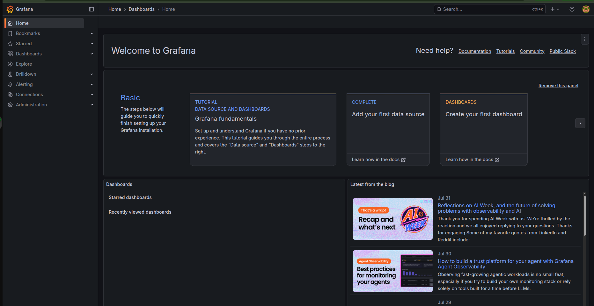
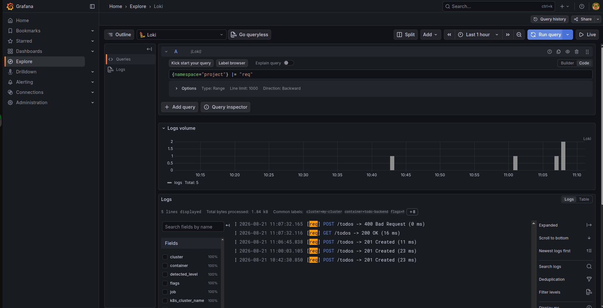
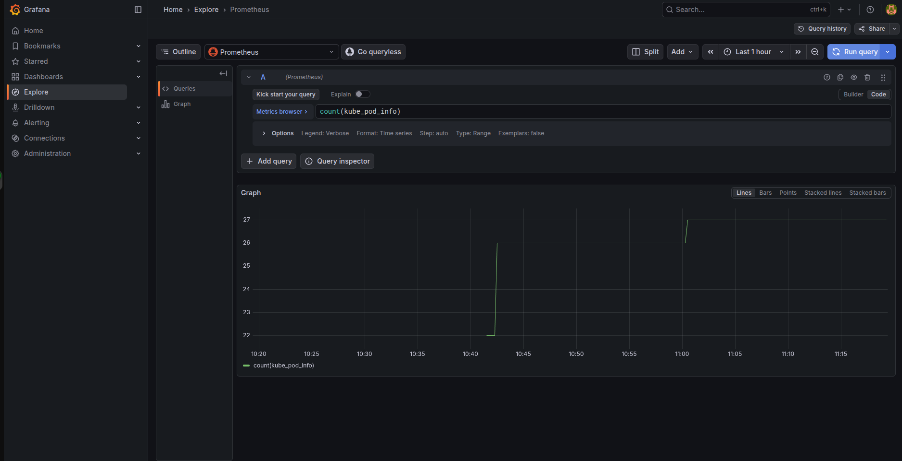
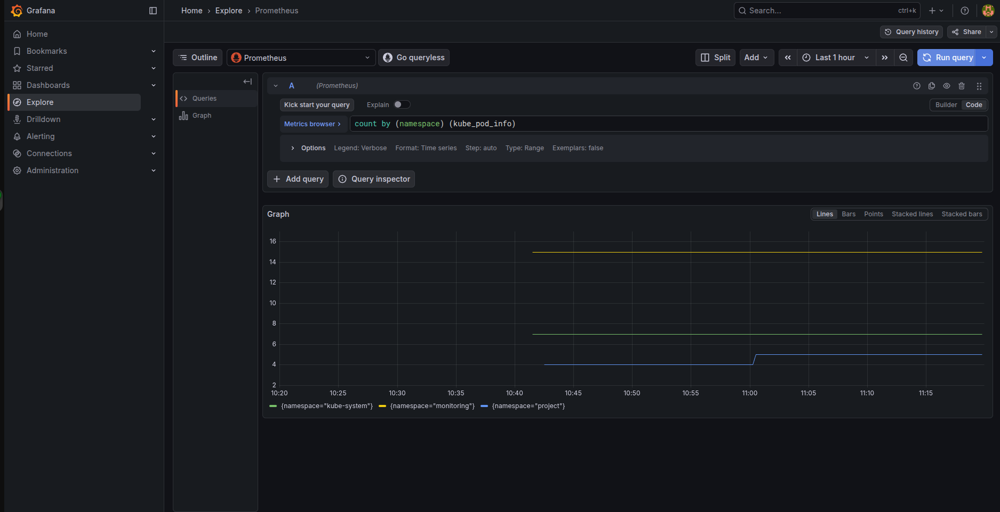

# Exercise 2.10 — The project, step 13 (Request logging + monitoring)

## Goal

> The project could really use logging. Add **request logging** so that you
> can monitor every `todo` that is sent to the backend. Set the limit of
> **140 characters** for todos in the backend as well. Use Postman or curl
> to test that too long todos are **blocked by the backend**, and you can
> see the **non-allowed messages in your Grafana**.

## Knowledge: the monitoring stack (Chapter 3)

The monitoring stack has **four components**, each with a distinct role:

| Component                    | Role                                                                                   |
| ---------------------------- | -------------------------------------------------------------------------------------- |
| **Prometheus**               | Collects and stores **cluster metrics** over time → graphs, rates, trends              |
| **Loki**                     | Collects and stores **container logs**, searchable from one place                      |
| **Alloy** (`k8s-monitoring`) | Automatically collects **pod logs** from the node filesystem and forwards them to Loki |
| **Grafana**                  | Visualizes both metrics and logs through dashboards and queries                        |

Data flow:

```
Pod logs (on node fs)  ──Alloy──▶  Loki  ──┐
                                           ├──▶  Grafana  (Explore / dashboards)
Node/cluster metrics  ──Prometheus───────▶┘
```

### Helm — the package manager for Kubernetes

- **Helm** packages Kubernetes apps as **charts**. Charts include the chart
  version, app requirements (K8s version, dependencies…).
- Charts are hosted in **remote repos** (like Docker images on Docker Hub).
  Register one with `helm repo add <name> <url>`.
- Charts ship with **defaults**; a **values file** (`-f xxx-values.yaml`)
  customizes the chart for your situation.
- Install/upgrade a chart: `helm upgrade --install <name> <repo>/<chart>`.
  Remove it: `helm delete <name>`.

### Custom resources

`helm install` pulls in a lot of stuff, including **custom resources**
(CRDs) — a way to extend the Kubernetes API with new resource types that K8s
doesn't have out of the box. Deleting a chart (`helm delete`) leaves CRDs
behind (they must be removed manually) — harmless on their own.

---

## Step 1 — build + push the images

One new image (`todo-backend:2.10`); the others are reused unchanged.

```bash
cd todo-app
docker build -t tripplen63/todo-app:2.6 .
docker push tripplen63/todo-app:2.6

cd ../todo-backend
docker build -t tripplen63/todo-backend:2.10 .
docker push tripplen63/todo-backend:2.10

cd ../todo-cron
docker build -t tripplen63/todo-cron:2.9 .
docker push tripplen63/todo-cron:2.9
```

> **What changed in 2.10 backend?** A request-logger middleware prints one
> line to stdout for _every_ request: `[req] METHOD /path -> STATUS (ms)`.
> Blocked ≥141-char todos also log `[reject] todo blocked: N chars`.
> These stdout lines are what Alloy scrapes off the node and forwards to
> Loki → visible in Grafana. (The 140-char limit already existed in the
> backend; logging makes the rejections observable.)

## Step 2 — install the monitoring stack (Helm)

Order matters! Alloy needs Loki up before it can forward logs; Grafana needs
both Prometheus and Loki before it configures datasources.

```bash
bash monitoring/install.sh
```

Or step by step (add repos → create namespace → install in order):

```bash
helm repo add prometheus-community https://prometheus-community.github.io/helm-charts
helm repo add grafana https://grafana.github.io/helm-charts
helm repo update
kubectl create namespace monitoring

helm upgrade --install prom prometheus-community/prometheus --version 29.27.0 \
  --namespace monitoring --create-namespace --values monitoring/prom-values.yaml
helm upgrade --install loki grafana/loki --version 7.3.0 \
  --namespace monitoring --values monitoring/loki-values.yaml
helm upgrade --install k8smon grafana/k8s-monitoring --version 4.4.0 \
  --namespace monitoring --values monitoring/k8smon-values.yaml
helm upgrade --install grafana grafana/grafana --version 10.5.15 \
  --namespace monitoring --values monitoring/grafana-values.yaml

helm list --namespace monitoring
kubectl get pods --namespace monitoring -w   # all 4 releases Running
```

## Step 3 — deploy the project app

```bash
docker exec k3d-mycluster-agent-0 mkdir -p /tmp/kube
kubectl apply -f manifests/pv/persistentvolume.yaml
kubectl apply -f manifests/

kubectl get statefulset,pods -n project
# pod/postgres-ss-0      1/1  Running
# pod/todo-backend-xxx   1/1  Running
# pod/todo-app-xxx       1/1  Running
```

## Step 4 — see the logs in Grafana

```bash
kubectl port-forward --namespace monitoring svc/grafana 3000:80
```

Open **http://localhost:3000** and log in with **admin / admin**.



### 1) Port-forward the backend, then send a valid + a too-long todo

The request logging lives in **todo-backend**, so hit that service directly
(not todo-app). Port-forward the backend port (`2345`):

```bash
kubectl port-forward -n project svc/todo-backend-svc 8082:2345
```

Then, in a second terminal:

```bash
# valid todo (201)
curl -s -X POST http://localhost:8082/todos -H 'Content-Type: application/json' \
  -d '{"title":"monitor me"}'

# too-long todo (400 — should be blocked)
LONG=$(python3 -c "print('x'*141)")
curl -s -o /dev/null -w "%{http_code}\n" -X POST http://localhost:8082/todos \
  -H 'Content-Type: application/json' -d "{\"title\":\"$LONG\"}"
# -> 400
```

### 2) Query the request logs in Grafana

In **Explore**, pick the **Loki** datasource, switch to code mode, run:

```
{namespace="project"} |= "req"
```

You'll see every request logged by the middleware, e.g.:

```
[req] POST /todos -> 400 Bad Request (0 ms)
[req] GET /todos -> 200 OK (16 ms)
[req] POST /todos -> 201 Created (11 ms)
[req] POST /todos -> 201 Created (23 ms)
[req] POST /todos -> 201 Created (23 ms)
```



The **non-allowed message** (≥141 chars) shows up right here — proof the
backend blocked it AND the monitoring stack works.

### 3) Bonus — metrics with Prometheus (PromQL)

In Explore pick **Prometheus** and run:

```
count(kube_pod_info)                 # total pods in the cluster
count by (namespace) (kube_pod_info) # per-namespace pod breakdown
```




## Step 5 — clean up

```bash
# project app
kubectl delete -f manifests/
kubectl delete -f manifests/pv/persistentvolume.yaml
kubectl delete pvc -n project -l app=postgres 2>/dev/null

# monitoring stack
helm delete grafana loki k8smon prom --namespace monitoring
kubectl delete namespace monitoring
```

## P/S:

1. **Observability** = seeing into the cluster (metrics + logs) instead of
   guessing — the whole point of Chapter 3.
2. **4 roles**: Prometheus (metrics), Loki (logs), **Alloy/k8s-monitoring**
   (collect pod logs → Loki), **Grafana** (visualize).
3. **Helm** = package manager; **charts** = packages; **values file** =
   customization; repos must be added first.
4. **Install order matters** (Prometheus+Loki → Alloy → Grafana) because of
   data-source dependencies.
5. **Request logging** in the backend is what makes the exercise observable —
   stdout → Alloy → Loki → Grafana. The 140-char limit was already enforced;
   logging surfaces the `400` rejections.
6. **Self-contained lab**: the whole project _and_ the whole monitoring
   stack run from a clean cluster — everything (Dockerfiles, manifests,
   values, script) is spelled out above for you to hand-type 👍.
