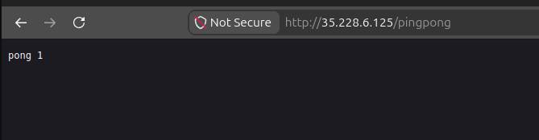

# Exercise 3.1 — Pingpong GKE

## Goal

> Deploy **Ping-pong application** into GKE.
> In this exercise use a **LoadBalancer** service to expose the service.

This is the first lab on **Google Kubernetes Engine (GKE)**, a managed
Kubernetes-as-a-service. Instead of a local k3d cluster, the Ping-pong app
goes to cloud infrastructure Google provisions (nodes, load balancer, IPs).

**How to use this lab:** only the app **source code** (`ping-pong/`) is
provided; hand-type the **Dockerfile** and the two manifests, then apply
them to GKE.

---

## What this folder contains (start)

```
part3/3.1/
└── ping-pong/    (src/ + Cargo.toml — provided)
```

Hand-create: `ping-pong/Dockerfile`, `manifests/deployment.yaml`,
`manifests/service.yaml`.

---

## Knowledge: managed Kubernetes (Chapter 4)

- **GKE** = Google's managed Kubernetes: Google runs the control plane;
  you define the cluster (nodes, machine type, count) and deploy workloads.
- GKE **bills per node per hour** + extra for load balancers/PVs, so it
  gets expensive fast; **delete the cluster when idle.**
- App structure is the **same** Kubernetes you learned locally
  (Deployment, Service, Ingress). What changes:
  - In GKE a `LoadBalancer` Service asks Google to provision a real cloud
    load balancer + external IP (vs. NodePort in k3d).
  - A PVC's disk is auto-provisioned unless you pin a storage class.
- **Managed ≠ free:** idle nodes, disks, and load balancers still cost
  credits.

---

## Prerequisites

- gcloud SDK + `gke-gcloud-auth-plugin` installed
- `gcloud auth login` (re-login if the token expired)
- project set: `dwk-gke-506208` (or your `dwk-gke-[id]`)
- a GKE cluster in zone `europe-north1-b` (Step 1)

Confirm the wiring:

```bash
gcloud auth list
gcloud config get-value project   # dwk-gke-506208
gcloud container clusters list
```

## Step 1 — create the GKE cluster (private nodes — org-policy safe)

```bash
gcloud container clusters create dwk-cluster \
  --zone=europe-north1-b --cluster-version=1.36 \
  --disk-size=32 --num-nodes=4 --machine-type=e2-small \
  --enable-ip-alias --enable-private-nodes --master-ipv4-cidr=172.16.0.0/28 \
  --project=dwk-gke-506208
```

or

```bash
gcloud container clusters create dwk-cluster \
  --zone=europe-north1-b --cluster-version=1.36 \
  --disk-size=32 --num-nodes=4 --machine-type=e2-small \
  --enable-ip-alias --enable-private-nodes --master-ipv4-cidr=172.16.0.0/28 \
  --project=dwk-gke-[id]
```

Wait for `STATUS: RUNNING` (a few minutes).

### Then two required fixes (private clusters)

**1) Allow kubectl to reach the master:** private clusters enable
master-authorized-networks by default, blocking your IP. Disable it:

```bash
gcloud container clusters update dwk-cluster --zone=europe-north1-b \
  --project=dwk-gke-[id] --no-enable-master-authorized-networks
```

**2) Let nodes pull your image from Artifact Registry:** node SA needs the
`artifactregistry.reader` role (missing = 403 `failed to authorize`):

```bash
gcloud projects add-iam-policy-binding dwk-gke-[id] \
  --member="serviceAccount:PROJECTNUM-compute@developer.gserviceaccount.com" \
  --role="roles/artifactregistry.reader"
```
(Replace `PROJECTNUM` with your project number from `gcloud projects list`.)

Verify kubectl + nodes ready:

```bash
kubectl cluster-info
kubectl get nodes   # all 4 nodes Ready
```

## Step 2 — create the  + build & push the Docker image

### `ping-pong/Dockerfile` (hand-type)

### Build + push to Container Registry (gcr.io)

Use the project's own registry so private nodes pull cleanly (no extra
Docker Hub login):

```bash
cd ping-pong
gcloud auth configure-docker   # once — lets docker talk to gcr.io
docker build -t gcr.io/dwk-gke-506208/ping-pong:3.1 .
docker push gcr.io/dwk-gke-506208/ping-pong:3.1
```

> If you prefer Docker Hub, use `tripplen63/ping-pong:3.1` instead and keep
> the image references consistent in the manifests. I went with gcr.io
> because private nodes already reach Google's registry without extra NAT.

## Step 3 — deploy + verify manifests

```bash
kubectl apply -f manifests/deployment.yaml
kubectl apply -f manifests/service.yaml

# wait for pods Running (image pull can take ~30-60s)
kubectl rollout status deploy/ping-pong
kubectl get pods -l app=ping-pong
# ping-pong-xxx   1/1  Running

# the load balancer takes a moment to get its EXTERNAL-IP
kubectl get svc ping-pong-svc -w
# NAME           TYPE          CLUSTER-IP    EXTERNAL-IP     PORT(S)
# ping-pong-svc  LoadBalancer  10.x.x.x      35.228.xx.xxx   80:3xxxx/TCP
```

Once `EXTERNAL-IP` appears, open it:

```
http://<EXTERNAL-IP>/pingpong
```



Refresh a few times → `pong 0`, `pong 1`, `pong 2`… Each request
increments the counter, and the LoadBalancer routes to a pod.

---

## Step 5 — clean up (IMPORTANT — saves credits!)

GKE bills per node + load balancer. **Delete the cluster when done.**

```bash
# deletes cluster (nodes) — the LoadBalancer goes with it
gcloud container clusters delete dwk-cluster --zone=europe-north1-b \
  --project=dwk-gke-[id]

# optionally remove the pushed image (saves a little storage)
gcloud container images delete gcr.io/dwk-gke-[id]/ping-pong:3.1 \
  --quiet --force-delete-tags
```

Verify nothing is left running:

```bash
gcloud container clusters list              # empty
gcloud compute instances list               # Listed 0 items.
gcloud compute forwarding-rules list        # empty
gcloud compute addresses list               # empty
```

> Re-create the cluster with the Step 1 command when you resume (part 4
> onwards). Deleting the cluster also deletes everything you deployed, so
> re-apply the YAMLs on resume; the declarative approach makes that easy.

## P/S:

1. **GKE = managed K8s**: you don't run the control plane; you pay per
   node/hour + LB.
2. **Org policy here** denies external IPs on VMs → must use **private
   nodes** (more setup than the course assumes; this README has the fixes).
3. A **LoadBalancer** Service is the cloud-native way to expose an app in
   GKE (vs NodePort in k3d); Google provisions the LB + IP.
4. Private nodes pull from **gcr.io** cleanly (no extra NAT or Docker Hub);
   the node SA needs `artifactregistry.reader`.
5. **Always delete the cluster when idle**; creds are limited. Resuming is
   just re-applying the same YAMLs.
