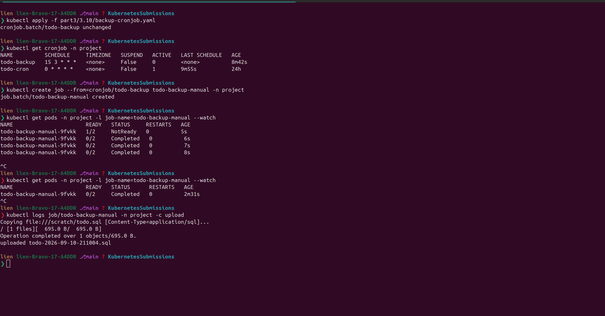

# Exercise 3.10 — The project, step 18: scheduled Postgres backup to Google Object Storage

> In part 2 (2.9) we already had a CronJob and, in the project, a `pg_dump`
> backup Job — but the backup was **thrown away** (nowhere saved). This lab
> wires the backup to **Google Object Storage** (GCS): a CronJob dumps the
> todo database **once per 24 hours** and uploads the file to a bucket.

## Goal

```text
┌────────────┐   pg_dump    ┌──────────┐   gsutil cp   ┌─────────────────────┐
│ postgres   │ ───────────▶ │ CronJob  │ ────────────▶ │ gs://<bucket>/backup│
│ project    │   5432       │ backup   │   (upload)    │ 2026-09-10-0300.sql │
└────────────┘              └──────────┘               └─────────────────────┘
      runs every 24h (schedule "15 3 * * *" = 03:15 daily, your pick)
```

Two ways to give the CronJob write access — the course offers both:

1. **A JSON key of a dedicated Service Account** (`my-storage-sa`) mounted
   into the pod through a Secret (Step 1 below). The course warns:
   *"Remember not to store the secret or [key] in GitHub!"* → the key lives
   only in the cluster, never in the repo.
2. **Workload Identity** — the pod authenticates as *itself*: no key, no
   Secret. This is the approach the course *recommends* ("authenticate to
   Google Cloud APIs from GKE workloads"), and in **our** GCP org it is the
   only one that works — the org blocks service-account keys (⚠️ section
   below). The manifest in Step 2 is the Workload Identity version.

---

## Step 1 — GCP: bucket + storage service account

```bash
P=dwk-gke-506208

# 1. a bucket. GCS bucket names are GLOBAL (not per-project) and must be
#    unique — pick a name no one else has. We use a fixed name so the
#    manifest below can hard-code it:
gsutil mb -l europe-north1 gs://dwk-todo-backups-tripplen23

# 2. service account with ONLY the storage permissions the backup needs
gcloud iam service-accounts create my-storage-sa \
  --display-name="Pod Storage SA" --project=$P

gcloud projects add-iam-policy-binding $P \
  --role="roles/storage.objectCreator" \
  --member="serviceAccount:my-storage-sa@$P.iam.gserviceaccount.com" \
  --project=$P

gcloud projects add-iam-policy-binding $P \
  --role="roles/storage.objectViewer" \
  --member="serviceAccount:my-storage-sa@$P.iam.gserviceaccount.com" \
  --project=$P

# 3. JSON key for the CronJob to use
gcloud iam service-accounts keys create /tmp/key.json \
  --iam-account=my-storage-sa@$P.iam.gserviceaccount.com

# 4. Secret in the cluster (NOT in GitHub — created from the CLI, per the
#    exercise; note the alias key.json → keeps the key's file name stable)
kubectl create secret generic storage-sa-key \
  --from-file=key.json=/tmp/key.json --namespace project

# 5. clean the key off your disk (it's inside the cluster now)
rm /tmp/key.json
```

> `storage.objectCreator` lets the SA **create** objects (upload); the
> `objectViewer` (read) is optional but handy for listing/testing. The
> bucket does NOT need per-object ACLs — the SA is allowed at the project
> level.

### ⚠️ If the org blocks service-account keys → use Workload Identity

Our org (`opscom.io`) enforces `constraints/iam.disableServiceAccountKeyCreation`,
so step 3 above fails:

```text
FAILED_PRECONDITION: Key creation is not allowed on this service account.
  type: constraints/iam.disableServiceAccountKeyCreation
```

You can't override it without org-admin rights → drop the key path entirely
and use the approach the course *recommends*: authenticate to Google Cloud
APIs from GKE workloads (Workload Identity) — the pod gets credentials from
the GKE metadata server, no key file anywhere:

```bash
P=dwk-gke-506208
Z=europe-north1-c

# 1. enable the workload pool on the cluster
gcloud container clusters update dwk-cluster --zone=$Z \
  --workload-pool=$P.svc.id.goog --project=$P

# 2. let the node pool serve the GKE metadata server (nodes roll, ~2-5 min)
gcloud container node-pools update default-pool --cluster=dwk-cluster \
  --zone=$Z --workload-metadata=GKE_METADATA --project=$P

# 3. a Kubernetes ServiceAccount for the backup
kubectl create serviceaccount backup-sa -n project

# 4. let that KSA write to the bucket (this is the WIF principal identity)
gcloud projects add-iam-policy-binding $P \
  --role=roles/storage.objectCreator \
  --member="principal://iam.googleapis.com/projects/323959491379/locations/global/workloadIdentityPools/$P.svc.id.goog/subject/ns/project/sa/backup-sa" \
  --condition=None
```

Then the CronJob changes in Step 2:
- add `serviceAccountName: backup-sa` under `spec.jobTemplate.spec.template.spec`
- **delete** the `sa-key` volume, its volumeMount, and the
  `GOOGLE_APPLICATION_CREDENTIALS` env — gsutil picks the credential up from
  the metadata server automatically.

---

## Step 2 — backup CronJob (two containers — dump + upload)

```yaml
apiVersion: batch/v1
kind: CronJob
metadata:
  name: todo-backup
  namespace: project
spec:
  schedule: "15 3 * * *"
  jobTemplate:
    spec:
      template:
        spec:
          restartPolicy: OnFailure
          serviceAccountName: backup-sa        # ← WIF: the pod's own identity
          volumes:
            - name: scratch
              emptyDir: {}
          containers:
            - name: dump
              image: gcr.io/dwk-gke-506208/postgres:16
              imagePullPolicy: IfNotPresent
              env:
                - name: PGPASSWORD
                  valueFrom:
                    secretKeyRef:
                      name: postgres-secret
                      key: POSTGRES_PASSWORD
              command: ["/bin/bash", "-c"]
              args:
                - |
                  pg_dump -h postgres-svc -U postgres -d postgres \
                    --file=/scratch/todo.sql
                  touch /scratch/done
              volumeMounts:
                - name: scratch
                  mountPath: /scratch
            - name: upload
              image: gcr.io/google.com/cloudsdktool/cloud-sdk:latest
              imagePullPolicy: IfNotPresent
              env:
                - name: BUCKET
                  value: "gs://dwk-todo-backups-tripplen23"
              command: ["/bin/bash", "-c"]
              args:
                - |
                  until [ -f /scratch/done ]; do sleep 1; done
                  STAMP=$(date -u +%Y-%m-%d-%H%M%S)
                  gsutil cp /scratch/todo.sql "$BUCKET/todo-${STAMP}.sql"
                  echo "uploaded todo-${STAMP}.sql"
              volumeMounts:
                - name: scratch
                  mountPath: /scratch
```

> The two containers run in the same pod and share `/scratch` (emptyDir).
> `dump` finishes pg_dump → touches `done`; `upload` polls for the marker,
> then pushes with gsutil. If the dump fails, the Job fails (`OnFailure`)
> without uploading garbage.
>
> **No key, no Secret.** Because the org blocks SA keys (see above), the
> upload container authenticates with the pod's own workload identity:
> `serviceAccountName: backup-sa` → the GKE metadata server hands gsutil a
> short-lived federated token for the `backup-sa` principal.
>
> ⚠️ Image path: `gcr.io/google-containers/cloud-sdk` **does not exist**
> (ImagePullBackOff) — the cloud-sdk image lives under
> `gcr.io/google.com/cloudsdktool/`.

> The course's "simpler way" (mount a JSON key of `my-storage-sa` as a
> Secret) is what Step 1 above describes — keep it for reference: on a
> GCP org *without* the key restriction, it is fewer moving parts.

---

## Step 3 — Apply, then run & verify

```bash
# 0) APPLY the manifest first — skipping this is why you get
#    `Error from server (NotFound): cronjobs.batch "todo-backup" not found`
kubectl apply -f part3/3.10/backup-cronjob.yaml
kubectl get cronjob -n project          # todo-backup must be listed

# trigger it NOW without waiting for 03:15
# (the "Saw a job that the controller did not create" warning right after
#  is harmless — kubectl says so because --from=cronjob builds a job the
#  CronJob controller didn't make itself)
kubectl create job --from=cronjob/todo-backup todo-backup-manual -n project

# watch until Completed (<2 min; the cloud-sdk image is ~1.5 GB on the
# first pull):
kubectl get pods -n project -l job-name=todo-backup-manual --watch

# the upload container is the one that talks:
kubectl logs job/todo-backup-manual -n project -c upload

# confirm the object is really in the bucket:
gsutil ls -l gs://dwk-todo-backups-tripplen23/
```



---

## Step 4 — Clean up

```bash
# after verifying, remove the manual job (the CronJob stays):
kubectl delete job todo-backup-manual -n project

# end of lab / end of course — remove the infra:
kubectl delete cronjob todo-backup -n project
kubectl delete serviceaccount backup-sa -n project        # WIF path
# (if you used the key path instead: kubectl delete secret storage-sa-key -n project)
gsutil rm -r gs://dwk-todo-backups-tripplen23
```

> Leave the cluster-side Workload Identity settings alone (workload pool +
> `GKE_METADATA`) — other workloads/tooling may rely on them, and they cost
> nothing.