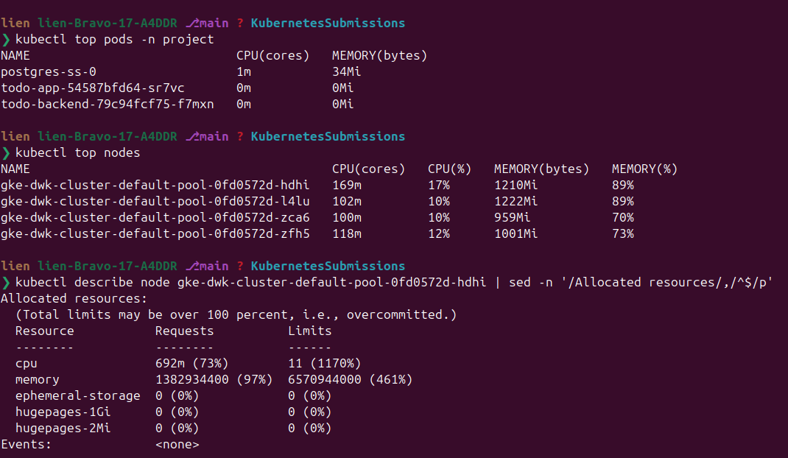
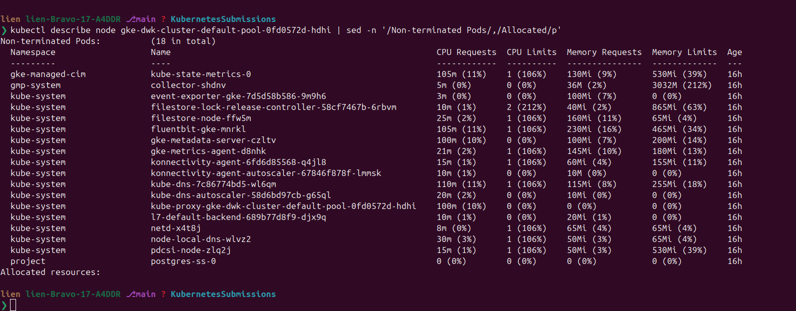
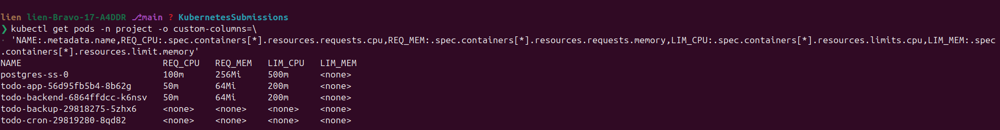
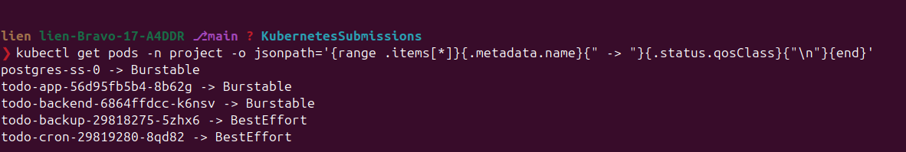
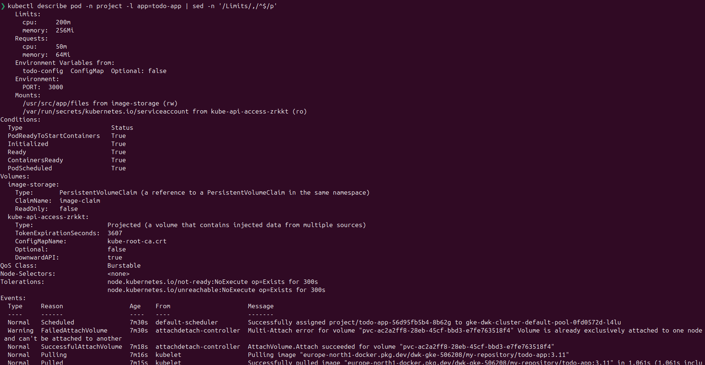
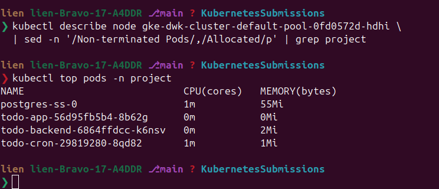
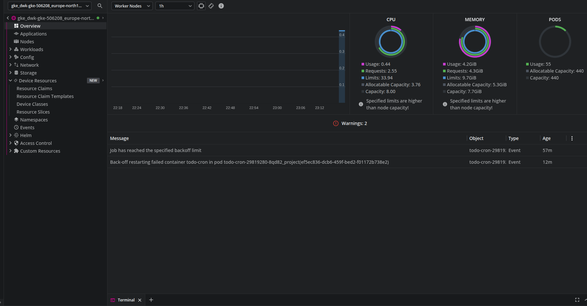
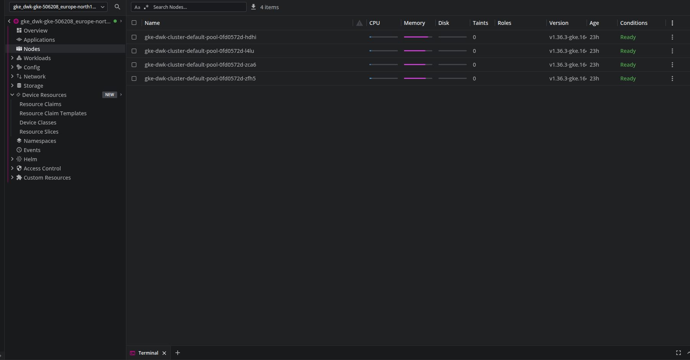

# Exercise 3.11 — The project, step 19: resource requests and limits

> Course text (chapter 4, *GKE features*): *"Set sensible resource requests and
> limits for the project. The exact values are not important. Just test what
> works. You may find the command `kubectl top pods` useful."*

## What this lab is

A **self-contained slice of the project**. The Rust sources of `todo-app` /
`todo-backend` and the cron script are already in this folder — the Dockerfiles
and the Kubernetes manifests next to them are the part typed by hand: that is
the DevOps part of the exercise.

```text
part3/3.11/
├── README.md
├── todo-app/       Cargo.toml Cargo.lock src/main.rs  ← project source (prepared)
├── todo-backend/   Cargo.toml Cargo.lock src/main.rs  ← project source (prepared)
├── todo-cron/      generate-todo.sh                   ← project source (prepared)
├── todo-app/Dockerfile  todo-backend/Dockerfile  todo-cron/Dockerfile
├── manifests/      configmap.yaml  configmap-todo.yaml  secret.yaml
│                   persistentvolumeclaim.yaml  postgres.yaml
│                   deployment-todo-backend.yaml  deployment-todo-app.yaml
│                   service.yaml  cronjob.yaml  kustomization.yaml
└── assets/         screenshots (Step 0, Step 1)
```

The point of the lab: every container gets a `resources` block.

```text
┌───────────────────────── pod ───────────────────────────┐
│  requests                       limits                  │
│  ────────                       ──────                  │
│  what the scheduler RESERVES    the container's ceiling:│
│  on a node before the pod is    CPU is throttled,       │
│  placed there (also the base    memory above it → the   │
│  for HPA percentages)           kernel OOM-kills it     │
└─────────────────────────────────────────────────────────┘
```

QoS class follows from what you set: `requests == limits` → `Guaranteed`;
requests set, limits larger → `Burstable`; nothing set → `BestEffort`, the first
pods evicted when the node runs out of memory — which is what this project is
today.

---

## Step 0 — measure before choosing numbers

```bash
kubectl top pods -n project
kubectl top nodes
kubectl describe node gke-dwk-cluster-default-pool-0fd0572d-hdhi | sed -n '/Allocated resources/,/^$/p'
```



```text
$ kubectl top pods -n project
NAME                            CPU(cores)   MEMORY(bytes)
postgres-ss-0                   1m           34Mi
todo-app-54587bfd64-sr7vc       0m           0Mi
todo-backend-79c94fcf75-f7mxn   0m           0Mi
```

The nodes are `e2-small` (2 vCPU / 2 GB → ≈ 940m CPU and ≈ 1.33Gi memory
*allocatable* each, 4 nodes):

```text
$ kubectl top nodes
NAME                                         CPU(cores)   CPU(%)   MEMORY(bytes)   MEMORY(%)
gke-dwk-cluster-default-pool-0fd0572d-hdhi   169m         17%      1210Mi          89%
gke-dwk-cluster-default-pool-0fd0572d-l4lu   102m         10%      1222Mi          89%
gke-dwk-cluster-default-pool-0fd0572d-zca6   100m         10%      959Mi           70%
gke-dwk-cluster-default-pool-0fd0572d-zfh5   118m         12%      1001Mi          73%
```

`kubectl top` shows *usage* — not what the scheduler looks at. The third command
shows the **requests already reserved** on a node:

```text
$ kubectl describe node gke-dwk-cluster-default-pool-0fd0572d-hdhi | sed -n '/Allocated resources/,/^$/p'
Allocated resources:
  (Total limits may be over 100 percent, i.e., overcommitted.)
  Resource           Requests          Limits
  --------           --------          ------
  cpu                692m (73%)        11 (1170%)
  memory             1382934400 (97%)  6570944000 (461%)
```

**Read that twice: 97 % of this node's memory is already *requested*.** And it
is not the project — look at who holds it:

```text
$ kubectl describe node gke-dwk-cluster-default-pool-0fd0572d-hdhi | sed -n '/Non-terminated Pods/,/Allocated/p'
Non-terminated Pods: (18 in total)
  Namespace        Name                                        CPU Requests  Memory Requests
  gke-managed-cim  kube-state-metrics-0                        105m (11%)    130Mi (9%)
  kube-system      fluentbit-gke-mnrkl                         105m (11%)    230Mi (16%)
  kube-system      kube-dns-7c86774bd5-wl6qm                   110m (11%)    115Mi (8%)
  kube-system      gke-metadata-server-czltv                   100m (10%)    100Mi (7%)
  kube-system      kube-proxy-gke-dwk-cluster-default-pool-…   100m (10%)    0 (0%)
  kube-system      filestore-node-ffw5m                        25m (2%)      160Mi (11%)
  …
  project          postgres-ss-0                               0 (0%)        0 (0%)   ← the project, today
```



17 GKE system pods reserve ~692m CPU and ~1.29Gi memory on that node; **every
project pod asks for nothing** (`0 (0%)`) — that is the state this exercise
fixes.

What it means for the numbers below:

- All four nodes are already **45–97 % CPU-requested and 66–97 %
  memory-requested** by GKE itself (kube-dns, fluentbit, gke-metadata-server,
  konnectivity-agent, CSI drivers, kube-state-metrics…). Cluster allocatable
  ≈ **5.35Gi** memory, of which ≈ **4.09Gi** is system-requested → ≈ **1.26Gi**
  of request headroom is left for the project.
- `Limits` above 100 % is normal — that column is the overcommit budget, not a
  reservation.
- Free request budget per node: `l4lu` ≈ 469Mi, `zca6` ≈ 427Mi, `zfh5` ≈ 355Mi,
  `hdhi` ≈ **41Mi**. A request that fits no node leaves the pod `Pending`
  (Step 4's experiment) — hence the modest numbers below.

---

## Step 1 — take a quick look at manifests files

### Chosen values and why

| workload | requests | limits | reasoning |
|---|---|---|---|
| `todo-app` | 50m / 64Mi | 200m / 256Mi | measured 0m/0Mi idle; a Node/Express-style server needs little, image uploads can spike CPU |
| `todo-backend` | 50m / 64Mi | 200m / 256Mi | measured 0m/0Mi idle; CPU spikes when the cache refreshes |
| `postgres` | 100m / 256Mi | 500m / 512Mi | measured 1m/**34Mi** idle — but Postgres grows with data and sorts/joins burst to CPU; 256Mi request leaves headroom, 512Mi limit is the OOM guard |
| `todo-cron` | 50m / 64Mi | 200m / 256Mi | short-lived job, hourly |

Total: **250m CPU / 448Mi** requested — fits the ≈ 1.26Gi request headroom the
cluster has left (Step 0), so nothing goes `Pending`.

---

## Step 2 — build, push and deploy this lab's images

```bash
P=dwk-gke-506208
R=europe-north1-docker.pkg.dev/$P/my-repository

gcloud auth configure-docker europe-north1-docker.pkg.dev

docker build -t $R/todo-app:3.11     part3/3.11/todo-app
docker build -t $R/todo-backend:3.11 part3/3.11/todo-backend
docker build -t $R/todo-cron:3.11    part3/3.11/todo-cron

docker push $R/todo-app:3.11
docker push $R/todo-backend:3.11
docker push $R/todo-cron:3.11

# the kustomization maps TODO_APP/TODO_BACKEND/TODO_CRON → the images above
kubectl apply -k part3/3.11/manifests

kubectl rollout status deployment/todo-app -n project
kubectl rollout status deployment/todo-backend -n project
kubectl rollout status statefulset/postgres-ss -n project
```

---

## Step 3 — verify

```bash
# requests/limits as the API server stored them:
kubectl get pods -n project -o custom-columns=\
'NAME:.metadata.name,REQ_CPU:.spec.containers[*].resources.requests.cpu,REQ_MEM:.spec.containers[*].resources.requests.memory,LIM_CPU:.spec.containers[*].resources.limits.cpu,LIM_MEM:.spec.containers[*].resources.limits.memory'

# QoS class per pod: expect Burstable (requests < limits above)
kubectl get pods -n project -o jsonpath='{range .items[*]}{.metadata.name}{" -> "}{.status.qosClass}{"\n"}{end}'

# the human-readable view (Limits / Requests sections):
kubectl describe pod -n project -l app=todo-app | sed -n '/Limits/,/^$/p'

# the project's own requests now show up in the node's allocation:
kubectl describe node gke-dwk-cluster-default-pool-0fd0572d-hdhi \
  | sed -n '/Non-terminated Pods/,/Allocated/p' | grep project

# usage vs the new numbers:
kubectl top pods -n project
```






Expected: every pod `Running`, QoS `Burstable`, the project's pods no longer
`0 (0%)` in the node table, and `kubectl top` still far below the limits —
limits are a ceiling, not a target.

Take a look at Lens




---

## Step 4 — "test what works" means: try to break it

1. **Memory limit too low → `OOMKilled`.**
   Measure first: `kubectl top pod -n project -l app=todo-backend` → **~0Mi**.
   This Rust service idles near nothing, so an 8Mi limit does **not** kill it —
   the pod just keeps running (`RESTARTS 0`). That is itself the lesson: pick
   limits from measurement, not from guesswork.

   To actually watch an OOM kill, use a throwaway pod that allocates (verified,
   exit 137):
   ```bash
   kubectl run oom-demo -n project --restart=Never \
     --image=gcr.io/dwk-gke-506208/postgres:16 \
     --overrides='{"spec":{"containers":[{"name":"oom-demo","image":"gcr.io/dwk-gke-506208/postgres:16","command":["bash","-c","s=$(head -c 100000000 /dev/zero | tr \"\\0\" x); echo len=${#s}; sleep 60"],"resources":{"requests":{"memory":"32Mi"},"limits":{"memory":"32Mi"}}}]}}'

   kubectl get pod oom-demo -n project
   #   NAME       READY   STATUS      RESTARTS   AGE
   #   oom-demo   0/1     OOMKilled   0          30s
   kubectl get pod oom-demo -n project \
     -o jsonpath='{.status.containerStatuses[0].state.terminated.reason} exit={.status.containerStatuses[0].state.terminated.exitCode}{"\n"}'
   #   OOMKilled exit=137          ← 137 = 128 + SIGKILL
   kubectl delete pod oom-demo -n project
   ```
   (`kubectl run` has no `--requests/--limits` flags — `--overrides` sets the
   container spec, that is why the flag version fails with
   `unknown flag: --requests`.)

   If you want to see the OOM status on the project's own pod, set the limit
   below what the process really peaks at; for *this* service there is nothing
   to see — it needs almost nothing, which is a perfectly good answer for
   "test what works".

   Note: with `requests == limits` the pod becomes `Guaranteed` — check
   `kubectl get pod -o jsonpath='{.status.qosClass}'` while such a version runs.

2. **Requests too high → `Pending`.**
   ```bash
   kubectl set resources deployment todo-backend -n project \
     --requests=cpu=4 --limits=cpu=4        # request <= limit, but 4 CPUs
   kubectl get pods -n project -l app=todo-backend      # the new pod stays Pending
   POD=$(kubectl get pods -n project -l app=todo-backend \
     -o jsonpath='{.items[?(@.status.phase=="Pending")].metadata.name}')
   kubectl describe pod "$POD" -n project | tail -5
   #   0/4 nodes are available: 4 Insufficient cpu.
   ```
   → scale back to the lab values with the undo command in point 4.

3. **CPU limits are soft killers:** a CPU-starved container is not restarted, it
   is *throttled* (latency, not errors). If a service feels slow under load,
   compare `kubectl top pod` with the limit before blaming the code.

4. Undo the experiments (the live patch touches only `resources`):

```bash
kubectl set resources deployment todo-backend -n project \
  --requests=cpu=50m,memory=64Mi --limits=cpu=200m,memory=256Mi
kubectl get pods -n project
```

---

## Step 5 — notes for the next steps

- The HPA in the course material scales on **CPU utilization relative to
  `requests`** — with `50m` requested, "60 % target" means 30m per pod. Setting
  requests is a prerequisite for meaningful autoscaling.
- `requests` set and `limits` higher = `Burstable`: right for this project.
  `Guaranteed` (requests == limits) is strictest and most wasteful.
- Cluster autoscaling reacts to **requests only**: a pod that cannot be
  scheduled because of a big request is what makes GKE add a node.
- This folder deploys its own images (`:3.11`) to the `project` namespace — the
  deployment now runs the build from *this* lab, not the older one.

---

## P.S. — what actually happened while doing this lab

- A pod going `Terminating` → `Error` in `kubectl get pods --watch` right after
  a change is **the rolling update replacing it**, not a crash: the events show
  `ScalingReplicaSet ... Scaled down replica set todo-backend-6864ffdcc from 1 to 0`
  and `Killing pod/todo-backend-6864ffdcc-k6nsv`.
- Setting the backend's memory limit to `8Mi` did **not** cause an OOM kill:
  measured usage is `~0Mi` (`kubectl top pod -l app=todo-backend`), so the pod
  stayed `Running` with `RESTARTS 0`. Good reminder that limits come from
  measurement — the `OOMKilled` demo needs a container that actually allocates
  (Step 4).
- `kubectl run` has no `--requests`/`--limits` flags (`unknown flag: --requests`);
  for a throwaway pod the resources go in `--overrides`.
- The cluster has **no Cloud NAT** (`gcloud compute routers list` is empty), so
  the private nodes have no general internet egress. `todo-cron` therefore keeps
  failing with `BackoffLimitExceeded` / `Job has reached the specified backoff
  limit` — its script fetches `en.wikipedia.org`. That behaviour predates this
  lab and has nothing to do with resource limits.
- The repository pipeline still builds from and applies `part3/3.6/...`, so the
  same `resources` blocks were mirrored into `part3/3.6/manifests/`; otherwise
  the next push to `main` would silently strip them from the running deployment.
  This folder keeps its own complete copy — that is what makes the lab
  self-contained.
