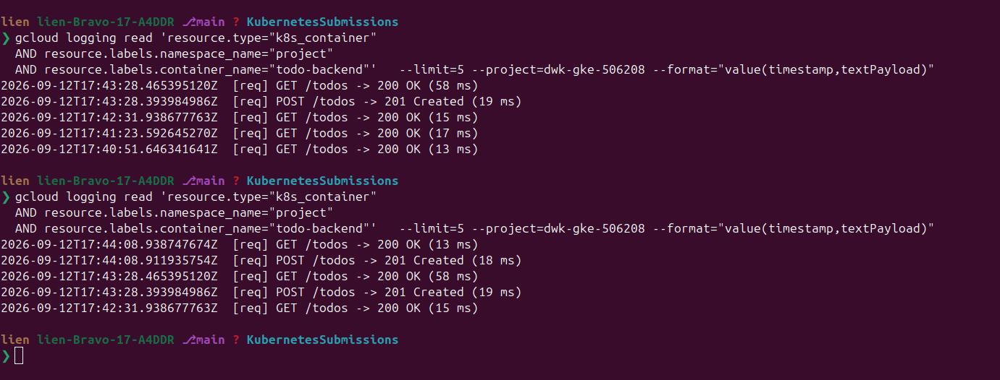
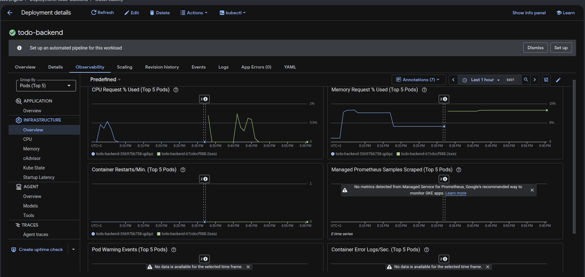

# Exercise 3.12 — The project, step 20: application logs in GKE

> Course text (chapter 4, *GKE features*): *"GKE includes monitoring systems
> already so we can just enable the monitoring. Read the documentation for
> Kubernetes Engine Monitoring. Find out how to find the application logs for
> the project in GKE. Add to your repository a picture of the logs when a new
> todo is created."*

## What this lab is

A **self-contained slice of the project**. The Rust sources of `todo-app` /
`todo-backend` and the cron script sit in this folder; the Dockerfiles and the
Kubernetes manifests are the hand-typed part — their full content is in
[Appendix A](#appendix-a--dockerfiles-and-manifests) so this folder can build and
run on its own.

```text
part3/3.12/
├── README.md
├── todo-app/       Cargo.toml Cargo.lock src/main.rs  ← project source (prepared)
├── todo-backend/   Cargo.toml Cargo.lock src/main.rs  ← project source (prepared)
├── todo-cron/      generate-todo.sh                   ← project source (prepared)
├── todo-app/Dockerfile  todo-backend/Dockerfile  todo-cron/Dockerfile
├── manifests/      configmap.yaml  configmap-todo.yaml  secret.yaml
│                   persistentvolumeclaim.yaml  postgres.yaml
│                   deployment-todo-backend.yaml  deployment-todo-app.yaml
│                   service.yaml  cronjob.yaml  kustomization.yaml
└── assets/image.png    ← the screenshot this exercise asks for
```

```text
┌─────────────┐   stdout    ┌────────────┐   Cloud Logging   ┌──────────────────┐
│ todo-backend│ ─────────▶  │ node agent │ ────────────────▶ │ Logs Explorer    │
│  [req] …    │             │ (gke-…)    │                   │ filter by        │
└─────────────┘             └────────────┘                   │ namespace=project│
                                                             └──────────────────┘
```

The code does not change in this exercise — it is about *where the logs end up*.
But the project **must be deployed and running** before the log steps make any
sense, so the lab starts by building and deploying **this folder's own copy**:

```text
Step 1  build + push the images, kubectl apply -k  ← the app now runs
Step 2  verify GKE monitoring/logging
Step 3  find the logs
Step 4  create a todo
Step 5  screenshot (the deliverable)
Step 6  optional tour
```

The deliverable is **one screenshot**: the project's logs at the moment a new
todo is created.

The relevant lines come from **`todo-backend`**, whose `log_request` middleware
prints one line per request to stdout (`part3/3.12/todo-backend/src/main.rs`):

```rust
/// Request logger middleware — prints one line to stdout for every
/// request that hits the backend.
async fn log_request(req: Request, next: Next) -> Response { … }

println!("[req] {method} {uri} -> {status} ({ms} ms)");
```

so creating a todo shows up in the **backend's** logs as
`[req] POST /todos -> 201 Created (… ms)`.

> The browser itself sees **303** after submitting the form — that is `todo-app`'s
> redirect back to the page (`Redirect` → `303 See Other`). But `todo-app` does
> not log requests (only startup and image-cache lines): the line in the logs
> comes from `todo-backend`, which answers the todo-app's `POST /todos` with
> **201 Created**. That is the status code to look for — not 303.
> (`GET /todos -> 200 OK` are the page refreshes.)

> The same stdout lines that the Kubernetes-part of the course shipped to
> Loki/Grafana (via Alloy) on k3d: on GKE you do not need any log shipper — the
> node agent collects container stdout/stderr into Cloud Logging automatically.
> That is the whole point of this exercise.

---

## Step 1 — build, push and deploy this lab's images

Without this step there is nothing running, and Steps 4–6 have nothing to show.

```bash
P=dwk-gke-506208
R=europe-north1-docker.pkg.dev/$P/my-repository

gcloud auth configure-docker europe-north1-docker.pkg.dev

docker build -t $R/todo-app:3.12     part3/3.12/todo-app
docker build -t $R/todo-backend:3.12 part3/3.12/todo-backend
docker build -t $R/todo-cron:3.12    part3/3.12/todo-cron

docker push $R/todo-app:3.12
docker push $R/todo-backend:3.12
docker push $R/todo-cron:3.12

# map TODO_APP / TODO_BACKEND / TODO_CRON → the images above, then apply
kubectl apply -k part3/3.12/manifests

kubectl rollout status deployment/todo-app -n project
kubectl rollout status deployment/todo-backend -n project
kubectl rollout status statefulset/postgres-ss -n project
```

Verify that the pod the logs will come from is the one you just built:

```bash
kubectl get pods -n project
kubectl get pods -n project \
  -o jsonpath='{range .items[*]}{.metadata.name}{"  "}{.spec.containers[0].image}{"\n"}{end}'
#   todo-backend-…   europe-north1-docker.pkg.dev/dwk-gke-506208/my-repository/todo-backend:3.12
```

> `todo-cron` is a CronJob — you will not see its pod until the hourly run, and
> in this cluster it fails because the node pool has no internet egress (see
> P.S.). It does not matter for this lab: the logs come from `todo-backend`.

---

## Step 2 — "enable the monitoring" on GKE

Standard GKE clusters created with `gcloud container clusters create` already
come with **Cloud Logging + Cloud Monitoring** wired in for the system and
workload components — "enabling" it is then just *verifying* it. Check:

```bash
gcloud container clusters describe dwk-cluster --zone=europe-north1-c \
  --project=dwk-gke-506208 --format="yaml(loggingConfig,monitoringConfig)"
```

What our cluster says:

```yaml
loggingConfig:
  componentConfig:
    enableComponents:
    - SYSTEM_COMPONENTS
    - WORKLOADS          # ← container stdout/stderr of your workloads
monitoringConfig:
  componentConfig:
    enableComponents:
    - SYSTEM_COMPONENTS
    - STORAGE
    - HPA
    - POD
    - DAEMONSET
    - DEPLOYMENT
    - STATEFULSET
    - CADVISOR
    - KUBELET
    - DCGM
    - JOBSET
```

If it were **off** (e.g. the cluster was created with `--logging=NONE
--monitoring=NONE`), turn it on instead — that is the "just enable the
monitoring" the exercise means:

```bash
gcloud container clusters update dwk-cluster --zone=europe-north1-c \
  --logging=SYSTEM,WORKLOAD --monitoring=SYSTEM --project=dwk-gke-506208
```

Console equivalent: **Kubernetes Engine → Clusters → dwk-cluster → Features**
(Cloud Logging / Cloud Monitoring dropdowns).

> `WORKLOAD` is the part that matters here: it is what ships the containers'
> stdout/stderr to Cloud Logging.

---

## Step 3 — find the project's application logs

Two entry points, same data.

**a) Logs Explorer (what the exercise's screenshot comes from)**

Open <https://console.cloud.google.com/logs/query?project=dwk-gke-506208>
(make sure the project selector says `dwk-gke-506208`) and paste this query:

```text
resource.type="k8s_container"
resource.labels.namespace_name="project"
resource.labels.container_name="todo-backend"
```

Direct link with the query pre-filled (URL-encoded):

```text
https://console.cloud.google.com/logs/query;query=resource.type%3D%22k8s_container%22%0Aresource.labels.namespace_name%3D%22project%22%0Aresource.labels.container_name%3D%22todo-backend%22?project=dwk-gke-506208
```

**b) the CLI (same filter, good for checking without a browser)**

```bash
gcloud logging read 'resource.type="k8s_container"
  AND resource.labels.namespace_name="project"
  AND resource.labels.container_name="todo-backend"' \
  --limit=5 --project=dwk-gke-506208 --format="value(timestamp,textPayload)"
```

Real output from this cluster (startup lines — at this point nobody has created
a todo yet):

```text
2026-09-10T22:05:27.560312640Z	todo-backend started in port 3000
2026-09-10T21:31:24.683148601Z	todo-backend started in port 3000
2026-09-10T21:24:34.945612846Z	todo-backend started in port 3000
```

Also worth knowing (and visible in the screenshot): every entry carries the
`resource.labels` that make this queryable — `namespace_name`, `pod_name`,
`container_name`, `cluster_name`, `location`.

> `kubectl logs` shows the same text but only for a *live* pod and only the
> last N lines — Cloud Logging keeps the history and lets you filter by
> workload/cluster. That is the difference the exercise is pointing at.

---

## Step 4 — create a new todo (so there is something to see)

The project has **no Ingress/Gateway** (only ClusterIP services), so reach the
UI through a port-forward — exactly like the earlier labs:

```bash
kubectl port-forward -n project svc/todo-app-svc 8081:3000
# leave it running, then open http://localhost:8081
```

Type a todo in the form and submit. Under the hood `todo-app` posts the form
field `content` to the backend's `POST /todos` as JSON (`{"title": …}`):

- success → the backend answers **201 Created** (the *browser* then gets a
  **303** redirect from `todo-app`, which never reaches the logs)
- over-long title (>140 chars) → the backend answers **400 Bad Request**

---

## Step 5 — take the screenshot (the deliverable)

With the port-forward running, submit a todo and look at Logs Explorer (Step 4)
right away — the request line appears within a second or two:

```text
2026-09-12T17:44:08.911937574Z	[req] POST /todos -> 201 Created (18 ms)
2026-09-12T17:44:08.465391520Z	[req] GET /todos -> 200 OK (15 ms)
2026-09-12T17:43:28.393984968Z	[req] POST /todos -> 201 Created (19 ms)
```



---

## Step 6 — what else the "monitoring systems" give you (optional tour)

- **Kubernetes Engine → Workloads → `todo-backend` → tab `Observability`**: CPU and
  memory *request utilization* — the percentages are relative to the requests set
  in the previous exercise — plus pod state, error logs and warning events
  (sub-dashboards: Overview / CPU / Memory / cAdvisor). The **Cost optimization**
  tab of the Workloads page shows *used vs requested vs limit* side by side, which
  is exactly the 3.11 exercise seen from the console.



- **Log-based counter metric** (no code change): Logs Explorer → **Actions →
  Create metric**, or **Logging → Log-based Metrics → Create metric** (type
  **Counter**, name `todos_created`, filter `textPayload:"POST /todos"`). It
  lands in Monitoring as `logging.googleapis.com/user/todos_created`.
- **Alerts**: **Actions → Create log alert** (log-based, single `log match`
  condition) or **Monitoring → Alerting → Create policy** on that metric. Needs
  a notification channel (**Alerting → Edit notification channels**).
- **Uptime checks**: **Monitoring → Uptime checks → Create Uptime Check**.
  ClusterIP services are unreachable for *public* checks — needs a public
  endpoint, or a **private uptime check** (Internal IP + Service Directory +
  firewall from `35.199.192.0/19`).
- Console links: [Logs Explorer](https://console.cloud.google.com/logs/query?project=dwk-gke-506208) ·
  [Log-based metrics](https://console.cloud.google.com/logs/metrics?project=dwk-gke-506208) ·
  [Alerting](https://console.cloud.google.com/monitoring/alerting?project=dwk-gke-506208) ·
  [Uptime checks](https://console.cloud.google.com/monitoring/uptime?project=dwk-gke-506208)

---

## P.S. — notes from doing this lab

- If `gcloud`/`kubectl` suddenly answer `Reauthentication failed. cannot prompt
  during non-interactive execution`, the CLI login has expired — run
  `gcloud auth login` (over SSH: `gcloud auth login --no-launch-browser`).
  `kubectl` authenticates through `gke-gcloud-auth-plugin` with the same
  credential, so **both** start failing at the same time.
- The cluster has **no Cloud NAT**, so pods have no general internet egress:
  creating a todo through the port-forward works (it only talks to Postgres in
  the cluster), while the hourly `todo-cron` keeps failing with
  `BackoffLimitExceeded` because its script fetches `en.wikipedia.org`. That has
  nothing to do with logging.
- Cloud Logging collects **stdout/stderr of containers**, and it keeps it even
  after the container is gone — which is why a cluster without SSH still lets you
  debug things like the `OOMKilled` pod from the previous exercise.
- Container output only shows up as *application* logs if it goes to
  stdout/stderr. Writing to a file inside the container means nothing will
  appear in Logs Explorer.
