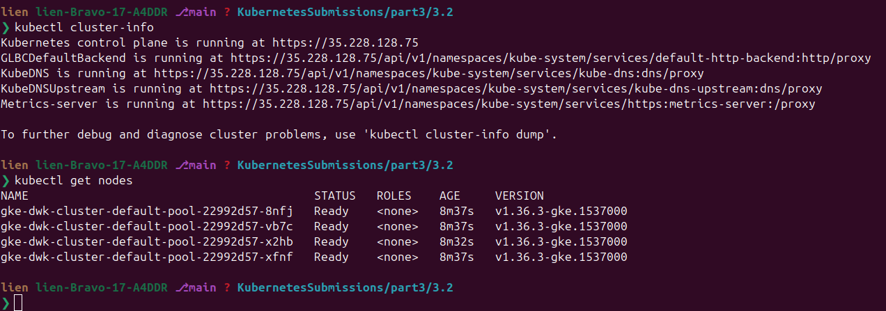

# Exercise 3.2 — Back to Ingress (GKE)

## Goal

> Deploy the **"Log output"** and **"Ping-pong"** applications into GKE and
> expose it with **Ingress**.
> "Ping-pong" will have to respond from **`/pingpong`** path. This may
> require you to rewrite parts of the code.
> **Note that Ingress expects a service to give a successful response in
> the path `/` even if the service is mapped to some other path!**

---

## Knowledge: Ingress on GKE (Chapter 4 — "From Service to Ingress")

Up to now a **Service** was a simple L4 (TCP/UDP) load balancer. For
**advanced traffic rules** (paths, hostnames) you need an L7 load balancer
— in Kubernetes that's an **Ingress** resource.

On GKE the Ingress works a bit differently than in k3d/Traefik:

1. **Service type must be `NodePort`** for Ingress in GKE. Even though the
   type is NodePort, GKE **does not expose it outside the cluster** — the
   Ingress controller just uses the node port as the backend target.
   (In the k3d labs we used ClusterIP + Traefik; here it's NodePort + the
   GKE Ingress controller.)
2. **Health check**: the GKE Ingress performs health checks by `GET` on
   **`/`** and expects an **HTTP 200**. So **every** backend service must
   answer `/` with 200 — **even if the Ingress maps it to a different
   path** (e.g. `/pingpong`). That's the note in the exercise: our
   ping-pong app must reply on `/` (we added a root route) *and* on
   `/pingpong`.
3. Path rules map URL prefixes to services: `/pingpong` → ping-pong,
   `/` → log-output.

### Data flow

```
Internet ──▶ GKE Ingress (L7 LB)
                ├─ /pingpong  ──▶ ping-pong-svc (NodePort) ──▶ ping-pong pod (:3000)
                └─ /          ──▶ log-output-svc (NodePort) ──▶ log-output pod (:3000)
```

## Step 1 — create the GKE cluster (private nodes — org-policy safe)

> The org policy `compute.vmExternalIpAccess` **denies external IPs on
> VMs** (org `opscom.io`). Normal nodes get public IPs → creation FAILS.
> Use **private nodes** (no public IP) — policy-safe.

Note, for my current project id in google cloud is project=dwk-gke-506208

```bash
gcloud container clusters create dwk-cluster \
  --zone=europe-north1-b --cluster-version=1.36 \
  --disk-size=32 --num-nodes=4 --machine-type=e2-small \
  --enable-ip-alias --enable-private-nodes --master-ipv4-cidr=172.16.0.0/28 \
  --project=dwk-gke-506208
```

Wait for `STATUS: RUNNING` (few minutes). Then **two required fixes** for
this project (needed only if you re-created the cluster):

```bash
# 1) kubectl can reach the master (private cluster blocks my IP by default)
gcloud container clusters update dwk-cluster --zone=europe-north1-b \
  --project=dwk-gke-506208 --no-enable-master-authorized-networks

# 2) node SA can pull images from Artifact Registry
gcloud projects add-iam-policy-binding dwk-gke-506208 \
  --member="serviceAccount:323959491379-compute@developer.gserviceaccount.com" \
  --role="roles/artifactregistry.reader"
```

Verify:

```bash
kubectl cluster-info
kubectl get nodes   # 4 nodes Ready
```



## Step 2 — build & push Dockerfiles images

```bash
gcloud auth configure-docker   # once
cd ping-pong && docker build -t gcr.io/dwk-gke-506208/ping-pong:3.2 . && docker push gcr.io/dwk-gke-506208/ping-pong:3.2
cd ../log-output && docker build -t gcr.io/dwk-gke-506208/log-output:3.2 . && docker push gcr.io/dwk-gke-506208/log-output:3.2
```

## Step 3 — deploy + verify manifests

```bash
kubectl apply -f manifests/deployment-ping-pong.yaml
kubectl apply -f manifests/deployment-log-output.yaml
kubectl apply -f manifests/service.yaml
kubectl apply -f manifests/ingress.yaml

kubectl rollout status deploy/ping-pong
kubectl rollout status deploy/log-output
kubectl get pods        # ping-pong, log-output all Running
kubectl get svc         # both NodePort
```

The Ingress needs a few minutes to provision the GCP L7 load balancer.
Watch for the ADDRESS:

```bash
kubectl get ing
# NAME   CLASS   HOSTS   ADDRESS       PORTS
# apps   <none>  *       34.120.x.x    80
```

### Verify paths

| Path | Expected |
|---|---|
| `http://<INGRESS-IP>/pingpong` | `pong 0`, `pong 1`, … (increments) |
| `http://<INGRESS-IP>/` | log lines + `Ping / Pongs: <N>` |

```bash
curl http://<INGRESS-IP>/pingpong   # pong 0
curl http://<INGRESS-IP>/pingpong   # pong 1
curl http://<INGRESS-IP>/           # log output + Ping / Pongs: 2
```

> Initial 404/502 while the LB provisions is normal (the material says so).
> The Ingress health-check GETs `/` on each backend; both return 200.

---

## Step 4 — clean up (IMPORTANT — saves credits!)

```bash
gcloud container clusters delete dwk-cluster --zone=europe-north1-b \
  --project=dwk-gke-506208

# remove the pushed images
gcloud container images delete gcr.io/dwk-gke-506208/ping-pong:3.2 --quiet --force-delete-tags
gcloud container images delete gcr.io/dwk-gke-506208/log-output:3.2 --quiet --force-delete-tags
```

Verify:

```bash
gcloud container clusters list
gcloud compute instances list
gcloud compute forwarding-rules list
gcloud compute addresses list
```

---

## P/S:

1. **Ingress = L7** routing (paths/hosts) vs Service = L4 (TCP/UDP).
2. **GKE Ingress needs `NodePort`** services; the NodePort isn't exposed
   to the internet — only the LB uses it.
3. **Health check on `/`**: every backend must return 200 at root, even if
   mapped elsewhere — the reason ping-pong got a `/` route in 3.2.
4. The LB takes minutes to provision; expect brief 404/502.
5. **Delete the cluster when idle** — GKE bills per node/hour + the LB.
   The Ingress/LB is deleted with the cluster.