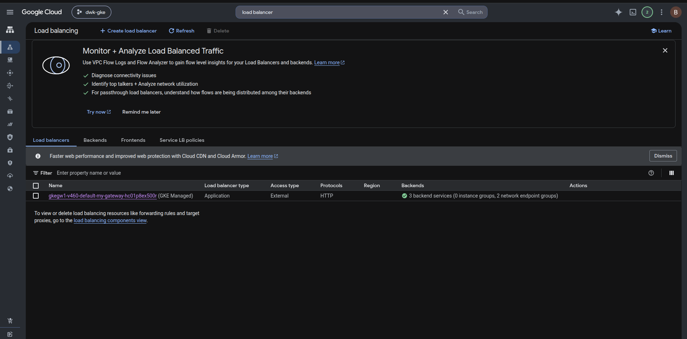
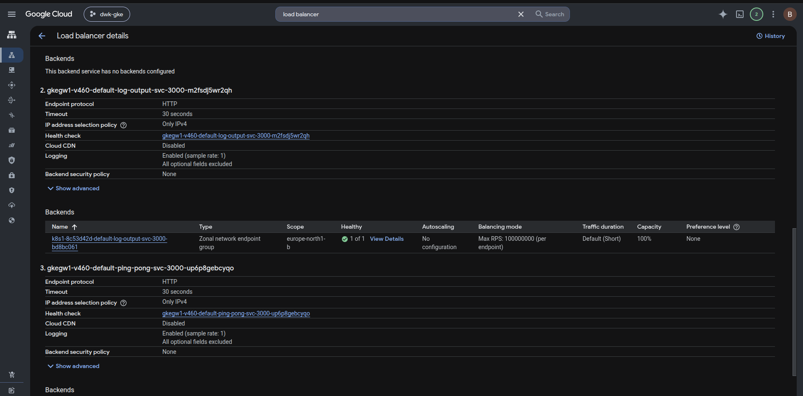
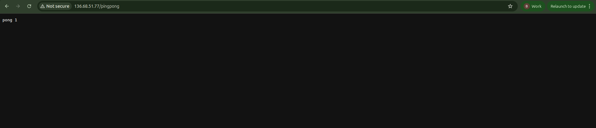
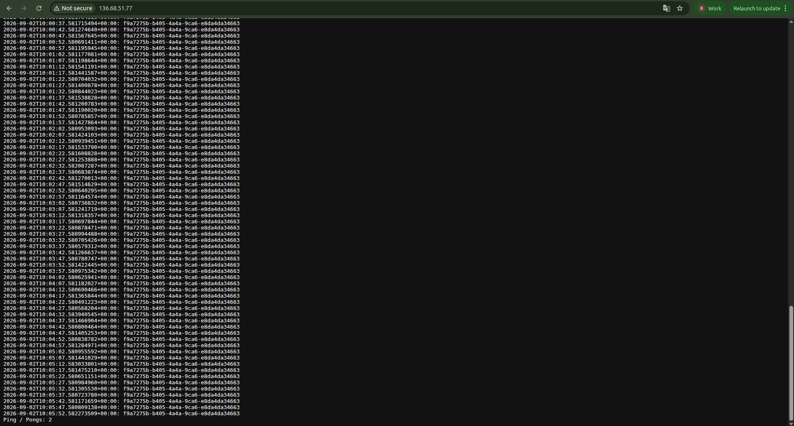

# Exercise 3.3 — To the Gateway (GKE)

## Goal

> Replace the **Ingress** with the **Gateway API** in the "Log output" and
> "Ping-pong" applications. See
> [HTTP routing](https://gateway-api.sigs.k8s.io/guides/user-guides/http-routing/)
> for more about HTTP routing.

---

## Knowledge: Gateway API (Chapter 4 — "New kid in the block: Gateway API")

The **Gateway API** is a set of resources/standards that define how
**external traffic** should be routed to services inside the cluster. It
builds on the Ingress concept but is more capable (complex routing, traffic
management). It has three key resources:

```
GatewayClass  ──defines a TYPE of gateway── (who implements it)
    │                (e.g. GKE's gke-l7-global-external-managed)
    ▼
Gateway  ──defines WHERE/HOW the LB listens──
    │          (external IP/hostnames, ports, protocol)
    ▼
HTTPRoute  ──defines the ROUTING RULES──
               (path/header matches → backendRefs to services)
```

| Resource | Role | Who creates it |
|---|---|---|
| **GatewayClass** | A type of gateway; selects the underlying LB controller (`gke-l7-*`) | Infrastructure provider (GKE) |
| **Gateway** | Where/how the load balancer listens (IPs, hostnames, ports) | You |
| **HTTPRoute** | Routing rules: which path/header goes to which Service | You |

### Changes vs the Ingress lab (3.2)

- **Ingress** → **Gateway + HTTPRoute** (two resources instead of one).
- **Service type: `ClusterIP`** (in 3.2 we used NodePort for GKE Ingress;
  the Gateway API controller accepts ClusterIP services) — the material
  explicitly says *"We still need to change the Service port type to
  ClusterIP."*
- Gateway CRDs come from GKE — enable them on the cluster
  (`--gateway-api=standard`).

### GKE specifics

- Enable Gateway API once per cluster:
  `gcloud container clusters update dwk-cluster --location=europe-north1-b --gateway-api=standard`
  (takes a few minutes; gives you `gateway.networking.k8s.io` CRDs).
- GKE provides GatewayClasses; the recommended one for an external L7 LB:
  `gke-l7-global-external-managed`.
- The **Gateway** address (external IP) appears in
  `kubectl get gateway my-gateway` → `ADDRESS` + `PROGRAMMED True` once the
  LB is ready (takes a few minutes).
- Health checks still hit `/` on each backend (`kubectl describe gateway`
  is a useful diagnostic).

## Step 1 — create the GKE cluster + enable Gateway API

### 1a. Create the cluster (private nodes — org-policy safe)

> Org policy `compute.vmExternalIpAccess` denies external IPs on VMs →
> normal nodes fail creation. Use **private nodes** (no public IP).

```bash
gcloud container clusters create dwk-cluster \
  --zone=europe-north1-b --cluster-version=1.36 \
  --disk-size=32 --num-nodes=4 --machine-type=e2-small \
  --enable-ip-alias --enable-private-nodes --master-ipv4-cidr=172.16.0.0/28 \
  --project=dwk-gke-506208
```

Wait for `STATUS: RUNNING`. Then the two required fixes (persisted at
project level after the first time, but run if re-creating):

```bash
gcloud container clusters update dwk-cluster --zone=europe-north1-b \
  --project=dwk-gke-506208 --no-enable-master-authorized-networks

# node SA needs Artifact Registry read to pull your gcr.io images
gcloud projects add-iam-policy-binding dwk-gke-506208 \
  --member="serviceAccount:323959491379-compute@developer.gserviceaccount.com" \
  --role="roles/artifactregistry.reader"
```

### 1b. Enable the Gateway API (once per cluster)

```bash
gcloud container clusters update dwk-cluster \
  --location=europe-north1-b --project=dwk-gke-506208 --gateway-api=standard
```

This installs the `gateway.networking.k8s.io` CRDs (GatewayClass, Gateway,
HTTPRoute). It takes a few minutes — be patient.

Check the provider-provided GatewayClasses:

```bash
kubectl get gatewayclass
# NAME                          CONTROLLER
# gke-l7-global-external-managed  networking.gke.io/gateway-controller
```

Verify kubectl + nodes:

```bash
kubectl cluster-info
kubectl get nodes   # 4 nodes Ready
```

## Step 2 — build & push Dockerfiles images

```bash
gcloud auth configure-docker   # once
cd ping-pong && docker build -t gcr.io/dwk-gke-506208/ping-pong:3.3 . && docker push gcr.io/dwk-gke-506208/ping-pong:3.3
cd ../log-output && docker build -t gcr.io/dwk-gke-506208/log-output:3.3 . && docker push gcr.io/dwk-gke-506208/log-output:3.3
```

## Step 3 — deploy + verify

```bash
kubectl apply -f manifests/deployment-ping-pong.yaml
kubectl apply -f manifests/deployment-log-output.yaml
kubectl apply -f manifests/service.yaml
kubectl apply -f manifests/gateway.yaml
kubectl apply -f manifests/route.yaml

kubectl rollout status deploy/ping-pong
kubectl rollout status deploy/log-output
kubectl get pods        # ping-pong, log-output all Running
kubectl get svc         # both ClusterIP
```

Watch the Gateway get its external IP (takes a few minutes):

```bash
kubectl get gateway my-gateway
# NAME         CLASS                      ADDRESS       PROGRAMMED   AGE
# my-gateway   gke-l7-gxlb                35.227.x.x    True         3m
kubectl describe gateway my-gateway   # diagnostics
kubectl get httproute my-route        # Accepted=True
```




Then open the gateway address in the browser:

| Path | Expected |
|---|---|
| `http://<GATEWAY-IP>/pingpong` | `pong 0`, `pong 1`, … (increments) |
| `http://<GATEWAY-IP>/` | log lines + `Ping / Pongs: <N>` |

```bash
curl http://<GATEWAY-IP>/pingpong   # pong 0
curl http://<GATEWAY-IP>/pingpong   # pong 1
curl http://<GATEWAY-IP>/           # log output + Ping / Pongs: 2
```




> It can take a while until the gateway is set up and the IP starts
> responding — the material warns about it.

---

## Step 4 — clean up (IMPORTANT — saves credits!)

```bash
gcloud container clusters delete dwk-cluster --zone=europe-north1-b \
  --project=dwk-gke-506208

gcloud container images delete gcr.io/dwk-gke-506208/ping-pong:3.3 --quiet --force-delete-tags
gcloud container images delete gcr.io/dwk-gke-506208/log-output:3.3 --quiet --force-delete-tags
```

Verify:

```bash
gcloud container clusters list
gcloud compute instances list
gcloud compute forwarding-rules list
gcloud compute addresses list
```

## P/S:

1. **Gateway API = 3 resources** (GatewayClass → Gateway → HTTPRoute) vs
   the single Ingress — it's the next-gen, more flexible alternative.
2. **GatewayClass is provider-owned**; on GKE: `gke-l7-global-external-managed`.
3. **Gateway** = where to listen (IPs/hostnames/ports); **HTTPRoute** = how
   to route (paths → services).
4. **Services back to ClusterIP** with Gateway API (vs NodePort for the GKE
   Ingress) — the material calls this out explicitly.
5. Enable `--gateway-api=standard` **once per cluster**; CRDs arrive slowly.
6. **Delete the cluster when idle** — GKE bills per node/hour + the LB.