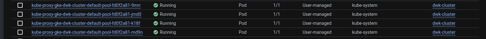
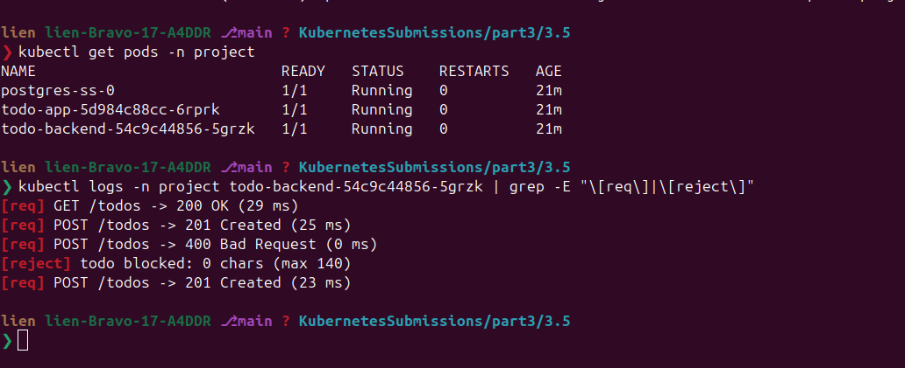

# Exercise 3.5 — The project, step 14: Kustomize + deploy the project to GKE

## Goal

> **"Configure the project to use Kustomize, and deploy it to Google Kubernetes Engine."**
> — Exercise 3.5, *Deployment Pipeline* (Chapter 4)

---

## Knowledge

### 1. What "deployment pipeline" means (context for the whole chapter)

Today you deploy by hand (`kubectl apply ...`) and hope. A **deployment
pipeline** automates the trip from *code pushed to git* to *running in
production*:

```
git push  →  build image  →  push image to a registry  →  deploy to cluster
```

Exercise 3.5 covers only the **deploy-by-hand done smartly** part
(Kustomize); full automation is 3.6.

### 2. Why Kustomize exists — the "lexical order" problem

If you have many manifests you can apply a whole folder:

```bash
kubectl apply -f manifests/
```

But kubernetes applies them in **lexical (alphabetical) order**, not
dependency order: if `configmap.yaml` comes before the file that creates its
namespace, or a deployment before its config map, you get errors. With 9
project files, applying them in the right order is exactly the sort of thing
humans get wrong.

**Kustomize** fixes this: *configuration customization and ordering*,
**baked straight into kubectl**.

| Command | Effect |
|---|---|
| `kubectl kustomize <dir>` | **Build only** — prints the whole kustomization as yaml to screen (dry run, nothing applied) |
| `kubectl apply -k <dir>` | Applies everything in the order declared in `kustomization.yaml` (`-k` = kustomize; **note: no `-f`!**) |

### 3. The `kustomization.yaml`

A small file listing the manifests **in apply order**:

```yaml
apiVersion: kustomize.config.k8s.io/v1beta1
kind: Kustomization
resources:
  - secret.yaml          # applied first — others depend on it
  - configmap.yaml
  # ... etc
```

> ⚠️ The apiVersion is **`kustomize.config.k8s.io/v1beta1`**. A common
> mistake is writing `config.kustomize.dev/v1beta1` (an older name);
> kubectl will refuse to read the file.

Kustomize is also the hook your pipeline needs: *override* values at apply
time:

```bash
kustomize edit set namespace ${BRANCH_NAME}
kustomize edit set image PROJECT/IMAGE=my-registry/image:tag
```

It rewrites the built yaml just before applying, so one pipeline deploys many
branches/images without touching the manifests.

---

## Step 1 — create the GKE cluster (private nodes)

```bash
gcloud container clusters create dwk-cluster \
  --zone=europe-north1-b --cluster-version=1.36 \
  --disk-size=32 --num-nodes=4 --machine-type=e2-small \
  --enable-ip-alias --enable-private-nodes --master-ipv4-cidr=172.16.0.0/28 \
  --project=dwk-gke-506208
```

Wait for `RUNNING` (~5 min), then:

```bash
# repair kubeconfig access (off by default until you flip it)
gcloud container clusters update dwk-cluster --zone=europe-north1-b \
  --project=dwk-gke-506208 --no-enable-master-authorized-networks

gcloud container clusters get-credentials dwk-cluster \
  --zone=europe-north1-b --project=dwk-gke-506208

# IAM (persists at project level, but harmless to re-grant)
gcloud projects add-iam-policy-binding dwk-gke-506208 \
  --member="serviceAccount:323959491379-compute@developer.gserviceaccount.com" \
  --role="roles/artifactregistry.reader"
```

```bash
kubectl get nodes            # 4 nodes Ready
kubectl create namespace project
```



## Step 2 — build & push the images

```bash
gcloud auth configure-docker   # once

cd todo-app && docker build -t gcr.io/dwk-gke-506208/todo-app:3.5 . && docker push gcr.io/dwk-gke-506208/todo-app:3.5

cd ../todo-backend && docker build -t gcr.io/dwk-gke-506208/todo-backend:3.5 . && docker push gcr.io/dwk-gke-506208/todo-backend:3.5

cd ../todo-cron && docker build -t gcr.io/dwk-gke-506208/todo-cron:3.5 . && docker push gcr.io/dwk-gke-506208/todo-cron:3.5

# postgres is a public image — retag it into our registry so private nodes can pull it
docker pull postgres:16
docker tag postgres:16 gcr.io/dwk-gke-506208/postgres:16
docker push gcr.io/dwk-gke-506208/postgres:16
```

## Step 3 — kustomization.yaml

```yaml
# manifests/kustomization.yaml
apiVersion: kustomize.config.k8s.io/v1beta1
kind: Kustomization
resources:
  - secret.yaml
  - configmap.yaml
  - configmap-todo.yaml
  - persistentvolumeclaim.yaml
  - postgres.yaml
  - deployment-todo-backend.yaml
  - deployment-todo-app.yaml
  - service.yaml
  - cronjob.yaml
```

Order = dependency order: secrets/configmaps/PVC first (deployments rely on
them by name), then database, services, app deployment, and the cron job.
Without Kustomize you'd apply these 9 files by hand in this order.

---

## Step 3b — deploy with Kustomize (from the exercise root)

---

### Namespaces — make sure it exists

Everything lives in the `project` namespace, which Kubernetes will not
auto-create:

```bash
kubectl create namespace project
kubectl config set-context --current --namespace=project   # optional default
```
---


Run from `part3/3.5/`, pointing kustomize at `manifests/`:

```bash
# 1) dry run: build the whole kustomization and look at it (nothing applied)
kubectl kustomize manifests/
# sample output: kind: Secret ... kind: StatefulSet ... (all 9 resources)

# 2) apply everything, in the declared order
kubectl apply -k manifests/
```

> `kubectl apply -k <dir>`: the `-k` flag does the kustomize processing.
> There is **no `-f`** on this command (they are mutually exclusive). Using
> `-k .` here would fail; there is no `kustomization.yaml` at the root.

```bash
kubectl rollout status deploy/todo-app -n project
kubectl rollout status deploy/todo-backend -n project
kubectl get pods -n project          # postgres-ss-0, todo-app, todo-backend all Running
kubectl get persistentvolumeclaims -n project   # both Bound
kubectl get cronjobs -n project      # todo-cron Active
```

## Step 4 — verify

```bash
# app through the ClusterIP service
kubectl port-forward -n project svc/todo-app-svc 8081:3000
curl -s -o /dev/null -w "%{http_code}\n" http://localhost:8081/                    # 200 (in another terminal)
LONG=$(python3 -c "print('x'*141)")
curl -s -o /dev/null -w "%{http_code}\n" -X POST http://localhost:8081/todos \
  --data "content=$LONG"                                                          # 400
curl -s -o /dev/null -w "%{http_code}\n" -X POST http://localhost:8081/todos \
  --data "content=salve"                                                          # 303
```

```bash
# backend: directly, port 2345 (this is where the request-logging lives)
kubectl port-forward -n project svc/todo-backend-svc 8091:2345
curl -s -o /dev/null -w "%{http_code}\n" -X POST http://localhost:8091/todos \
  -H 'Content-Type: application/json' -d "{\"title\":\"$LONG\"}"                  # 400
curl -s -o /dev/null -w "%{http_code}\n" -X POST http://localhost:8091/todos \
  -H 'Content-Type: application/json' -d '{"title":"salve from GKE"}'             # 201
kubectl get pods -n project
# NAME                            READY   STATUS
# todo-backend-54c9c44856-5jvfz   1/1     Running 
kubectl logs -n project <todo-backend-pod> | grep -E "\[req\]|\[reject\]"         # logging works
```



That last `201` proves the whole chain: todo-app → todo-backend →
postgres-svc → postgres PV → disk.

## Step 5 — clean up (IMPORTANT — saves credits!)

```bash
gcloud container clusters delete dwk-cluster --zone=europe-north1-b \
  --project=dwk-gke-506208

for img in todo-app:3.5 todo-backend:3.5 todo-cron:3.5 postgres:16; do
  gcloud container images delete gcr.io/dwk-gke-506208/$img --quiet --force-delete-tags
done
```

**The bit everyone forgets:** the PVCs left real disks behind:

```bash
gcloud compute disks list --project=dwk-gke-506208
# NAME  ... pvc-xxxxxxxx...  READY   ← delete any pvc-* disks!
gcloud compute disks delete pvc-<hash> --project=dwk-gke-506208 --zone=europe-north1-b
```

Final check: everything must be `0`:

```bash
gcloud container clusters list
gcloud compute instances list
gcloud compute forwarding-rules list
gcloud compute addresses list
gcloud compute disks list
```

---

## P/S:

1. **Kustomize = declared application ORDER + value overrides**, built into
   kubectl: `kubectl kustomize <dir>` (dry run) / `kubectl apply -k <dir>`.
2. `apiVersion: kustomize.config.k8s.io/v1beta1` with a `resources:` list in
   dependency order (secrets, configs, volumes, db, services, apps).
3. GKE ≠ k3d: no `local-path` storage class (use `standard`), no Traefik
   (ClusterIP + port-forward), and PVCs cost real disks; **delete `pvc-*`
   disks after the cluster**.
4. postgres initdb workaround: mount parent dir, set `PGDATA` subdir.
5. `ReadWriteOnce` + `replicas: 1` → RollingUpdate is safe; 2+ replicas
   needs a multi-pod access mode (see 3.6).
6. **The project on GKE works end-to-end**: a 201 through postgres proves the
   full stack, and request-logging `[req]`/`[reject]` works.
7. Clean up cluster, 4 images, and leftover disks; credits!
