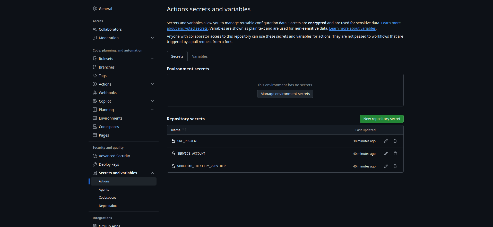
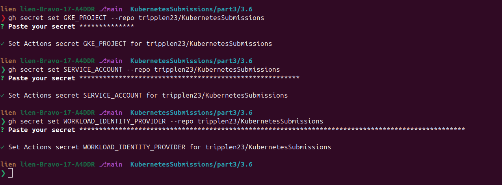
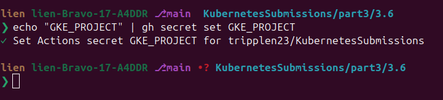
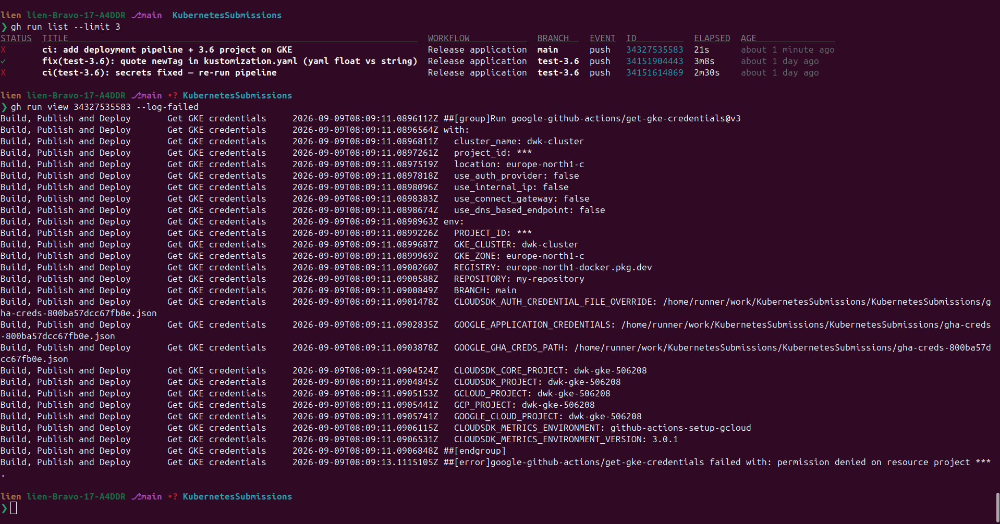
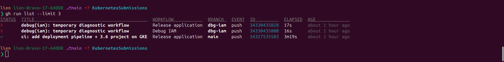
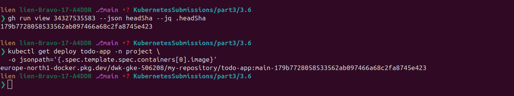
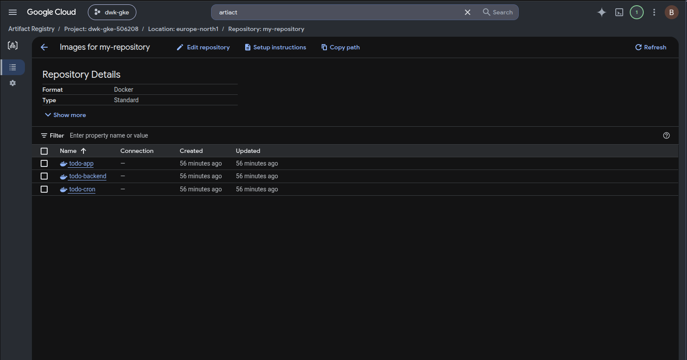

# Exercise 3.6 — The project, step 15: Deployment Pipeline (GitHub Actions)

## Goal

> **"Setup automatic deployment for the project as well."** — Exercise 3.6,
> *Deployment Pipeline* (Chapter 4)
---

## Knowledge

### 1. What the pipeline does (the whole picture)

```
1. git push                   → GitHub Actions wakes up (workflow file)
2. auth: GitHub ⇄ Google      → OIDC chain of trust (NO stored secrets!)
3. get GKE credentials        → kubectl can talk to dwk-cluster
4. configure docker           → push auth for Artifact Registry
5. build images               → todo-app, todo-backend, todo-cron
6. publish images             → europe-north1-docker.pkg.dev/.../todo-app:main-<sha>
7. kustomize edit set image   → inject fresh image tags into the manifests
8. kubectl apply -k           → deploy
9. kubectl rollout status     → wait until everything is running
```

### 2. GitHub Actions basics

- A **workflow** is a YAML file in **`.github/workflows/`** **at the repository
  ROOT** (the repo already has part1–part3, so it sits *beside* them, not in
  `3.6`). GitHub runs it.
- `on: push` runs the workflow on any push, on any branch (3.7 exploits this).
- `env:` holds variables shared by all steps; each `step` runs on the same
  ephemeral runner.
- **`${{ secrets.X }}`** reads a *secret* stored on GitHub
  (Settings → Secrets and variables → Actions); never visible in logs or git.
- **`$GITHUB_ENV` trick**: `echo "VAR=value" >> $GITHUB_ENV` exports a
  variable to the *next* steps (how tags travel).
- **`$GITHUB_SHA`** and **`github.ref_name`**: the commit hash and branch
  name GitHub injects.
- **`permissions: id-token: write`** on the job is REQUIRED for OIDC auth;
  without it, auth fails with *"Actions did not inject
  $ACTIONS_ID_TOKEN_REQUEST_TOKEN"* (we hit this).

### 3. The OIDC chain of trust — the "what did we actually do" part

The classic way: create a service account **JSON key** stored as a GitHub
secret. It works, but a stolen key means full access forever.

The modern way is **Workload Identity Federation**: GitHub proves who it is
with a **short-lived signed token** (nothing stored) and Google exchanges it
for a service-account token:

| # | Resource | What it is | Why needed |
|---|---|---|---|
| 1 | **Service Account** `github-actions-sa` | a GCP identity | GCP can't grant permissions to "GitHub" directly — the pipeline acts *as* this SA |
| 2 | **Roles on the SA** | `artifactregistry.writer` + `container.admin` | the SA's powers: push images + deploy to GKE |
| 3 | **Workload Identity Pool** `github-pool` | container for trusted external identities | scopes WHERE external tokens can come from |
| 4 | **OIDC Provider** `github-provider` | registers GitHub as trusted issuer + attribute mapping/condition (which repo) | "tokens from GitHub are trusted — and here's how to read them" |
| 5 | **Impersonation binding** | allows `principalSet` (our repo) to impersonate the SA | locks it down: ONLY this repo can use the SA |

When the pipeline runs, GitHub mints a token, GCP verifies and exchanges it
for a SA token; **nothing is stored.**

### 4. The image tag recipe — why it's so long

```
$REGISTRY/$PROJECT_ID/$REPOSITORY/$IMAGE:$BRANCH-$GITHUB_SHA
europe-north1-docker.pkg.dev/dwk-gke-506208/my-repository/todo-app:main-c00adaefda1f7169
```

- `europe-north1-docker.pkg.dev`: the Artifact Registry endpoint (region).
- `dwk-gke-506208`: project id.
- `my-repository`: the Docker repo we create.
- `todo-app`: the image name.
- `main-c00adaefda1f7169`: branch + commit → **unique per push**, so
  Kubernetes always sees a *new* image → `imagePullPolicy: Always` redeploys.

### 5. Deployment strategy vs. ReadWriteOnce PVC (the material's warning)

The material warns: *"If your pod uses a Persistent Volume Claim access
mode ReadWriteOnce, you may need to consider the deployment strategy, since
the default (RollingUpdate) may cause problems."*

Why: a **ReadWriteOnce** volume is mountable by **one pod at a time**, so
RollingUpdate (default) starts the NEW pod *before* terminating the OLD one
(`maxSurge`); it cannot attach the RWO PVC while the old pod holds it, so it
sits **Pending** forever and the rollout hangs.

Our project:
- **todo-app** has the PVC (`image-claim`, RWO) → switch to **`Recreate`**
  (old pod first, then new, so only one holder at a time).
- **todo-backend**: no volume → default RollingUpdate is fine.
- **postgres-ss** is a **StatefulSet**: pods update in place, one at a time,
  each with its own PVC, so no conflict.

### 6. Namespace

The project lives in namespace `project`, which neither Kubernetes nor the
pipeline auto-creates, so **you create it once** (Step 1); the manifests pin
it.

---

## Step 1 — GCP: cluster + namespace + Artifact Registry repo

### 1a. Cluster (private nodes — org policy blocks external IPs) + namespace

```bash
gcloud container clusters create dwk-cluster \
  --zone=europe-north1-c --cluster-version=1.36 \
  --disk-size=32 --num-nodes=4 --machine-type=e2-small \
  --enable-ip-alias --enable-private-nodes --master-ipv4-cidr=172.16.10.0/28 \
  --project=dwk-gke-506208
```

Wait for `RUNNING`, then:

```bash
gcloud container clusters update dwk-cluster --zone=europe-north1-c \
  --project=dwk-gke-506208 --no-enable-master-authorized-networks
gcloud container clusters get-credentials dwk-cluster --zone=europe-north1-c --project=dwk-gke-506208
kubectl create namespace project
```

### 1b. Artifact Registry — a Docker repository (the pipeline pushes here)

> Artifact Registry (`europe-north1-docker.pkg.dev`) is the *current*
> Google registry; `gcr.io` is legacy. The pipeline pushes to
> `my-repository`.

```bash
gcloud artifacts repositories create my-repository \
  --repository-format=docker --location=europe-north1 --project=dwk-gke-506208
```

### 1c. Base image for postgres

The pipeline rebuilds the three apps, but **postgres is a public image**
(not rebuilt). GKE private nodes can't be sure they can pull Docker Hub, so
push it to your registry once (see `postgres.yaml`):

```bash
docker pull postgres:16
docker tag postgres:16 gcr.io/dwk-gke-506208/postgres:16
docker push gcr.io/dwk-gke-506208/postgres:16
```

---

## Step 2 — GCP IAM: the OIDC chain of trust (5 commands)

Replace placeholders: `PROJECT_ID=dwk-gke-506208`,
`PROJECT_NUMBER=323959491379` (confirm with `gcloud projects list`),
`YOUR_ORG/YOUR_REPO=tripplen23/KubernetesSubmissions`.

**1. Service account + permissions** (the pipeline's identity):

```bash
gcloud iam service-accounts create github-actions-sa --display-name="GitHub Actions SA" --project=PROJECT_ID

gcloud projects add-iam-policy-binding PROJECT_ID \
  --role="roles/artifactregistry.writer" \
  --member="serviceAccount:github-actions-sa@PROJECT_ID.iam.gserviceaccount.com"

gcloud projects add-iam-policy-binding PROJECT_ID \
  --role="roles/container.admin" \
  --member="serviceAccount:github-actions-sa@PROJECT_ID.iam.gserviceaccount.com"
```

> `artifactregistry.writer` = push images; `container.admin` = deploy to GKE.

**2. Workload identity pool** (container for the trusted identities):

```bash
gcloud iam workload-identity-pools create github-pool --location=global --display-name="GitHub Actions Pool" --project=PROJECT_ID
```

**3. OIDC provider** (register GitHub as trusted, restricted to YOUR repo
via the attribute-condition):

```bash
gcloud iam workload-identity-pools providers create-oidc github-provider \
  --location=global --workload-identity-pool=github-pool \
  --display-name="GitHub provider" \
  --attribute-mapping="google.subject=assertion.sub,attribute.repository=assertion.repository" \
  --attribute-condition="assertion.repository=='YOUR_ORG/YOUR_REPO'" \
  --issuer-uri="https://token.actions.githubusercontent.com" \
  --project=PROJECT_ID
```

**4. Allow YOUR repo to impersonate the service account**:

```bash
gcloud iam service-accounts add-iam-policy-binding github-actions-sa@PROJECT_ID.iam.gserviceaccount.com \
  --role="roles/iam.workloadIdentityUser" \
  --member="principalSet://iam.googleapis.com/projects/PROJECT_NUMBER/locations/global/workloadIdentityPools/github-pool/attribute.repository/YOUR_ORG/YOUR_REPO" \
  --project=PROJECT_ID
```

> This last step needs permission to **set policy on a service account**
> (`roles/iam.serviceAccountAdmin`). If it fails with
> `IAM_PERMISSION_DENIED`, grant yourself that role, then retry:
>
> ```bash
> gcloud projects add-iam-policy-binding PROJECT_ID \
>   --role=roles/iam.serviceAccountAdmin --member=user:YOU@EMAIL
> ```

---

## Step 3 — GitHub: the three secrets

In the repo: **Settings → Secrets and variables → Actions → New repository
secret** (or `gh`):

| Secret | Value |
|---|---|
| `GKE_PROJECT` | `dwk-gke-506208` |
| `SERVICE_ACCOUNT` | `github-actions-sa@dwk-gke-506208.iam.gserviceaccount.com` |
| `WORKLOAD_IDENTITY_PROVIDER` | `projects/323959491379/locations/global/workloadIdentityPools/github-pool/providers/github-provider` |

```bash
gh secret set GKE_PROJECT --repo tripplen23/KubernetesSubmissions
# type the value: dwk-gke-506208
gh secret set SERVICE_ACCOUNT --repo tripplen23/KubernetesSubmissions
# type the value: github-actions-sa@dwk-gke-506208.iam.gserviceaccount.com
gh secret set WORKLOAD_IDENTITY_PROVIDER --repo tripplen23/KubernetesSubmissions
# type the value: projects/323959491379/locations/global/workloadIdentityPools/github-pool/providers/github-provider
```




> ⚠️ `gh secret set` reads the VALUE from **stdin** (or `--body`), **not** the
> name; `echo "GKE_PROJECT" | gh secret set GKE_PROJECT` stores the literal
> placeholder (we hit this during testing: auth failed with "Invalid value
> for audience").
>
> ⚠️ **`GKE_PROJECT` must be the project ID** `dwk-gke-506208`; a wrong value
> makes `get-gke-credentials` fail with `permission denied on resource
> project ***` (seen in 2026-09-09 testing). Auth still works (auth@v3
> doesn't read `GKE_PROJECT`), so a green auth step does NOT prove this
> secret is correct.



---

## Step 4 — the GitHub Actions workflow

Create **`.github/workflows/main.yaml`** at the repository **root**:

```yaml
name: Release application

on:
  push:

env:
  PROJECT_ID: ${{ secrets.GKE_PROJECT }}
  GKE_CLUSTER: dwk-cluster
  GKE_ZONE: europe-north1-c
  REGISTRY: europe-north1-docker.pkg.dev
  REPOSITORY: my-repository
  BRANCH: ${{ github.ref_name }}

jobs:
  build-publish-deploy:
    name: Build, Publish and Deploy
    runs-on: ubuntu-latest
    permissions:
      id-token: write
      contents: read

    steps:
      - name: Checkout
        uses: actions/checkout@v6

      - uses: google-github-actions/auth@v3
        with:
          workload_identity_provider: '${{ secrets.WORKLOAD_IDENTITY_PROVIDER }}'
          service_account: '${{ secrets.SERVICE_ACCOUNT }}'

      - name: 'Set up Cloud SDK'
        uses: google-github-actions/setup-gcloud@v3

      - name: 'Use gcloud CLI'
        run: gcloud info

      - name: 'Get GKE credentials'
        uses: 'google-github-actions/get-gke-credentials@v3'
        with:
          cluster_name: '${{ env.GKE_CLUSTER }}'
          project_id: '${{ env.PROJECT_ID }}'
          location: '${{ env.GKE_ZONE }}'

      - name: 'Configure Docker to push to Artifact Registry'
        run: gcloud --quiet auth configure-docker $REGISTRY

      - name: 'Form image names'
        run: |
          echo "IMAGE_TAG_APP=$REGISTRY/$PROJECT_ID/$REPOSITORY/todo-app:$BRANCH-$GITHUB_SHA" >> $GITHUB_ENV
          echo "IMAGE_TAG_BACKEND=$REGISTRY/$PROJECT_ID/$REPOSITORY/todo-backend:$BRANCH-$GITHUB_SHA" >> $GITHUB_ENV
          echo "IMAGE_TAG_CRON=$REGISTRY/$PROJECT_ID/$REPOSITORY/todo-cron:$BRANCH-$GITHUB_SHA" >> $GITHUB_ENV

      - name: 'Build todo-app'
        run: docker build --tag $IMAGE_TAG_APP part3/3.6/todo-app

      - name: 'Build todo-backend'
        run: docker build --tag $IMAGE_TAG_BACKEND part3/3.6/todo-backend

      - name: 'Build todo-cron'
        run: docker build --tag $IMAGE_TAG_CRON part3/3.6/todo-cron

      - name: 'Publish images'
        run: |
          docker push $IMAGE_TAG_APP
          docker push $IMAGE_TAG_BACKEND
          docker push $IMAGE_TAG_CRON

      - name: 'Set up Kustomize'
        uses: imranismail/setup-kustomize@v3

      - name: 'Deploy with Kustomize'
        run: |
          cd part3/3.6/manifests
          kustomize edit set image TODO_APP=$IMAGE_TAG_APP
          kustomize edit set image TODO_BACKEND=$IMAGE_TAG_BACKEND
          kustomize edit set image TODO_CRON=$IMAGE_TAG_CRON
          kustomize build . | kubectl apply -f -
          kubectl rollout status deployment todo-app -n project
          kubectl rollout status deployment todo-backend -n project
          kubectl rollout status statefulset postgres-ss -n project
          kubectl get pods -n project -o wide
```

Read it in 4 chunks:
1. **trigger + env**: `on: push`, the constants, `BRANCH=github.ref_name`.
2. **auth block**: checkout, `auth@v3` (OIDC via the two secrets),
   `setup-gcloud`, `get-gke-credentials`, `auth configure-docker $REGISTRY`.
3. **build + publish**: "Form image names" writes the three tags into
   **$GITHUB_ENV**; then `docker build --tag` and `docker push`.
4. **deploy**: the kustomize action installs `kustomize`; `edit set image`
   rewrites the `images:` entries to the fresh `main-<sha>` tags; then
   `kustomize build . | kubectl apply -f -` and `rollout status`.

---

## Step 5 — kick it: commit + push → the pipeline deploys

```bash
git add -A
git commit -m "ci: add deployment pipeline + 3.6 project on GKE"
git push
```

GitHub runs `Release application` (watch the **Actions** tab):

```bash
gh run list --limit 3
gh run watch            # live
gh run view <ID> --log-failed   # when it fails, the tail shows the failing step
```



A green `✓` means the whole chain worked: auth → build → push → deploy →
rollout.



---

## Step 6 — verify the deployment (proves the pipeline deployed it)

```bash
kubectl rollout status deploy/todo-app -n project          # "successfully rolled out"
kubectl rollout status deploy/todo-backend -n project
kubectl get pods -n project -o wide        # 3× Running — postgres-ss-0, todo-app, todo-backend

# the image really comes from Artifact Registry, tagged main-<sha>:
kubectl get deploy todo-app -n project \
  -o jsonpath='{.spec.template.spec.containers[0].image}'
# → europe-north1-docker.pkg.dev/dwk-gke-506208/my-repository/todo-app:main-<sha>
```



Now check Google Cloud Artifact Registry:


And the app still works (deployed by the pipeline, no human touch):

```bash
kubectl port-forward -n project svc/todo-app-svc 8081:3000 &
LONG=$(python3 -c "print('x'*141)")
curl -s -o /dev/null -w "GET / -> %{http_code}\n" http://localhost:8081/                 # 200
curl -s -o /dev/null -w "POST 141 -> %{http_code}\n" -X POST http://localhost:8081/todos --data "content=$LONG"          # 400
curl -s -o /dev/null -w "POST ok -> %{http_code}\n" -X POST http://localhost:8081/todos --data "content=deployed-by-pipeline"  # 303
```

---

## Step 7 — clean up (credits!)

```bash
gcloud container clusters delete dwk-cluster --zone=europe-north1-c --project=dwk-gke-506208

# images live in Artifact Registry now (not gcr) — delete the whole repo:
gcloud artifacts repositories delete my-repository \
  --location=europe-north1 --project=dwk-gke-506208 --async

# the postgres base image pushed to legacy gcr:
gcloud container images delete gcr.io/dwk-gke-506208/postgres:16 --quiet --force-delete-tags

# leftover PVC disks (they SURVIVE cluster deletion):
gcloud compute disks list --project=dwk-gke-506208     # any pvc-* → delete:
gcloud compute disks delete pvc-... --project=dwk-gke-506208 --zone=europe-north1-c
```

Final check: clusters, instances, forwarding-rules, addresses, disks all = 0:

```bash
gcloud container clusters list --project=dwk-gke-506208
gcloud compute disks list --project=dwk-gke-506208
```

## P/S:

1. **CI/CD = build → publish → deploy, triggered by a push**: the moment
   you `git push`, production updates.
2. **OIDC chain of trust (5 pieces)**: SA → roles → identity pool → OIDC
   provider with repo condition → impersonation binding. **No stored
   secrets.**
3. `permissions: id-token: write` unlocks OIDC from Actions.
4. Image tag `main-<sha>` is unique per push, so deployments always run fresh
   images.
5. **RollingUpdate vs RWO PVC** → `Recreate` on the volume-carrying
   deployment; StatefulSets are safe.
6. The whole project (app + backend + db + cron) ships to production with
   one workflow.
7. Clean up cluster, AR repo, images and leftover disks; borrowed cloud
   costs money.
