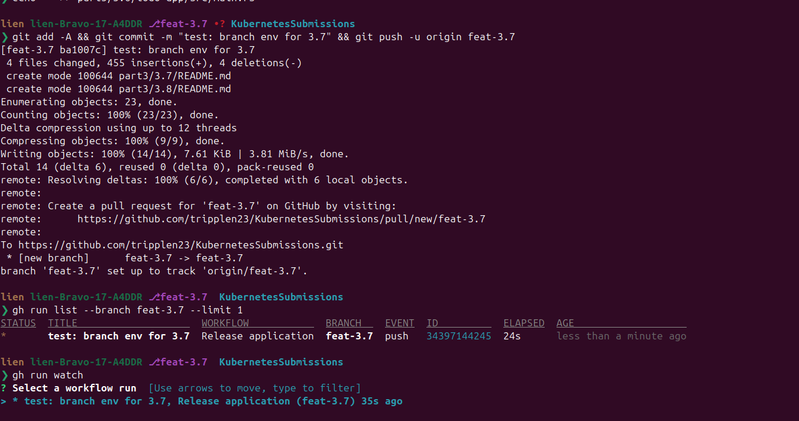

# Exercise 3.7 — The project, step 16: Separate environment for each branch

> Continue in **the same repository** as 3.6. The pipeline already exists
> (`.github/workflows/main.yaml`, building from `part3/3.6/*`). This lab
> only **upgrades the Deploy step** so that *each branch gets its own
> environment*. `main` keeps deploying to namespace `project`.

## Goal

Extend the 3.6 pipeline: **every git branch deploys to a namespace named
after the branch**; the `main` branch still deploys to `project`.

```text
feature branches            main
      │                       │
      ▼                       ▼
namespace <branch>       namespace project
```

The course assumes branch names are valid namespace names (lowercase,
no dots/slashes — e.g. `feat37`).

## Knowledge — the three namespace commands

The whole trick is 3 small commands inside the Deploy step (from the
course "Separate environment for each branch" section):

```bash
kubectl create namespace "${BRANCH}" || true            # may not exist yet
kubectl config set-context --current --namespace="${BRANCH}"
kustomize edit set namespace "${BRANCH}"
```

- `|| true` — the namespace might already exist; don't let create fail the build.
- `set-context --current --namespace` — everything `kubectl` does after
  this (apply, rollout, get) targets that namespace.
- `kustomize edit set namespace X` — adds `namespace: X` into
  `kustomization.yaml`, which **overrides the hard-coded `namespace:
  project` on every manifest** (verified: the kustomize namespace
  transformer replaces the field, it does not merge; cluster-scoped kinds
  like StorageClass are left alone).

The only branch that must NOT get a branch-named namespace is `main`.

---

## Step 1 — Prep: cluster + postgres base image

```bash
gcloud container clusters create dwk-cluster \
  --zone=europe-north1-c --cluster-version=1.36 \
  --disk-size=32 --num-nodes=4 --machine-type=e2-small \
  --enable-ip-alias --enable-private-nodes --master-ipv4-cidr=172.16.10.0/28 \
  --project=dwk-gke-506208

gcloud container clusters update dwk-cluster --zone=europe-north1-c \
  --project=dwk-gke-506208 --no-enable-master-authorized-networks
gcloud container clusters get-credentials dwk-cluster --zone=europe-north1-c --project=dwk-gke-506208

# postgres base image the manifests reference (postgres.yaml):
# it is NOT rebuilt by the pipeline — pull public + push to gcr once
docker pull postgres:16
docker tag postgres:16 gcr.io/dwk-gke-506208/postgres:16
docker push gcr.io/dwk-gke-506208/postgres:16
```

> If `my-repository` was deleted too, recreate it (the pipeline pushes
> images there): `gcloud artifacts repositories create my-repository
> --repository-format=docker --location=europe-north1 --project=dwk-gke-506208`
> (and the 3 GCP-side secrets + WIF pool/provider are still alive — do not
> recreate those, `undelete` is the fix if they ever show `DELETED`).

---

## Step 2 — Update the workflow (full file)

My current `.github/workflows/main.yaml` (from 3.6) must become this —
**only the Deploy step changed** (the namespace logic); every other step
stays identical. Replace the file, then diff mentally against yours.

```yaml
name: Release application

on:
  push:

env:
  PROJECT_ID: ${{ secrets.GKE_PROJECT }}
  GKE_CLUSTER: dwk-cluster
  GKE_ZONE: europe-north1-c
  REGISTRY: europe-north1-docker.pkg.dev
  REPOSITORY: my-repository
  BRANCH: ${{ github.ref_name }}

jobs:
  build-publish-deploy:
    name: Build, Publish and Deploy
    runs-on: ubuntu-latest
    permissions:
      id-token: write
      contents: read

    steps:
      - name: Checkout
        uses: actions/checkout@v6

      - uses: google-github-actions/auth@v3
        with:
          workload_identity_provider: '${{ secrets.WORKLOAD_IDENTITY_PROVIDER }}'
          service_account: '${{ secrets.SERVICE_ACCOUNT }}'

      - name: 'Set up Cloud SDK'
        uses: google-github-actions/setup-gcloud@v3

      - name: 'Use gcloud CLI'
        run: gcloud info

      - name: 'Get GKE credentials'
        uses: 'google-github-actions/get-gke-credentials@v3'
        with:
          cluster_name: '${{ env.GKE_CLUSTER }}'
          project_id: '${{ env.PROJECT_ID }}'
          location: '${{ env.GKE_ZONE }}'

      - name: 'Configure Docker to push to Artifact Registry'
        run: gcloud --quiet auth configure-docker $REGISTRY

      - name: 'Form image names'
        run: |
          echo "IMAGE_TAG_APP=$REGISTRY/$PROJECT_ID/$REPOSITORY/todo-app:$BRANCH-$GITHUB_SHA" >> $GITHUB_ENV
          echo "IMAGE_TAG_BACKEND=$REGISTRY/$PROJECT_ID/$REPOSITORY/todo-backend:$BRANCH-$GITHUB_SHA" >> $GITHUB_ENV
          echo "IMAGE_TAG_CRON=$REGISTRY/$PROJECT_ID/$REPOSITORY/todo-cron:$BRANCH-$GITHUB_SHA" >> $GITHUB_ENV

      - name: 'Build todo-app'
        run: docker build --tag $IMAGE_TAG_APP part3/3.6/todo-app

      - name: 'Build todo-backend'
        run: docker build --tag $IMAGE_TAG_BACKEND part3/3.6/todo-backend

      - name: 'Build todo-cron'
        run: docker build --tag $IMAGE_TAG_CRON part3/3.6/todo-cron

      - name: 'Publish images'
        run: |
          docker push $IMAGE_TAG_APP
          docker push $IMAGE_TAG_BACKEND
          docker push $IMAGE_TAG_CRON

      - name: 'Set up Kustomize'
        uses: imranismail/setup-kustomize@v3

      - name: 'Deploy with Kustomize'
        run: |
          # keep main on project; every other branch gets a namespace of its own
          NAMESPACE="project"
          if [ "$BRANCH" != "main" ]; then
            NAMESPACE="$BRANCH"
          fi
          kubectl create namespace "$NAMESPACE" || true
          kubectl config set-context --current --namespace="$NAMESPACE"
          cd part3/3.6/manifests
          kustomize edit set namespace "$NAMESPACE"
          kustomize edit set image TODO_APP=$IMAGE_TAG_APP
          kustomize edit set image TODO_BACKEND=$IMAGE_TAG_BACKEND
          kustomize edit set image TODO_CRON=$IMAGE_TAG_CRON
          kustomize build . | kubectl apply -f -
          kubectl rollout status deployment todo-app
          kubectl rollout status deployment todo-backend
          kubectl rollout status statefulset postgres-ss
          kubectl get pods -o wide
```

### What changed vs 3.6

| 3.6 (old) | 3.7 (new) |
|---|---|
| `kubectl rollout status ... -n project` (3×) | `NAMESPACE` computed (`main`→`project`, else branch name) |
| no namespace creation | `kubectl create namespace "$NAMESPACE" \|\| true` |
| (nothing) | `kubectl config set-context --current --namespace` — targets rest of the step |
| (nothing) | `kustomize edit set namespace "$NAMESPACE"` — rewrites all manifests |

---

## Step 3 — Kick it: push a test branch

```bash
git checkout -b feat37
# touch nothing? make a trivial diff so the branch is pushed:
echo "" >> part3/3.6/todo-app/src/main.rs    # or any real change
git add -A && git commit -m "test: branch env for 3.7" && git push -u origin feat37
```

The `on: push` trigger fires for the new branch → the pipeline now runs
twice per push (main's run + branch's run). Watch the **branch** run:

```bash
gh run list --branch feat37 --limit 1
gh run watch
```



---

## Step 4 — Verify

```bash
# the new per-branch environment is up:
kubectl get pods -n feat37 -o wide
#   todo-app-*, todo-backend-*, postgres-ss-0  → all Running

# main's environment untouched:
kubectl get pods -n project -o wide

# the branch's image comes from THIS branch's build (tag = branch-sha):
kubectl get deploy todo-app -n feat37 \
  -o jsonpath='{.spec.template.spec.containers[0].image}'
# → europe-north1-docker.pkg.dev/dwk-gke-506208/my-repository/todo-app:feat37-<sha>

# and it actually serves:
kubectl port-forward -n feat37 svc/todo-app-svc 8082:3000 &
curl -s -o /dev/null -w "GET / -> %{http_code}\n" http://localhost:8082/    # 200
```

Each branch environment is a **full stack** (app + backend + postgres +
cron + its own PVC) — postgres runs inside its own namespace, so
environments are isolated from each other.

---

## Step 5 — Clean up (after submitting; keep cluster for 3.8!)

3.8 (delete-branch → delete-env) will automate namespace cleanup — until
then you delete the test environment by hand:

```bash
git push origin --delete feat37   # removes the branch (and its runs)
kubectl delete namespace feat37    # removes the test environment

# when fully done with 3.7:
gcloud container clusters delete dwk-cluster --zone=europe-north1-c --project=dwk-gke-506208
gcloud artifacts repositories delete my-repository --location=europe-north1 --project=dwk-gke-506208 --async
gcloud container images delete gcr.io/dwk-gke-506208/postgres:16 --quiet --force-delete-tags
gcloud compute disks list --project=dwk-gke-506208   # any pvc-* → delete them
```

> KEEP the WIF chain (workload identity pool `github-pool`, SA
> `github-actions-sa`, the 3 GitHub secrets) — **3.8 reuses every bit of
> it.** Only clean it after 3.8.

---

## Common errors (quick table)

| Symptom | Cause | Fix |
|---|---|---|
| deploy fails at `kustomize edit set namespace` | ran outside the `manifests` dir | the `cd part3/3.6/manifests` must run before all `kustomize edit ...` |
| `The Namespace "feat-3.7" is invalid: ... must not contain dots` | branch name contains a **dot** — Kubernetes namespace names can't have dots (hit with `feat-3.7`!) | rename the branch to a dot-free name: `git branch -m feat-3.7 feat37` then push; the namespace (and verify commands) then use `feat37` |
| everything lands in the `default` namespace | namespace override missing → kustomize kept the manifests' hardcoded `project` or empty | ensure `kustomize edit set namespace "$NAMESPACE"` is in the step (verified: field overrides the manifests) |
| postgres pod ImagePullBackOff in a branch env | `gcr.io/.../postgres:16` was deleted in cleanup | re-run the `docker tag/push` from Step 1 |
| `AlreadyExists` namespace | branch created twice / is `main` | `\|\| true` after `kubectl create` (already in the script) |
| a push to `main` deploys the same as `project` | expected | that's the requirement: main → `project` |