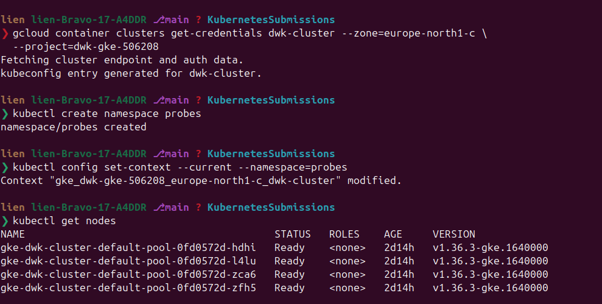
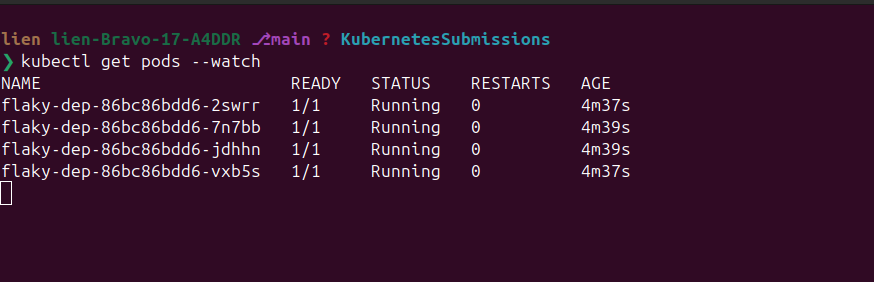
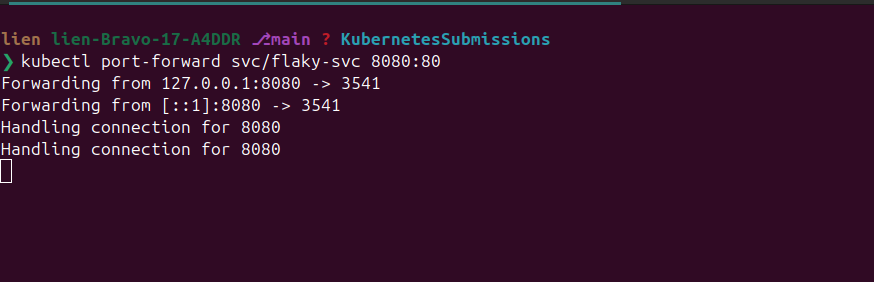
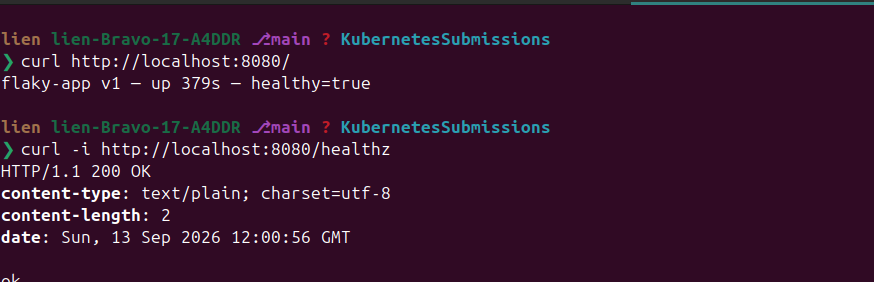
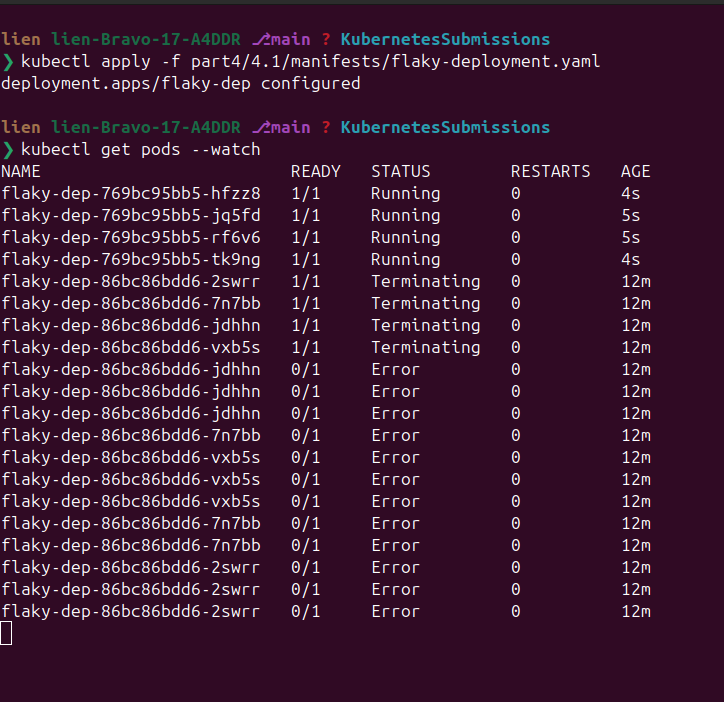
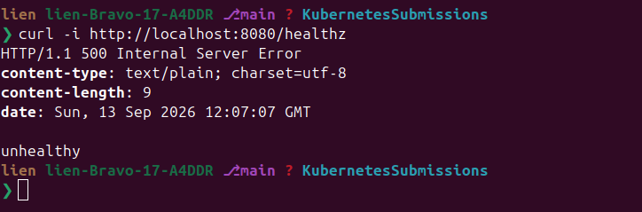
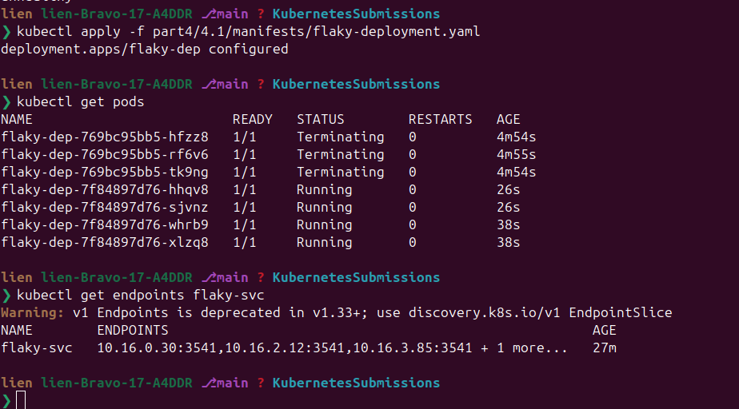
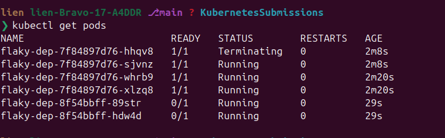
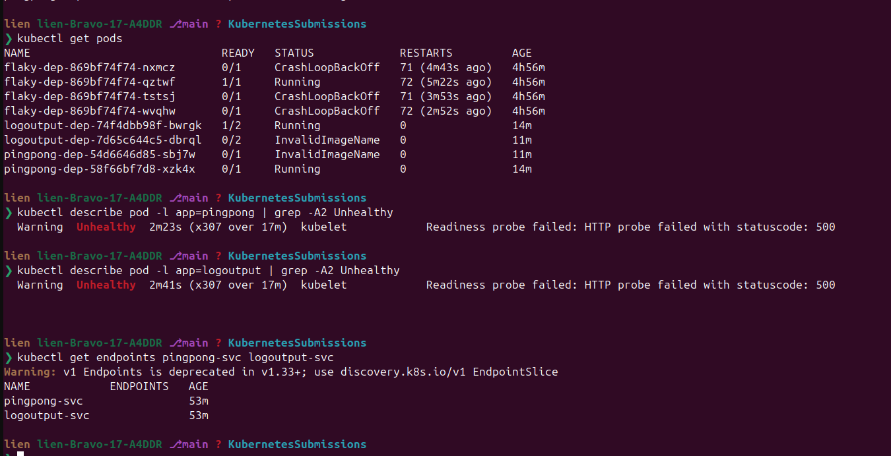
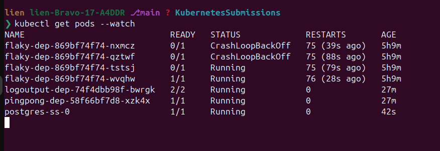

# Exercise 4.1 — Readiness probe

> Course text (chapter 5, *Update Strategies and Prometheus*):
> *"Create a ReadinessProbe for the Ping-pong application. It should be ready
> when it has a connection to the database. And another ReadinessProbe for Log
> output application. It should be ready when it can receive data from the
> Ping-pong application. Test that it works by applying everything but the
> database statefulset."*

This lab covers exercise **4.1** and the theory that exercise needs — nothing
else. What we will learn by *doing*:

1. What a rolling update does, and why "the update succeeded" is not the same as
   "the application works".
2. What a `readinessProbe` is, what Kubernetes does when it fails, and how
   readiness is what puts a pod into (or keeps it out of) a Service's endpoints.
3. Rolling back a change that never becomes ready (`kubectl rollout undo`).
4. Building the **exercise 4.1** deliverable: readiness probes for the ping-pong
   and log-output applications, tested the way the exercise asks.

> The chapter's page goes on to canary releases (Argo Rollouts) and Prometheus —
> those are *other* exercises and are deliberately not part of this lab.

Work through the steps in order — each one builds on the previous one and is
small: apply a file, look at what changed, say out loud what it means.

---

## Step 0 — a cluster and the tools

Any Kubernetes cluster works. This is the GKE setup used here (skip it if you
already have a cluster; the lab only needs `kubectl`):

```bash
gcloud container clusters create dwk-cluster --zone=europe-north1-c \
  --cluster-version=1.36 --disk-size=32 --num-nodes=4 --machine-type=e2-small \
  --enable-ip-alias --enable-private-nodes --master-ipv4-cidr=172.16.10.0/28 \
  --project=dwk-gke-506208
gcloud container clusters get-credentials dwk-cluster --zone=europe-north1-c \
  --project=dwk-gke-506208
```

Everything in this lab runs in its own namespace, so nothing collides with other
work:

```bash
kubectl create namespace probes
kubectl config set-context --current --namespace=probes
kubectl get nodes
```



> ⚠️ This cluster is a **private cluster without general internet egress**: only
> `docker.io` images can be pulled, `quay.io` and the open internet time out. The
> lab builds every image it needs itself (see P.S.).

---

## Step 1 — build and push this lab's images

Replace the registry with your own. The tag `4.1` is only a label; what matters is
that all three images come from *this* folder.

```bash
R=europe-north1-docker.pkg.dev/dwk-gke-506208/my-repository

gcloud auth configure-docker europe-north1-docker.pkg.dev

docker build -t $R/flaky-app:4.1  part4/4.1/flaky-app
docker build -t $R/ping-pong:4.1  part4/4.1/ping-pong
docker build -t $R/log-output:4.1 part4/4.1/log-output

docker push $R/flaky-app:4.1
docker push $R/ping-pong:4.1
docker push $R/log-output:4.1
```

---

## Step 2 — what a rolling update really does (no probes yet)

A **rolling update** replaces the pods of a Deployment one at a time. Two numbers
control it: `maxSurge` (how many extra pods may exist during the update) and
`maxUnavailable` (how many pods may be missing) — both default to 25 %, so with 4
replicas you always keep at least 3 pods serving. The point is **availability
during the update**: an update should never take the app down.

**Replace the registry placeholder first.** Every manifest in this lab uses
`your-registry.example.com/...`; applying one without replacing it is the classic
`ImagePullBackOff`:

```text
Failed to pull image "your-registry.example.com/flaky-app:4.1": ...
dial tcp: lookup your-registry.example.com on 169.254.169.254:53: no such host
```

Do it once, for all the manifests at the same time, and check:

```bash
R=europe-north1-docker.pkg.dev/dwk-gke-506208/my-repository
sed -i "s|your-registry.example.com|$R|g" part4/4.1/manifests/*.yaml
grep -rn "your-registry.example.com" part4/4.1/manifests/ || echo "placeholders replaced"
```

> A placeholder has to be **lowercase**: an image name is not case-insensitive.
> `YOUR_REGISTRY/ping-pong:4.1` never even reaches the network — the kubelet
> refuses it with `InvalidImageName ... repository name must be lowercase`, while
> an all-caps host such as `EUROPE/...` is treated as a registry and fails with
> `dial tcp: lookup EUROPE ... no such host`. `your-registry.example.com` is
> lowercase and obviously fake, so a forgotten substitution is easy to read.

Then apply both files (`-n probes` if that is not your current namespace):

```bash
kubectl apply -f part4/4.1/manifests/flaky-deployment.yaml
kubectl apply -f part4/4.1/manifests/flaky-service.yaml
kubectl get pods --watch     # 4 pods, all 1/1 Running
```



In a second terminal, look at the app through the Service:

```bash
kubectl port-forward svc/flaky-svc 8080:80
curl http://localhost:8080/            # flaky-app v1 — healthy=true
curl -i http://localhost:8080/healthz  # HTTP/1.1 200 OK
```




Now deploy the broken version — change `FLAKY_VERSION` to `"v2"` in the
deployment and apply it again:

```bash
kubectl apply -f part4/4.1/manifests/flaky-deployment.yaml
kubectl get pods --watch
```



**What you will see:** the update finishes successfully — 4 pods, all
`1/1 Running`, no errors — and yet the application is broken:

```bash
curl -i http://localhost:8080/healthz  # HTTP/1.1 500 Internal Server Error
```



**What it means:** the *container* is running, so Kubernetes is happy; the
*application* is not working, and plain Kubernetes has no way to know. The only
thing that can tell the difference is a **check inside the container**. That is
what probes are.

---

## Step 3 — readinessProbe: "do not send me traffic until I work"

A **readinessProbe** is a check Kubernetes runs periodically against a container.
While it fails, the pod is **not Ready**: it stays running (no restart), but it is
**removed from the Service's endpoints**, so no traffic reaches it.

Add this to the container in `flaky-deployment.yaml`:

```yaml
          readinessProbe:
            initialDelaySeconds: 10   # wait this long after the container starts
            periodSeconds: 5          # then check every 5 seconds
            httpGet:
              path: /healthz
              port: 3541
```

Set `FLAKY_VERSION` back to `"v1"`, apply, wait until all 4 pods are Ready, and
look at what the Service is actually pointing at:

```bash
kubectl apply -f part4/4.1/manifests/flaky-deployment.yaml
kubectl get pods
kubectl get endpoints flaky-svc      # 4 pod IPs, because 4 pods are ready
```



Now break it again (`FLAKY_VERSION: "v2"`) and apply:

```bash
kubectl apply -f part4/4.1/manifests/flaky-deployment.yaml
kubectl get pods --watch
kubectl get pods
```



**What you will see:** the update **stops half-way** — three `v1` pods keep
running and two `v2` pods sit at `0/1 Running` forever:

```text
NAME                         READY   STATUS    RESTARTS   AGE
flaky-dep-6c9b7d9f8-2lq4c    1/1     Running   0          3m   (v1)
flaky-dep-6c7b9f5d4-8xj2v   0/1     Running   0          25s  (v2, never ready)
flaky-dep-6c7b9f5d4-dkw7p    0/1     Running   0          24s
```

```bash
kubectl describe pod <one-of-the-0/1-pods>
#   Warning  Unhealthy  Readiness probe failed: HTTP probe failed with statuscode: 500
kubectl get endpoints flaky-svc      # still the three v1 pods → traffic keeps working
```

**What it means:** the readinessProbe turned a silent outage into a **stalled
update**. Kubernetes refused to continue rolling out a version that never becomes
ready, and because only *ready* pods are in the endpoints, the users never
noticed. This is the trade-off to remember: the rollout is blocked until you
either fix the new version or roll back.

---

Readiness probe parameters you will see in this lab:

| field | meaning |
|---|---|
| `initialDelaySeconds` | wait this long after the container starts before the first check |
| `periodSeconds` | how often to check |
| `timeoutSeconds` | how long one check may take (default 1 s — often too short) |
| `failureThreshold` | consecutive failures before the probe counts as failed |
| `successThreshold` | consecutive successes to be Ready again |

**Readiness vs liveness, in one line each:** *readiness* means "do not send me
traffic" — the pod keeps running and the traffic stops; *liveness* means "kill and
restart me". For "my dependency is not up yet" you always want **readiness**,
because restarting does not fix a database that is still starting. (Liveness and
startup probes are covered by the later exercises.)

---

## Step 4 — rolling back

The Deployment keeps a revision history, so a bad rollout is reversible:

```bash
kubectl rollout history deployment flaky-dep
kubectl rollout status deployment flaky-dep     # shows it is stuck
kubectl rollout undo deployment flaky-dep       # back to the previous revision
kubectl get pods --watch                         # 4/4 v1 pods again
```

`undo` goes back **one** revision. If the previous revision is also broken (for
example you deployed v2, then v3, and both are bad), jump to a specific one:

```bash
kubectl rollout undo deployment flaky-dep --to-revision=1
kubectl describe deployment flaky-dep | grep -i image     # check which version is live
```

> `kubectl rollout restart deployment flaky-dep` is the third useful verb: it
> re-creates the pods without changing the spec (new pods, same version).

---

## Step 5 — the exercise: readiness probes that follow the database

This is exercise **4.1** itself. Two applications:

- **ping-pong** — answers `pong N`, counting in Postgres. It must be **ready only
  when it has a connection to the database**.
- **log-output** — a two-container app: the *writer* appends a timestamped line
  to a shared file every 5 seconds, the *server* serves that file plus the current
  pong count. It must be **ready only when it can receive data from ping-pong**.

Both applications already behave correctly — `ping-pong /healthz` answers **500**
while Postgres is unreachable (verified: body `unhealthy`, plus the log line
`database not ready (...) — retrying in 2s` every 2 seconds) and **200** (body
`ok`) once it is; `log-output /healthz` answers **500** while ping-pong is
unreachable (verified: `connect pingpong-svc:80 failed: ...`). Your job is the
Kubernetes side: an endpoint per app and a readinessProbe pointing at it.

Apply **everything except the database** and look at the pods:

```bash
kubectl apply -f part4/4.1/manifests/ping-pong.yaml
kubectl apply -f part4/4.1/manifests/log-output.yaml
kubectl get pods
```

Expected — the applications are up but not ready, and the reason is visible in
the READY column:

```text
NAME                             READY   STATUS    RESTARTS   AGE
logoutput-dep-7f49547cf4-ttj4f   1/2     Running   0          21s
pingpong-dep-9b698d6fb-jdgq9     0/1     Running   0          21s
```

`pingpong` is `0/1` because the readiness probe gets a 500 (no database), and
`logoutput` is `1/2` because the **writer** container is fine while the **server**
container is not ready (ping-pong is not answering). Check both:

```bash
kubectl describe pod -l app=pingpong | grep -A2 Unhealthy
kubectl describe pod -l app=logoutput | grep -A2 Unhealthy
kubectl get endpoints pingpong-svc logoutput-svc     # both are empty: no ready pods
```



Now add the database:

```bash
kubectl apply -f part4/4.1/manifests/postgres.yaml
kubectl get pods --watch
```

Expected — readiness follows the database automatically, no restart involved:

```text
NAME                             READY   STATUS    RESTARTS   AGE
logoutput-dep-7f49547cf4-ttj4f   2/2     Running   0          3m
pingpong-dep-9b698d6fb-jdgq9     1/1     Running   0          3m
postgres-ss-0                    1/1     Running   0          40s
```



Prove that the app really works through the Services:

```bash
kubectl port-forward svc/logoutput-svc 8080:80
curl http://localhost:8080/          # the log file + "ping-pong answered: 200 pong 1"
```

> Notice what just happened: nothing was restarted, nothing was re-deployed. The
> pods were running the whole time and Kubernetes simply moved them **into** the
> Service's endpoints when they became ready. That is why readiness — not
> liveness — is the right probe for "my dependency is not up yet".

---

## Step 6 — cleanup

```bash
kubectl delete namespace probes
```

The images stay in Artifact Registry (`flaky-app`, `ping-pong`, `log-output`) —
delete them when you are completely done with the course.

---

## P.S. — what this lab verified, and the cluster's rules

Every "expected" output in this lab was produced by running the pieces for real:
the three applications, their health endpoints (with and without a database), the
probe behaviour on a live cluster, and the manifests through
`kubectl apply --dry-run=server`.

Measured on this setup:

- `ping-pong` without a database → `curl /healthz` = **500** (body `unhealthy`) and
  the log shows `database not ready (...) — retrying in 2s` — the app starts, it is
  simply not ready. With a database the same endpoint answers **200** (body `ok`)
  and `GET /` returns `pong 1`.
- `log-output` with ping-pong unreachable → `curl /healthz` = **500**
  (`connect ... failed: ...` in the log), while `GET /` still answers 200 with the
  file the writer container appended to the shared `emptyDir` volume.
- Registry reachability from the cluster: **docker.io works** (`rust:1.85`,
  `debian:bookworm-slim`, `postgres:16` all come from there), `quay.io` and the
  open internet time out. Everything this lab runs is built from its own folder
  and pushed to your own registry.
- A placeholder can fail in two different ways, both worth recognising:
  `YOUR_REGISTRY/ping-pong:4.1` is refused by the kubelet with
  `InvalidImageName ... repository name must be lowercase`, while an all-caps host
  such as `EUROPE/...` is parsed as a registry and fails later with
  `dial tcp: lookup EUROPE ... no such host`. Use a lowercase, obviously fake host
  and `grep` for it before applying.
