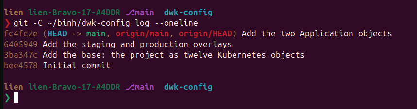
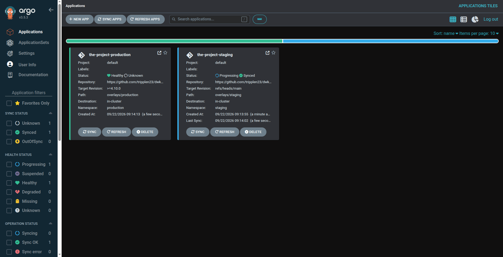
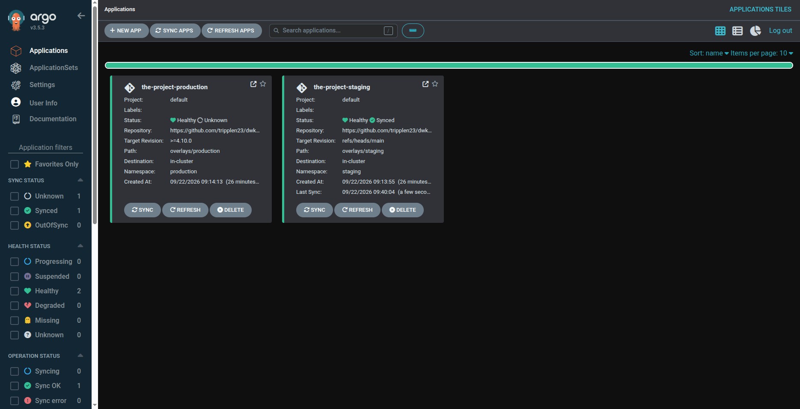
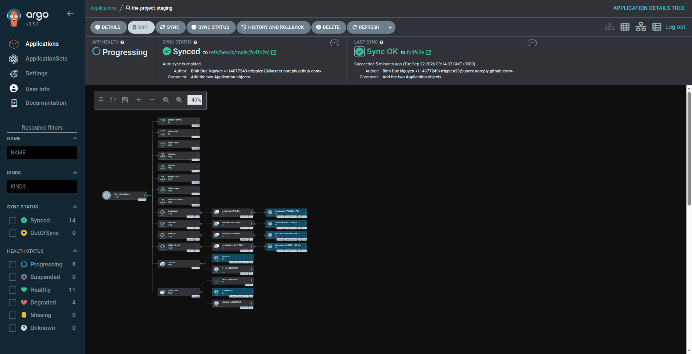
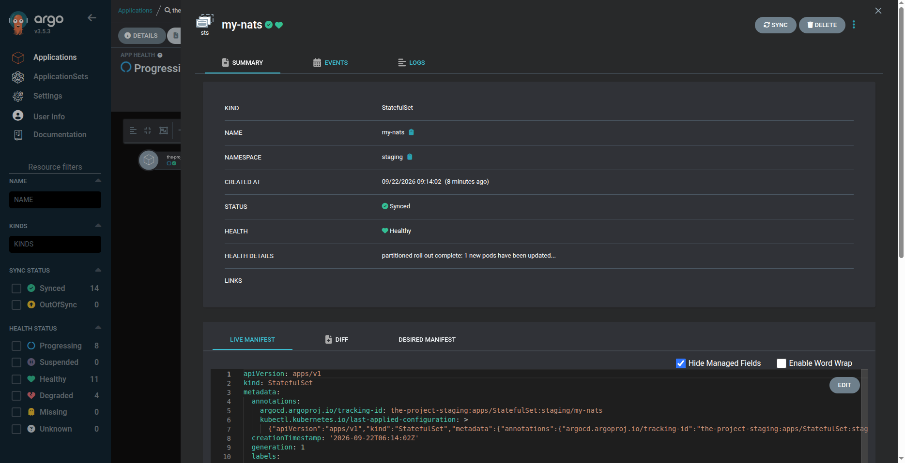
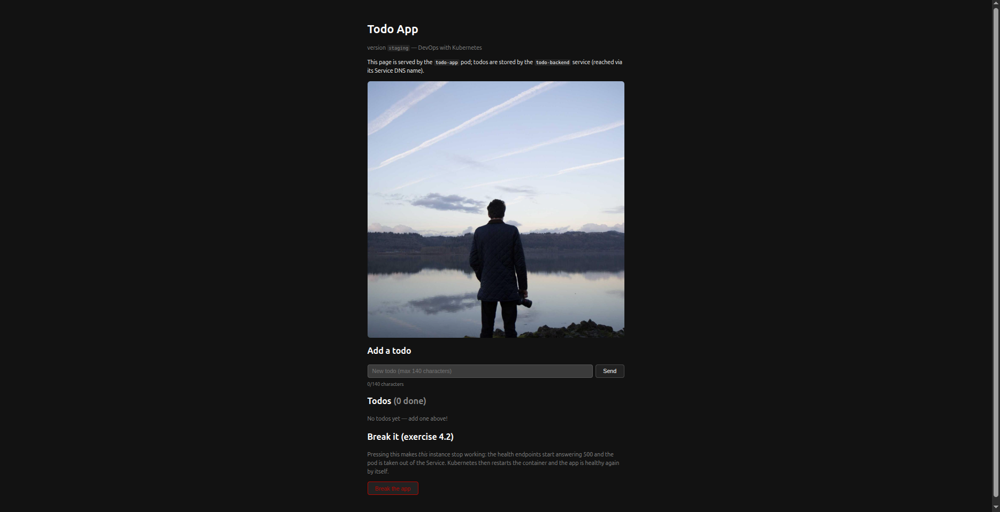
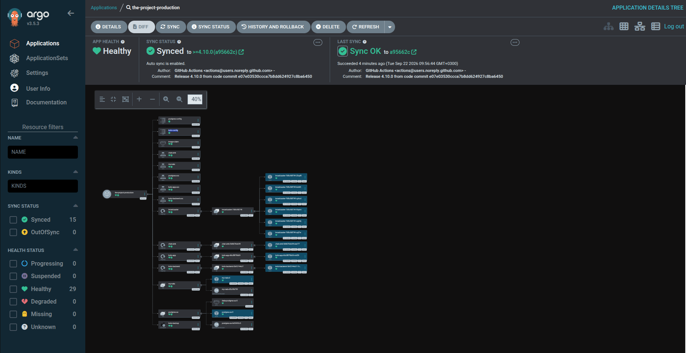

# Exercise 4.10 — The project, the grande finale: two repositories, one project

> Course text (chapter 5, *GitOps*), in short: *the project is split in two — the
> application code in one repository and the Kubernetes configuration in another —
> with CI translating every release in the first into a commit in the second, and
> ArgoCD reading only the second.*

---

## Step 0 — what you need in front of you

- **the GKE cluster and `kubectl` pointing at it**, and room on it. This lab deploys the project twice, as before, plus seven ArgoCD pods:

```bash
kubectl get nodes
```

```text
NAME                                         STATUS   ROLES    AGE   VERSION
gke-dwk-cluster-default-pool-0fd0572d-hdhi   Ready    <none>   10d   v1.36.3-gke.1640000
gke-dwk-cluster-default-pool-0fd0572d-l4lu   Ready    <none>   10d   v1.36.3-gke.1640000
gke-dwk-cluster-default-pool-0fd0572d-zca6   Ready    <none>   10d   v1.36.3-gke.1640000
gke-dwk-cluster-default-pool-0fd0572d-zfh5   Ready    <none>   10d   v1.36.3-gke.1640000
```

Read the requests before you install anything, because memory on these nodes is the resource that runs out:

```bash
kubectl describe node | grep -A6 "Allocated resources" | head -20
```

```text
Allocated resources:
  (Total limits may be over 100 percent, i.e., overcommitted.)
  Resource           Requests          Limits
  --------           --------          ------
  cpu                587m (62%)        10 (1063%)
  memory             1246619520 (87%)  6015198720 (422%)
  ephemeral-storage  0 (0%)            0 (0%)
```

  A node whose memory requests already sit at 87% has little room left: a pod stuck `Pending` with `Insufficient memory` later is this number, not your YAML.

- **`docker`** — CI publishes the images in this lab, but you will build one locally to prove the Dockerfiles, which is faster than waiting for a workflow run to say so;

- **`git`**, and a second working copy of the config repository. Clone it **outside** this submission. A `dwk-config/.git` sitting inside the submission would make the submission repository see a nested repository, which is a mess Git cannot untangle for you:

```bash
cd ~
git clone https://github.com/tripplen23/dwk-config.git
```

- **the `kustomize` CLI.** `kubectl kustomize` renders, but CI runs `kustomize edit`, which only the CLI has:

```bash
curl -s "https://raw.githubusercontent.com/kubernetes-sigs/kustomize/master/hack/install_kustomize.sh" | bash
sudo mv kustomize /usr/local/bin/
kustomize version
```

```text
v5.8.1
```

- **egress.** ArgoCD clones over the network from inside a private cluster, and so does the workflow's image pull of a second repository. The NAT gateway is what makes both possible:

```bash
gcloud compute routers nats describe dwk-nat --router=dwk-router \
  --region=europe-north1 --project=dwk-gke-506208
```

```text
autoNetworkTier: PREMIUM
enableEndpointIndependentMapping: false
endpointTypes:
- ENDPOINT_TYPE_VM
name: dwk-nat
natIpAllocateOption: AUTO_ONLY
sourceSubnetworkIpRangesToNat: ALL_SUBNETWORKS_ALL_IP_RANGES
type: PUBLIC
```

Only if that says *was not found*, create the router with `gcloud compute routers create dwk-router --network=default --region=europe-north1 --project=dwk-gke-506208`, then the gateway with `gcloud compute routers nats create dwk-nat --router=dwk-router --region=europe-north1 --project=dwk-gke-506208 --auto-allocate-nat-external-ips --nat-all-subnet-ip-ranges`.

- **`gh`**, optional, and the fastest way to look at secrets and workflow runs.

Two repositories, one cluster, and no new application code: every line of Rust in this lab is a directory you already have, copied forward unchanged.

Confirm the two tools that are easy to get wrong before you start them, by running `kustomize version` and `gh auth status`.

---

## Step 1 — the boundary: what goes in which repository

The split is the exercise, so it is worth stating as a rule before any file is typed:

- **the code repository holds everything needed to build an image, and no Kubernetes object.** Dockerfile, `Cargo.toml`, `Cargo.lock`, `src/`, and one workflow file;
- **the config repository holds every Kubernetes object, and no application code.** No Dockerfile, no `Cargo.toml`, no `src/`, nothing that a compiler has ever seen.

```text
code repository (KubernetesSubmissions)           config repository (dwk-config)
  part4/4.10/todo-app/        Cargo.toml, src/     base/                 twelve files
  part4/4.10/todo-backend/    Cargo.toml, src/     overlays/staging/     three files
  part4/4.10/broadcaster/     Cargo.toml, src/     overlays/production/  three files
  part4/4.10/chat-sink/       Cargo.toml, src/     applications/         two files
  .github/workflows/release-4.10.yaml
        │
        │  push to main, or a tag 4.10.*
        ▼
   CI  ── docker build && docker push ──►  Artifact Registry (four images)
        │
        │  kustomize edit set image, commit, push
        ▼
                                                 ArgoCD (in the cluster)
                                                        │
                                        ┌───────────────┴───────────────┐
                                        ▼                               ▼
                                namespace staging              namespace production
```

**The two `Application` objects point at the config repository**, both of them, with the same `repoURL` and the same cluster, and they differ in three fields:

```text
Application           path                  targetRevision      namespace
the-project-staging   overlays/staging      refs/heads/main     staging
the-project-production overlays/production  >=4.10.0            production
```

The revision field is the entire difference between the two environments, and it
now refers to the *config* repository's refs: staging follows its `main`, production
follows a tag. You push the tag in the other repository; Step 7's workflow carries the
name across.

**Prove both repositories are reachable from where ArgoCD stands**, from inside the cluster rather than from your laptop. Any commit hash is a pass; a timeout is the only
failure:

```bash
kubectl -n default run gitcheck --rm -i --restart=Never --image=alpine/git:latest \
  --command -- git ls-remote https://github.com/tripplen23/KubernetesSubmissions.git HEAD
```

```text
e07e03530ccca7b8dd624927c8ba645000ac10fb	HEAD
```

```bash
kubectl -n default run gitcheck-config --rm -i --restart=Never --image=alpine/git:latest \
  --command -- git ls-remote https://github.com/tripplen23/dwk-config.git HEAD
```

```text
bee457872831281ee105d577cfad794d27f85dab	HEAD
```

The second hash is the config repository as this lab started: one commit and a
README. Everything else in it is typed below. That `main` is also its only ref,
which is what staging's `targetRevision` means:

```bash
git ls-remote https://github.com/tripplen23/dwk-config.git
```

```text
bee457872831281ee105d577cfad794d27f85dab	HEAD
bee457872831281ee105d577cfad794d27f85dab	refs/heads/main
```

---

## Step 2 — the code repository: four Dockerfiles

Build them all, locally, and stop there:

```bash
R=europe-north1-docker.pkg.dev/dwk-gke-506208/my-repository
for app in todo-app todo-backend broadcaster chat-sink; do
  docker build -t $R/$app:4.10.0 part4/4.10/$app
done
```

---

## Step 3 — the credential: a fine-grained token named `CONFIG_REPO_TOKEN`

The workflow runs in the code repository and has to write to a *different* repository. GitHub's automatic `GITHUB_TOKEN` is scoped to the repository the workflow runs in, so it cannot push to `dwk-config`. Two repositories, two permissions: that is the honest cost of the split, and it is paid once.

Create the token by hand:

1. GitHub → your avatar → **Settings** → **Developer settings** → **Personal access tokens** → **Fine-grained tokens** → **Generate new token**;
2. **Token name**: `dwk-config-release`. **Expiration**: whatever your course requires;   a token that expires mid-course shows up as a failed workflow run with a `403`, not as anything friendlier;
3. **Repository access**: *Only select repositories* → `tripplen23/dwk-config`. The **Repository permissions** section only appears once this is done: it is rendered from the repositories you selected, so with *All repositories* chosen (or no repository yet) there is nothing for it to list — if the section is missing, this is the step to fix;
4. **Permissions** → **Repository permissions** → **Contents**: **Read and write**. Everything else stays *No access*.
5. **Generate token**, and copy it. GitHub shows it exactly once.

Then store it in the code repository, where the workflow can read it:

**Settings** → **Secrets and variables** → **Actions** → **New repository secret** →
name `CONFIG_REPO_TOKEN`, value the token you copied.

The three secrets that were already there are the ones CI uses to reach Google Cloud;
this one is new and it is the only one that is about GitHub:

```bash
gh secret list -R tripplen23/KubernetesSubmissions
```

```text
GKE_PROJECT	2026-09-09T08:41:54Z
SERVICE_ACCOUNT	2026-09-09T07:02:32Z
WORKLOAD_IDENTITY_PROVIDER	2026-09-09T07:03:01Z
```

After the click, a fourth line appears with the name `CONFIG_REPO_TOKEN` and today's
date. That list is a receipt of names only: GitHub never returns a secret's value, to
`gh` or to anyone else, and the workflow receives it masked in the logs.

**Store it in the code repository, not the config repository.** The workflow runs in
`KubernetesSubmissions` and GitHub only lets it read that repository's Actions secrets.
A `CONFIG_REPO_TOKEN` added under `dwk-config`'s settings is invisible to it, and the
first run then fails at the clone step with a `401` — the list above shows exactly
three names until the secret sits where the workflow looks.

Three rules about this token, and all three are about what happens when it leaks:

- **it is never written into a file.** It reaches the workflow through
  `${{ secrets.CONFIG_REPO_TOKEN }}` and nowhere else. A token pasted into a YAML file
  is a token committed to a public repository, and the only fix is to revoke it;
- **it is scoped to one repository and one permission**, so a workflow mistake stays
  inside `dwk-config` instead of reaching every repository you own;
- **it is the username `x-access-token` inside a clone URL**, which is the one place a
  secret appears in a command:

```text
https://x-access-token:${{ secrets.CONFIG_REPO_TOKEN }}@github.com/tripplen23/dwk-config.git
```

`x-access-token` is the username GitHub expects for a token push over HTTPS. ArgoCD in
the cluster needs none of this: the config repository is public, so ArgoCD clones it
anonymously and holds no credential at all.

Confirm the fourth line of names before you move on, with
`gh secret list -R tripplen23/KubernetesSubmissions`.

---

## Step 4 — the config repository: the base

Work in the clone you made in Step 0, outside the submission:

```bash
cd ~/dwk-config
git status
```

```text
On branch main
Your branch is up to date with 'origin/main'.

nothing to commit, working tree clean
```

Everything that follows is written at the **root** of this repository: `base/`,
`overlays/staging/`, `overlays/production/` and `applications/` sit beside `README.md`,
not under a `part4` directory. The base is the project as a set of Kubernetes objects,
the same twelve files in any environment, and two properties of it are deliberate:

- **no `namespace:` field anywhere.** The overlay's `namespace:` transformer owns the namespace, which is also why the overlays' strategic-merge patches need none;
- **no Secret.** `postgres-secret` and the backup's ServiceAccount are prerequisites of the deployed project rather than parts of it, so they are applied by hand.

`dwk-config: base/kustomization.yaml`
```yaml
apiVersion: kustomize.config.k8s.io/v1beta1
kind: Kustomization
resources:
  - configmap.yaml
  - configmap-todo.yaml
  - persistentvolumeclaim.yaml
  - postgres.yaml
  - nats.yaml
  - service.yaml
  - service-chat-sink.yaml
  - deployment-todo-app.yaml
  - deployment-todo-backend.yaml
  - deployment-broadcaster.yaml
  - deployment-chat-sink.yaml
```

`dwk-config: base/configmap.yaml`
```yaml
apiVersion: v1
kind: ConfigMap
metadata:
  name: postgres-config
data:
  POSTGRES_HOST: postgres-svc
  POSTGRES_PORT: "5432"
```

The frontend's own configuration:

`dwk-config: base/configmap-todo.yaml`
```yaml
apiVersion: v1
kind: ConfigMap
metadata:
  name: todo-config
data:
  TODO_BACKEND_URL: http://todo-backend-svc:2345
  IMAGE_URL: https://picsum.photos/1200
  IMAGE_PATH: /usr/src/app/files/image.jpg
  MAX_AGE_SECS: "600"
```

Postgres, a StatefulSet behind a headless Service, with the data on a volume claim
template and `PGDATA` mounted at the *parent* directory so `initdb` never sees the
filesystem's `lost+found`:

`dwk-config: base/postgres.yaml`
```yaml
apiVersion: v1
kind: Service
metadata:
  name: postgres-svc
  labels:
    app: postgres
spec:
  ports:
    - port: 5432
      name: web
  clusterIP: None
  selector:
    app: postgres
---
apiVersion: apps/v1
kind: StatefulSet
metadata:
  name: postgres-ss
spec:
  serviceName: postgres-svc
  replicas: 1
  selector:
    matchLabels:
      app: postgres
  template:
    metadata:
      labels:
        app: postgres
    spec:
      containers:
        - name: postgres
          image: postgres:16
          ports:
            - name: web
              containerPort: 5432
          env:
            - name: POSTGRES_USER
              valueFrom:
                secretKeyRef:
                  name: postgres-secret
                  key: POSTGRES_USER
            - name: POSTGRES_PASSWORD
              valueFrom:
                secretKeyRef:
                  name: postgres-secret
                  key: POSTGRES_PASSWORD
            - name: POSTGRES_DB
              valueFrom:
                secretKeyRef:
                  name: postgres-secret
                  key: POSTGRES_DB
            # mount at the PARENT dir; data lives in a subdir so initdb
            # never sees the filesystem's lost+found
            - name: PGDATA
              value: /var/lib/postgresql/data
          volumeMounts:
            - name: data
              mountPath: /var/lib/postgresql
  volumeClaimTemplates:
    - metadata:
        name: data
      spec:
        accessModes: ["ReadWriteOnce"]
        storageClassName: standard
        resources:
          requests:
            storage: 100Mi
```

`postgres-secret` does not exist yet, and until Step 5's last command creates it the
Postgres pod does not start. That is deliberate: a repository records the *reference*
to a secret, never the value.

The image cache the frontend photographs into, **ReadWriteOnce**, which is why the
frontend's Deployment is `Recreate`:

`dwk-config: base/persistentvolumeclaim.yaml`
```yaml
apiVersion: v1
kind: PersistentVolumeClaim
metadata:
  name: image-claim
spec:
  storageClassName: standard
  accessModes:
    - ReadWriteOnce
  resources:
    requests:
      storage: 1Gi
```

`dwk-config: base/nats.yaml`
```yaml
apiVersion: v1
kind: Service
metadata:
  name: my-nats
  labels:
    app: my-nats
spec:
  clusterIP: None
  selector:
    app: my-nats
  ports:
    - name: client
      port: 4222
      targetPort: 4222
---
apiVersion: apps/v1
kind: StatefulSet
metadata:
  name: my-nats
  labels:
    app: my-nats
spec:
  serviceName: my-nats
  replicas: 1
  selector:
    matchLabels:
      app: my-nats
  template:
    metadata:
      labels:
        app: my-nats
    spec:
      containers:
        - name: nats
          image: nats:2.14.6-alpine
          imagePullPolicy: IfNotPresent
          ports:
            - name: client
              containerPort: 4222
          resources:
            requests:
              cpu: 20m
              memory: 32Mi
            limits:
              cpu: 100m
              memory: 128Mi
```

The Services the applications talk to. Their names are the reason neither overlay may
carry a `namePrefix`:

`dwk-config: base/service.yaml`
```yaml
apiVersion: v1
kind: Service
metadata:
  name: todo-app-svc
  labels:
    app: todo-app
spec:
  type: ClusterIP
  selector:
    app: todo-app
  ports:
    - name: http
      port: 3000
      targetPort: 3000
      protocol: TCP
---
apiVersion: v1
kind: Service
metadata:
  name: todo-backend-svc
  labels:
    app: todo-backend
spec:
  type: ClusterIP
  selector:
    app: todo-backend
  ports:
    - name: http
      port: 2345
      targetPort: 3000
      protocol: TCP
```

`dwk-config: base/service-chat-sink.yaml`
```yaml
apiVersion: v1
kind: Service
metadata:
  name: chat-sink
spec:
  selector:
    app: chat-sink
  ports:
    - name: http
      port: 8080
      targetPort: 8080
```

### The four Deployments

Every project image in the base is a **placeholder**, `PROJECT/<NAME>`: the base
describes the shape, the overlays own the tag. Read the table once, because the whole
overlay mechanism hangs on it:

```text
base image name   PROJECT/TODO-APP  PROJECT/TODO-BACKEND  PROJECT/BROADCASTER  PROJECT/CHAT-SINK
overlay rewrites  europe-north1-docker.pkg.dev/dwk-gke-506208/my-repository/todo-app:4.10.0
                  europe-north1-docker.pkg.dev/dwk-gke-506208/my-repository/todo-backend:4.10.0
                  europe-north1-docker.pkg.dev/dwk-gke-506208/my-repository/broadcaster:4.10.0
                  europe-north1-docker.pkg.dev/dwk-gke-506208/my-repository/chat-sink:4.10.0
```

`dwk-config: base/deployment-todo-app.yaml`
```yaml
apiVersion: apps/v1
kind: Deployment
metadata:
  name: todo-app
  labels:
    app: todo-app
spec:
  strategy:
    type: Recreate
  replicas: 1
  selector:
    matchLabels:
      app: todo-app
  template:
    metadata:
      labels:
        app: todo-app
    spec:
      volumes:
        - name: image-storage
          persistentVolumeClaim:
            claimName: image-claim
      containers:
        - name: todo-app
          image: PROJECT/TODO-APP
          imagePullPolicy: Always
          ports:
            - containerPort: 3000
          readinessProbe:
            initialDelaySeconds: 5
            periodSeconds: 5
            timeoutSeconds: 3
            failureThreshold: 3
            httpGet:
              path: /healthz
              port: 3000
          livenessProbe:
            initialDelaySeconds: 15
            periodSeconds: 5
            timeoutSeconds: 3
            failureThreshold: 3
            httpGet:
              path: /livez
              port: 3000
          envFrom:
            - configMapRef:
                name: todo-config
          env:
            - name: PORT
              value: "3000"
          resources:
            requests:
              cpu: 50m
              memory: 64Mi
            limits:
              cpu: 200m
              memory: 256Mi
          volumeMounts:
            - name: image-storage
              mountPath: /usr/src/app/files
```

The API, with the database credentials from the Secret and the address from the
ConfigMap:

`dwk-config: base/deployment-todo-backend.yaml`
```yaml
apiVersion: apps/v1
kind: Deployment
metadata:
  name: todo-backend
  labels:
    app: todo-backend
spec:
  replicas: 1
  selector:
    matchLabels:
      app: todo-backend
  template:
    metadata:
      labels:
        app: todo-backend
    spec:
      containers:
        - name: todo-backend
          image: PROJECT/TODO-BACKEND
          imagePullPolicy: Always
          ports:
            - containerPort: 3000
          readinessProbe:
            initialDelaySeconds: 5
            periodSeconds: 5
            timeoutSeconds: 3
            failureThreshold: 3
            httpGet:
              path: /healthz
              port: 3000
          # no livenessProbe: /healthz needs Postgres, and a database that is
          # restarting must not restart the backend
          env:
            - name: PORT
              value: "3000"
            - name: NATS_URL
              value: "nats://my-nats:4222"
            - name: NATS_SUBJECT
              value: "todo_events"
            - name: POSTGRES_HOST
              valueFrom:
                configMapKeyRef:
                  name: postgres-config
                  key: POSTGRES_HOST
            - name: POSTGRES_PORT
              valueFrom:
                configMapKeyRef:
                  name: postgres-config
                  key: POSTGRES_PORT
            - name: POSTGRES_USER
              valueFrom:
                secretKeyRef:
                  name: postgres-secret
                  key: POSTGRES_USER
            - name: POSTGRES_PASSWORD
              valueFrom:
                secretKeyRef:
                  name: postgres-secret
                  key: POSTGRES_PASSWORD
            - name: POSTGRES_DB
              valueFrom:
                secretKeyRef:
                  name: postgres-secret
                  key: POSTGRES_DB
          resources:
            requests:
              cpu: 50m
              memory: 64Mi
            limits:
              cpu: 200m
              memory: 256Mi
```

Six broadcasters sharing the queue group, so one event is delivered once however many
replicas the environment asks for. **The base carries six and no
`BROADCASTER_LOG_ONLY`**, because forwarding is the program's default and the base is
the thing that does not know what kind of environment it is in:

`dwk-config: base/deployment-broadcaster.yaml`
```yaml
apiVersion: apps/v1
kind: Deployment
metadata:
  name: broadcaster
  labels:
    app: broadcaster
spec:
  replicas: 6
  selector:
    matchLabels:
      app: broadcaster
  template:
    metadata:
      labels:
        app: broadcaster
    spec:
      containers:
        - name: broadcaster
          image: PROJECT/BROADCASTER
          imagePullPolicy: Always
          env:
            - name: NATS_URL
              value: "nats://my-nats:4222"
            - name: NATS_SUBJECT
              value: "todo_events"
            - name: NATS_QUEUE_GROUP
              value: "broadcasters"
            - name: CHAT_URL
              value: "http://chat-sink:8080"
            - name: CHAT_FORMAT
              value: "generic"
            - name: BOT_NAME
              value: "bot"
          resources:
            requests:
              cpu: 20m
              memory: 32Mi
            limits:
              cpu: 100m
              memory: 128Mi
```

and the sink that receives what the broadcaster forwards: the cluster's stand-in for
Discord, Telegram or Slack.

`dwk-config: base/deployment-chat-sink.yaml`
```yaml
apiVersion: apps/v1
kind: Deployment
metadata:
  name: chat-sink
  labels:
    app: chat-sink
spec:
  replicas: 1
  selector:
    matchLabels:
      app: chat-sink
  template:
    metadata:
      labels:
        app: chat-sink
    spec:
      containers:
        - name: chat-sink
          image: PROJECT/CHAT-SINK
          imagePullPolicy: Always
          ports:
            - containerPort: 8080
          env:
            - name: PORT
              value: "8080"
          resources:
            requests:
              cpu: 20m
              memory: 32Mi
            limits:
              cpu: 100m
              memory: 128Mi
```

Commit the base and push it. The repository is now the project's blueprint, and
nothing in the cluster has noticed yet:

```bash
git add base
git commit -m "Add the base: the project as twelve Kubernetes objects"
git push origin main
```

Twelve files is the whole base, and the count is the check that nothing was forgotten:

```bash
git ls-tree -r --name-only HEAD | grep -cE '\.ya?ml$'   # -E: with plain grep the ? is literal and the count is 0
```

```text
12
```

---

## Step 5 — the config repository: two overlays, and only production gets a backup

The overlays sit beside the base, one environment each. They are identical except for
what the exercise asks to differ, and reading them side by side is the fastest way to
know what this lab actually deploys.

### The staging overlay

`dwk-config: overlays/staging/kustomization.yaml`
```yaml
apiVersion: kustomize.config.k8s.io/v1beta1
kind: Kustomization
namespace: staging
resources:
  - ../../base
patches:
  - path: broadcaster.yaml
  - path: deployment.yaml
images:
  - name: PROJECT/TODO-APP
    newName: europe-north1-docker.pkg.dev/dwk-gke-506208/my-repository/todo-app
    newTag: "4.10.0"
  - name: PROJECT/TODO-BACKEND
    newName: europe-north1-docker.pkg.dev/dwk-gke-506208/my-repository/todo-backend
    newTag: "4.10.0"
  - name: PROJECT/BROADCASTER
    newName: europe-north1-docker.pkg.dev/dwk-gke-506208/my-repository/broadcaster
    newTag: "4.10.0"
  - name: PROJECT/CHAT-SINK
    newName: europe-north1-docker.pkg.dev/dwk-gke-506208/my-repository/chat-sink
    newTag: "4.10.0"
```

Three fields carry the environment:

- **`namespace: staging`.** Every object the base holds is rewritten into it, and there
  is no namespace to keep in step by hand;
- **`patches`** — two files, which are the only two differences between this overlay and
  production;
- **`images`** — the four placeholders resolved to real images with a real tag. The tag
  written here is the release this configuration currently describes. CI overwrites it
  on every release, so it is a starting point rather than a value you maintain.

Staging's broadcaster logs instead of forwarding. One replica, and the flag the program
reads:

`dwk-config: overlays/staging/broadcaster.yaml`
```yaml
apiVersion: apps/v1
kind: Deployment
metadata:
  name: broadcaster
spec:
  replicas: 1
  template:
    spec:
      containers:
        - name: broadcaster
          env:
            - name: BROADCASTER_LOG_ONLY
              value: "true"
```

and the frontend is told which environment it is:

`dwk-config: overlays/staging/deployment.yaml`
```yaml
apiVersion: apps/v1
kind: Deployment
metadata:
  name: todo-app
spec:
  template:
    spec:
      containers:
        - name: todo-app
          env:
            - name: VERSION
              value: "staging"
```

The app defaults to `v1` when `VERSION` is absent, so the base stays runnable on its
own.

### The production overlay

`dwk-config: overlays/production/kustomization.yaml`
```yaml
apiVersion: kustomize.config.k8s.io/v1beta1
kind: Kustomization
namespace: production
resources:
  - ../../base
  - cronjob-backup.yaml
patches:
  - path: deployment.yaml
images:
  - name: PROJECT/TODO-APP
    newName: europe-north1-docker.pkg.dev/dwk-gke-506208/my-repository/todo-app
    newTag: "4.10.0"
  - name: PROJECT/TODO-BACKEND
    newName: europe-north1-docker.pkg.dev/dwk-gke-506208/my-repository/todo-backend
    newTag: "4.10.0"
  - name: PROJECT/BROADCASTER
    newName: europe-north1-docker.pkg.dev/dwk-gke-506208/my-repository/broadcaster
    newTag: "4.10.0"
  - name: PROJECT/CHAT-SINK
    newName: europe-north1-docker.pkg.dev/dwk-gke-506208/my-repository/chat-sink
    newTag: "4.10.0"
```

Read the two kustomizations side by side and the entire environment difference is
visible: the same `resources: [../../base]`, a different `namespace:`, the same four
`images:`, and a different list of patches — `cronjob-backup.yaml` is in one
`resources:` list and not in the other, which is the whole of the backup difference.

Production's frontend announces itself as `v1`:

`dwk-config: overlays/production/deployment.yaml`
```yaml
apiVersion: apps/v1
kind: Deployment
metadata:
  name: todo-app
spec:
  template:
    spec:
      containers:
        - name: todo-app
          env:
            - name: VERSION
              value: "v1"
```

Production's broadcaster is the base's: six replicas, forwarding. **That half of the
difference is the absence of a patch** — nothing in this overlay mentions
`BROADCASTER_LOG_ONLY`, so the program's `false` default stands.

Production's database is backed up nightly and staging's is not, and again the whole
difference is that this file exists in one overlay:

`dwk-config: overlays/production/cronjob-backup.yaml`
```yaml
apiVersion: batch/v1
kind: CronJob
metadata:
  name: todo-backup
spec:
  schedule: "15 3 * * *"
  concurrencyPolicy: Forbid
  startingDeadlineSeconds: 300
  jobTemplate:
    spec:
      template:
        spec:
          serviceAccountName: backup-sa
          restartPolicy: OnFailure
          volumes:
            - name: dump
              emptyDir: {}
          containers:
            - name: dump
              image: postgres:16
              command: ["/bin/sh", "-c"]
              args:
                - |
                  pg_dump -h postgres-svc -U "$POSTGRES_USER" -d "$POSTGRES_DB" -f /dump/todo.sql
                  echo "dump written: $(wc -c < /dump/todo.sql) bytes"
              env:
                - name: PGPASSWORD
                  valueFrom:
                    secretKeyRef:
                      name: postgres-secret
                      key: POSTGRES_PASSWORD
                - name: POSTGRES_USER
                  valueFrom:
                    secretKeyRef:
                      name: postgres-secret
                      key: POSTGRES_USER
                - name: POSTGRES_DB
                  valueFrom:
                    secretKeyRef:
                      name: postgres-secret
                      key: POSTGRES_DB
              volumeMounts:
                - name: dump
                  mountPath: /dump
            - name: upload
              image: google/cloud-sdk:slim
              command: ["/bin/sh", "-c"]
              args:
                - |
                  until [ -s /dump/todo.sql ]; do sleep 2; done
                  gcloud storage cp /dump/todo.sql \
                    gs://dwk-todo-backups-tripplen23/todo-$(date +%Y-%m-%d-%H%M).sql
              volumeMounts:
                - name: dump
                  mountPath: /dump
```

Four decisions in that file, rather than syntax details:

- **two containers, one `emptyDir`.** `dump` writes the SQL file, `upload` waits for it
  and ships it, and an `emptyDir` lives exactly as long as the pod: no PVC, no cleanup;
- **`postgres:16`, the same version as the StatefulSet.** `pg_dump` refuses to read a
  server newer than itself, so the version is not free;
- **`concurrencyPolicy: Forbid`.** A dump still running when the next one starts would
  read a database mid-backup, and skipping a run is the cheaper mistake;
- **`serviceAccountName: backup-sa`**, a ServiceAccount that is **not in the
  repository**, for the same reason the Secret is not.

### The objects that stay outside the repository

Two prerequisites of the deployed project are applied by hand, into the cluster, and
never committed. Apply them before anything syncs, or Postgres will not start:

```bash
for ns in staging production; do
  kubectl create namespace "$ns" --dry-run=client -o yaml | kubectl apply -f -

  kubectl -n "$ns" create secret generic postgres-secret \
    --from-literal=POSTGRES_USER=postgres \
    --from-literal=POSTGRES_PASSWORD=example \
    --from-literal=POSTGRES_DB=postgres
done

kubectl -n production create serviceaccount backup-sa

gcloud projects add-iam-policy-binding dwk-gke-506208 \
  --role=roles/storage.objectAdmin \
  --member="principal://iam.googleapis.com/projects/323959491379/locations/global/workloadIdentityPools/dwk-gke-506208.svc.id.goog/subject/ns/production/sa/backup-sa" \
  --condition=None
```

- **the identity comes from the cluster, not from a file.** The node pool serves the GKE
  metadata server, so `backup-sa` picks up Google credentials at run time;
- **`--member` is scoped to one namespace**: `ns/production/sa/backup-sa` and nothing
  else. Skip the binding and the upload container dies with `403` *does not have
  storage.objects.create access* while the dump beside it succeeds;
- **`objectAdmin`, not `objectCreator`**, because `gcloud storage cp` reads the object
  back as it transfers and needs `storage.objects.get` as well as `create`.

ArgoCD never deletes any of it, for two independent reasons, and either is enough: the
objects are not in the repository, so nothing renders them, and `prune` deletes *removed
repository objects* rather than object types ArgoCD has never seen. Creating the
namespaces by hand here also means a namespace problem will look different from a sync
problem later.

### Render both overlays before pushing

Kustomize is what decides what ArgoCD will see, so read it here where the error messages
are cheap:

```bash
kustomize build overlays/staging | grep -E "^\s+(image|namespace):" | sort -u
kustomize build overlays/production | grep -E "^\s+(image|namespace):" | sort -u
```

```text
        image: europe-north1-docker.pkg.dev/dwk-gke-506208/my-repository/broadcaster:4.10.0
        image: europe-north1-docker.pkg.dev/dwk-gke-506208/my-repository/chat-sink:4.10.0
        image: europe-north1-docker.pkg.dev/dwk-gke-506208/my-repository/todo-app:4.10.0
        image: europe-north1-docker.pkg.dev/dwk-gke-506208/my-repository/todo-backend:4.10.0
        image: postgres:16
  namespace: staging

        image: europe-north1-docker.pkg.dev/dwk-gke-506208/my-repository/broadcaster:4.10.0
        image: europe-north1-docker.pkg.dev/dwk-gke-506208/my-repository/chat-sink:4.10.0
        image: europe-north1-docker.pkg.dev/dwk-gke-506208/my-repository/todo-app:4.10.0
        image: europe-north1-docker.pkg.dev/dwk-gke-506208/my-repository/todo-backend:4.10.0
            image: google/cloud-sdk:slim
            image: postgres:16
        image: postgres:16
  namespace: production
```

The two outputs differ by exactly one image, and it is the backup in one picture:
production lists `google/cloud-sdk:slim`, because the CronJob's `upload` container rides
along inside that overlay. `postgres:16` shows up twice there and once in staging: the
StatefulSet runs it in both environments, and the CronJob's `dump` container runs it too,
one nesting level deeper. The indentation is the whole story — the deeper lines belong to
the CronJob, the shallower ones to the workloads both namespaces share.

**If `kustomize build` fails, read the file it names.** A filename that does not match a
`resources:` entry gives
*accumulating resources from 'persistentvolumeclaim.yaml'* followed by *no such file or
directory*, which is a typo in the file's name and not a Kustomize problem. A patch whose
`metadata.name` matches no object gives *no matches for Id*, naming the patch file: a
strategic-merge patch selects its target by `apiVersion`, `kind` and `metadata.name`,
nothing else.

Push both overlays:

```bash
git add overlays
git commit -m "Add the staging and production overlays"
git push origin main
```

The repository now renders two complete environments, and the push above is what puts
them there. Nothing has reached the cluster yet, and that is the point of the next file:
a rendered environment is an offer, and an `Application` is the acceptance.

---

## Step 6 — the config repository: the two Application objects

An `Application` says *which repository, which path, which revision, which namespace*.
Both of this lab's point at the config repository they live in, so `repoURL` is the same
in both files and the revision is the whole difference.

`dwk-config: applications/staging.yaml`
```yaml
apiVersion: argoproj.io/v1alpha1
kind: Application
metadata:
  name: the-project-staging
  namespace: argocd
spec:
  project: default
  source:
    repoURL: https://github.com/tripplen23/dwk-config.git
    targetRevision: refs/heads/main
    path: overlays/staging
  destination:
    server: https://kubernetes.default.svc
    namespace: staging
  syncPolicy:
    automated:
      prune: true
      selfHeal: true
    syncOptions:
      - CreateNamespace=true
```

`dwk-config: applications/production.yaml`
```yaml
apiVersion: argoproj.io/v1alpha1
kind: Application
metadata:
  name: the-project-production
  namespace: argocd
spec:
  project: default
  source:
    repoURL: https://github.com/tripplen23/dwk-config.git
    targetRevision: ">=4.10.0"
    path: overlays/production
  destination:
    server: https://kubernetes.default.svc
    namespace: production
  syncPolicy:
    automated:
      prune: true
      selfHeal: true
    syncOptions:
      - CreateNamespace=true
```

Read the two side by side and the environments are three lines apart:

- `destination.namespace` is `staging` and `production`, so the environments share
  nothing but the cluster;
- `targetRevision: refs/heads/main` for staging, so **any commit to the config
  repository's main deploys staging**;
- `targetRevision: ">=4.10.0"` for production, so **only a tag deploys production**.

Both also carry the GitOps contract: `automated.prune` deletes from the cluster what was
removed from the repository, and `automated.selfHeal` reverts a hand-made change back to
what the repository says. `CreateNamespace=true` lets the controller create the
destination namespace if it is missing, a safety net here rather than the mechanism,
because Step 5 already created both.

**Use the fully qualified `refs/heads/main`, not `main`.** A tag and a branch can share a
name, and then `targetRevision: main` is ambiguous: `git ls-remote` order decides which
one you get. `refs/heads/main` is the branch, `refs/tags/main` the tag, and one careless
tag stops that branch from ever moving again.

### Where the semver constraint looks, and why the tag is carried across

ArgoCD reads `targetRevision` as a **git revision in the repository named by
`repoURL`** — the config repository — and it resolves anything that looks like a version
constraint against **tags only**. Its own documentation is blunt about the second half:
*"Semver constraints (those containing `*`, `>`, `<`, `>=`, `<=`, `~`, `^`, or range
expressions like `>=1.0.0 <2.0.0`) are only matched against tags, never branches."*

Both halves matter here. Staging points at `refs/heads/main`, so every commit CI makes to
the config repository is a new revision for it, and a commit can never satisfy
`>=4.10.0`, so no commit can deploy production by itself.

The tag is pushed in the **code** repository, because that is where a release is decided,
while the repository ArgoCD resolves in is the config repository. The workflow in Step 7
closes that circle: it commits the production overlay and then tags that commit with the
name you pushed. One tag name, two repositories, one of them yours and one of them CI's.

**The tag is what deploys production.** A hundred commits to `main` change staging a
hundred times and production not once; a single `git push origin 4.10.0` in the code
repository changes production, and nothing else does.

Commit both Applications and look at the repository's final shape. It is a small,
readable tree, and every file in it is something ArgoCD could be pointed at:

```bash
git add applications
git commit -m "Add the two Application objects"
git push origin main

git ls-tree -r --name-only HEAD
```

```text
README.md
applications/production.yaml
applications/staging.yaml
base/configmap-todo.yaml
base/configmap.yaml
base/deployment-broadcaster.yaml
base/deployment-chat-sink.yaml
base/deployment-todo-app.yaml
base/deployment-todo-backend.yaml
base/kustomization.yaml
base/nats.yaml
base/persistentvolumeclaim.yaml
base/postgres.yaml
base/service-chat-sink.yaml
base/service.yaml
overlays/production/cronjob-backup.yaml
overlays/production/deployment.yaml
overlays/production/kustomization.yaml
overlays/staging/broadcaster.yaml
overlays/staging/deployment.yaml
overlays/staging/kustomization.yaml
```

Twenty-one files, and not one of them is Rust. That is the boundary from Step 1,
measured.

Read the history you have made in that repository before going on, with
`git -C ~/dwk-config log --oneline`.



---

## Step 7 — the code repository: the release workflow

The workflow is what does the same thing to the same files from now on: a push to `main` releases to **staging**, a tag releases to **production**, and in both cases the release is a commit in the *other* repository.

`.github/workflows/release-4.10.yaml`
```yaml
name: Release 4.10

on:
  push:
    # a branch push is filtered by path; a tag push is NOT — GitHub does not
    # evaluate `paths:` for tag events, which is exactly what this lab wants:
    # part4/4.10/** decides branch pushes, and every 4.10.* tag gets through
    branches: [main]
    tags: ['4.10.*']
    paths:
      - 'part4/4.10/**'

permissions:
  contents: read           # the checkout only; the push into the config repository
                           # rides on CONFIG_REPO_TOKEN, not on GITHUB_TOKEN
  id-token: write          # Workload Identity Federation needs an OIDC token to mint
                           # the access token, and without it the auth step fails with
                           # "did not inject $ACTIONS_ID_TOKEN_REQUEST_TOKEN"

jobs:
  build-publish-release:
    name: Build, Push, Release
    runs-on: ubuntu-latest

    steps:
      - name: Checkout
        uses: actions/checkout@v6

      - name: Authenticate to Google Cloud
        uses: google-github-actions/auth@v3
        with:
          workload_identity_provider: ${{ secrets.WORKLOAD_IDENTITY_PROVIDER }}
          service_account: ${{ secrets.SERVICE_ACCOUNT }}

      - name: Decide which environment this run releases to
        id: target
        run: |
          if [ "$GITHUB_REF_TYPE" = "tag" ]; then
            echo "overlay=production" >> "$GITHUB_OUTPUT"
            echo "version=$GITHUB_REF_NAME" >> "$GITHUB_OUTPUT"
            echo "what=Release $GITHUB_REF_NAME" >> "$GITHUB_OUTPUT"
          else
            echo "overlay=staging" >> "$GITHUB_OUTPUT"
            echo "version=$GITHUB_SHA" >> "$GITHUB_OUTPUT"
            echo "what=Release to staging" >> "$GITHUB_OUTPUT"
          fi

      - name: Build and publish the four images
        run: |
          gcloud auth configure-docker europe-north1-docker.pkg.dev -q
          R=europe-north1-docker.pkg.dev/${{ secrets.GKE_PROJECT }}/my-repository
          for app in todo-app todo-backend broadcaster chat-sink; do
            docker build -t "$R/$app:${{ steps.target.outputs.version }}" "part4/4.10/$app"
            docker push "$R/$app:${{ steps.target.outputs.version }}"
          done

      - name: Set up Kustomize
        uses: imranismail/setup-kustomize@v3

      - name: Clone the config repository
        run: |
          git clone \
            "https://x-access-token:${{ secrets.CONFIG_REPO_TOKEN }}@github.com/tripplen23/dwk-config.git" \
            /tmp/dwk-config

      - name: Point the overlay at the new images
        run: |
          cd "/tmp/dwk-config/overlays/${{ steps.target.outputs.overlay }}"
          R=europe-north1-docker.pkg.dev/${{ secrets.GKE_PROJECT }}/my-repository
          for app in todo-app todo-backend broadcaster chat-sink; do
            kustomize edit set image \
              "PROJECT/$(echo $app | tr 'a-z' 'A-Z')=$R/$app:${{ steps.target.outputs.version }}"
          done

      - name: Commit the release into the config repository
        run: |
          cd /tmp/dwk-config
          git config user.name "GitHub Actions"
          git config user.email "actions@users.noreply.github.com"
          git add overlays
          git commit -m "${{ steps.target.outputs.what }} from code commit ${{ github.sha }}" \
            || echo "nothing to commit: the overlay already carries ${{ steps.target.outputs.version }}"
          # commit before the pull, so the pull has a clean tree and no stash to
          # apply: if another release reached the config repository while this one
          # built, the rebase moves this commit on top of it. A push rejected by a
          # racing release is tried once more: pull, then push again
          git pull --rebase origin main
          git push origin main || { git pull --rebase origin main && git push origin main; }

      - name: Carry the release tag into the config repository
        if: github.ref_type == 'tag'
        run: |
          # production's ">=4.10.0" is resolved against tags in the repository the
          # Application names, which is this clone: one tag name, pushed by hand in the
          # code repository above, carried across here in the same run. The -f makes a
          # re-release re-point the existing tag to its own release commit
          git -C /tmp/dwk-config tag -f "$GITHUB_REF_NAME"
          git -C /tmp/dwk-config push -f origin "$GITHUB_REF_NAME"
```

Six details, each one a trap that has already bitten:

- **the tag is what deploys production**, and the tag is pushed in *this* repository
  while the constraint that consumes it lives in the other one. The last step is what
  closes that circle: without it the production `Application` would compare forever
  against a repository that never sees a tag, and the failure looks like ArgoCD being
  slow rather than like a missing step;
- **`paths:` does not apply to tag pushes.** GitHub does not evaluate path filters for
  tag events, so `4.10.*` gets through however small the diff is — which is what makes
  `git push origin 4.10.0` a release even on a commit that changed nothing;
- **the workflow must live at the repository root.** GitHub runs workflows only from
  `.github/workflows` at the root: *"You must store workflow files in the
  `.github/workflows` directory of your repository"*. A copy inside
  `part4/4.10/.github/workflows/` never runs, and the failure mode is silence;
- **`id-token: write` is not optional.** It is what Workload Identity Federation mints
  its token from. Without it the auth step fails with *did not inject
  `$ACTIONS_ID_TOKEN_REQUEST_TOKEN`*;
- **`contents: read` is enough, and that is worth knowing.** Nothing here pushes to the
  repository it runs in: the config repository's push uses the fine-grained token from
  Step 3, which the clone embeds in the remote URL. If you ever add a `git tag` for the
  code repository itself, that step needs `contents: write`, and the failure without it
  is a rejected push at the very end of a successful run;
- **`[skip ci]` has no job here, and its absence is deliberate.** The commit this
  workflow makes lands in the config repository, which holds no workflows at all, so
  nothing can re-trigger itself. In a single-repository setup the same commit would
  touch the path filter and start its own release; the split removes that class of
  accident rather than papering over it.

The shape to notice: **CI never talks to the cluster.** It publishes images, writes a
line of YAML in another repository, and pushes a tag. What happens next is ArgoCD's
business, in both environments, without a single `kubectl`.

### The first release, from the code repository

Commit the applications' Dockerfiles, the workflow, and the README together. That commit
touches `part4/4.10/**`, which is what starts the first run:

```bash
git add part4/4.10 .github/workflows/release-4.10.yaml
git commit -m "4.10: split the project into code and configuration"
git push origin main

gh run list -R tripplen23/KubernetesSubmissions --workflow release-4.10.yaml --limit 3
gh run watch -R tripplen23/KubernetesSubmissions
```

The first successful run took 4m53s (run 35695468334): four images pushed, the four
`newTag` lines of `overlays/staging` rewritten to the code commit, one commit and one
push. (An earlier attempt failed in its release step — it used a third-party action
that crashed mid-run; the plain-git step in the file below was the replacement.)

A branch run produces four images tagged with the commit SHA and one new commit on the
config repository's `main`, in which `overlays/staging`'s four image tags are the same
SHA. Nothing in it mentions production, and nothing addresses the cluster.

That is the release path this lab is built on, and it is now running without you. Watch
the first run finish with `gh run watch -R tripplen23/KubernetesSubmissions`, then read
the commit it made in `~/dwk-config`.

---

## Step 8 — ArgoCD in the cluster, and the UI on localhost

The install manifest comes from GitHub and is applied straight into `argocd`:

```bash
curl -sL https://raw.githubusercontent.com/argoproj/argo-cd/stable/manifests/install.yaml \
  -o /tmp/argocd-install.yaml

kubectl create namespace argocd

kubectl apply --server-side --force-conflicts -n argocd -f /tmp/argocd-install.yaml
```

Download it into `/tmp`, never into either repository: it is tens of thousands of lines
of CRDs, and the next `git add -A` in either working copy would sweep it in.

Give it a couple of minutes. The pods pull straight from upstream — `quay.io`, `ghcr.io`,
`public.ecr.aws` — which works because of Step 0's NAT. An `ImagePullBackOff` here is
slowness, not a wrong registry:

```bash
kubectl -n argocd get pods -o custom-columns=NAME:.metadata.name,STATUS:.status.phase
```

```text
NAME                                                STATUS
argocd-application-controller-0                     Running
argocd-applicationset-controller-84549767db-dwdtl   Running
argocd-dex-server-6cc5dd7c9d-hdlzg                  Running
argocd-notifications-controller-57d4c66f69-nkb69    Running
argocd-redis-c55679569-6hr2v                        Running
argocd-repo-server-7f9fdfbb74-srffc                 Running
argocd-server-5f785dd555-5zhb9                      Running
```

Seven pods, and `Running` for all seven is the check that the server-side apply landed
the whole manifest. The CRD the plain apply would have dropped is the one worth asking
about by name, because a missing CRD does not stop this lab from working:

```bash
kubectl get crd applicationsets.argoproj.io
```

```text
NAME                             CREATED AT
applicationsets.argoproj.io      2026-09-20T22:17:19Z
```

Then reach the UI. The chapter uses a `LoadBalancer`; these nodes have no external
addresses, so port-forward and leave the Service as it is:

```bash
kubectl -n argocd port-forward svc/argocd-server 8080:443

# the initial admin password: base64 in a Secret, which is where ArgoCD puts it
kubectl -n argocd get secret argocd-initial-admin-secret \
  -o jsonpath='{.data.password}' | base64 -d; echo
```

That password is generated during your install and belongs to your cluster: copy it
from your own terminal before you log in, and never commit it — a committed copy of a
one-time credential is the fastest way to fail the submission.

Leave the port-forward running in its own terminal for the rest of the lab: every UI step
below depends on it, and 8080 is now the UI's port — which is why the project's frontend
is reached on 3001 later.

Open <https://localhost:8080>, accept the self-signed certificate, and log in as `admin`
with that password. The first screen is empty, and it should be: there is no
`Application` in the cluster yet.

---

## Step 9 — apply the two Applications, and what the UI means

The `Application` objects are files in the config repository, and they are applied the
same way anything else is, from the clone you already have:

```bash
kubectl apply -n argocd -f ~/dwk-config/applications/staging.yaml
kubectl apply -n argocd -f ~/dwk-config/applications/production.yaml

kubectl -n argocd get applications -w
```




`the-project-staging` resolves `refs/heads/main` to the release commit CI just pushed,
turns `OutOfSync`, then `Synced` and `Healthy`, and the whole staging environment comes
up: Postgres, NATS, four Deployments, a broadcaster in log-only mode.

`the-project-production` is a different story for the moment, and the difference is the
lesson. Its revision is `>=4.10.0`, and the repository it resolves that constraint in is
the config repository, which has no such tag until proof 2 pushes one. Until then the
card shows the constraint itself and the Application compares to nothing. That is the
same behaviour as an unresolvable revision, and it is expected rather than broken: no
commit can satisfy a semver constraint, and a tag that does not exist yet cannot either.

**The two badges answer two different questions**, and reading them separately is most of
what the UI is for. **Sync Status** compares the cluster with the revision ArgoCD
resolved: `Synced`, `OutOfSync`, and `Unknown` when the comparison itself failed, which
is what production shows until a tag exists. **Health Status** is about the workloads:
`Healthy`, `Progressing`, or `Degraded`, which is when the resource tree is where you
look. The same two fields from the terminal:

```bash
kubectl -n argocd get application the-project-staging \
  -o jsonpath='{.spec.source.targetRevision}{" -> "}{.status.sync.revision}{"\n"}'
kubectl -n argocd get application the-project-production \
  -o jsonpath='{.spec.source.targetRevision}{" -> "}{.status.sync.revision}{"\n"}'
```

If both badges are blank, nothing is reconciling: `argocd-application-controller` fills
them in, so `kubectl -n argocd get pods` comes before any doubt about the Application.

Click a card and you get the **resource tree**: everything the Kustomization rendered.
`StatefulSet → Pod` for Postgres and NATS, `Deployment → ReplicaSet → Pod` for the four
applications, `CronJob → Job → Pod` in production only, and the Services beside them.
Click a node for its live manifest and its events.




**Where the replica count is.** On the **Deployment node**: the `6/6` or `1/1` beside an
application's name is ready replicas over desired. The broadcaster node reads `1/1` in
staging and `6/6` in production, because staging's overlay patches the count down and
production's does not. The terminal reads the same numbers:

```bash
kubectl -n staging get deploy
```

```text
NAME           READY   UP-TO-DATE   AVAILABLE   AGE
broadcaster    1/1     1            1           4m
chat-sink      1/1     1            1           4m
todo-app       1/1     1            1           4m
todo-backend   1/1     1            1           4m
```

**SYNC, REFRESH and HARD REFRESH.** *Refresh* re-reads the repository without waiting for
the 180-second poll, *Sync* reconciles immediately, and *Hard Refresh* also drops the
cached manifests, which is the one to press after editing a file the UI still shows an
old version of. None of the three changes either repository.

**HISTORY AND ROLLBACK** lists one entry per revision ArgoCD has deployed. **DEPLOY**
beside an older entry is a rollback, and with `selfHeal` on it lasts only until the next
sync restores the repository's version: the durable rollback is a revert commit.

**The application itself.** The frontend is a ClusterIP Service in each namespace, so a
port-forward is how you reach it — 3001, because 8080 is the UI:

```bash
kubectl -n staging port-forward svc/todo-app-svc 3001:3000
# Ctrl-C when done
```

The page is the project's todo list, rendered by the frontend from the API in Postgres
over the Service name, because files in a repository say so. The version string under the
title is the overlay's: `staging` here, `v1` in production.

Start the port-forward from the block above and open <http://localhost:3001> to see it.



---

## Step 10 — the four proofs

Each proof measures one half of the split, and each one is something you can run.

### Proof 1 — a commit to the code repository releases staging, and production does not move

Change one line of Rust. Line 204 of the frontend is the subtitle under the title, and it
is a good choice precisely because it is something a person can see in a browser:

```bash
grep -n 'DevOps with Kubernetes' part4/4.10/todo-app/src/main.rs
```

```text
204:    <p class="muted">version <code>{version}</code> &mdash; DevOps with Kubernetes</p>
```

Edit that line so the page says where it came from, then commit and push. Nothing is
pushed, tagged or applied by hand beyond this:

```bash
git add part4/4.10/todo-app/src/main.rs
git commit -m "Say where the release came from"
git push origin main
```

The run builds four images tagged with the new commit SHA, clones the config repository, rewrites `overlays/staging`'s image tags to that SHA, and commits. Watch the second half of it happen, in the config repository:

```bash
git -C ~/dwk-config pull --quiet
git -C ~/dwk-config log --oneline -2
grep newTag ~/dwk-config/overlays/staging/kustomization.yaml
```

```text
ee1f372 Release to staging from code commit e07e03530ccca7b8dd624927c8ba645000ac10fb
0dd9ab1 Release to staging from code commit 99404ec0570a370fe5bbf82be0be077bff6a12d8

  newTag: e07e03530ccca7b8dd624927c8ba645000ac10fb
  newTag: e07e03530ccca7b8dd624927c8ba645000ac10fb
  newTag: e07e03530ccca7b8dd624927c8ba645000ac10fb
  newTag: e07e03530ccca7b8dd624927c8ba645000ac10fb
```

The commit message names the code commit, which is the only link between the two
histories, and the four tags are the commit SHA because a branch run releases what the
branch points at.

ArgoCD polls the config repository every 180 seconds, so staging moves within a couple of
minutes, or immediately if you press **Refresh** in the UI:

```bash
kubectl -n argocd get application the-project-staging -o jsonpath='{.status.sync.revision}{"\n"}'
kubectl -n argocd get application the-project-production -o jsonpath='{.status.sync.revision}{"\n"}'
kubectl -n staging rollout status deploy/todo-app
kubectl -n staging get pods -l app=todo-app
```

```text
ee1f37279298509001e7a48f230bc0b97fd04d7d
>=4.10.0

deployment "todo-app" successfully rolled out

NAME                        READY   STATUS    RESTARTS   AGE
todo-app-<deployment hash>-<random suffix>   1/1     Running   0          46s
```

**What the receipts show.** Staging's revision is the config repository commit CI made
from your code commit; production's line is still the constraint, because only a tag
resolves it. Nobody touched the cluster and neither `Application` was edited: a commit
in the code repository moved staging, and the staging page shows the text you typed.
Pod-name suffixes are random; that run also lined up 1/1 rows for the other three
applications and both StatefulSets.

### Proof 2 — a tag on the code repository deploys production

The tag goes on the commit that is already on `main`, and it is pushed in the code
repository, where a release is decided:

```bash
git tag 4.10.0
git push origin 4.10.0

git ls-remote --tags origin | grep 4.10
```

```text
a95662c15ac9f9a9b1e927f311efda43c805f7ac	refs/tags/4.10.0
```

The tag push starts a second run. Because `$GITHUB_REF_TYPE` is `tag`, it releases to
`overlays/production` with the version `4.10.0`, commits that overlay, and then carries
the tag name into the config repository, which is where production's constraint can
finally see it:

```bash
git -C ~/dwk-config pull --quiet
git -C ~/dwk-config log --oneline -1
git ls-remote --tags https://github.com/tripplen23/dwk-config.git
```

```text
a95662c Release 4.10.0 from code commit e07e03530ccca7b8dd624927c8ba645000ac10fb

a95662c15ac9f9a9b1e927f311efda43c805f7ac	refs/tags/4.10.0
```

The `Application` resolves its constraint against that tag, turns `OutOfSync`, and
deploys. Refresh the UI so you are not waiting for a poll, and read it from the terminal:

```bash
kubectl -n argocd get application the-project-production \
  -o jsonpath='{.status.sync.status}{" "}{.status.health.status}{"\n"}{.status.sync.revision}{"\n"}'
kubectl -n production rollout status deploy/broadcaster
kubectl -n production get pods
```



```text
Synced Healthy
a95662c15ac9f9a9b1e927f311efda43c805f7ac

deployment "broadcaster" successfully rolled out

NAME                             READY   STATUS    RESTARTS   AGE
broadcaster-768cf6874f-25qd8    1/1     Running   0          38s
broadcaster-768cf6874f-bddt5    1/1     Running   0          38s
broadcaster-768cf6874f-cphcd    1/1     Running   0          38s
broadcaster-768cf6874f-f9qmv    1/1     Running   0          38s
broadcaster-768cf6874f-wgh6j    1/1     Running   0          38s
broadcaster-768cf6874f-zql7w    1/1     Running   0          38s
chat-sink-5d6676dc94-xwr77      1/1     Running   0          38s
my-nats-0                       1/1     Running   0          38s
postgres-ss-0                   1/1     Running   0          38s
todo-app-<random suffix>        1/1     Running   0          38s
todo-backend-<random suffix>    1/1     Running   0          38s
```

Six broadcasters — production's overlay leaves the base's replica count alone — and
the revision is the config repository tag, not the code commit: the same images staging
runs, promoted by a tag. (The two todo pods were 1/1 too; only their random suffixes
were not captured.)

One more push, with no new commit at all, shows what `>=` means:

```bash
git tag 4.10.1 && git push origin 4.10.1
```

Production follows the newest match, because the constraint has no ceiling. That is not
a bug in the constraint, it is what `>=` says, and it is why a promotion pipeline's tag
is a decision rather than a formality. Pin it with `~4.10` if you want to stay inside
4.10.x.

**A tag and a branch with the same name.** If you ever tag something `main` *in the config
repository*, that repository's `targetRevision: refs/heads/main` stops being the branch
you meant. See Step 6 for why the fully qualified spelling is the one to use.

### Proof 3 — the config repository's history is the release history

Two lines of `git log` and the whole GitOps claim is on screen: every release is a commit
in the config repository, and every commit names the code commit it came from.

```bash
git -C ~/dwk-config log --oneline
```

```text
a95662c Release 4.10.0 from code commit e07e03530ccca7b8dd624927c8ba645000ac10fb
ee1f372 Release to staging from code commit e07e03530ccca7b8dd624927c8ba645000ac10fb
0dd9ab1 Release to staging from code commit 99404ec0570a370fe5bbf82be0be077bff6a12d8
fc4fc2e Add the two Application objects
6405949 Add the staging and production overlays
3ba347c Add the base: the project as twelve Kubernetes objects
bee4578 Initial commit
```

The two release commits at the top are the two releases you made; the four below them are
the hand-typed configuration from Steps 4 to 6, which is also a kind of history worth
being able to read. Join the two repositories with the hashes in those messages:

```bash
git log --oneline -2
```

```text
e07e035 Say where the release came from
99404ec 4.10: release to the config repo via plain git
```

**What is missing from that second log is the point.** No deployment, no image tag, no
`kubectl`: one commit of Rust, and production is now running it, because something else
read the other repository.

### Proof 4 — the split is real, and it is countable

The boundary is not a convention anyone has to remember, it is a property of two trees:

```bash
git ls-tree -r --name-only HEAD part4/4.10
git ls-tree -r --name-only HEAD part4/4.10 | grep -cE '\.ya?ml$'

git -C ~/dwk-config ls-tree -r --name-only HEAD | grep -cE '\.ya?ml$'
git -C ~/dwk-config ls-tree -r --name-only HEAD | grep -cE '\.(rs|toml|lock)$'
```

```text
part4/4.10/README.md
part4/4.10/assets/image.png
part4/4.10/assets/image1.png
part4/4.10/assets/image2.png
part4/4.10/assets/image3.png
part4/4.10/assets/image4.png
part4/4.10/assets/image5.png
part4/4.10/assets/image6.png
part4/4.10/broadcaster/Cargo.lock
part4/4.10/broadcaster/Cargo.toml
part4/4.10/broadcaster/Dockerfile
part4/4.10/broadcaster/src/main.rs
part4/4.10/chat-sink/Cargo.lock
part4/4.10/chat-sink/Cargo.toml
part4/4.10/chat-sink/Dockerfile
part4/4.10/chat-sink/src/main.rs
part4/4.10/todo-app/Cargo.lock
part4/4.10/todo-app/Cargo.toml
part4/4.10/todo-app/Dockerfile
part4/4.10/todo-app/src/main.rs
part4/4.10/todo-backend/Cargo.lock
part4/4.10/todo-backend/Cargo.toml
part4/4.10/todo-backend/Dockerfile
part4/4.10/todo-backend/src/main.rs

0

20

0
```

Twenty-four files where the project lives (seventeen of code, seven screenshots of
the UI from Step 9), none of them a Kubernetes manifest. Twenty
manifests in the repository ArgoCD reads, none of them Rust. The counts are what makes
the boundary hold: adding a manifest to the code repository now means either the file
never gets deployed or the boundary has already been broken, and both are visible in a
pull request.

Run those four commands once more and keep the output with your submission: those counts
are the shortest description of this exercise there is.

---

## Step 11 — cleanup

The order matters, and it is the order the pieces depend on each other in. With `CreateNamespace` and auto-sync on, deleting a destination namespace alone just makes the controller build it again, so the `Application`s go first, and both of them:

```bash
kubectl -n argocd delete application the-project-staging the-project-production

kubectl delete namespace staging
kubectl delete namespace production

kubectl delete -n argocd -f /tmp/argocd-install.yaml   # the CRDs uninstall with it
kubectl delete namespace argocd

rm -f /tmp/argocd-install.yaml
rm -rf ~/dwk-config
```

Four notes on that list:

- **both repositories stay.** The submission holds the code and the workflow; the config
  repository holds the manifests and the release history. They are the deliverable, and
  there is nothing to remove because both are yours;
- **the hand-made objects go with the namespaces.** `postgres-secret` in both, and
  `backup-sa` in production, are deleted with `kubectl delete namespace`; there is
  nothing extra to hunt for *because* they were never ArgoCD's;
- **the CRDs go with the manifest.** `kubectl delete -f` removes the objects the manifest
  created, CRDs included, and it is the same server-side story as the install: deleting
  what you applied is the mirror image of applying it;
- **the port-forward dies with the UI** — Ctrl-C the terminal from Step 8.

The one credential this lab created is worth revoking when the course is done, because a
token that can write to a repository is a token that can write to a repository:

**Settings** → **Developer settings** → **Personal access tokens** → **Fine-grained
tokens** → `dwk-config-release` → **Delete**, then **Settings** → **Secrets and
variables** → **Actions** → `CONFIG_REPO_TOKEN` → **Remove**. Revoking the token first
leaves the workflow failing loudly at the clone step, which is a better failure than a
secret nobody remembers.

And the NAT from Step 0, only if the course is finished with it:

```bash
gcloud compute routers nats delete dwk-nat --router=dwk-router \
  --region=europe-north1 --project=dwk-gke-506208
gcloud compute routers delete dwk-router --region=europe-north1 --project=dwk-gke-506208
```

---

## P.S. — what this exercise leaves you with

- **ArgoCD reads one repository, and it is the one without code.** Everything the cluster
  runs is in a repository that no compiler has ever seen, so a deployment can be reviewed
  by someone who cannot build Rust, and an application change cannot deploy a manifest by
  accident. The permission boundary and the review boundary end up in the same place.
- **The arrow points one way: code decides, CI translates, ArgoCD applies.** CI never
  holds cluster credentials, and the cluster never holds build credentials. Each side can
  be compromised without the other side's access, which is the practical reason to pay for
  the second repository.
- **A commit is a staging release, and a tag is a production release.** `refs/heads/main`
  moves with every commit and `>=4.10.0` matches only a tag, so the policy lives in two
  lines of YAML rather than in a person's discipline.
- **The tag is a decision with a duration, and it has to be carried across.** A hundred
  commits change staging and production not once; one `git push origin 4.10.0` in the code
  repository changes production, and the workflow carries the name into the repository
  ArgoCD actually reads. A constraint whose tags never arrive is indistinguishable from a
  slow sync until you look.
- **Two of the three credentials never enter a repository.** The fine-grained token lives
  in GitHub's secret store and `postgres-secret` in the cluster, while the repositories
  record only the *references* to them: `secretKeyRef: postgres-secret` and
  `${{ secrets.CONFIG_REPO_TOKEN }}`. That is what makes a public configuration repository
  a safe place to keep configuration.
- **The split is countable.** Seventeen files and no manifest on one side, twenty
  manifests and no Rust on the other. A boundary you can measure with `grep -c` is a
  boundary that survives the next person who is in a hurry.
