# Exercise 4.2 — The project, step 21: probes and a "break" button

> Course text (*Update Strategies and Prometheus*):
> *"Create the required probes and endpoint for The Project to ensure that it's
> working and connected to a database. Add a button to your app that can be used
> to 'break' the app: Pressing the button causes the normal operation of the app to
> stop. […] Ensure that once you 'break' the app, a new pod will be started up soon
> and the app becomes healthy again."*

This lab does exactly that, on **the project you already run** (`todo-app` +
`todo-backend` + Postgres in the `project` namespace). Nothing else about the
project changes — the other manifests stay exactly as they are.

What we will learn by *doing*:

1. What a health endpoint must actually check — a living dependency, not a
   constant that always answers 200.
2. Readiness vs liveness on a real application: which one takes a pod out of the
   Service, which one restarts it, and why a *dependency* must never be wired to
   liveness.
3. How an app that "breaks" itself heals again without anybody doing anything:
   the broken flag lives in memory, so the restarted container starts healthy.
4. Why a failing readiness probe means the application really **stops answering**
   on its address: a Service routes traffic only to Ready pods — the chapter's
   "the app stops responding to the address after a while".
5. Rolling a bad update back: `kubectl rollout history`, `rollout undo`,
   `--to-revision=N` — the same tools the chapter uses after deploying a buggy
   version.
6. Where a **`StartupProbe`** fits (the chapter mentions it: it delays the
   liveness probe while a slow application starts).

---

## Step 0 — what you need in front of you

A cluster, `kubectl`, and the project running:

```bash
kubectl get pods -n project
```

```text
NAME                             READY   STATUS    RESTARTS   AGE
postgres-ss-0                    1/1     Running   0          3h
todo-app-7c9d8f4b5-2xk7p         1/1     Running   0          3h
todo-backend-86bc86bdd6-9nz4q    1/1     Running   0          3h
```

Everything happens in the `project` namespace, so nothing collides with other
work. `kubectl config set-context --current --namespace=project` saves typing.

---

## Step 1 — the code: two health endpoints, three states

The applications in this folder already contain the change. The whole point of
exercise 4.2 is that a health check has to **check something** — so these are the
endpoints it was built around:

| endpoint | probe that calls it | what it answers |
|---|---|---|
| `todo-backend` `GET /healthz` | readiness | opens a **fresh** Postgres connection and runs `SELECT 1` → 200 `{"status":"ok"}`, or 500 `{"status":"unhealthy"}` |
| `todo-app` `GET /healthz` | readiness | 200 only if this instance has **not** been broken *and* `todo-backend /healthz` answers 200 |
| `todo-app` `GET /livez` | liveness | 200 unless this instance has been broken from the UI — **no dependency is consulted** |
| `todo-app` `POST /break` | the button on the front page | flips the in-memory "broken" flag; `/healthz` and `/livez` then answer 500 and creating a todo answers 503 |

Two details that matter more than the code:

- **The backend caches nothing.** Every check opens a connection and runs the
  query, so a Postgres that disappears (or comes back) is noticed within one
  probe period.
- **Liveness and readiness do not share an endpoint.** The course's example points
  both probes at `/healthz`; that would mean "the database is down → restart the
  app pods", i.e. a database restart becomes an app crash loop. Here the app's
  liveness only looks at the app itself (`/livez`), and only the *readiness* probe
  cares about the database. Same behaviour for the exercise's break button, and a
  dependency story you can defend.

Build and push both Docker images:

```bash
R=europe-north1-docker.pkg.dev/dwk-gke-506208/my-repository

docker build -t $R/todo-app:4.2      part4/4.2/todo-app
docker build -t $R/todo-backend:4.2  part4/4.2/todo-backend

docker push $R/todo-app:4.2
docker push $R/todo-backend:4.2
```

> The project's own manifests use the placeholders `TODO_APP` / `TODO_BACKEND`
> that the pipeline (and kustomize) replace with `main-<sha>` images. In this lab
> you type the real image reference directly — same objects, no kustomize.

---

## Step 2 — the probes, in the two Deployments

`manifests/deployment-todo-backend.yaml`

```yaml
apiVersion: apps/v1
kind: Deployment
metadata:
  name: todo-backend
  namespace: project
  labels:
    app: todo-backend
spec:
  replicas: 1
  selector:
    matchLabels:
      app: todo-backend
  template:
    metadata:
      labels:
        app: todo-backend
    spec:
      containers:
        - name: todo-backend
          image: europe-north1-docker.pkg.dev/dwk-gke-506208/my-repository/todo-backend:4.2
          imagePullPolicy: Always
          ports:
            - containerPort: 3000
          readinessProbe:                        # ← NEW
            initialDelaySeconds: 5
            periodSeconds: 5
            timeoutSeconds: 3
            failureThreshold: 3
            httpGet:
              path: /healthz
              port: 3000
          # no livenessProbe: /healthz needs Postgres, and a database that is
          # restarting must not restart the backend
          env:
            - name: PORT
              value: "3000"
            - name: POSTGRES_USER
              valueFrom:
                configMapKeyRef:
                  name: postgres-config
                  key: POSTGRES_USER
            - name: POSTGRES_HOST
              valueFrom:
                configMapKeyRef:
                  name: postgres-config
                  key: POSTGRES_HOST
            - name: POSTGRES_PORT
              valueFrom:
                configMapKeyRef:
                  name: postgres-config
                  key: POSTGRES_PORT
            - name: POSTGRES_DB
              valueFrom:
                configMapKeyRef:
                  name: postgres-config
                  key: POSTGRES_DB
            - name: POSTGRES_PASSWORD
              valueFrom:
                secretKeyRef:
                  name: postgres-secret
                  key: POSTGRES_PASSWORD
          resources:
            requests:
              cpu: 50m
              memory: 64Mi
            limits:
              cpu: 200m
              memory: 256Mi
```

`manifests/deployment-todo-app.yaml`

```yaml
apiVersion: apps/v1
kind: Deployment
metadata:
  name: todo-app
  namespace: project
  labels:
    app: todo-app
spec:
  strategy:
    type: Recreate
  replicas: 1
  selector:
    matchLabels:
      app: todo-app
  template:
    metadata:
      labels:
        app: todo-app
    spec:
      volumes:
        - name: image-storage
          persistentVolumeClaim:
            claimName: image-claim
      containers:
        - name: todo-app
          image: europe-north1-docker.pkg.dev/dwk-gke-506208/my-repository/todo-app:4.2
          imagePullPolicy: Always
          ports:
            - containerPort: 3000
          readinessProbe:                        # ← NEW
            initialDelaySeconds: 5
            periodSeconds: 5
            timeoutSeconds: 3
            failureThreshold: 3
            httpGet:
              path: /healthz
              port: 3000
          livenessProbe:                         # ← NEW
            initialDelaySeconds: 15
            periodSeconds: 5
            timeoutSeconds: 3
            failureThreshold: 3
            httpGet:
              path: /livez
              port: 3000
          envFrom:
            - configMapRef:
                name: todo-config
          env:
            - name: PORT
              value: "3000"
          resources:
            requests:
              cpu: 50m
              memory: 64Mi
            limits:
              cpu: 200m
              memory: 256Mi
          volumeMounts:
            - name: image-storage
              mountPath: /usr/src/app/files
```

Apply them and wait — the pods restart with the new images and the probes:

```bash
kubectl apply -f part4/4.2/manifests/deployment-todo-backend.yaml
kubectl apply -f part4/4.2/manifests/deployment-todo-app.yaml
kubectl rollout status deployment/todo-backend -n project
kubectl rollout status deployment/todo-app -n project
kubectl get pods -n project
```

Both pods must come back `1/1 Running` — the backend only becomes Ready once it
can really talk to Postgres, the app only once it can also reach the backend.

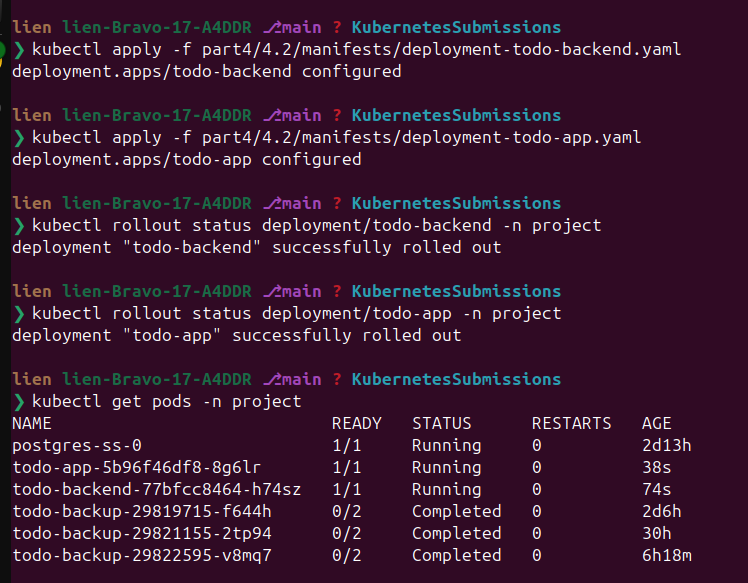

Check the endpoint that the probes actually use:

```bash
kubectl run curl-42 -n project --image=busybox:1.36 --restart=Never --rm -it -- \
  sh -c 'wget -qO- http://todo-backend-svc:2345/healthz; echo; wget -qO- http://todo-app-svc:3000/healthz; echo'
```

```text
{"status":"ok"}
{"status":"ok"}
```

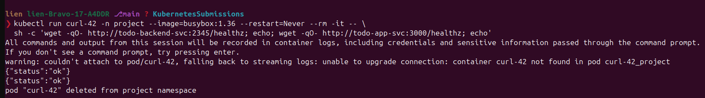

---

## Step 3 — break the app from the UI (the actual exercise)

Open the app and press the button:

```bash
kubectl port-forward -n project svc/todo-app-svc 8080:3000
# then open http://localhost:8080 in a browser
```

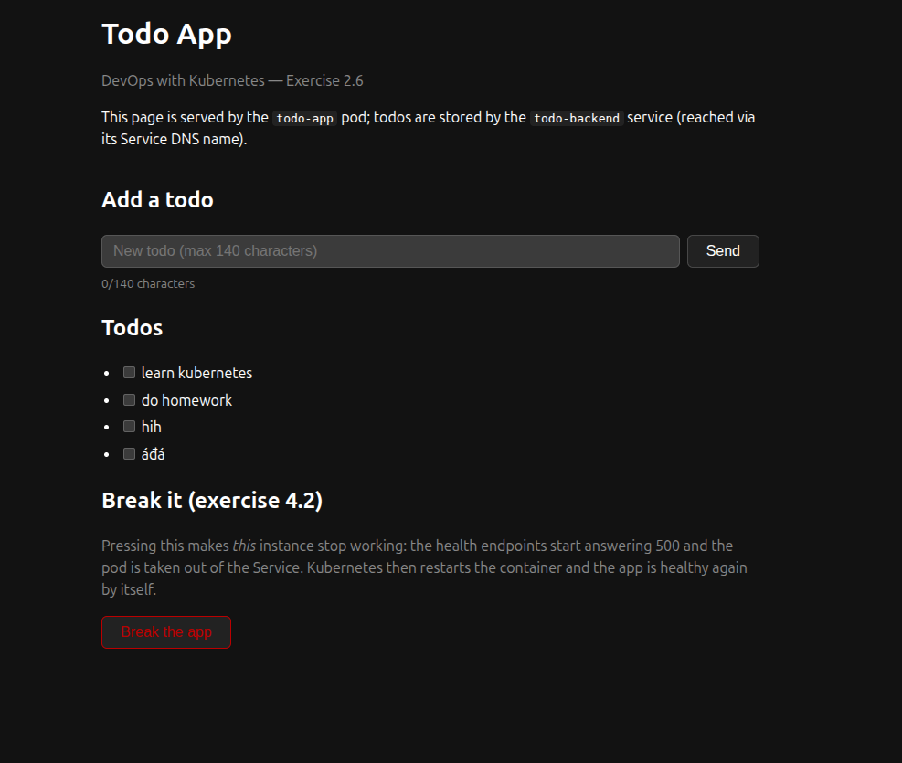
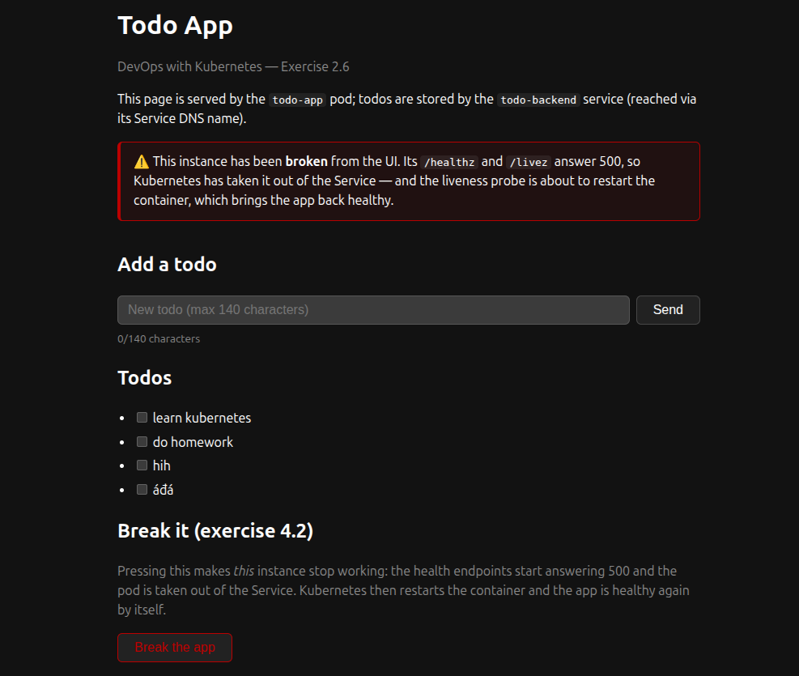

At the bottom of the page there is now a **"Break the app"** button. Press it and
switch to another terminal with a watch running:

```bash
kubectl get pods -n project -w
kubectl get endpoints todo-app-svc -n project -w     # in a second terminal
```

**What happens, in order** (all of it without you doing anything):

1. The page reloads and shows the red "this instance has been broken" banner.
2. Within ~15 s the readiness probe fails three times in a row → the pod is
   `0/1` and the Service's endpoint list for `todo-app-svc` becomes **empty**:
   the app is out of rotation for new requests.
3. At ~30 s the liveness probe (`/livez`) has failed three times → kubelet
   **kills the container and starts a new one** in the same pod. The broken flag
   was only in memory, so the new container starts healthy.
4. The pod goes back to `1/1`, the endpoint comes back, and the page works again.

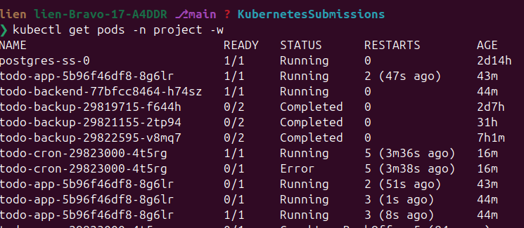
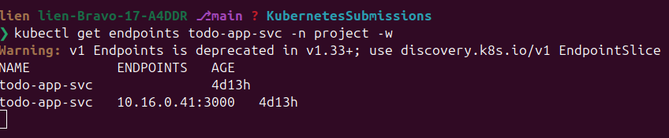

Watch the counter fill up and the reason for the restarts:

```bash
kubectl get pods -n project -o custom-columns='NAME:.metadata.name,READY:.status.containerStatuses[0].ready,RESTARTS:.status.containerStatuses[0].restartCount'
kubectl get endpoints todo-app-svc -n project
```

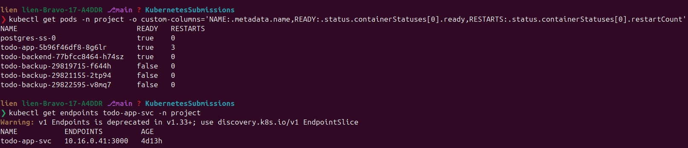

Measured on a real cluster (the times are from the moment the button was
pressed):

```text
T+12s  READY=true   RESTARTS=0   endpoints todo-app-svc = 10.16.3.105:3000
T+24s  READY=false  RESTARTS=0   endpoints todo-app-svc = <none>       ← out of the Service
T+60s  READY=false  RESTARTS=1   endpoints todo-app-svc = <none>       ← liveness restarted it
T+72s  READY=true   RESTARTS=1   endpoints todo-app-svc = 10.16.3.105:3000
```

```bash
kubectl describe pod -n project -l app=todo-app | grep -E "Readiness|Liveness|Unhealthy"
```

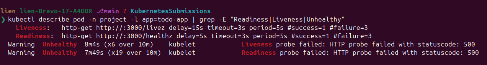

```text
    Liveness:   http-get http://:3000/livez   delay=15s timeout=3s period=5s #success=1 #failure=3
    Readiness:  http-get http://:3000/healthz delay=5s  timeout=3s period=5s #success=1 #failure=3
  Warning  Unhealthy  59s (x3 over 69s)   kubelet  Liveness probe failed: HTTP probe failed with statuscode: 500
  Warning  Unhealthy  29s (x11 over 71s)  kubelet  Readiness probe failed: HTTP probe failed with statuscode: 500
```

> **Where would a `StartupProbe` fit?** The liveness probe above
> (`delay=15s`, `period=5s`, `failure=3`) gives the container about 30 seconds
> before it is killed. An application that needs a minute to warm up would never
> survive that, and that is exactly what `startupProbe` is for: while it has not
> succeeded, the liveness probe is not started at all —
> `startupProbe: {periodSeconds: 5, failureThreshold: 24}` buys two minutes. This
> app answers within a second, so there is nothing to wait for here; the chapter
> only mentions the probe for the same reason.

**The app really stops answering.** While the pod is `0/1`, simply reload the
browser page: the port-forward is still open, but `todo-app-svc` has no endpoints
to route to, so the page does not load any more. The same thing from inside the
cluster:

```bash
kubectl run app-probe -n project --image=busybox:1.36 --restart=Never --rm -it -- \
  sh -c 'wget -qO- --timeout=3 http://todo-app-svc:3000/ >/dev/null && echo answered || echo "no answer"'
```

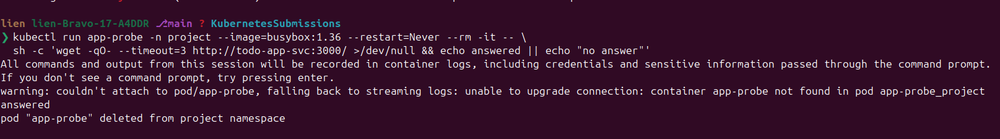

That is the chapter's "the app stops responding to the address after a while" —
readiness is not decoration, it is what the Service uses to decide where traffic
goes. (If you miss the ~15-second window before the liveness restart, press the
button again once the pod is healthy.)

> The exercise says "a new pod will be started up soon". What Kubernetes actually
> does with a failing liveness probe is restart the **container inside the same
> pod** — the pod name stays, `RESTARTS` grows by one. That is enough for the
> requirement, because the broken state lived in the process: the new container
> is healthy again. (A new *pod* would be the case if the pod itself died, e.g.
> if the app called `process::exit`, or if the Deployment had to be replaced.)

---

## Step 4 — a bad update, and rolling it back

The chapter rolls a buggy version back with `kubectl rollout undo`. Do the same on
the project: make a *bad update* by pointing the app at a backend that does not
exist. An entry in `env` wins over the value the ConfigMap provides, so it is a
one-line change in `deployment-todo-app.yaml`:

```yaml
          env:
            - name: PORT
              value: "3000"
            - name: TODO_BACKEND_URL          # ← the bad update
              value: http://does-not-exist:2345
```

```bash
kubectl apply -f part4/4.2/manifests/deployment-todo-app.yaml
kubectl rollout status deployment/todo-app -n project     # never finishes
kubectl get pods -n project                              # 0/1 Running, RESTARTS unchanged
```

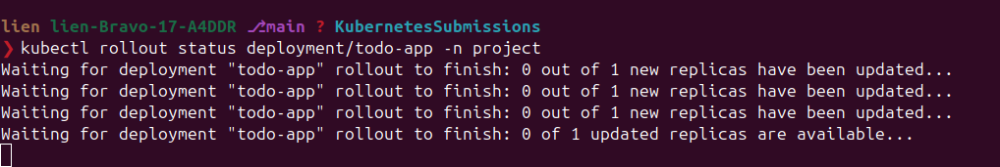
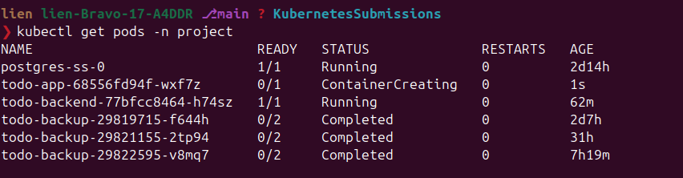

What you should see — and why it is different from the break button: `/healthz`
answers 500 (`todo-backend unreachable`), so the pod never becomes Ready and the
rollout never completes. `/livez` is still 200, so **nothing gets restarted**: a
wrong configuration is not a reason to kill a container. (Verified on the app:
`/healthz` → 500 `{"status":"unhealthy","error":"todo-backend unreachable: ..."}`,
`/livez` → 200 `{"status":"ok"}`.)

Measured on a cluster, asking the Service for the page from a client pod:

```text
before the bad update:   wget http://todo-app-svc:3000/  -> ANSWERED
after  the bad update:   wget http://todo-app-svc:3000/  -> NO ANSWER   (pod 0/1, RESTARTS still 0)
after  the rollout undo: wget http://todo-app-svc:3000/  -> ANSWERED   (pod 1/1, RESTARTS still 0)
```

Two things to take away: the application really is unreachable while it is not
Ready (that is readiness gating the Service, not a crash), and the whole bad
episode cost **zero restarts**.

Now the way out, which is what the chapter shows:

```bash
kubectl rollout history deployment/todo-app -n project
kubectl describe deployment/todo-app -n project | grep Image
kubectl rollout undo deployment/todo-app -n project
kubectl rollout status deployment/todo-app -n project
```

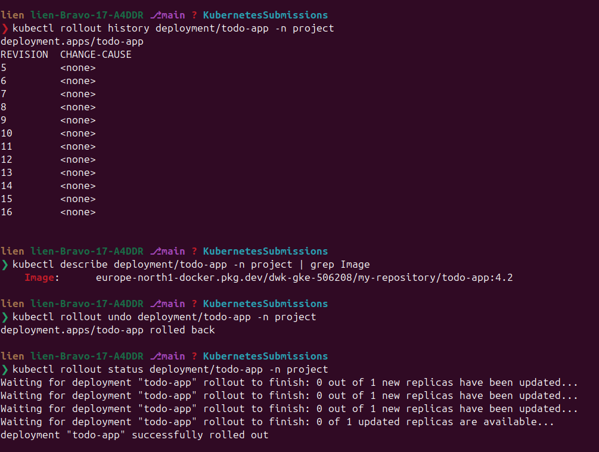
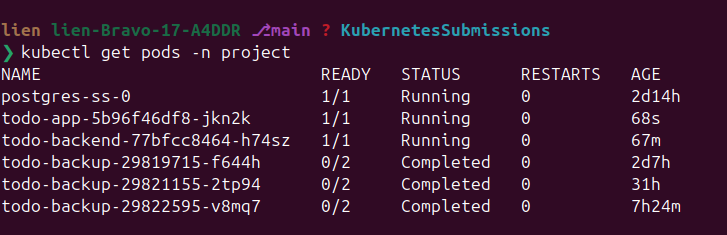

`undo` goes back one revision. If that revision were bad too, you name the one you
want — the chapter's `--to-revision`:

```bash
kubectl rollout undo deployment/todo-app -n project --to-revision=1
kubectl rollout undo --help
```

> **Revision numbers move.** `undo` rewrites the history (the revision it replaced
> is dropped and the history is renumbered), so running `--to-revision=1` right
> after an undo answers
> `error: unable to find specified revision 1 in history`. Always read
> `kubectl rollout history` immediately before naming a revision.

> `rollout undo` deletes nothing: it creates a *new* revision with the old
> content, which is why `rollout history` keeps growing. Annotate before you
> change something and the history stops being a wall of `<none>`:
>
> ```bash
> kubectl annotate deployment/todo-app -n project \
>   kubernetes.io/change-cause="4.2: bad TODO_BACKEND_URL"
> ```
>
> Put the good value back (remove the `TODO_BACKEND_URL` entry) before you move on.

---

## Step 5 — the other half: "connected to a database"

The exercise asks for an endpoint that proves the app *is working **and** connected
to a database*. The backend's `/healthz` is that proof, and you can see it fail on
purpose:

```bash
kubectl scale statefulset postgres-ss -n project --replicas=0
kubectl get pods -n project -w
```

```text
NAME                            READY   STATUS    RESTARTS
todo-app-5b96f46df8-mhstq       0/1     Running   1
todo-backend-77bfcc8464-stk78   0/1     Running   0
```

Both pods are `0/1`: the backend cannot run `SELECT 1` any more, and the app
cannot get a 200 from the backend. Note what does **not** happen: `RESTARTS` does
not move — no probe restarts anything. That is the liveness/readiness split doing
its job; an app whose liveness probe pointed at a database-dependent endpoint
would be in `CrashLoopBackOff` by now.

> Careful about *when* the database disappears. Scaling Postgres down while the
> pods run (what you just did) leaves the backend pod up and merely not Ready —
> that is the interesting case. If the backend *starts* while Postgres is not
> there at all, `init_db` retries for about a minute and then exits, and the pod
> goes into `CrashLoopBackOff` — a pre-existing property of the project, not
> something the probes can fix.

Bring the database back and both go Ready on their own:

```bash
kubectl scale statefulset postgres-ss -n project --replicas=1
kubectl get pods -n project -w
```

---

## Step 6 — cleanup

```bash
kubectl delete pod curl-42 -n project --ignore-not-found
kubectl delete pod app-probe -n project --ignore-not-found
```

---