# Exercise 4.3 — Prometheus

> Course text (chapter 5, *Update Strategies and Prometheus*):
> *"Ok, we started up Prometheus in Chapter 3, but we have barely scratched the
> surface. Let's do a single hands-on query to learn more. Start now Prometheus
> with Helm, and use port-forward to access the GUI website. This time, we will do
> the port forwarding through the service: […] Write a query that shows the number
> of pods created by StatefulSets in prometheus namespace. […] Query for
> `kube_pod_info` should have the required fields to filter through."*

What we will learn by *doing*:

1. Installing a real monitoring stack with **Helm** — and seeing what the chart
   actually creates (Prometheus, Alertmanager, Grafana, kube-state-metrics,
   node-exporter, an operator and two webhook jobs).
2. Making that install work on a cluster that **cannot reach quay.io, registry.k8s.io
   or ghcr.io**: mirror every image into a registry of your own first.
3. **Port-forwarding a Service** (not a pod) and querying Prometheus through its API.
4. The metrics the *next* exercise needs: `kube_pod_info` / `kube_pod_owner` for "how
   many pods and who created them", and `kube_pod_container_status_restarts_total` —
   what the chapter's canary analysis differences over two minutes (Step 4).

No application source is needed: the exercise is about the monitoring stack and the
metrics of whatever runs in the cluster. The only workload it wants — a container
that keeps crashing, in Step 4 — is a four-line BusyBox pod. The lab stands alone.

---

## Step 0 — what you need, and the capacity question

A cluster, `kubectl`, `helm` **and** a place to put the chart's images.

```bash
helm version --short
kubectl get nodes
```

**This cluster is small (4 × e2-small) and it is nearly full.** The whole
`kube-prometheus-stack` wants more memory than is free, so check before you start:

```bash
kubectl describe nodes | grep -A 6 "Allocated resources"
```

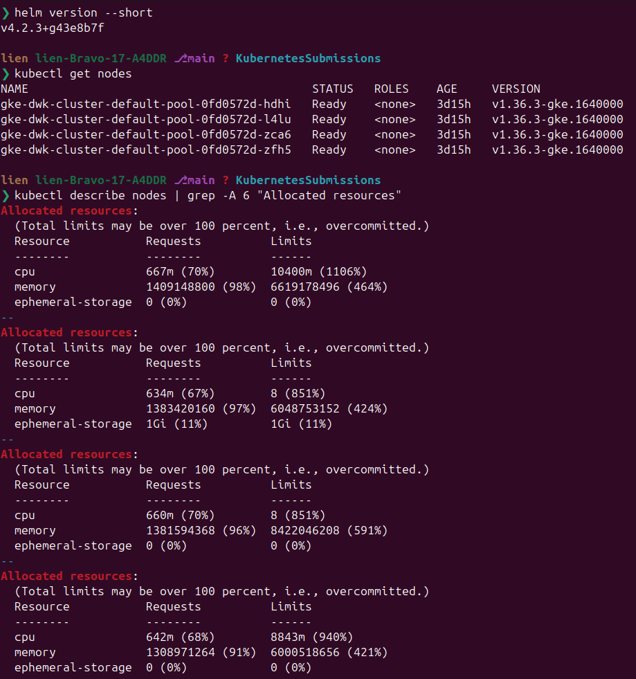

If the chart's pods end up `Pending` with `0/4 nodes are available: 4 Insufficient
memory`, there are two ways out — **you need neither if everything reads `Running`**:

```bash
# 1) free memory: look at what the cluster carries and delete a namespace you
#    are done with (earlier exercises leave their workloads behind)
kubectl get namespaces
kubectl delete namespace <the-namespace-you-no-longer-need>

# 2) add a node (about two cents per hour, and it makes the whole lab comfortable)
gcloud container clusters resize dwk-cluster --num-nodes=5 \
  --zone=europe-north1-c --project=dwk-gke-506208
```

The values file is written for the 4-node cluster: small requests, a **single**
Prometheus replica. Add a node and set `prometheus.prometheusSpec.replicas: 2` and
you have the chapter's own setup — the source of its "3 pods" answer (Step 3).

---

## Step 1 — mirror the images

The cluster here cannot pull from `quay.io`, `registry.k8s.io` or `ghcr.io`
(general internet egress is blocked), and `kube-prometheus-stack 91.2.3` needs
nine images from exactly those registries. My laptop can reach them, so pull
there and push into Artifact Registry:

```bash
R=europe-north1-docker.pkg.dev/dwk-gke-506208/my-repository
gcloud auth configure-docker europe-north1-docker.pkg.dev

# quay.io → Artifact Registry
docker pull quay.io/prometheus/prometheus:v3.14.0-distroless
docker tag  quay.io/prometheus/prometheus:v3.14.0-distroless          $R/prometheus:v3.14.0-distroless
docker push $R/prometheus:v3.14.0-distroless

docker pull quay.io/prometheus-operator/prometheus-operator:v0.94.0
docker tag  quay.io/prometheus-operator/prometheus-operator:v0.94.0  $R/prometheus-operator:v0.94.0
docker push $R/prometheus-operator:v0.94.0

docker pull quay.io/prometheus-operator/prometheus-config-reloader:v0.94.0
docker tag  quay.io/prometheus-operator/prometheus-config-reloader:v0.94.0 $R/prometheus-config-reloader:v0.94.0
docker push $R/prometheus-config-reloader:v0.94.0

docker pull quay.io/prometheus/alertmanager:v0.34.0
docker tag  quay.io/prometheus/alertmanager:v0.34.0                  $R/alertmanager:v0.34.0
docker push $R/alertmanager:v0.34.0

docker pull quay.io/prometheus/node-exporter:v1.12.1-distroless
docker tag  quay.io/prometheus/node-exporter:v1.12.1-distroless       $R/node-exporter:v1.12.1-distroless
docker push $R/node-exporter:v1.12.1-distroless

docker pull quay.io/kiwigrid/k8s-sidecar:2.11.2
docker tag  quay.io/kiwigrid/k8s-sidecar:2.11.2                       $R/k8s-sidecar:2.11.2
docker push $R/k8s-sidecar:2.11.2

# registry.k8s.io → Artifact Registry
docker pull registry.k8s.io/kube-state-metrics/kube-state-metrics:v2.20.0
docker tag  registry.k8s.io/kube-state-metrics/kube-state-metrics:v2.20.0 $R/kube-state-metrics:v2.20.0
docker push $R/kube-state-metrics:v2.20.0

# ghcr.io / Docker Hub → Artifact Registry
docker pull ghcr.io/jkroepke/kube-webhook-certgen:1.8.8
docker tag  ghcr.io/jkroepke/kube-webhook-certgen:1.8.8               $R/kube-webhook-certgen:1.8.8
docker push $R/kube-webhook-certgen:1.8.8

docker pull docker.io/grafana/grafana:13.2.1-distroless
docker tag  docker.io/grafana/grafana:13.2.1-distroless               $R/grafana:13.2.1-distroless
docker push $R/grafana:13.2.1-distroless
```

Two traps:

- **`prometheus-config-reloader` is easy to forget** — it is not in the rendered
  manifests; the *operator* injects it as an init container. Miss it and the
  StatefulSet pods sit in `Init:ImagePullBackOff` while everything else runs.
- `docker push` can end with `unexpected EOF` **after** printing a digest. Usually
  the manifest landed anyway — compare digests:

  ```bash
  gcloud artifacts docker images describe $R/kube-state-metrics:v2.20.0 \
    --format="value(image_summary.digest)"
  ```

  Equal digests mean the push is done — ignore the error. If the digest is missing
  or different, copy registry-to-registry instead:

  ```bash
  docker buildx imagetools create -t $R/kube-state-metrics:v2.20.0 \
    registry.k8s.io/kube-state-metrics/kube-state-metrics:v2.20.0
  ```

---

## Step 2 — the values file, then the install

`part4/4.3/values.yaml` does two things: it points every component at the mirrored
images, and it gives the stack the modest requests this small cluster can schedule.

> The chart joins `image.registry` + `image.repository` + `image.tag`, so setting
> `repository:` to the full `…/my-repository/grafana` path alone renders
> `quay.io/europe-north1-…` — both lines are needed.

Render the chart before installing it: it shows what will be created, and catches an
image you forgot to mirror:

```bash
helm repo add prometheus-community https://prometheus-community.github.io/helm-charts
helm repo update

helm template prom prometheus-community/kube-prometheus-stack --version 91.2.3 \
  -n monitoring -f part4/4.3/values.yaml | grep -E "^\s+image: " | sort -u
```

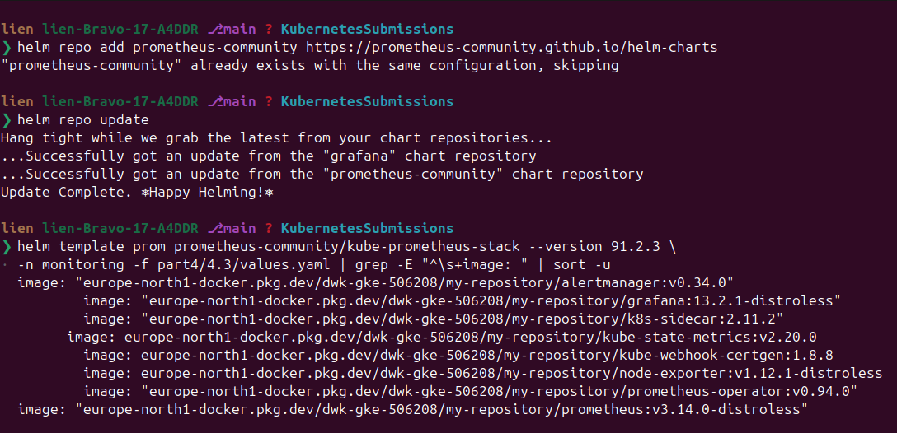

Every line of that output must start with `europe-north1-docker.pkg.dev`. Then:

```bash
kubectl create namespace monitoring

# --install makes this idempotent: run it again after changing values.yaml
helm upgrade --install prom prometheus-community/kube-prometheus-stack \
  --version 91.2.3 -n monitoring -f part4/4.3/values.yaml
```

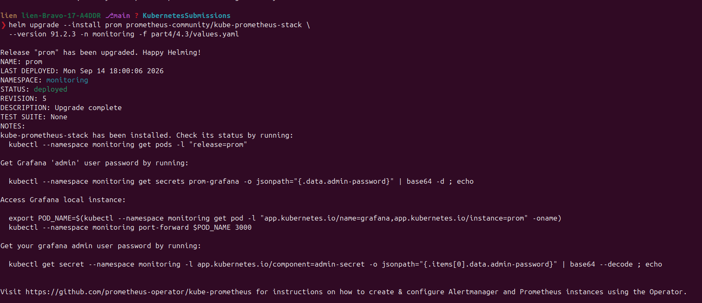

The first start pulls about a gigabyte of images — give it a few minutes.

---

## Step 3 — the exercise: the StatefulSet query

First look at what the chart installed. The names in the chapter's text come from
an older chart version; with **91.2.3** the Prometheus Service is
`prom-kube-prometheus-stack-prometheus` (and it listens on **9090**, not 80):

```bash
kubectl -n monitoring get pods,svc,statefulset
```

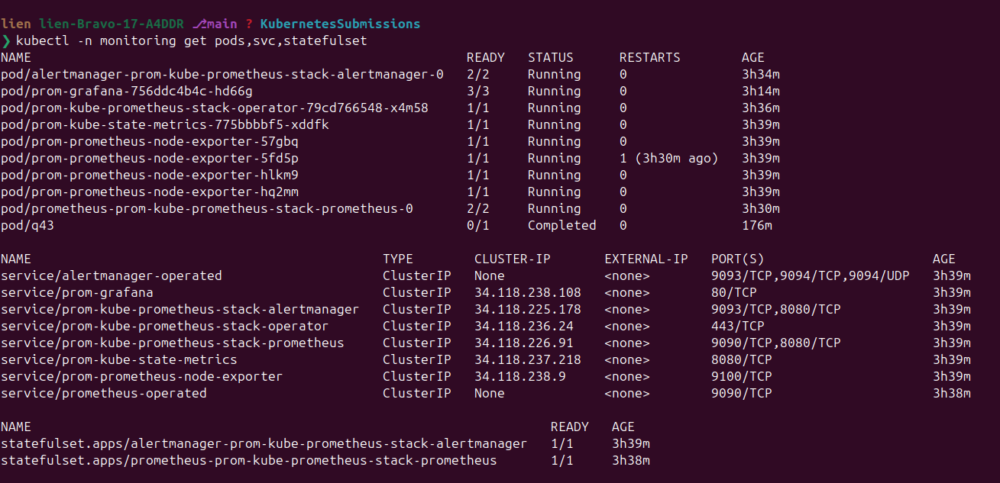

Port-forward through the **Service**, exactly as the exercise asks (a pod would
work too, but a pod is replaced; the Service keeps working):

```bash
kubectl port-forward svc/prom-kube-prometheus-stack-prometheus -n monitoring 9090:9090
```

Now open <http://localhost:9090> and you get Prometheus' GUI: the **Graph** tab is
where you type queries, and the `Execute` button runs them (the *Table* view shows
the value).

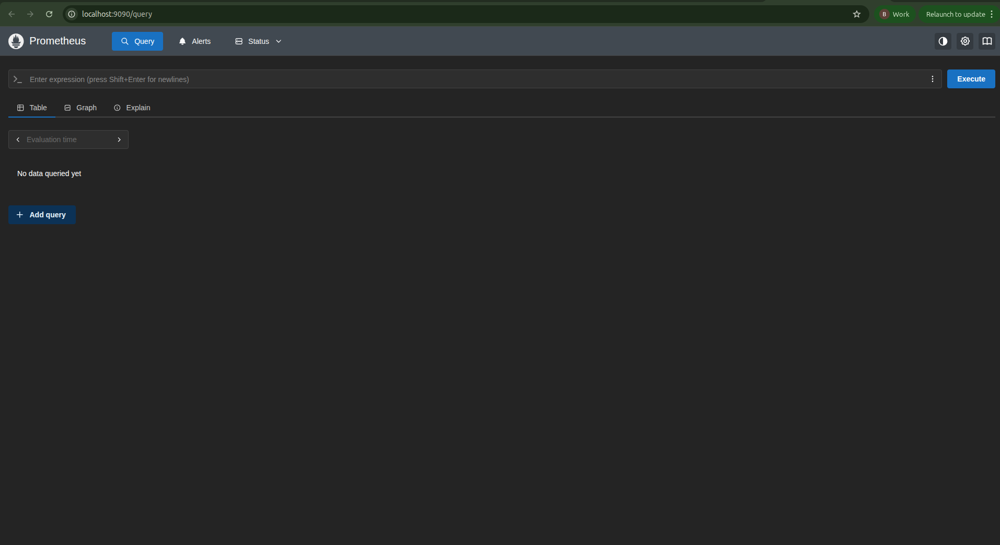

### The query: pods created by StatefulSets

The exercise wants the number of pods that a StatefulSet created. `kube_pod_info`
is the metric to start from, and it carries the labels you need to filter with:
`namespace`, `pod`, `node`, `created_by_kind`, `created_by_name`.

```promql
count(kube_pod_info{namespace="monitoring", created_by_kind="StatefulSet"})
```

```text
Value: 2
```

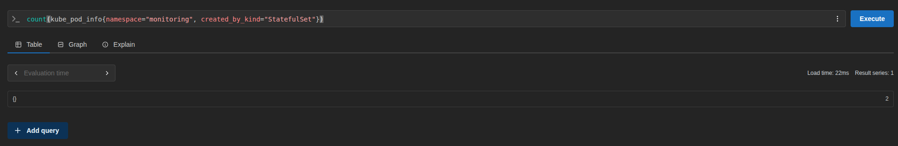

Read it out loud: "count the series of `kube_pod_info` in the `monitoring`
namespace whose `created_by_kind` is `StatefulSet`" → the Prometheus pod and the
Alertmanager pod, which is exactly what `kubectl get statefulset -n monitoring`
shows. **You can predict this number by hand before querying:** count the
StatefulSets and add up their replicas.

> The chapter's output is **3** because its setup ran `replicas: 2` (2 Prometheus +
> 1 Alertmanager); this lab runs one replica, so you get 2 — to reproduce theirs, add
> a node and set `replicas: 2`. The *number* is not the point; the query is.

The same answer through the API — handy for checking a query without a browser:

```bash
kubectl run -n monitoring query-check --image=busybox:1.36 --restart=Never --rm -it -- \
  sh -c 'wget -qO- "http://prom-kube-prometheus-stack-prometheus:9090/api/v1/query?query=count(kube_pod_info%7Bnamespace%3D%22monitoring%22%2Ccreated_by_kind%3D%22StatefulSet%22%7D)"'
```

```text
{"status":"success","data":{"resultType":"vector","result":[{"metric":{},"value":[1789386090.197,"2"]}]}}
```

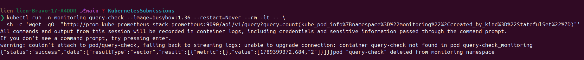

In the **GUI** the same answer reads `{}` then `2`, which catches everybody out
once. It is not empty: `{}` is the **empty label set** of the single series `count()`
returned (`Result series: 1`) — an aggregation drops every label and keeps a number.
Keep them, and you get one row per StatefulSet:

```promql
count by (created_by_name) (kube_pod_info{namespace="monitoring", created_by_kind="StatefulSet"})
```

```text
{'created_by_name': 'alertmanager-prom-kube-prometheus-stack-alertmanager'} → 1
{'created_by_name': 'prometheus-prom-kube-prometheus-stack-prometheus'}      → 1
```

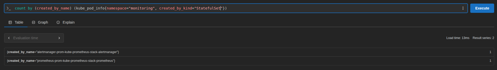

Three more queries — the vocabulary the rest of the chapter is built on:

```promql
# the same thing seen from the owner side (one series per pod + owner)
count(kube_pod_owner{namespace="monitoring", owner_kind="StatefulSet"})

# who created the pods of this namespace? (DaemonSet vs StatefulSet vs ReplicaSet)
count by (created_by_kind) (kube_pod_info{namespace="monitoring"})

# → {'created_by_kind': 'DaemonSet'} 4    (the node-exporters)
#   {'created_by_kind': 'StatefulSet'} 2   (Prometheus + Alertmanager)
#   {'created_by_kind': 'ReplicaSet'} 3    (Grafana, kube-state-metrics, operator)

# how many pods exist per namespace
count by (namespace) (kube_pod_info)
```

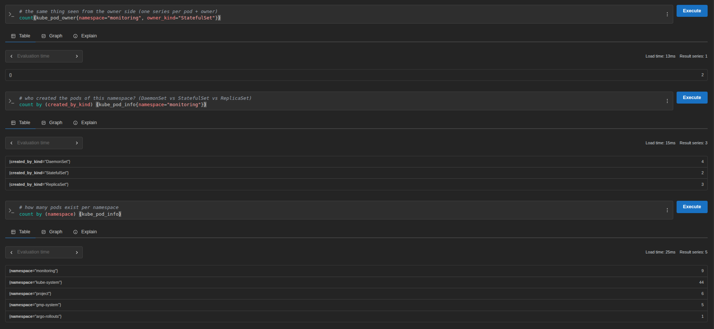

The chart also brings Grafana: `kubectl port-forward svc/prom-grafana -n monitoring
3000:80` opens it at <http://localhost:3000>, with the admin password from its
secret. Not needed here — but it is the pretty view of the same data.

---

## Step 4 — the metric a canary analysis uses

The chapter's *next* exercise builds a canary release whose `AnalysisTemplate`
asks Prometheus one question:

```promql
scalar(
  sum(kube_pod_container_status_restarts_total{namespace="default", container="flaky-update"}) -
  sum(kube_pod_container_status_restarts_total{namespace="default", container="flaky-update"} offset 2m)
)
```

"how many restarts happened in the last two minutes" — if the answer is ≥ 2 the
analysis fails and the release is rolled back before it reaches everybody. So:
which metric answers that, and how does it behave over time?

This lab brings its own workload for it, so nothing else has to be running: a
BusyBox container that starts, waits 20 seconds, and dies. Kubernetes restarts it
— exactly like a bad release that never stays healthy.

```bash
kubectl create namespace crash-demo
kubectl apply -f part4/4.3/manifests/crash-demo.yaml
kubectl get pod -n crash-demo -w          # Error, RESTARTS climbing
```

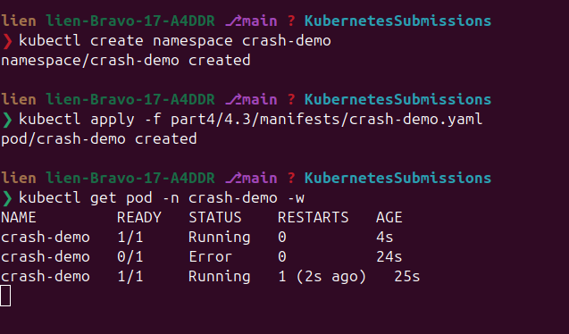

Now ask Prometheus for the number — the same way you would ask it about a release:

```bash
kubectl run -n monitoring restarts --image=busybox:1.36 --restart=Never --rm -it -- \
  sh -c 'wget -qO- "http://prom-kube-prometheus-stack-prometheus:9090/api/v1/query?query=sum(kube_pod_container_status_restarts_total%7Bnamespace%3D%22crash-demo%22%7D)"'
```

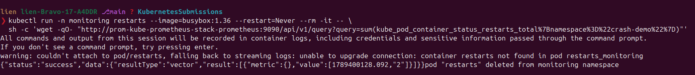

Measured on this cluster, asking once a minute:

```text
right after kubectl apply:  {"status":"success","data":{"resultType":"vector","result":[]}}
after ~60 seconds:          {"…","value":[…,"1"]}
after ~120 seconds:         {"…","value":[…,"2"]}
```

Two details in that output matter for the canary analysis:

- The first query answers **nothing at all** (an empty vector), not `0`: a metric
  reaches Prometheus only after kube-state-metrics reports it and Prometheus scrapes
  it. Hence the template's `initialDelay: 2m` — analyse too early and there is no data.
- It is a counter, so it only goes up. The useful question is "how many restarts
  **since** a moment ago" — the `offset 2m` subtraction, and `rate()` / `increase()`.

Clean the demo up when you have seen the numbers:

```bash
kubectl delete namespace crash-demo
```

---

## Step 5 — cleanup

Prometheus is needed by the next exercise, so keep it. When the chapter is done:

```bash
helm uninstall prom -n monitoring
kubectl delete namespace monitoring
```

`helm uninstall` leaves the CRDs behind (they are cluster-scoped); remove them only
when you are sure nothing else uses them:

```bash
kubectl get crd | grep monitoring.coreos.com
```

The mirrored images stay in Artifact Registry — delete them with the rest when the
course is over.

---

## P.S. — what this exercise leaves you with

- **A stack is a system.** An operator, a database, two exporters, an alert router
  and a dashboard — all of it has to fit the cluster before any of the data exists.
- **Metrics have producers; labels are the handles.** kube-state-metrics reports the
  state of objects, node-exporter the machines; you filter on labels, not names.
- **Aggregations summarise, `by (...)` breaks down.** `count()` returns one labelless
  series — the `{}` in the GUI — and forgets the pods behind it.
- **Counters are read as differences** (`offset`, `rate()`, `increase()`) — the
  reasoning the next exercise's canary analysis runs on.
- **Requests are a budget, limits are discovered by running.** Near 100 % of
  `Allocated resources` means the memory is promised away, and a full cluster can
  deadlock even a routine update; Grafana needed ~436 MiB to load its plugins, so a
  384 MiB limit restarted forever.
- **A chart is a contract with the registry.** Every image it pulls, including the
  ones its operator injects at runtime, has to be reachable from inside the cluster.
- **Documentation ages faster than charts.** The chapter's Service name, namespace and
  pod count all predate the version you installed — your cluster is the specification.