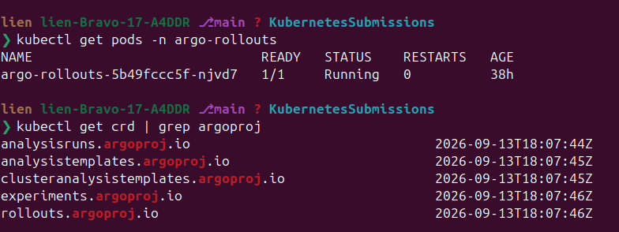
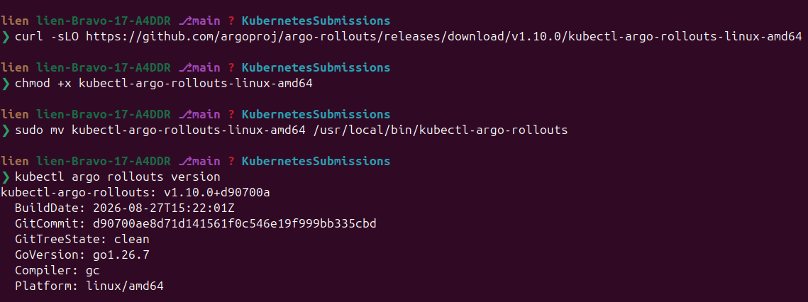
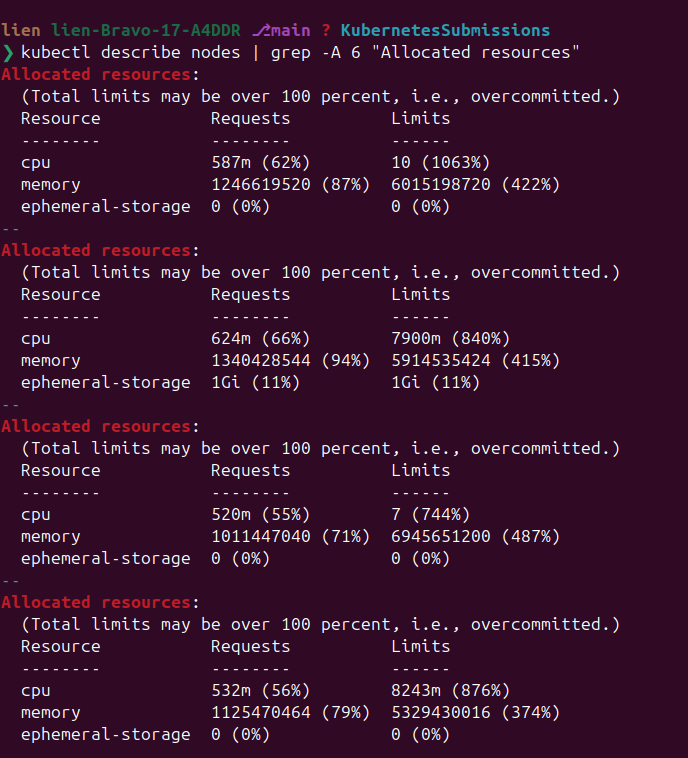
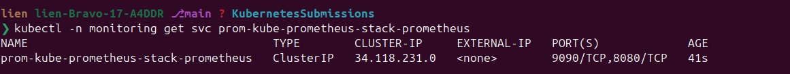
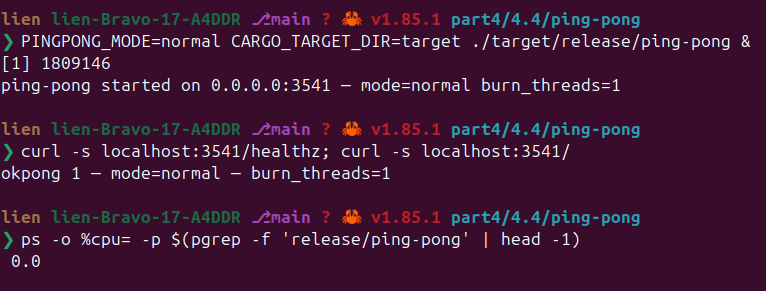
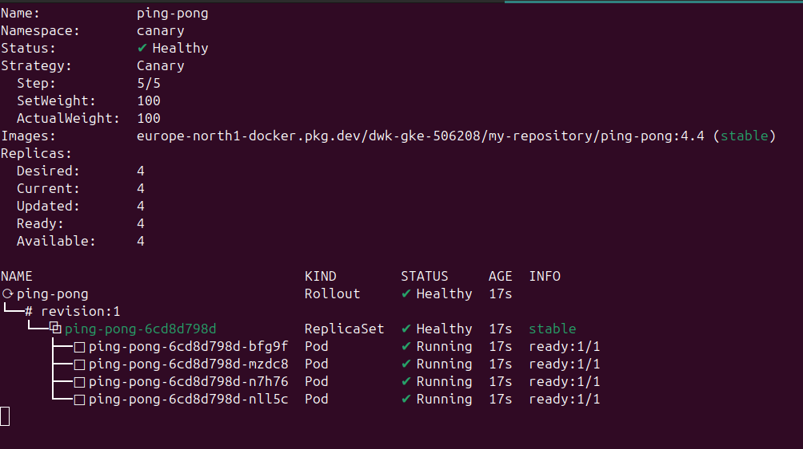
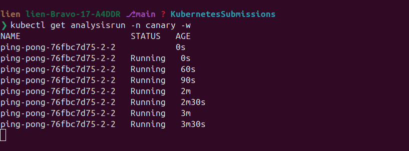
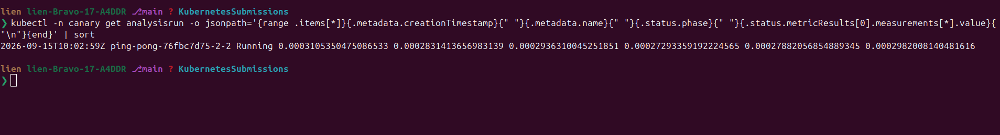
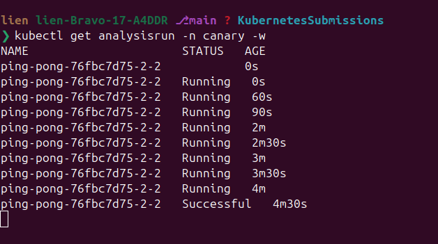
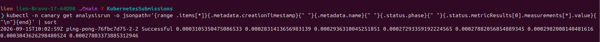

# Exercise 4.4 — Your canary

> Course text (chapter 5, *Update Strategies and Prometheus*):
> *"Create an AnalysisTemplate for the Ping-pong app that will follow the CPU usage
> of all containers in the namespace. If the CPU usage rate sum for the namespace
> increases above a set value (you may choose a good hardcoded value) within 5
> minutes, revert the update. Make sure that the application doesn't get updated,
> if the value is set too low."*

What we will learn by *doing*:

1. **Canary vs rolling update.** A rolling update replaces every pod and hopes; a
   canary gives the new version a fraction of the traffic and asks a question about
   it before going further.
2. **Argo Rollouts**: a `Rollout` whose `strategy.canary.steps` mixes `setWeight`,
   `pause` and `analysis`, plus the two resources behind it — `AnalysisTemplate`
   (the test) and `AnalysisRun` (one execution of that test).
3. **Judging a release by a metric instead of by the app.** Both versions of this
   lab's app answer `/healthz` with 200 and both are `1/1 Running`; what separates
   them is CPU. That is exactly the gap probes cannot close.
4. **Prometheus as the analysis provider**: the address, the query, and why a query
   for an analysis must be a **scalar**.
5. **Operating the thing**: `kubectl argo rollouts get rollout -w`, `promote`,
   `abort` / `retry` — and what "revert the update" looks like on the cluster.

---

## Step 0 — what you need

A cluster with `kubectl`, `helm` and internet access **from your laptop** (the
cluster itself cannot reach quay.io / registry.k8s.io / ghcr.io).

**Argo Rollouts.** The chapter installs it with one command that pulls a manifest
from the internet and then an image from quay.io — on this cluster the image has to
be mirrored first:

```bash
R=europe-north1-docker.pkg.dev/dwk-gke-506208/my-repository

docker pull quay.io/argoproj/argo-rollouts:v1.10.0
docker tag  quay.io/argoproj/argo-rollouts:v1.10.0 $R/argo-rollouts:v1.10.0
docker push $R/argo-rollouts:v1.10.0

curl -sLO https://github.com/argoproj/argo-rollouts/releases/download/v1.10.0/install.yaml
sed -i "s|quay.io/argoproj/argo-rollouts:v1.10.0|$R/argo-rollouts:v1.10.0|" install.yaml

kubectl create namespace argo-rollouts
# --server-side is required: the two big CRDs exceed the 262144-byte annotation
# limit of a client-side apply
kubectl apply --server-side -n argo-rollouts -f install.yaml
```

```bash
kubectl get pods -n argo-rollouts
kubectl get crd | grep argoproj
```



Five CRDs: `rollouts` (the new Deployment-like object), `analysistemplates` /
`clusteranalysistemplates` (the tests), `analysisruns` (one execution of a test) and
`experiments`.

> Already installed in your cluster? Then only the checks below matter — `kubectl
> apply` is idempotent, and the namespace may already exist.

**The plugin** (optional, but it is how the rollouts below are watched):

```bash
curl -sLO https://github.com/argoproj/argo-rollouts/releases/download/v1.10.0/kubectl-argo-rollouts-linux-amd64
chmod +x kubectl-argo-rollouts-linux-amd64
sudo mv kubectl-argo-rollouts-linux-amd64 /usr/local/bin/kubectl-argo-rollouts
kubectl argo rollouts version
```



**Room to run.** The monitoring stack and the canary take about 600 MiB of
requests; on this 4 × e2-small cluster that fits, but check first:

```bash
kubectl describe nodes | grep -A 6 "Allocated resources"
```



---

## Step 1 — Prometheus, because the analysis asks it questions

The 4.4 exercise measures CPU, and only Prometheus has that data. Everything is
mirrored into your own registry first. Grafana and Alertmanager stay **off** — this
exercise needs the time-series database, not the dashboards, and the cluster is
small.

Mirror the six images the chart will ask for:

```bash
R=europe-north1-docker.pkg.dev/dwk-gke-506208/my-repository

docker pull quay.io/prometheus/prometheus:v3.14.0-distroless
docker tag  quay.io/prometheus/prometheus:v3.14.0-distroless $R/prometheus:v3.14.0-distroless
docker push $R/prometheus:v3.14.0-distroless

docker pull quay.io/prometheus-operator/prometheus-operator:v0.94.0
docker tag  quay.io/prometheus-operator/prometheus-operator:v0.94.0 $R/prometheus-operator:v0.94.0
docker push $R/prometheus-operator:v0.94.0

docker pull quay.io/prometheus-operator/prometheus-config-reloader:v0.94.0
docker tag  quay.io/prometheus-operator/prometheus-config-reloader:v0.94.0 $R/prometheus-config-reloader:v0.94.0
docker push $R/prometheus-config-reloader:v0.94.0

docker pull quay.io/prometheus/node-exporter:v1.12.1-distroless
docker tag  quay.io/prometheus/node-exporter:v1.12.1-distroless $R/node-exporter:v1.12.1-distroless
docker push $R/node-exporter:v1.12.1-distroless

docker pull registry.k8s.io/kube-state-metrics/kube-state-metrics:v2.20.0
docker tag  registry.k8s.io/kube-state-metrics/kube-state-metrics:v2.20.0 $R/kube-state-metrics:v2.20.0
docker push $R/kube-state-metrics:v2.20.0

docker pull ghcr.io/jkroepke/kube-webhook-certgen:1.8.8
docker tag  ghcr.io/jkroepke/kube-webhook-certgen:1.8.8 $R/kube-webhook-certgen:1.8.8
docker push $R/kube-webhook-certgen:1.8.8
```

Then render the chart and check that every image it wants is one of yours — a mirror
you forgot shows up here instead of later as `ImagePullBackOff`:

```bash
helm repo add prometheus-community https://prometheus-community.github.io/helm-charts
helm repo update
helm template prom prometheus-community/kube-prometheus-stack --version 91.2.3 \
  -n monitoring -f part4/4.4/values.yaml | grep -E "^\s+image: " | sort -u

kubectl create namespace monitoring
helm upgrade --install prom prometheus-community/kube-prometheus-stack \
  --version 91.2.3 -n monitoring -f part4/4.4/values.yaml
```

Then find the address your AnalysisTemplate will talk to — it is the Service, not a
pod:

```bash
kubectl -n monitoring get svc prom-kube-prometheus-stack-prometheus
```



The value used below is the fully-qualified name of that Service, which works from
any namespace in the cluster:

```text
http://prom-kube-prometheus-stack-prometheus.monitoring.svc.cluster.local:9090
```

---

## Step 2 — the application

`part4/4.4/ping-pong/` is a small axum server with two behaviours, switched by one
environment variable — so one image covers both releases:

- `PINGPONG_MODE=normal` (default) — answers, and burns almost nothing.
- `PINGPONG_MODE=hog` — answers, and a background thread spins on arithmetic.

Both modes answer `GET /healthz` with `200 ok` and `GET /` with a `pong …` line. The
container port is **3541**, the same one the course's ping-pong app uses. There is no
database here: the exercise measures CPU, and a database would only add noise to a
namespace-wide CPU sum.

Measure the difference on your laptop before shipping anything:

```bash
cd part4/4.4/ping-pong
cargo build --release
PINGPONG_MODE=normal CARGO_TARGET_DIR=target ./target/release/ping-pong &
curl -s localhost:3541/healthz; curl -s localhost:3541/
ps -o %cpu= -p $(pgrep -f 'release/ping-pong' | head -1)
```



Swap `PINGPONG_MODE=hog` and the same command shows ≈ 99 % CPU **while `/healthz`
still answers 200**. That is the release the canary exists to catch.

```bash
R=europe-north1-docker.pkg.dev/dwk-gke-506208/my-repository
docker build -t $R/ping-pong:4.4 part4/4.4/ping-pong
docker push $R/ping-pong:4.4
```

---

## Step 3 — the Rollout and the AnalysisTemplate

Two manifests, both yours to type.

**`part4/4.4/manifests/analysistemplate.yaml`** — the test. A namespace CPU sum is
not a number Prometheus hands out directly: `container_cpu_usage_seconds_total` is a
counter of seconds burned per container, so the *rate* is what we want, summed over
every container in the namespace.

```yaml
apiVersion: argoproj.io/v1alpha1
kind: AnalysisTemplate
metadata:
  name: namespace-cpu
  namespace: canary
spec:
  metrics:
    - name: namespace-cpu
      initialDelay: 1m
      interval: 30s
      count: 8
      successCondition: result < 0.3
      provider:
        prometheus:
          address: http://prom-kube-prometheus-stack-prometheus.monitoring.svc.cluster.local:9090
          query: |
            scalar(
              sum(rate(container_cpu_usage_seconds_total{namespace="canary", container!=""}[1m]))
            )
```

Read the fields as a sentence: *"wait a minute (`initialDelay`), then every 30
seconds (`interval`), eight times (`count` — four minutes, so five in total), ask
Prometheus for that query and require the answer to stay under a third of a core
(`successCondition`)."*

Two details that cost real debugging time:

- **`scalar(...)` is needed.** Without it the query returns a *vector* — one value
  per series — and Argo cannot compare a vector with a number:
  `could not evaluate successCondition "result < 0.3": invalid operation: <
  (mismatched types []float64 and float64)`.
- `container!=""` drops the cgroup line that represents the whole pod, so the sum
  counts containers, as the exercise says.

**`part4/4.4/manifests/rollout.yaml`** — the canary:

```yaml
apiVersion: argoproj.io/v1alpha1
kind: Rollout
metadata:
  name: ping-pong
  namespace: canary
spec:
  replicas: 4
  selector:
    matchLabels:
      app: ping-pong
  strategy:
    canary:
      steps:
        - setWeight: 25
        - pause:
            duration: 30s
        - analysis:
            templates:
              - templateName: namespace-cpu
        - setWeight: 50
        - pause:
            duration: 30s
  template:
    metadata:
      labels:
        app: ping-pong
    spec:
      containers:
        - name: ping-pong
          image: europe-north1-docker.pkg.dev/dwk-gke-506208/my-repository/ping-pong:4.4
          env:
            - name: PINGPONG_MODE
              value: normal
          ports:
            - containerPort: 3541
          readinessProbe:
            httpGet:
              path: /healthz
              port: 3541
            initialDelaySeconds: 5
            periodSeconds: 5
          resources:
            requests:
              cpu: 50m
              memory: 32Mi
            limits:
              cpu: 500m
              memory: 128Mi
---
apiVersion: v1
kind: Service
metadata:
  name: ping-pong-svc
  namespace: canary
spec:
  selector:
    app: ping-pong
  ports:
    - port: 80
      targetPort: 3541
```

The steps say: shift a quarter of the traffic, wait for the new pods to be
measurable, then **ask the question**; only if the answer is acceptable continue to
half, wait, and finish at full traffic.

> The analysis is placed **after** `setWeight` deliberately. Put it first and it
> measures the *old* version's CPU — a test that passes no matter how bad the release
> is.

Apply, and keep the rollouts' own view open in a second terminal:

```bash
kubectl create namespace canary
kubectl apply -f part4/4.4/manifests/analysistemplate.yaml
kubectl apply -f part4/4.4/manifests/rollout.yaml

kubectl argo rollouts get rollout ping-pong -n canary --watch   # if you installed the plugin
```



The first apply creates all four pods straight away — a canary only *starts* when the
pod template changes, which is the next step.

---

## Step 4 — a release that deserves to go out

Change nothing about the app's behaviour, only make the Rollout believe it is a new
version. The cheapest way is a change-cause annotation... which is not a pod template
change, so instead touch a label on the pod template:

```bash
kubectl -n canary patch rollout ping-pong --type=merge \
  -p '{"spec":{"template":{"metadata":{"annotations":{"release":"first"}}}}}'
```

Watch the four pods: one of them starts the new version, and the rollout then waits
for the analysis. The analysis data is worth looking at while you wait:

```bash
kubectl get analysisrun -n canary -w

# every measurement so far, newest run last (the list is not sorted for you)
kubectl -n canary get analysisrun -o jsonpath='{range .items[*]}{.metadata.creationTimestamp}{" "}{.metadata.name}{" "}{.status.phase}{" "}{.status.metricResults[0].measurements[*].value}{"\n"}{end}' | sort
```

```text
10:02:59Z  AnalysisRun ping-pong-76fbc7d75-2-2 starts (after the 1m initialDelay)
10:07:30Z  eight measurements, one every 30 s: 0.000311  0.000283  0.000294
           0.000273  0.000279  0.000298 …
           phase: Successful → the rollout continued to weight 100, Healthy, 4/4 pods
```

This is the canary working: a quarter of the traffic through a version that is
measurably cheap, then half, then everything — with `setWeight 50` never reached
before the numbers were read.






---

## Step 5 — the release that burns CPU

Now ship the version that is "healthy" and expensive: change `PINGPONG_MODE` to
`hog` in the Rollout and apply it.

```bash
sed -i 's/value: normal/value: hog/' part4/4.4/manifests/rollout.yaml
kubectl apply -f part4/4.4/manifests/rollout.yaml
```

```text
t+0s       AnalysisRun starts with one hog pod at 25 %
t+100s     first measurement, once the initialDelay expires: 0.3476 cores
           ← above the 0.3 bound
           phase: Failed (1 failed measurement > failureLimit 0)
t+170s     the hog pod is gone; 4/4 pods serving from the old, normal ReplicaSet
```

(The timings and the value are from the reference run of this lab; the shape is the
same in every run — what varies is how far above 0.3 the hog pod lands.)

Watch what happens, and what does not: the new pod passes its readiness probe,
answers `pong … mode=hog`, and never reaches half of the traffic. The AnalysisRun
fails on its first measurement, Argo aborts the rollout and scales the previous
ReplicaSet back up — the application is untouched.

```bash
kubectl -n canary get rollout ping-pong -o jsonpath='{.status.message}{"\n"}'
```

```text
RolloutAborted: Rollout aborted update to revision 5: Step-based analysis phase
error/failed: Metric "namespace-cpu" assessed Failed due to failed (1) > failureLimit (0)
```

Revert your manifest, since you will want the healthy version again:

```bash
sed -i 's/value: hog/value: normal/' part4/4.4/manifests/rollout.yaml
```

---

## Step 6 — a value set too low (the exercise's last requirement)

A threshold that a healthy release cannot pass is not a safe default either — with
`successCondition: result < 0.0002`, even the `normal` version fails, and the update
simply never happens. Try it:

```bash
sed -i 's/result < 0.3/result < 0.0002/' part4/4.4/manifests/analysistemplate.yaml
kubectl apply -f part4/4.4/manifests/analysistemplate.yaml

kubectl -n canary patch rollout ping-pong --type=merge \
  -p '{"spec":{"template":{"metadata":{"annotations":{"release":"too-low"}}}}}'
```

```text
t+0s       AnalysisRun starts, the bound is now 0.0002
t+100s     first measurement: 0.000277 cores   ← a healthy release, and it still fails
           phase: Failed (1 measurement) → that revision is aborted and the pods stay
           on the version that was already serving
```

The requirement is met from the other side: the whole point of a threshold is that it
sits **between** a good release and a bad one. Measured on this cluster, the healthy
namespace burns about **0.0003 cores**, and one `hog` pod adds **0.5** — three orders
of magnitude apart, which is why `0.3` is a comfortable hardcoded value.

Put the threshold back:

```bash
sed -i 's/result < 0.0002/result < 0.3/' part4/4.4/manifests/analysistemplate.yaml
kubectl apply -f part4/4.4/manifests/analysistemplate.yaml
```

Some other ways out of a stuck rollout, for the day you need them:

```bash
kubectl argo rollouts promote ping-pong -n canary   # if it is paused indefinitely
kubectl argo rollouts abort   ping-pong -n canary   # give up and keep the old version
kubectl argo rollouts retry   ping-pong -n canary   # try the same revision again
```

---

## Step 7 — cleanup

```bash
kubectl delete namespace canary
```

The AnalysisTemplate goes with that namespace. The monitoring stack is not needed by
4.5 either:

```bash
helm uninstall prom -n monitoring
kubectl delete namespace monitoring
kubectl get crd | grep monitoring.coreos.com    # left behind; delete them when the course is over
```

Argo Rollouts can stay, or (delete it with the `install.yaml` you downloaded in Step 0):

```bash
kubectl delete -n argo-rollouts -f install.yaml
kubectl delete crd rollouts.argoproj.io analysisruns.argoproj.io \
  analysistemplates.argoproj.io clusteranalysistemplates.argoproj.io experiments.argoproj.io
```

---

## P.S. — what this exercise leaves you with

- **Probes ask the app; a canary asks the system.** Both versions here are
  `1/1 Running` with a green `/healthz`, so no probe can tell them apart — CPU can.
- **`setWeight` before `analysis`, always.** An analysis placed before the new pods
  exist measures the old version and approves anything.
- **An analysis is a scalar comparison.** Wrap the query in `scalar()`; a vector
  answers with `mismatched types []float64 and float64`.
- **`initialDelay` is the price of trusting a metric.** Counters and rates need to be
  scraped before they mean anything, which is also why `count × interval` defines the
  judgement window — here five minutes, the window the exercise asks for.
- **A threshold lives between two measurements**, not at a round number: 0.0003
  (healthy) versus 0.5 (one hog pod) is what makes 0.3 honest.
- **A failed analysis is a successful deployment system.** The bad release reached one
  pod out of four, and then not even that: Argo reverted automatically.