# Exercise 4.5 — The project, step 22: a Done field, and two ways to update

> Course text (chapter 5, *Update Strategies and Prometheus*):
> *"Speaking of updating. Our todo application could use 'Done' field for todos
> that are already done. It should be a PUT request to `/todos/<id>`."*
>
> And the theory behind it, the two strategies the page teaches just above:
> Kubernetes' **Recreate** strategy (*"takes down the previous pods and replaces
> everything with the updated one… creates a moment of downtime, but ensures that
> different versions are not running at the same time"*) and Argo Rollouts'
> **BlueGreen** (*"a new version is run side by side to the old one, but traffic is
> switched between the two at a certain point"*).

What this lab does, in order:

1. **the feature**: a Done field with a button, the `PUT /todos/<id>` the exercise
   asks for, and a **Delete** button (`DELETE /todos/<id>`);
2. **the picture**: the front page caches a photo on a volume; on a private cluster
   that fetch fails silently, so this lab fixes it and proves the image shows;
3. **Recreate**: measured, this app must use it because of the image volume;
4. **BlueGreen**: the backend as an Argo Rollout with a preview service, where only a
   promotion switches traffic.

The applications here already contain the change; you hand-type the Dockerfiles and
manifests from this README.

---

## Step 0 — what you need in front of you

A cluster with the project running (the pipeline put it there), plus Argo Rollouts
from 4.4:

```bash
kubectl get pods -n project
kubectl get crd | grep argoproj          # rollouts.argoproj.io and friends
kubectl argo rollouts version            # the plugin, for watching a rollout
```

```text
NAME                             READY   STATUS      RESTARTS   AGE
postgres-ss-0                    1/1     Running     0          2d5h
todo-app-...                     1/1     Running     0          29h
todo-backend-...                 1/1     Running     0          29h
```

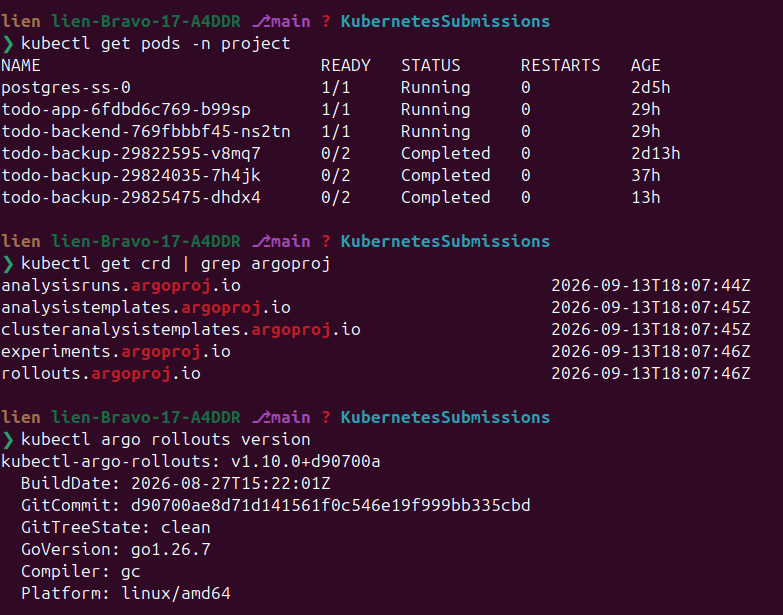

```bash
kubectl config set-context --current --namespace=project
```

The images are built from this folder, so the two apps you deploy are *yours*, not
the pipeline's. Everything stays in `project` until the next push overwrites it; the
last step puts it back.

---

## Step 1 — the code: one field, two endpoints, one button each

The backend keeps todos in Postgres, so the "Done" field is a column:

```sql
ALTER TABLE todos ADD COLUMN IF NOT EXISTS done BOOLEAN NOT NULL DEFAULT false
```

`IF NOT EXISTS` matters: the table already has rows. The lab's backend runs that
line at startup, after `CREATE TABLE IF NOT EXISTS`.

**The two endpoints the exercise is about.** Both act on one todo and share a
path; only the verb differs, which makes it a REST resource:

- `PUT /todos/<id>` with `{"done": true}` marks the todo done (or `false` to undo),
  answering `200` with the updated todo or `404` when the id is missing;
- `DELETE /todos/<id>` removes the todo (this lab's extra button), answering `204`
  or `404` when it never existed

Both use `RETURNING id, title, done`, so the reply *is* the row as it now stands,
with no second query. An `UPDATE ... WHERE id = $1` that returns no row is a `404`:
an absent id must not look like a success.

**The browser cannot send PUT.** An HTML form speaks GET and POST, nothing else. So
the page posts a tiny form to *the app* (`/todos/<id>/done`, `/todos/<id>/delete`),
and the app, as a server-side client, makes the `PUT`/`DELETE` the backend offers.
The form carries the target state, so the app never reads the todo first to flip it:

```html
<form method="post" action="/todos/7/done">
  <input type="hidden" name="done" value="true" />
  <button type="submit" class="small">Done</button>
</form>
```

A done todo shows a struck-through title, its button says *Undo* (carrying
`value="false"`), and every row has a red *Delete*.

**The picture, and why it was broken.** The front page shows an hourly photo. On
your laptop `https://picsum.photos/1200` works; inside this cluster it does not:
these nodes are private with no NAT, so the fetch times out, `/image` answers `502`,
and the page shows a broken image. Two things follow:

- the ConfigMap points `IMAGE_URL` at a photo the cluster *can* reach
  (`https://www.gstatic.com/webp/gallery/1.jpg`, a 44 891-byte JPEG);
- `/image` serves the cached picture when a refresh fails, even an expired one: an
  old picture beats a broken one, and the log says so:
  `Serving the stale cached image instead of failing`.

---

## Step 2 — build and push the two images

Type the two Dockerfiles the project uses, next to each app.

`part4/4.5/todo-app/Dockerfile`

```dockerfile
FROM rust:1.85-slim AS builder
WORKDIR /app
COPY Cargo.toml Cargo.lock* ./
COPY src ./src
RUN cargo build --release

FROM debian:bookworm-slim
RUN apt-get update && apt-get install -y ca-certificates && rm -rf /var/lib/apt/lists/*
COPY --from=builder /app/target/release/todo-app /usr/local/bin/todo-app
EXPOSE 3000
CMD ["/usr/local/bin/todo-app"]
```

`part4/4.5/todo-backend/Dockerfile`

```dockerfile
FROM rust:1.85-slim AS builder
WORKDIR /app
COPY Cargo.toml Cargo.lock* ./
COPY src ./src
RUN cargo build --release

FROM debian:bookworm-slim
RUN apt-get update && apt-get install -y ca-certificates && rm -rf /var/lib/apt/lists/*
COPY --from=builder /app/target/release/todo-backend /usr/local/bin/todo-backend
EXPOSE 3000
CMD ["/usr/local/bin/todo-backend"]
```

```bash
R=europe-north1-docker.pkg.dev/dwk-gke-506208/my-repository

docker build -t $R/todo-app:4.5     part4/4.5/todo-app
docker build -t $R/todo-backend:4.5 part4/4.5/todo-backend
docker push $R/todo-app:4.5
docker push $R/todo-backend:4.5
```

---

## Step 3 — deploy the project with the new images

Four files. Start with the app's configuration; only the image URL changes:

`part4/4.5/manifests/configmap-todo.yaml`

```yaml
apiVersion: v1
kind: ConfigMap
metadata:
  name: todo-config
  namespace: project
data:
  TODO_BACKEND_URL: http://todo-backend-svc:2345
  IMAGE_URL: https://www.gstatic.com/webp/gallery/1.jpg
  IMAGE_PATH: /usr/src/app/files/image.jpg
  MAX_AGE_SECS: "600"
```

Then the frontend. `VERSION` is new; the page prints it, which is how you tell blue
from green in Step 5:

`part4/4.5/manifests/deployment-todo-app.yaml`

```yaml
apiVersion: apps/v1
kind: Deployment
metadata:
  name: todo-app
  namespace: project
  labels:
    app: todo-app
spec:
  strategy:
    type: Recreate
  replicas: 1
  selector:
    matchLabels:
      app: todo-app
  template:
    metadata:
      labels:
        app: todo-app
    spec:
      volumes:
        - name: image-storage
          persistentVolumeClaim:
            claimName: image-claim
      containers:
        - name: todo-app
          image: europe-north1-docker.pkg.dev/dwk-gke-506208/my-repository/todo-app:4.5
          imagePullPolicy: Always
          ports:
            - containerPort: 3000
          readinessProbe:
            initialDelaySeconds: 5
            periodSeconds: 5
            timeoutSeconds: 3
            failureThreshold: 3
            httpGet:
              path: /healthz
              port: 3000
          livenessProbe:
            initialDelaySeconds: 15
            periodSeconds: 5
            timeoutSeconds: 3
            failureThreshold: 3
            httpGet:
              path: /livez
              port: 3000
          envFrom:
            - configMapRef:
                name: todo-config
          env:
            - name: PORT
              value: "3000"
            - name: VERSION
              value: "v1"
          resources:
            requests:
              cpu: 50m
              memory: 64Mi
            limits:
              cpu: 200m
              memory: 256Mi
          volumeMounts:
            - name: image-storage
              mountPath: /usr/src/app/files
```

`imagePullPolicy: Always` matters here: `:4.5` may already be pushed, and a node
holding an older image of that tag would keep using it.

Then the API, same shape, no volume, with a `VERSION` of its own:

`part4/4.5/manifests/deployment-todo-backend.yaml`

```yaml
apiVersion: apps/v1
kind: Deployment
metadata:
  name: todo-backend
  namespace: project
  labels:
    app: todo-backend
spec:
  replicas: 2
  selector:
    matchLabels:
      app: todo-backend
  template:
    metadata:
      labels:
        app: todo-backend
    spec:
      containers:
        - name: todo-backend
          image: europe-north1-docker.pkg.dev/dwk-gke-506208/my-repository/todo-backend:4.5
          imagePullPolicy: Always
          ports:
            - containerPort: 3000
          readinessProbe:
            initialDelaySeconds: 5
            periodSeconds: 5
            timeoutSeconds: 3
            failureThreshold: 3
            httpGet:
              path: /healthz
              port: 3000
          # no livenessProbe: /healthz needs Postgres, and a database that is
          # restarting must not restart the backend
          env:
            - name: PORT
              value: "3000"
            - name: VERSION
              value: "v1"
            - name: POSTGRES_USER
              valueFrom:
                configMapKeyRef:
                  name: postgres-config
                  key: POSTGRES_USER
            - name: POSTGRES_HOST
              valueFrom:
                configMapKeyRef:
                  name: postgres-config
                  key: POSTGRES_HOST
            - name: POSTGRES_PORT
              valueFrom:
                configMapKeyRef:
                  name: postgres-config
                  key: POSTGRES_PORT
            - name: POSTGRES_DB
              valueFrom:
                configMapKeyRef:
                  name: postgres-config
                  key: POSTGRES_DB
            - name: POSTGRES_PASSWORD
              valueFrom:
                secretKeyRef:
                  name: postgres-secret
                  key: POSTGRES_PASSWORD
          resources:
            requests:
              cpu: 50m
              memory: 64Mi
            limits:
              cpu: 200m
              memory: 256Mi
```

```bash
kubectl apply -f part4/4.5/manifests/configmap-todo.yaml
kubectl apply -f part4/4.5/manifests/deployment-todo-app.yaml
kubectl apply -f part4/4.5/manifests/deployment-todo-backend.yaml
kubectl rollout status deploy/todo-app -n project
kubectl rollout status deploy/todo-backend -n project
```

**Look at it.** The app is a ClusterIP service, so port-forward to
`http://localhost:8080`:

```bash
kubectl port-forward svc/todo-app-svc -n project 8080:3000
```

You should see the photo (the fix from Step 1), the `version v1` line, and every
todo with **Done**/**Undo** and **Delete** buttons. Add a todo, press Done, watch it
strike through, press Delete.

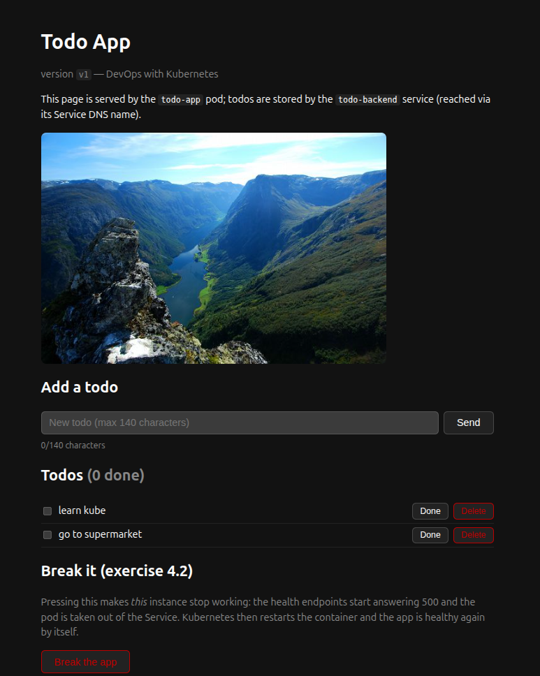

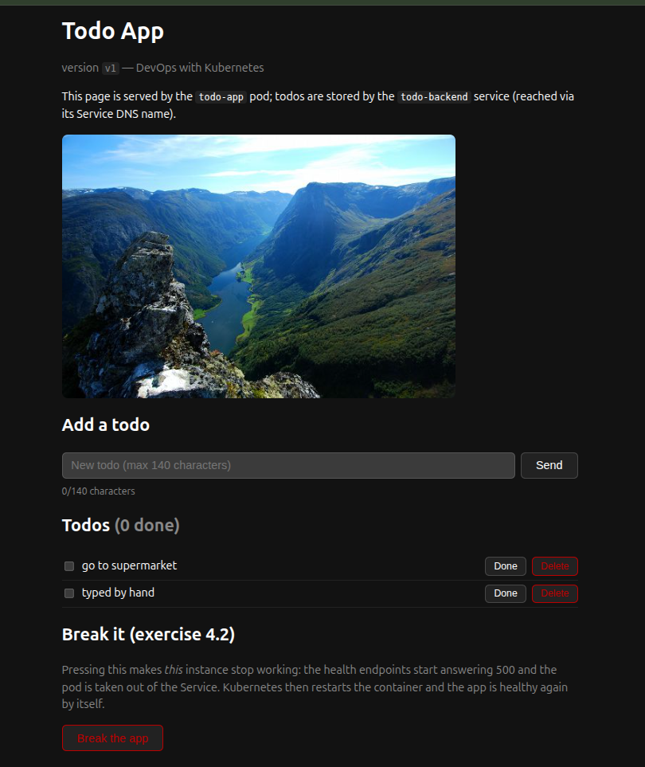

The same from inside the cluster, if you prefer no browser:

```bash
kubectl run curlbox --rm -it --restart=Never -n project --image=curlimages/curl:8.11.1 -- sh
# inside:
curl -s http://todo-backend-svc:2345/todos                     # the list, as JSON
curl -s -X POST -H 'content-type: application/json' \
     -d '{"title":"typed by hand"}' http://todo-backend-svc:2345/todos
curl -s -X PUT -H 'content-type: application/json' \
     -d '{"done":true}' http://todo-backend-svc:2345/todos/1    # the exercise's PUT
curl -s -o /dev/null -w '%{http_code}\n' -X DELETE http://todo-backend-svc:2345/todos/1
curl -s -o /tmp/i -w 'image: %{http_code} %{content_type} %{size_download} bytes\n' \
     http://todo-app-svc:3000/image
```

```text
image: 200 image/jpeg 44891 bytes
```

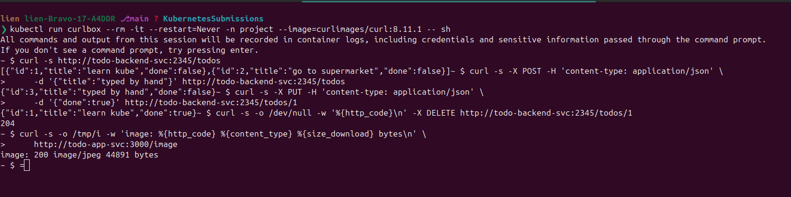

That last line answers "is the picture actually there": `200`, `image/jpeg`,
44 891 bytes, and the magic bytes `ff d8 ff` confirm a JPEG, not an error page with a
picture's name on it.

---

## Step 4 — Recreate, and the update strategy this app is not allowed to use

The frontend already runs `strategy: Recreate`, and not as a style choice. Its
`image-claim` volume is **ReadWriteOnce**, so two pods on two nodes cannot share one
RWO volume, and a rolling update does the opposite of Recreate: it starts the new pod
*before* stopping the old one.

Do the experiment, and mind the order: the loop must run **while** the pod is
replaced. Run the hammer detached, trigger the update from your shell, then read the
result.

```bash
# 1) start the hammer: 60 seconds of requests, in a pod that is left behind
kubectl run hammer --restart=Never -n project --image=curlimages/curl:8.11.1 --command -- sh -c '
ok=0; bad=0; end=$(( $(date +%s) + 60 ))
while [ "$(date +%s)" -lt "$end" ]; do
  if curl -s -m 2 -o /dev/null http://todo-app-svc:3000/healthz; then ok=$((ok+1)); else bad=$((bad+1)); fi
  sleep 0.2
done
echo "ok=$ok failed=$bad"'

# 2) *now* trigger an update — any change to the pod template does it
kubectl set env deploy/todo-app -n project VERSION=v4

# 3) watch the pod leave and come back
kubectl get pods -n project -l app=todo-app -w

# 4) after a minute, read what the loop saw
kubectl logs hammer -n project
kubectl delete pod hammer -n project
```

(If the pod is still around from an earlier try, `kubectl delete pod hammer -n project`
first, otherwise `kubectl run` answers `AlreadyExists`.)

**Recreate** gives what the course text promises: a moment of downtime. These
screenshots come from a run with one replica, the loop hitting the app about four
times a second:

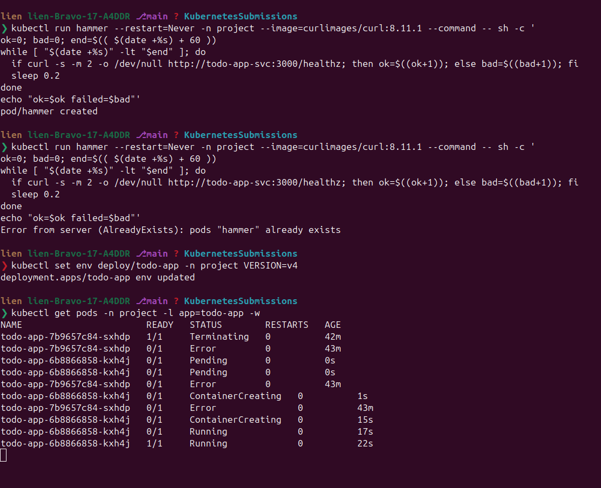

```text
ok=211 failed=16
```

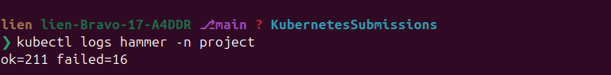

16 requests hit a closed door while the old pod was gone and the new one was not
ready: a couple of seconds of "the app is not there", the price of never running two
versions at once. Your count depends on how fast the new pod becomes Ready, but never
zero: a `failed=0` almost always means the update had finished before step 1, and the
loop only saw a healthy app.

**Now try the update the app must not use.** Point the Deployment at a rolling
update and push a new version:

```bash
kubectl patch deploy todo-app -n project --type=merge \
  -p '{"spec":{"strategy":{"type":"RollingUpdate"}}}'
kubectl set env deploy/todo-app -n project VERSION=v3
kubectl get pods -n project -w
```

The old pod stays `Running`, the new one never becomes Ready:

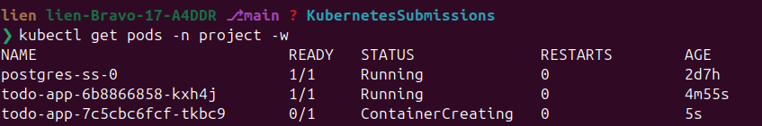

```text
NAME                          READY   STATUS              RESTARTS   AGE
todo-app-6b88866858-kxh4j     1/1     Running             0          4m55s
todo-app-7c5cbc6fcf-tkbc9     0/1     ContainerCreating   0          5s
```

```bash
kubectl describe pod -n project -l app=todo-app | tail -5
```

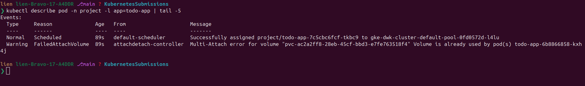

```text
Warning  FailedAttachVolume  Multi-Attach error for volume
  "pvc-ac2a2ff8-28eb-45cf-bbd3-e7fe763518f4"
  Volume is already used by pod(s) todo-app-6b88866858-kxh
```

The new pod was scheduled on the other node, asked for the volume, and was refused
it. With `maxUnavailable: 0` the old pod may not leave first, so the update waits
forever and nothing is deployed.

Put it back, and mind the API's own trap: switching the `type` back is not enough,
because Kubernetes **filled in** a `rollingUpdate` block when you chose RollingUpdate,
and a `type: Recreate` Deployment may not carry one. Clear it in the same patch:

```bash
kubectl patch deploy todo-app -n project --type=merge \
  -p '{"spec":{"strategy":{"type":"Recreate","rollingUpdate":null}}}'
kubectl rollout status deploy/todo-app -n project
kubectl get deploy todo-app -n project -o jsonpath='{.spec.strategy}{"\n"}'
```

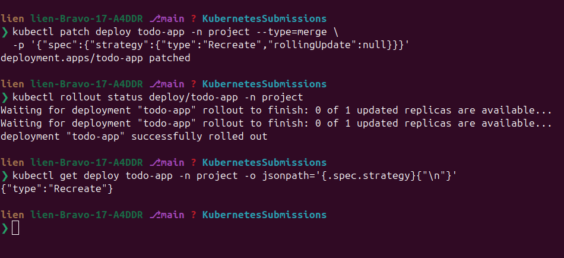

A patch that only says `{"type":"Recreate"}` is rejected with

```text
The Deployment "todo-app" is invalid: spec.strategy.rollingUpdate: Forbidden:
may not be specified when strategy `type` is 'Recreate'
```

The API protects you from a half-set strategy: the type says Recreate while the
leftover block still says how to roll. Replacing the whole object does the same: `--type=json -p '[{"op":"replace","path":"/spec/strategy","value":{"type":"Recreate"}}]'`.

The lesson of the Kubernetes page: **RollingUpdate needs room for two pods — two
sets of resources, here two mounts of one volume. When an app cannot give that,
Recreate is the honest choice, and the downtime is the price of correctness.**

---

## Step 5 — BlueGreen with Argo Rollouts

The backend has no volume, so it *can* run two versions at once, which is what
BlueGreen is for. Two services, both pointing at the same pods by label; Argo
Rollouts rewrites the selectors for you:

- `todo-backend-svc`: the **active** service, the one the todo app talks to;
- `todo-backend-preview`: the **preview** service, the one only you (or your QA team)
  look at.

`part4/4.5/manifests/service-todo-backend-preview.yaml`

```yaml
apiVersion: v1
kind: Service
metadata:
  name: todo-backend-preview
  namespace: project
spec:
  selector:
    app: todo-backend
  ports:
    - name: http
      port: 2345
      targetPort: 3000
```

`part4/4.5/manifests/rollout-todo-backend.yaml`

```yaml
apiVersion: argoproj.io/v1alpha1
kind: Rollout
metadata:
  name: todo-backend
  namespace: project
spec:
  replicas: 2
  selector:
    matchLabels:
      app: todo-backend
  template:
    metadata:
      labels:
        app: todo-backend
    spec:
      containers:
        - name: todo-backend
          image: europe-north1-docker.pkg.dev/dwk-gke-506208/my-repository/todo-backend:4.5
          imagePullPolicy: Always
          ports:
            - containerPort: 3000
          readinessProbe:
            initialDelaySeconds: 5
            periodSeconds: 5
            timeoutSeconds: 3
            failureThreshold: 3
            httpGet:
              path: /healthz
              port: 3000
          env:
            - name: PORT
              value: "3000"
            - name: VERSION
              value: "v1"
            - name: POSTGRES_USER
              valueFrom:
                configMapKeyRef:
                  name: postgres-config
                  key: POSTGRES_USER
            - name: POSTGRES_HOST
              valueFrom:
                configMapKeyRef:
                  name: postgres-config
                  key: POSTGRES_HOST
            - name: POSTGRES_PORT
              valueFrom:
                configMapKeyRef:
                  name: postgres-config
                  key: POSTGRES_PORT
            - name: POSTGRES_DB
              valueFrom:
                configMapKeyRef:
                  name: postgres-config
                  key: POSTGRES_DB
            - name: POSTGRES_PASSWORD
              valueFrom:
                secretKeyRef:
                  name: postgres-secret
                  key: POSTGRES_PASSWORD
          resources:
            requests:
              cpu: 50m
              memory: 64Mi
            limits:
              cpu: 200m
              memory: 256Mi
  strategy:
    blueGreen:
      activeService: todo-backend-svc
      previewService: todo-backend-preview
      # Nothing is promoted until a human (or a pipeline) says so.
      autoPromotionEnabled: false
```

A Deployment and a Rollout cannot manage the same pods, so the Deployment goes and
the Rollout takes over:

```bash
kubectl delete deploy todo-backend -n project
kubectl apply -f part4/4.5/manifests/service-todo-backend-preview.yaml
kubectl apply -f part4/4.5/manifests/rollout-todo-backend.yaml
kubectl argo rollouts get rollout todo-backend -n project --watch
```

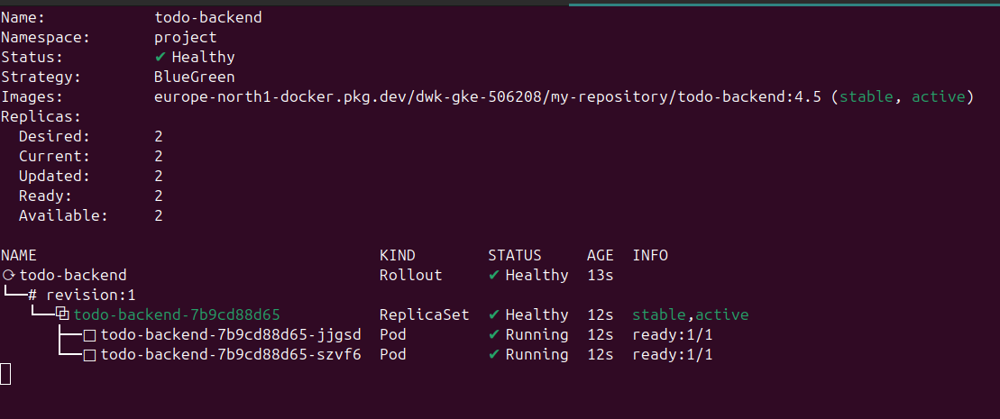

Now ship a new version: change `VERSION: "v1"` to `"v2"` in the Rollout's manifest
and apply again; the pod template changed, so a new ReplicaSet appears:

```bash
kubectl apply -f part4/4.5/manifests/rollout-todo-backend.yaml
kubectl get rs -n project
```

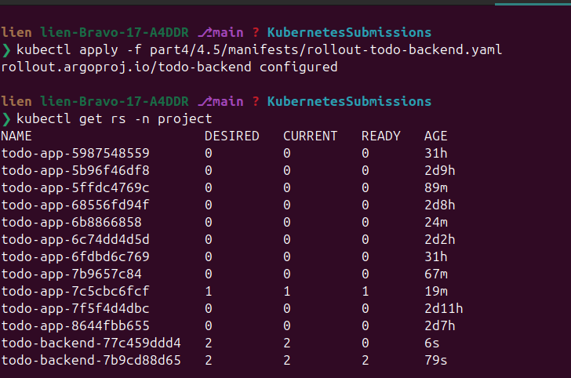

Four pods are running, the old version never went away, and **the users have not
seen v2 at all**. Ask both services the same:

```bash
kubectl run curlbox --restart=Never -n project --image=curlimages/curl:8.11.1 --command -- sh -c '
echo "active  (users) -> $(curl -s http://todo-backend-svc:2345/version)"
echo "preview (QA)    -> $(curl -s http://todo-backend-preview:2345/version)"'

sleep 5
kubectl logs curlbox -n project
kubectl delete pod curlbox -n project
```

(Left detached: `kubectl run -it … -- sh -c '…'` attaches to a container that has
already exited, answering with a `couldn't attach to pod` warning instead of your
output.)

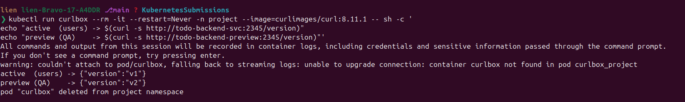

```text
active  (users) -> {"version":"v1"}
preview (QA)    -> {"version":"v2"}
```

The Rollout sits in `Paused`: `autoPromotionEnabled: false` means Argo waits for a
decision instead of switching traffic itself. That is the "after your QA team has
approved the new version" moment from the course text. Approve it:

```bash
kubectl argo rollouts promote todo-backend -n project
kubectl argo rollouts get rollout todo-backend -n project
```

Ask again:

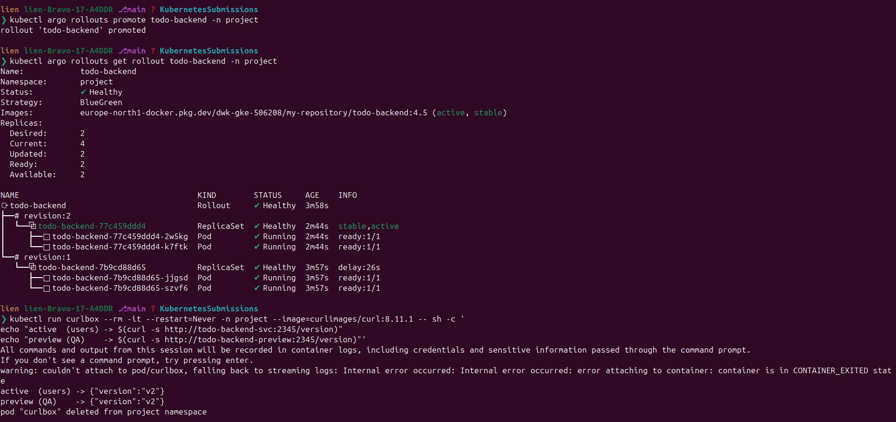

```text
active  (users) -> {"version":"v2"}
preview (QA)    -> {"version":"v2"}
```

The switch took one command and was all-or-nothing; had the preview been broken,
`kubectl argo rollouts abort todo-backend` would have rolled it back.

---

## Step 6 — put the project back

The pipeline owns `todo-backend`, and it does not deploy a Rollout:

```bash
kubectl delete rollout todo-backend -n project
kubectl delete svc todo-backend-preview -n project
kubectl apply -f part4/4.5/manifests/deployment-todo-backend.yaml
kubectl rollout status deploy/todo-backend -n project
```

`todo-app` stays as left by this lab (new image, `Recreate`, the new ConfigMap)
until the next push to `main` redeploys the project.

---

## P.S. — Recreate and BlueGreen, in four lines

- **A strategy is a promise about downtime.** RollingUpdate promises none and needs
  room for two pods; Recreate promises "never two versions at once" and pays with a
  gap. Neither is better; the app decides.
- **Recreate's price is countable.** 16 of 227 requests got nothing while the pod was
  swapped: a couple of seconds of "the app is not there", bought so that two versions
  never run side by side.
- **A ReadWriteOnce volume decides the strategy for you.** Two pods, two nodes, one
  volume: the second pod is refused (`Multi-Attach error`) and the update waits
  forever, which is why this app says Recreate.
- **BlueGreen spends resources to take the risk out of the switch.** Both versions
  run, users stay on the old one, the preview is yours to test, and one `promote`
  moves everybody while an `abort` moves nobody. A canary instead spends availability
  to buy evidence.
