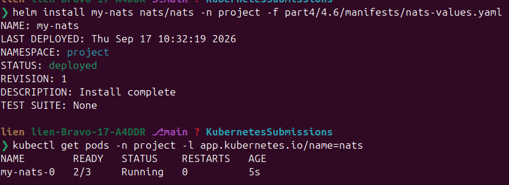
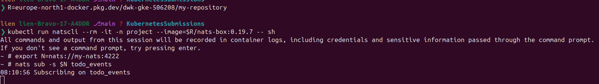
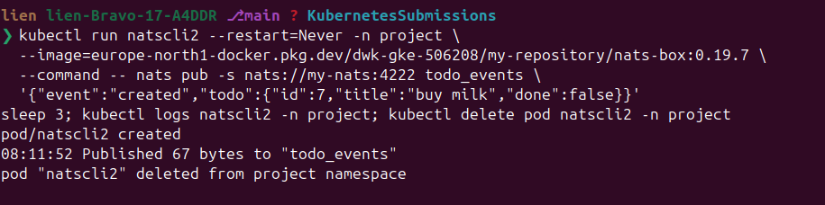
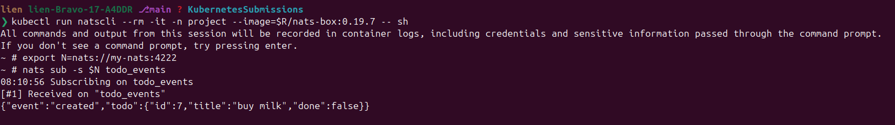
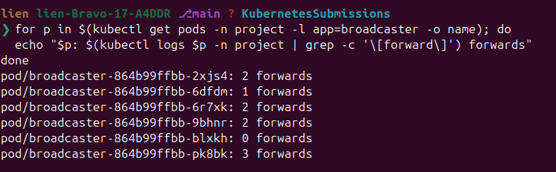
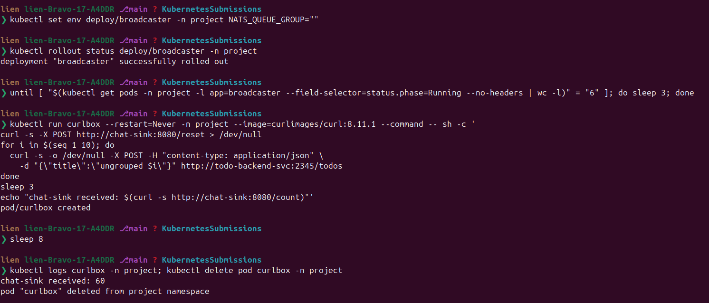
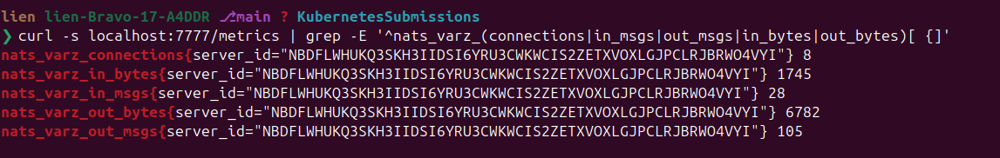
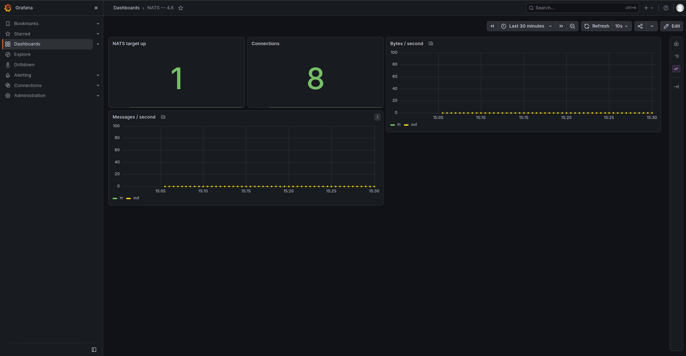

# Exercise 4.6 — The project, step 23: a broadcaster, and a queue group

> Course text (chapter 5, *Messagin systems*):
> *"Create a new separate service for sending status messages of the todos to some
> chat service. Let's call the new service 'broadcaster'.*
>
> *Requirements: the backend should send a message to NATS on saving or updating
> todos; the broadcaster should subscribe to NATS messages; the broadcaster should
> send the message forward to an external service in a format they support.*
>
> *[…] you can choose either Discord, Telegram, Slack, or if you don't want to use
> them, use 'Generic' where a URL is set as an Environment variable and the payload
> is e.g. `{"user": "bot", "message": "A todo was created"}`.*
>
> *The broadcaster should be able to be scaled without sending the message multiple
> times. Test that it can run with 6 replicas without issues. […] a randomly missing
> message is not an issue but a duplicate is."*

What this lab does:

1. **the concept**: a message queue in one page: subjects, publish-subscribe, queues,
   and what "at most once" means;
2. **NATS**: the messaging system the chapter uses, installed from its Helm chart with
   the four images mirrored;
3. **the publisher**: todo-backend announces every saved or updated todo on `todo_events`;
4. **the broadcaster**: a new service subscribing inside a **queue group** and
   forwarding each event to a chat webhook;
5. **the proof**: six replicas forwarding every message once, and the same six without the group forwarding it six times;
6. **the monitoring**: the NATS Prometheus exporter, a scrape job, and the four queries the dashboard is built from;
7. **optional: Discord**: the cluster cannot reach a chat service (measured), so the step runs one broadcaster *outside* it, with the Discord payload shape, into a real webhook.

---

## Step 0 — what you need in front of you

The project running (the pipeline put it there), Helm, a NATS chart:

```bash
kubectl get pods -n project
helm version
helm repo add nats https://nats-io.github.io/k8s/helm/charts/
helm repo update nats
kubectl config set-context --current --namespace=project
```

---

## Step 1 — the concept, in one page

Two HTTP services have to know where each other live. A message queue removes that:
one publishes, the other subscribes, neither knows who listens.

Messages are addressed by **subject**, with two ways to subscribe:

- **publish-subscribe**: every subscriber gets a copy. Six broadcasters on
  `todo_events` would each forward the same todo, six duplicates, which the exercise
  forbids;
- **queue group**: subscribers share a group name, and each message reaches exactly
  **one** member. Six replicas in the group `broadcasters`: every todo announced
  once, by whichever replica is free. Add replicas freely; the count does not move.

The two delivery promises the chapter names:

- **Core NATS is *at most once***: nobody listening, or a subscriber dying mid-work,
  and the message is gone, with no persistence or retry. Hence the exercise's
  tolerance for a missing message;
- **JetStream** gives *at least once* or *exactly once*, with streams and consumers.
  Out of scope; it is the answer when losing a message is unacceptable.

The chapter's example splits a heavy job across a Fetcher, many Mappers and many
Savers, sharing the load through queue-mode subjects, and keeps the Fetcher single:
it holds the record of what is done. This lab is the small version: one publisher, a
group, one sink.

---

## Step 2 — NATS, and the images its chart wants

This cluster cannot reach most of the internet, so mirror first:

```bash
R=europe-north1-docker.pkg.dev/dwk-gke-506208/my-repository

docker pull nats:2.14.6-alpine
docker tag  nats:2.14.6-alpine $R/nats-server:2.14.6-alpine
docker push $R/nats-server:2.14.6-alpine

docker pull natsio/nats-server-config-reloader:0.23.0
docker tag  natsio/nats-server-config-reloader:0.23.0 $R/nats-reloader:0.23.0
docker push $R/nats-reloader:0.23.0

docker pull natsio/prometheus-nats-exporter:0.20.1
docker tag  natsio/prometheus-nats-exporter:0.20.1 $R/nats-exporter:0.20.1
docker push $R/nats-exporter:0.20.1

docker pull natsio/nats-box:0.19.7
docker tag  natsio/nats-box:0.19.7 $R/nats-box:0.19.7
docker push $R/nats-box:0.19.7
```

Four images: three for the chart (the server, the config reloader, the exporter),
plus `nats-box` for the manual CLI in Step 3; the chart's own nats-box Deployment
stays off.

`part4/4.6/manifests/nats-values.yaml`: the chart with our images and the Prometheus
exporter switched on. Mind the key names: the server image lives under
`container.image`, the reloader under `reloader.image`, the exporter under
`promExporter.image`:

```yaml
container:
  image:
    repository: europe-north1-docker.pkg.dev/dwk-gke-506208/my-repository/nats-server
    tag: 2.14.6-alpine

reloader:
  image:
    repository: europe-north1-docker.pkg.dev/dwk-gke-506208/my-repository/nats-reloader
    tag: 0.23.0

natsBox:
  enabled: false

promExporter:
  enabled: true
  port: 7777
  image:
    repository: europe-north1-docker.pkg.dev/dwk-gke-506208/my-repository/nats-exporter
    tag: 0.20.1
```

```bash
helm install my-nats nats/nats -n project -f part4/4.6/manifests/nats-values.yaml
kubectl get pods -n project -l app.kubernetes.io/name=nats
```



Three containers in one pod: the NATS server, its config reloader and the Prometheus
exporter. The chart also creates the headless service `my-nats`, the address the
applications use.

---

## Step 3 — the publisher, and three experiments with the CLI

The backend publishes one small JSON event per change:

```text
{"event":"created","todo":{"id":7,"title":"buy milk","done":false}}
{"event":"done","todo":{"id":7,"title":"buy milk","done":true}}
{"event":"deleted","todo":{"id":7,"title":"buy milk","done":true}}
```

Before deploying it, watch a subject by hand: one throwaway pod, three experiments,
and the idea becomes visible.

```bash
R=europe-north1-docker.pkg.dev/dwk-gke-506208/my-repository
kubectl run natscli --rm -it -n project --image=$R/nats-box:0.19.7 -- sh
export N=nats://my-nats:4222
```

### Experiment 1 — publish, and watch it arrive

In the pod, subscribe. It stays attached and prints what arrives; Ctrl-C leaves it:

```bash
nats sub -s $N todo_events
```

In a second terminal, publish one event as the backend sends it:

```bash
kubectl run natscli2 --restart=Never -n project \
  --image=europe-north1-docker.pkg.dev/dwk-gke-506208/my-repository/nats-box:0.19.7 \
  --command -- nats pub -s nats://my-nats:4222 todo_events \
  '{"event":"created","todo":{"id":7,"title":"buy milk","done":false}}'
sleep 3; kubectl logs natscli2 -n project; kubectl delete pod natscli2 -n project
```







### Experiment 2 — two subscribers in one group, one outside it

```bash
kubectl run natscheck --restart=Never -n project --image=europe-north1-docker.pkg.dev/dwk-gke-506208/my-repository/nats-box:0.19.7 --command -- sh -c 'N=nats://my-nats:4222; nats sub -s $N --queue broadcasters todo_events > /tmp/a.log 2>&1 & nats sub -s $N --queue broadcasters todo_events > /tmp/b.log 2>&1 & nats sub -s $N todo_events > /tmp/c.log 2>&1 & sleep 2; nats pub -s $N todo_events one; nats pub -s $N todo_events two; nats pub -s $N todo_events three; sleep 2; echo "in the group: $(( $(grep -c "Received on" /tmp/a.log) + $(grep -c "Received on" /tmp/b.log) ))  outside it: $(grep -c "Received on" /tmp/c.log)"'
sleep 15; kubectl logs natscheck -n project; kubectl delete pod natscheck -n project
```


If your prompt turns into `>` after pasting, you are inside an unclosed quote: Ctrl-C
and paste again.

Three messages. The group received three: its two members split them, one
took two, the other one. The subscriber outside the group received all three.
Same subject, two different answers: that is the queue group, and Step 6
measures it on the real Deployment.

### Experiment 3 — a message nobody is listening for is gone

```bash
nats pub -s $N todo_events 'this one is lost'
nats sub -s $N todo_events      # starts listening after the fact: nothing arrives
```


No persistence and no retry: that is *at most once*, and why the exercise only
forbids duplicates.

Back to the publisher:


---

## Step 4 — the broadcaster: subscribe in a queue group, forward to a webhook

A new service, one job: take the event off NATS, turn it into a sentence, POST it to
the chat service. `part4/4.6/broadcaster/` is it.

The interesting line is the subscription:

```rust
// Six replicas in the same group: each message goes to exactly ONE of them.
let mut subscription = nats.queue_subscribe(subject, queue_group).await?;
```

Everything else follows from it:

- **the payload**: `{"user": "bot", "message": "…"}`, the exercise's "Generic" option.
  `CHAT_FORMAT` swaps in the shape each service wants: `{"content": "…"}` for Discord,
  `{"text": "…"}` for Slack. Telegram is left out: a bot token, a chat id
  and a `sendMessage` call is a different integration, not a different payload;
- **it formats, it does not decide.** The backend says what happened; the broadcaster
  says how a chat service hears it, so changing wording never touches the API;
- **a failed forward is logged, never retried.** Core NATS is at-most-once: when the
  POST fails, the message is gone, which is why the exercise forgives a missing
  message and forbids a duplicate.

### Seeing the three shapes

The sink keeps the exact body sent. A local run of the three:

```text
CHAT_FORMAT=generic ->  {"message": "A todo was created: #42 check the payload", "user": "todo-bot"}
CHAT_FORMAT=discord ->  {"content": "A todo was created: #42 check the payload"}
CHAT_FORMAT=slack   ->  {"text":    "A todo was created: #42 check the payload"}
```

In the cluster the same switch is a single `kubectl set env` on the broadcaster
Deployment; Step 5 shows the command, with the receipt from the sink.

### The chat service (this lab's stand-in)

Discord, Telegram and Slack all need internet access this cluster lacks, so the lab
uses the exercise's third option (**Generic**): `part4/4.6/chat-sink/`, a tiny service
that keeps every payload it receives:

- `POST /`: the webhook the broadcaster calls;
- `GET /messages`: everything received, in order;
- `GET /count`: just the number;
- `POST /reset`: forget everything, for the next experiment.

That counter makes *"no duplicates"* measurable.

---

## Step 5 — build, push, deploy

build and push all three dockerfiles:

```bash
R=europe-north1-docker.pkg.dev/dwk-gke-506208/my-repository
for app in todo-backend broadcaster chat-sink; do
  docker build -t $R/$app:4.6 part4/4.6/$app
  docker push $R/$app:4.6
done
```

```bash
kubectl apply -f part4/4.6/manifests/deployment-todo-backend.yaml
kubectl apply -f part4/4.6/manifests/service-chat-sink.yaml
kubectl apply -f part4/4.6/manifests/deployment-chat-sink.yaml
kubectl apply -f part4/4.6/manifests/deployment-broadcaster.yaml
kubectl rollout status deploy/todo-backend -n project
kubectl rollout status deploy/chat-sink -n project
kubectl rollout status deploy/broadcaster -n project
```

Create a todo and watch the chain in three logs:

```bash
kubectl run curlbox --restart=Never -n project --image=curlimages/curl:8.11.1 --command -- \
  sh -c 'curl -s -X POST -H "content-type: application/json" -d "{\"title\":\"say hi in chat\"}" http://todo-backend-svc:2345/todos'
sleep 5
kubectl logs curlbox -n project; kubectl delete pod curlbox -n project

kubectl logs deploy/todo-backend -n project | grep nats
kubectl logs deploy/broadcaster -n project | grep forward | tail -3
kubectl logs deploy/chat-sink -n project | grep chat | tail -3
```

![the whole chain on one screen: curlbox returns `{"id":4,"title":"say hi in chat","done":false}`, the backend logs `publishing todo events to todo_events on nats://my-nats:4222`, the broadcaster `listening on todo_events (queue group broadcasters), forwarding to http://chat-sink:8080`, and the sink `[chat] #1 bot: A todo was created: #4 say hi in chat`](./assets/image7.png)

The backend announced it, one broadcaster picked it up, the sink received it; no
service learned another's name.

**Now take NATS away from the backend**, the other half of Step 3's second decision:

```bash
kubectl set env deploy/todo-backend -n project NATS_URL=""

# create another todo, keep the nats sub from Step 3 open (it stays silent),
# then check that the data is there all the same:
kubectl run peek --restart=Never -n project --image=curlimages/curl:8.11.1 --command -- \
  sh -c 'curl -s http://todo-backend-svc:2345/todos | tail -c 160'
sleep 5; kubectl logs peek -n project; kubectl delete pod peek -n project

kubectl set env deploy/todo-backend -n project NATS_URL=nats://my-nats:4222
```


The todo is in the response, no chat message was sent, and the request never failed,
which is what adding messaging to a running service means.

**And check the chat format the same way.** One env change, then a *fresh* todo: reset
the sink first and wait for a single generation of pods, since old messages and
replicas still speak the old shape.

```bash
kubectl set env deploy/broadcaster -n project CHAT_FORMAT=discord
kubectl rollout status deploy/broadcaster -n project

# wait until the old replicas are really gone (six pods, not twelve — about 30s here)
until [ "$(kubectl get pods -n project -l app=broadcaster --field-selector=status.phase=Running --no-headers | wc -l)" = "6" ]; do sleep 3; done

# forget what the sink already has, create one new todo, read what the chat service got
kubectl run shape --restart=Never -n project --image=curlimages/curl:8.11.1 --command -- sh -c \
  'curl -s -X POST http://chat-sink:8080/reset; curl -s -o /dev/null -X POST -H "content-type: application/json" -d "{\"title\":\"discord shape\"}" http://todo-backend-svc:2345/todos; sleep 3; curl -s http://chat-sink:8080/messages'
sleep 12; kubectl logs shape -n project; kubectl delete pod shape -n project

kubectl set env deploy/broadcaster -n project CHAT_FORMAT=generic
```

![`CHAT_FORMAT=discord`, the rollout, the wait for six pods, and the sink answering `{"received":0,"count":1,"messages":[{"content":"A todo was created: #5 discord shape"}]}`](./assets/image9.png)

`generic` sends `{"message": …, "user": "bot"}`, `discord` sends `{"content": …}` and
`slack` sends `{"text": …}`: the same sentence in three vocabularies, decided by one
environment variable at the edge of the system. (The id and title are yours, so they
will differ from the line above.)

---

## Step 6 — six replicas, and the duplicate that must not happen

**With the queue group** (what the Deployment above has). Reset the sink, create ten
todos:

```bash
kubectl run curlbox --restart=Never -n project --image=curlimages/curl:8.11.1 --command -- sh -c '
curl -s -X POST http://chat-sink:8080/reset > /dev/null
for i in $(seq 1 10); do
  curl -s -o /dev/null -X POST -H "content-type: application/json" \
    -d "{\"title\":\"queued $i\"}" http://todo-backend-svc:2345/todos
done
sleep 3
echo "chat-sink received: $(curl -s http://chat-sink:8080/count)"'
sleep 8
kubectl logs curlbox -n project; kubectl delete pod curlbox -n project
```


Ten todos, six replicas, ten messages: each event handled once, by one replica, and
any replica could have died mid-run without changing the number. See *which*
replica did it:

```bash
for p in $(kubectl get pods -n project -l app=broadcaster -o name); do
  echo "$p: $(kubectl logs $p -n project | grep -c '\[forward\]') forwards"
done
```



**Without the queue group.** Take the group away and push the same ten events, but let
the rollout settle first: the pods of the previous generation stay subscribers until
they terminate (seven Running instead of six is that, lasting about half a minute):

```bash
kubectl set env deploy/broadcaster -n project NATS_QUEUE_GROUP=""
kubectl rollout status deploy/broadcaster -n project

# wait until only six replicas are left before you measure anything
until [ "$(kubectl get pods -n project -l app=broadcaster --field-selector=status.phase=Running --no-headers | wc -l)" = "6" ]; do sleep 3; done

# the same ten todos and the same reading as above
kubectl run curlbox --restart=Never -n project --image=curlimages/curl:8.11.1 --command -- sh -c '
curl -s -X POST http://chat-sink:8080/reset > /dev/null
for i in $(seq 1 10); do
  curl -s -o /dev/null -X POST -H "content-type: application/json" \
    -d "{\"title\":\"ungrouped $i\"}" http://todo-backend-svc:2345/todos
done
sleep 3
echo "chat-sink received: $(curl -s http://chat-sink:8080/count)"'
sleep 8
kubectl logs curlbox -n project; kubectl delete pod curlbox -n project
```



Sixty: each of the six replicas received all ten events and forwarded all of them.
*That* is the duplicate the exercise forbids; the queue group is the one line that
prevents it.

Fire those ten todos *during* the rollout and the counter reads **70**: the six new
replicas plus the old generation, still subscribed until it terminates. However
many stale pods there are, they share one queue group and count as a single extra
subscriber, 10 × (6 + 1). One lab, two honest numbers, decided by how patient you are
with `kubectl rollout status`.

Put the group back:

```bash
kubectl set env deploy/broadcaster -n project NATS_QUEUE_GROUP=broadcasters
kubectl rollout status deploy/broadcaster -n project
```

**And the missing message.** While the broadcasters restart, publish again:
some are simply not received. Nothing retries them: core NATS is at-most-once
and the event is gone. Were that unacceptable, JetStream would enter here, with a
stream that keeps messages until a consumer acknowledges them.

---

## Step 7 — the metrics the chapter's dashboard uses

The NATS chart's exporter (already running beside the server, because
`promExporter.enabled: true`) serves NATS server statistics on `/metrics`, port
7777. Look at it:

```bash
kubectl port-forward pod/my-nats-0 -n project 7777:7777
# in a second terminal — the series that matter, not the first ones alphabetically:
curl -s localhost:7777/metrics | grep -E '^nats_varz_(connections|in_msgs|out_msgs|in_bytes|out_bytes)[ {]'
```



```text
nats_varz_connections{server_id="NDTVIU5C…"} 9
nats_varz_in_msgs{server_id="NDTVIU5C…"} 40
nats_varz_out_msgs{server_id="NDTVIU5C…"} 220
nats_varz_in_bytes{server_id="NDTVIU5C…"} 2815
nats_varz_out_bytes{server_id="NDTVIU5C…"} 15679
```

Those numbers are cumulative since the server started, and `out_msgs` runs ahead of
`in_msgs` because one event reaches several subscribers, which is
why the chapter's queries wrap them in `rate(...)`. The exporter also serves
`nats_connz_*` per-connection statistics and the Go runtime's metrics from the same
endpoint; `nats_varz_*` is the family the dashboard uses.

To get those numbers into Prometheus instead, add a scrape job and install the
monitoring stack, from this folder with its images in your own registry: this
cluster reaches neither `quay.io` nor `registry.k8s.io`. Everything below stands on
its own; nothing reads another lab's files.

### The nine images the chart needs

`quay.io`, `registry.k8s.io` and `ghcr.io` are unreachable from this cluster, so the
images go to Artifact Registry first. These tags belong to chart **91.2.3**:

```bash
R=europe-north1-docker.pkg.dev/dwk-gke-506208/my-repository
docker pull quay.io/prometheus/prometheus:v3.14.0-distroless        && docker push $R/prometheus:v3.14.0-distroless
docker pull quay.io/prometheus-operator/prometheus-operator:v0.94.0 && docker push $R/prometheus-operator:v0.94.0
docker pull quay.io/prometheus-operator/prometheus-config-reloader:v0.94.0 && docker push $R/prometheus-config-reloader:v0.94.0
docker pull quay.io/prometheus/alertmanager:v0.34.0                 && docker push $R/alertmanager:v0.34.0
docker pull quay.io/prometheus/node-exporter:v1.12.1-distroless     && docker push $R/node-exporter:v1.12.1-distroless
docker pull quay.io/kiwigrid/k8s-sidecar:2.11.2                     && docker push $R/k8s-sidecar:2.11.2
docker pull registry.k8s.io/kube-state-metrics/kube-state-metrics:v2.20.0 && docker push $R/kube-state-metrics:v2.20.0
docker pull ghcr.io/jkroepke/kube-webhook-certgen:1.8.8             && docker push $R/kube-webhook-certgen:1.8.8
docker pull docker.io/grafana/grafana:13.2.1-distroless             && docker push $R/grafana:13.2.1-distroless
```

A `docker push` can end with `unexpected EOF` **after** printing a digest: the push
succeeded, and the registry never complained about the upload.

### Install it, after checking what it will pull

```bash
helm repo add prometheus-community https://prometheus-community.github.io/helm-charts
helm repo update

# every image the chart will run must come from your registry — a line that does not
# start with europe-north1-docker.pkg.dev means a mirror you forgot
helm template prom prometheus-community/kube-prometheus-stack --version 91.2.3 \
  -n monitoring -f part4/4.6/manifests/prom-values.yaml | grep -E '^\s+image:' | sort -u

kubectl create namespace monitoring
helm upgrade --install prom prometheus-community/kube-prometheus-stack \
  --version 91.2.3 -n monitoring -f part4/4.6/manifests/prom-values.yaml

# the first start pulls about a gigabyte of images; a minute or two of ContainerCreating
kubectl -n monitoring get pods
# (a node-exporter pod stuck Pending just means that node is full — it is a DaemonSet,
# one pod per node. The NATS target is a pod, so the next steps are unaffected.)

# the chart names the two StatefulSets <component>-<release>-kube-prometheus-stack-<component>;
# kubectl -n monitoring get statefulset shows the real names if this one surprises you
kubectl rollout status statefulset/prometheus-prom-kube-prometheus-stack-prometheus -n monitoring

# and the receipt that the scrape job was carried into Prometheus' own configuration:
kubectl -n monitoring get secret prom-kube-prometheus-stack-prometheus-scrape-confg \
  -o jsonpath='{.data.additional-scrape-configs\.yaml}' | base64 -d

kubectl port-forward svc/prom-kube-prometheus-stack-prometheus -n monitoring 9090:9090
```

That Secret should print exactly the job from the values file:

```text
- job_name: nats
  static_configs:
  - targets:
    - my-nats-0.my-nats-headless.project.svc.cluster.local:7777
```

With chart **91.2.3** the Service is `prom-kube-prometheus-stack-prometheus` on
**9090** (older chapter texts say port 80). Open <http://localhost:9090>, click the
**Graph** tab, and paste each of the four queries below into the query box, pressing
**Execute** after each. These are the chapter's queries; the dashboard is these four,
one per panel:

1. `up{job="nats"}` should read `1`: the scrape config was picked up and the
   exporter answers;


2. `sum(nats_varz_connections)`: how many clients are connected right now, the
   backend, the six broadcasters, and every port-forward you leave open;


3. `rate(nats_varz_in_msgs[5m])` and `rate(nats_varz_out_msgs[5m])`: messages per
   second in and out. Create a few todos and both move, `out` staying ahead of `in`;

![`rate(nats_varz_out_msgs[5m])` with Prometheus' info notice about the missing `_total` suffix](./assets/image16.png)
![`rate(nats_varz_in_msgs[5m])` and the same notice — a naming hint, not a failure](./assets/image17.png)

4. `rate(nats_varz_in_bytes[5m])` and `rate(nats_varz_out_bytes[5m])`: the same in
   bytes. Read together with the message rates, they tell you whether the payloads are
   representative of real traffic.

![`rate(nats_varz_in_bytes[5m])`, legend pointing at the headless-service instance](./assets/image18.png)
![`rate(nats_varz_out_bytes[5m])` — flat while nothing is published](./assets/image19.png)


### The dashboard

```bash
kubectl apply -f part4/4.6/manifests/grafana-dashboard.yaml

# the Service listens on 80 and forwards to the container's 3000 — hence 3000:80
kubectl port-forward svc/prom-grafana -n monitoring 3000:80

# the admin password, from the Secret the chart created
kubectl -n monitoring get secret prom-grafana -o jsonpath='{.data.admin-password}' | base64 -d; echo

# and the receipt that the sidecar took the file (a few seconds after the apply):
kubectl -n monitoring logs deploy/prom-grafana -c grafana-sc-dashboard --tail=4
```

```text
{"msg":"Writing /tmp/dashboards/nats-4.6.json (ascii)"}
{"msg":"None sent to http://localhost:3000/api/admin/provisioning/dashboards/reload. Response: 200 OK {\"message\":\"Dashboards config reloaded\"}"}
```

Log in as `admin` and open **Dashboards → NATS — 4.6**. It appeared by itself: the chart
runs a sidecar that watches ConfigMaps labeled `grafana_dashboard: "1"` (the
`k8s-sidecar` image you mirrored) and wires up the Prometheus datasource, so a panel
carries only the query.

Create a few todos and the two throughput panels move.

> Throughput panels need traffic *and* range: `rate(...[5m])` wants two
> scrapes inside five minutes, so set **Last 15 minutes** and give it a scrape interval
> (~30s).



## Step 8 — cleanup

```bash
kubectl delete deploy broadcaster chat-sink -n project
kubectl delete svc chat-sink -n project
helm uninstall my-nats -n project
kubectl delete pvc -n project -l app.kubernetes.io/instance=my-nats   # the NATS jetstream volume, if it was created
```

The backend keeps its `NATS_URL`, so it logs a NATS warning and carries on serving,
the behaviour Step 3 chose. Remove the two variables, or revert to the 4.5 manifest,
to silence it.

---

## P.S. — what this exercise leaves you with

- **A queue decouples sender from receiver.** The backend does not know how many
  broadcasters exist, or whether any do.
- **A queue group is how you scale a consumer.** Same subject, same group, any number of
  replicas, one delivery per message. Remove the group and one event becomes one event
  *per replica*.
- **Core NATS is at most once.** No subscriber, or a subscriber dying mid-work, and the
  message is gone. Duplicates are what you design against, losses are what you trade
  away; JetStream buys them back. It is also why the exercise forgives a missing
  message and forbids a repeated one: noise versus spam.
- **Publish from the place that owns the fact.** The backend knows a todo changed; the
  broadcaster knows how a chat service likes its sentences. Keep those apart and
  neither is redeployed for the other.
