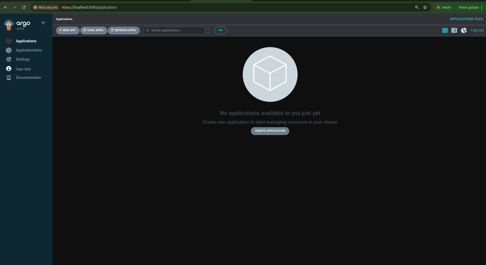
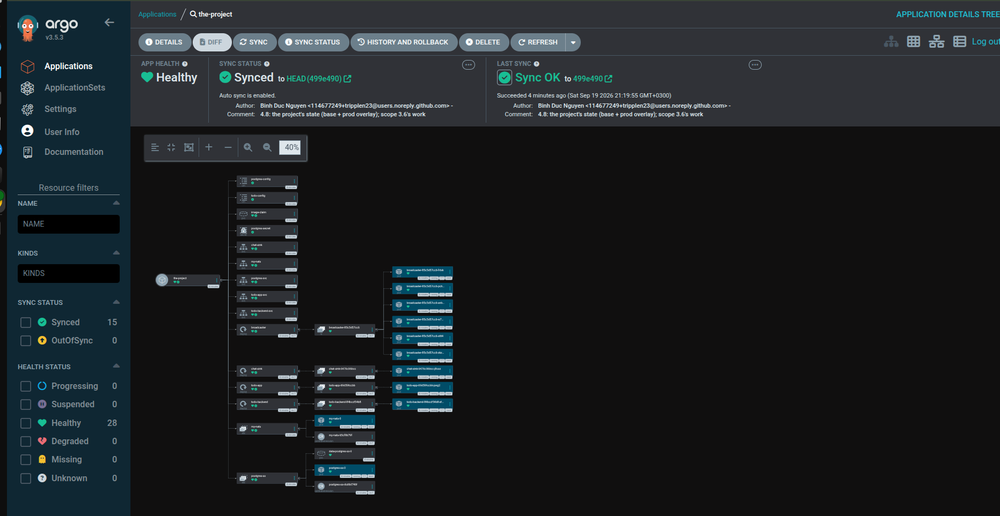
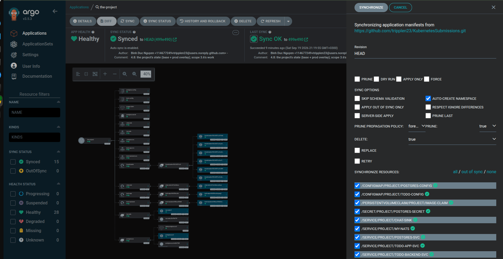
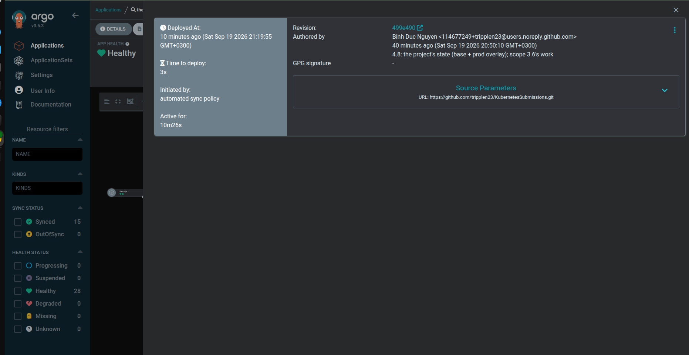
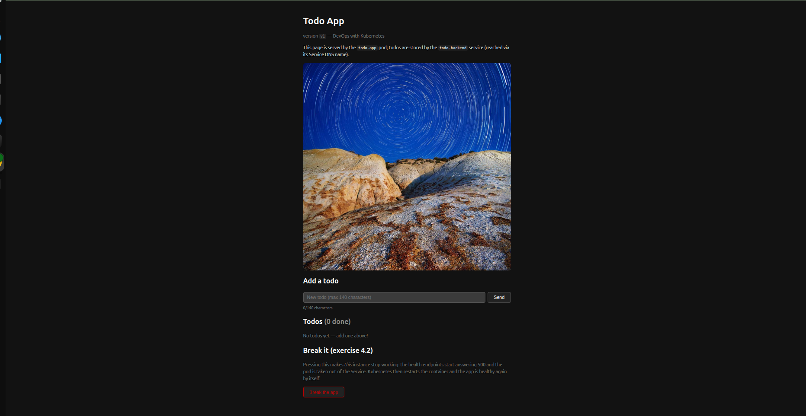
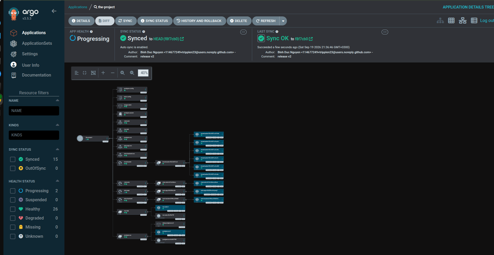

# Exercise 4.8 — The project, step 24: GitOps

> Course text (chapter 5, *GitOps*):
> *"Move the project to use GitOps so that when you commit to the repository, the
> application is automatically updated. In this exercise, it is enough that the main
> branch is deployed to cluster."*

---

## Step 0 — what you need in front of you

- the GKE cluster and `kubectl` pointing at it;
- `docker` — the four project images are yours, so you build and push them to Artifact Registry (3.6 on); the cluster pulls everything else — `quay.io`, `ghcr.io`, `public.ecr.aws`, Docker Hub — itself;
- `git`;
- **the `kustomize` CLI** — `kubectl kustomize` renders, but `kustomize edit` is what the release step needs:

```bash
curl -s "https://raw.githubusercontent.com/kubernetes-sigs/kustomize/master/hack/install_kustomize.sh" | bash
sudo mv kustomize /usr/local/bin/
kustomize version
```

- **egress** - ArgoCD clones over the
  network, and these nodes are private with **no route out**: measured from a pod,
  `github.com` resolves and then times out (`curl: (28) after 8001 ms`), and so do
  `gitlab.com`, `codeberg.org`, `bitbucket.org`, Docker Hub and `quay.io`. Only Google
  services answer, which is why image pulls from Artifact Registry work and nothing else
  does. A **Cloud NAT** is the compliant fix (egress without any external address on the
  nodes), and without it this lab cannot use GitHub at all:

```bash
gcloud compute routers create dwk-router \
  --network=default --region=europe-north1 --project=dwk-gke-506208
gcloud compute routers nats create dwk-nat \
  --router=dwk-router --region=europe-north1 --project=dwk-gke-506208 \
  --auto-allocate-nat-external-ips --nat-all-subnet-ip-ranges
```

- After that, this answers with a commit hash instead of an error — from **inside** the
  cluster, which is where ArgoCD stands:

```bash
kubectl -n default run gitcheck --rm -i --restart=Never --image=alpine/git:latest \
  --command -- git ls-remote https://github.com/tripplen23/KubernetesSubmissions.git HEAD
```

```text
f0f064769c03f17f1a472254f75d180298335f32	HEAD
```

  The NAT bills by the hour (a few cents a day while it exists, plus traffic). The rest of
  this course wants it; if you only wanted it for this lab,
  `gcloud compute routers nats delete dwk-nat --router=dwk-router --region=europe-north1 --project=dwk-gke-506208`
  and delete the router afterwards undoes it.

- and no `-n argocd` forgotten on the install: the manifest's objects carry no
  `namespace:` field, so whatever namespace the command line names is where ArgoCD lands
  (Step 4 explains the failure, which is silent).

**Room in the cluster.** Seven ArgoCD pods and the whole project on four `e2-small`
nodes is tight. Look before you install:

```bash
kubectl get nodes
kubectl describe node | grep -A6 "Allocated resources" | head -30
```

---

## Step 1 — why the cluster pulls instead of being pushed to

The pipeline from 3.6 *pushes*: GitHub Actions builds an image, then calls
`kubectl apply` on the cluster. That works because the pipeline holds cluster
credentials — which is exactly the problem. Anyone who can run the pipeline can change
the cluster, and a cluster that cannot be reached from outside cannot be deployed to at all.

GitOps reverses it:

```text
push   CI ──image──► registry ──kubectl apply──► cluster     the CI holds the credentials
pull   CI ──image──► registry                                nobody touches the cluster
              └──commit──►  git repository  ◄──reads── ArgoCD  (inside the cluster)
```

CI still builds and publishes the image; what changed is that CI writes *what should
run* into a repository, and a component inside the cluster reads that repository and
makes it true. The repository becomes the only source of truth, so:

- nobody needs cluster access except the cluster — the security argument;
- every change to the cluster is a commit: reviewable, revertible, attributable;
- the same repository pointed at another cluster is simply *that* state.

**One difference this cluster used to force.** ArgoCD clones over the network, and these nodes had no route out at all — no Cloud NAT, so every public git host timed out while Google's own services answered. 4.7 answered that by running a Gitea *inside* the cluster;
this lab repairs the cause instead (Step 0), and then uses the chapter's own shape: the repository is GitHub, ArgoCD reads it anonymously, and a commit is the only thing that changes the cluster. The mechanism is identical either way — a repository, a Kustomization, an `Application`, automated sync, selfHeal — which is the point: GitOps does not care where the repository is, only that the cluster can read it.

---

## Step 2 — the four apps, their images

Build and push all four:

```bash
R=europe-north1-docker.pkg.dev/dwk-gke-506208/my-repository
for app in todo-app todo-backend broadcaster chat-sink; do
  docker build -t $R/$app:4.8 part4/4.8/$app
  docker push $R/$app:4.8
done
```

A `docker push` can end with `unexpected EOF` **after** printing a digest — the upload succeeded.

Those four tags are what the repository will name. Nothing in this lab deploys them by hand: from Step 6 on, ArgoCD does.

---

## Step 3 — the repository: your own GitHub repository

The repository ArgoCD reads is the one this folder is committed to. Nothing is installed, and there is no second repository to keep in step: the project's configuration is simply a directory, `part4/4.8/config/`, and every push to `main` is what ArgoCD will see.

Two properties matter, and both are about ArgoCD rather than about you:

- **it has to be readable anonymously.** ArgoCD clones with no credentials unless you give it a repository Secret, so the repository must be public. A 404 for the API below means it is private, and that is the whole fix:

```bash
# the same request ArgoCD makes: no token, no login
curl -s -o /dev/null -w "%{http_code}\n" \
  https://api.github.com/repos/tripplen23/KubernetesSubmissions
```

```text
200
```

- **the cluster has to reach it.**

```bash
kubectl -n default run gitcheck --rm -i --restart=Never --image=alpine/git:latest \
  --command -- git ls-remote https://github.com/tripplen23/KubernetesSubmissions.git HEAD
```

```text
f0f064769c03f17f1a472254f75d180298335f32	HEAD
```

  Any commit hash is a pass — the point is that `github.com` answered from inside the cluster. Before the NAT this command times out instead, and that timeout is the only reason 4.7's repository lived in the cluster.

There is nothing to create here and nothing to push yet: the files you type in Step 5 are committed with the rest of the submission, and *that* commit is the release. One thing to know about sharing the repository with your own homework: ArgoCD watches `main`, so every
commit re-syncs the application, not only the ones that touch `config/`. It is harmless — the path it reads does not change — and it is exactly the property the exercise is about.

## Step 4 — ArgoCD

The install manifest comes from GitHub and is applied straight into `argocd`:

```bash
curl -sL https://raw.githubusercontent.com/argoproj/argo-cd/stable/manifests/install.yaml \
  -o /tmp/argocd-install.yaml

kubectl create namespace argocd
kubectl apply --server-side -n argocd -f /tmp/argocd-install.yaml
```

Download it into `/tmp`, never the repository: it is tens of thousands of lines of CRDs and the next `git add -A` would sweep it in (`.gitignore` refuses `install.yaml` too).

No image substitution is needed any more. The manifest names
`quay.io/argoproj/argocd:v3.5.3`, `ghcr.io/dexidp/dex:v2.45.1` and
`public.ecr.aws/docker/library/redis:8.2.3-alpine`, and the nodes pull all three
themselves — verified here, all of them reachable from a pod since Step 0's NAT. On a cluster without egress they have to be mirrored into your own registry first.

Seven pods start. Give them a couple of minutes — with egress in place an `ImagePullBackOff` here is only slowness, not a wrong registry.

The chapter reaches the UI through a `LoadBalancer`; these nodes have no external addresses, so port-forward and leave the Service as it is:

```bash
kubectl -n argocd get pods
kubectl -n argocd port-forward svc/argocd-server 8080:443

# the initial admin password, as the chapter says: base64 in a Secret
kubectl -n argocd get secret argocd-initial-admin-secret \
  -o jsonpath='{.data.password}' | base64 -d; echo
```


Open <https://localhost:8080>, accept the self-signed certificate, log in as `admin`.
The first screen is empty — there is nothing to sync yet.



---

## Step 5 — the project's state, as a repository

This is the state ArgoCD will keep: a Kustomize **base** with the whole project, and one **overlay** for the environment. Type these files inside `part4/4.8/config/`; they are what ArgoCD reads from your repository.

Two consequences of a single environment, before the files:

- there is exactly **one overlay**, `overlays/prod` — the exercise only asks for `main` to be deployed. 4.9 adds staging as a second overlay;
- the overlay carries **no `namePrefix`**. The project's services are named in each other's environment variables (`http://todo-backend-svc:2345`, `nats://my-nats:4222`, `http://chat-sink:8080`), so a prefix would rename the Services and break the project. The chapter's example app talks to nobody and can afford one.

### The base

`part4/4.8/config/base/kustomization.yaml`

```yaml
apiVersion: kustomize.config.k8s.io/v1beta1
kind: Kustomization
resources:
  - secret.yaml
  - configmap.yaml
  - configmap-todo.yaml
  - persistentvolumeclaim.yaml
  - postgres.yaml
  - nats.yaml
  - service.yaml
  - service-chat-sink.yaml
  - deployment-todo-app.yaml
  - deployment-todo-backend.yaml
  - deployment-broadcaster.yaml
  - deployment-chat-sink.yaml
```

The Postgres password, the same one the project has used since 3.5 (`example`, base64):

`part4/4.8/config/base/secret.yaml`

```yaml
apiVersion: v1
kind: Secret
metadata:
  name: postgres-secret
  namespace: project
type: Opaque
data:
  POSTGRES_PASSWORD: ZXhhbXBsZQ==
```

The connection details, as a ConfigMap — which is the point of the split: the password is
a Secret, everything else is not:

`part4/4.8/config/base/configmap.yaml`

```yaml
apiVersion: v1
kind: ConfigMap
metadata:
  name: postgres-config
  namespace: project
data:
  POSTGRES_USER: postgres
  POSTGRES_HOST: postgres-svc
  POSTGRES_PORT: "5432"
  POSTGRES_DB: postgres
```

The frontend's own configuration:

`part4/4.8/config/base/configmap-todo.yaml`

```yaml
apiVersion: v1
kind: ConfigMap
metadata:
  name: todo-config
  namespace: project
data:
  TODO_BACKEND_URL: http://todo-backend-svc:2345
  IMAGE_URL: https://picsum.photos/1200
  IMAGE_PATH: /usr/src/app/files/image.jpg
  MAX_AGE_SECS: "600"
```

Postgres itself — a StatefulSet behind a headless Service, with the data on a volume
claim template and `PGDATA` mounted at the *parent* directory, so `initdb` never sees the
filesystem's `lost+found`. The image is the mirrored one, named directly in the base
because the overlay has no business choosing a database version:

`part4/4.8/config/base/postgres.yaml`

```yaml
apiVersion: v1
kind: Service
metadata:
  name: postgres-svc
  namespace: project
  labels:
    app: postgres
spec:
  ports:
    - port: 5432
      name: web
  clusterIP: None
  selector:
    app: postgres
---
apiVersion: apps/v1
kind: StatefulSet
metadata:
  name: postgres-ss
  namespace: project
spec:
  serviceName: postgres-svc
  replicas: 1
  selector:
    matchLabels:
      app: postgres
  template:
    metadata:
      labels:
        app: postgres
    spec:
      containers:
        - name: postgres
          image: postgres:16
          ports:
            - name: web
              containerPort: 5432
          env:
            - name: POSTGRES_PASSWORD
              valueFrom:
                secretKeyRef:
                  name: postgres-secret
                  key: POSTGRES_PASSWORD
            # mount at the PARENT dir; data lives in a subdir so initdb
            # never sees the filesystem's lost+found
            - name: PGDATA
              value: /var/lib/postgresql/data
          volumeMounts:
            - name: data
              mountPath: /var/lib/postgresql
  volumeClaimTemplates:
    - metadata:
        name: data
      spec:
        accessModes: ["ReadWriteOnce"]
        storageClassName: standard
        resources:
          requests:
            storage: 100Mi
```

The image cache the frontend writes hourly photos into — **ReadWriteOnce**, which
decides the frontend's update strategy further down:

`part4/4.8/config/base/persistentvolumeclaim.yaml`

```yaml
apiVersion: v1
kind: PersistentVolumeClaim
metadata:
  name: image-claim
  namespace: project
spec:
  storageClassName: standard
  accessModes:
    - ReadWriteOnce
  resources:
    requests:
      storage: 1Gi
```

`part4/4.8/config/base/nats.yaml`

```yaml
apiVersion: v1
kind: Service
metadata:
  name: my-nats
  namespace: project
  labels:
    app: my-nats
spec:
  clusterIP: None
  selector:
    app: my-nats
  ports:
    - name: client
      port: 4222
      targetPort: 4222
---
apiVersion: apps/v1
kind: StatefulSet
metadata:
  name: my-nats
  namespace: project
  labels:
    app: my-nats
spec:
  serviceName: my-nats
  replicas: 1
  selector:
    matchLabels:
      app: my-nats
  template:
    metadata:
      labels:
        app: my-nats
    spec:
      containers:
        - name: nats
          image: nats:2.14.6-alpine
          imagePullPolicy: IfNotPresent
          ports:
            - name: client
              containerPort: 4222
          resources:
            requests:
              cpu: 20m
              memory: 32Mi
            limits:
              cpu: 100m
              memory: 128Mi
```

The two Services the applications talk to — `todo-app-svc` on 3000 and
`todo-backend-svc` on 2345, the port the course's own demo uses:

`part4/4.8/config/base/service.yaml`

```yaml
apiVersion: v1
kind: Service
metadata:
  name: todo-app-svc
  namespace: project
  labels:
    app: todo-app
spec:
  type: ClusterIP
  selector:
    app: todo-app
  ports:
    - name: http
      port: 3000
      targetPort: 3000
      protocol: TCP
---
apiVersion: v1
kind: Service
metadata:
  name: todo-backend-svc
  namespace: project
  labels:
    app: todo-backend
spec:
  type: ClusterIP
  selector:
    app: todo-backend
  ports:
    - name: http
      port: 2345
      targetPort: 3000
      protocol: TCP
```

and the chat sink's, on 8080:

`part4/4.8/config/base/service-chat-sink.yaml`

```yaml
apiVersion: v1
kind: Service
metadata:
  name: chat-sink
  namespace: project
spec:
  selector:
    app: chat-sink
  ports:
    - name: http
      port: 8080
      targetPort: 8080
```

### The four Deployments

Every project image here is a **placeholder**, `PROJECT/<NAME>`: the base describes the shape, the overlay owns the tag. `namespace: project` stays in the metadata of each object — the overlay sets the same namespace, so it is redundant and harmless, and leaving it in keeps the base readable on its own.

`part4/4.8/config/base/deployment-todo-app.yaml`

```yaml
apiVersion: apps/v1
kind: Deployment
metadata:
  name: todo-app
  namespace: project
  labels:
    app: todo-app
spec:
  strategy:
    type: Recreate
  replicas: 1
  selector:
    matchLabels:
      app: todo-app
  template:
    metadata:
      labels:
        app: todo-app
    spec:
      volumes:
        - name: image-storage
          persistentVolumeClaim:
            claimName: image-claim
      containers:
        - name: todo-app
          image: PROJECT/TODO-APP
          imagePullPolicy: Always
          ports:
            - containerPort: 3000
          readinessProbe:
            initialDelaySeconds: 5
            periodSeconds: 5
            timeoutSeconds: 3
            failureThreshold: 3
            httpGet:
              path: /healthz
              port: 3000
          livenessProbe:
            initialDelaySeconds: 15
            periodSeconds: 5
            timeoutSeconds: 3
            failureThreshold: 3
            httpGet:
              path: /livez
              port: 3000
          envFrom:
            - configMapRef:
                name: todo-config
          env:
            - name: PORT
              value: "3000"
          resources:
            requests:
              cpu: 50m
              memory: 64Mi
            limits:
              cpu: 200m
              memory: 256Mi
          volumeMounts:
            - name: image-storage
              mountPath: /usr/src/app/files
```

`imagePullPolicy: Always` is not decoration: `:4.8` is a tag you have pushed once
already, and a node holding an older image with that tag would keep serving it.

The API — Postgres from the ConfigMap and Secret, and NATS, which it degrades without gracefully:

`part4/4.8/config/base/deployment-todo-backend.yaml`

```yaml
apiVersion: apps/v1
kind: Deployment
metadata:
  name: todo-backend
  namespace: project
  labels:
    app: todo-backend
spec:
  replicas: 1
  selector:
    matchLabels:
      app: todo-backend
  template:
    metadata:
      labels:
        app: todo-backend
    spec:
      containers:
        - name: todo-backend
          image: PROJECT/TODO-BACKEND
          imagePullPolicy: Always
          ports:
            - containerPort: 3000
          readinessProbe:
            initialDelaySeconds: 5
            periodSeconds: 5
            timeoutSeconds: 3
            failureThreshold: 3
            httpGet:
              path: /healthz
              port: 3000
          # no livenessProbe: /healthz needs Postgres, and a database that is
          # restarting must not restart the backend
          env:
            - name: PORT
              value: "3000"
            - name: NATS_URL
              value: "nats://my-nats:4222"
            - name: NATS_SUBJECT
              value: "todo_events"
            - name: POSTGRES_USER
              valueFrom:
                configMapKeyRef:
                  name: postgres-config
                  key: POSTGRES_USER
            - name: POSTGRES_HOST
              valueFrom:
                configMapKeyRef:
                  name: postgres-config
                  key: POSTGRES_HOST
            - name: POSTGRES_PORT
              valueFrom:
                configMapKeyRef:
                  name: postgres-config
                  key: POSTGRES_PORT
            - name: POSTGRES_DB
              valueFrom:
                configMapKeyRef:
                  name: postgres-config
                  key: POSTGRES_DB
            - name: POSTGRES_PASSWORD
              valueFrom:
                secretKeyRef:
                  name: postgres-secret
                  key: POSTGRES_PASSWORD
          resources:
            requests:
              cpu: 50m
              memory: 64Mi
            limits:
              cpu: 200m
              memory: 256Mi
```

Six broadcasters sharing the queue group — one event, one forward, however many replicas the repository asks for:

`part4/4.8/config/base/deployment-broadcaster.yaml`

```yaml
apiVersion: apps/v1
kind: Deployment
metadata:
  name: broadcaster
  namespace: project
  labels:
    app: broadcaster
spec:
  replicas: 6
  selector:
    matchLabels:
      app: broadcaster
  template:
    metadata:
      labels:
        app: broadcaster
    spec:
      containers:
        - name: broadcaster
          image: PROJECT/BROADCASTER
          imagePullPolicy: Always
          env:
            - name: NATS_URL
              value: "nats://my-nats:4222"
            - name: NATS_SUBJECT
              value: "todo_events"
            - name: NATS_QUEUE_GROUP
              value: "broadcasters"
            - name: CHAT_URL
              value: "http://chat-sink:8080"
            - name: CHAT_FORMAT
              value: "generic"   # or "discord" ({"content"}) / "slack" ({"text"})
            - name: BOT_NAME
              value: "bot"
          resources:
            requests:
              cpu: 20m
              memory: 32Mi
            limits:
              cpu: 100m
              memory: 128Mi
```

and the sink that receives what the broadcaster forwards — the cluster's stand-in for Discord, Telegram or Slack, which it cannot reach:

`part4/4.8/config/base/deployment-chat-sink.yaml`

```yaml
apiVersion: apps/v1
kind: Deployment
metadata:
  name: chat-sink
  namespace: project
  labels:
    app: chat-sink
spec:
  replicas: 1
  selector:
    matchLabels:
      app: chat-sink
  template:
    metadata:
      labels:
        app: chat-sink
    spec:
      containers:
        - name: chat-sink
          image: PROJECT/CHAT-SINK
          imagePullPolicy: Always
          ports:
            - containerPort: 8080
          env:
            - name: PORT
              value: "8080"
          resources:
            requests:
              cpu: 20m
              memory: 32Mi
            limits:
              cpu: 100m
              memory: 128Mi
```

### The overlay

`part4/4.8/config/overlays/prod/kustomization.yaml`

```yaml
apiVersion: kustomize.config.k8s.io/v1beta1
kind: Kustomization
namespace: project
resources:
  - ../../base
patches:
  - path: deployment.yaml
images:
  - name: PROJECT/TODO-APP
    newName: europe-north1-docker.pkg.dev/dwk-gke-506208/my-repository/todo-app
    newTag: "4.8"
  - name: PROJECT/TODO-BACKEND
    newName: europe-north1-docker.pkg.dev/dwk-gke-506208/my-repository/todo-backend
    newTag: "4.8"
  - name: PROJECT/BROADCASTER
    newName: europe-north1-docker.pkg.dev/dwk-gke-506208/my-repository/broadcaster
    newTag: "4.8"
  - name: PROJECT/CHAT-SINK
    newName: europe-north1-docker.pkg.dev/dwk-gke-506208/my-repository/chat-sink
    newTag: "4.8"
```

The patch is what makes an environment an environment: the frontend's `VERSION` string is a difference between deployments of the same app, so it lives here and not in the base. The app defaults to `v1` when the variable is absent, which keeps the base runnable on
its own, and the page prints whatever the overlay decides — which is how Step 7 proves a commit reached the cluster.

`part4/4.8/config/overlays/prod/deployment.yaml`

```yaml
apiVersion: apps/v1
kind: Deployment
metadata:
  name: todo-app
  namespace: project
spec:
  template:
    spec:
      containers:
        - name: todo-app
          env:
            - name: VERSION
              value: "v1"
```

Render it before pushing — Kustomize is what decides what ArgoCD will see, and the image
lines are the ones the overlay just filled in:

```bash
cd part4/4.8/config
kustomize build overlays/prod | grep -E "^\s+image:" | sort -u
```

### Release, and the first push

The release step of this pipeline is one command per image, and it edits the file above — `kustomize edit set image` matches the **name**, i.e. the `PROJECT/…` placeholder, never the registry path it renders to:

```bash
# from part4/4.8/config
cd overlays/prod
kustomize edit set image PROJECT/TODO-APP=europe-north1-docker.pkg.dev/dwk-gke-506208/my-repository/todo-app:4.8
kustomize edit set image PROJECT/TODO-BACKEND=europe-north1-docker.pkg.dev/dwk-gke-506208/my-repository/todo-backend:4.8
kustomize edit set image PROJECT/BROADCASTER=europe-north1-docker.pkg.dev/dwk-gke-506208/my-repository/broadcaster:4.8
kustomize edit set image PROJECT/CHAT-SINK=europe-north1-docker.pkg.dev/dwk-gke-506208/my-repository/chat-sink:4.8
cd ..
```

Run here they rewrite the values the file already carries — which is exactly why they are safe to run from CI later: the same command, the same result. Passing the full registry path instead of `PROJECT/TODO-APP` appends a second entry and leaves the placeholder alone, so the change never lands.

**If `kustomize build` fails, read the file it names.** In a lab typed by hand the usual cause is a filename that does not match `resources:` in `base/kustomization.yaml`:
*`accumulating resources from 'persistentvolumeclaim.yaml' … no such file or directory`* is a typo in the file's name (`persistentvolumnclaim.yaml`), not a Kustomize problem. Compare the name in the error with the list in the kustomization before touching anything else.

From the repository root — the config is a directory in it, not a repository of its own, so there is no second remote and no nested `.git`:

```bash
git add part4/4.8/config
git commit -m "4.8: the project's state, base + prod overlay"
git push origin main
```

**One thing to fix in this repository before you go on.** Its *other* root workflow
(`main.yaml`, from 3.6) has no `paths:` filter: it runs on every push to every branch, and
its deploy step applies that lab's manifests into the **`project`** namespace — the same
namespace this lab is about to hand to ArgoCD, with the same object names (`todo-app`, `todo-backend`, `postgres-ss`). Left alone, that workflow and `selfHeal` overwrite each
other on every commit. Scope it to the directory it owns — `part3/3.6` in this submission,
the lab that workflow builds and deploys:

```yaml
on:
  push:
    branches: ['**']
    paths:
      - '<that workflow’s own lab folder>/**'
```

That push is the release: it is the state ArgoCD is about to be pointed at. Before you create the `Application`, check the URL where ArgoCD stands — inside the cluster, with the `repo-server` that will do the cloning:

```bash
kubectl -n argocd exec deploy/argocd-repo-server -- \
  git ls-remote https://github.com/tripplen23/KubernetesSubmissions.git
```

A list of refs — `…  HEAD`, `…  refs/heads/main` — is the pass. It is literally what ArgoCD does before it syncs anything, so it is the right place to prove the URL, and it fails the same way ArgoCD would if the repository were private or unreachable.

---

## Step 6 — the Application: once in the UI, then as a file

ArgoCD does nothing by itself. An `Application` says *which repository, which path, which cluster, which namespace* — and the UI is the fastest way to meet that object.

**Creating it by hand.** With the UI open from Step 4, press **+ NEW APP** and fill the panel in:

- **General** — Application Name `the-project`, Project `default`, **Sync Policy** **Automatic**: tick **ENABLE AUTO-SYNC**, then **PRUNE RESOURCES** and **SELF HEAL**. Those three ticks are the `automated:` block of the YAML further down;
- **Source** — Repository URL `https://github.com/tripplen23/KubernetesSubmissions.git`, Revision `HEAD`, Path `part4/4.8/config/overlays/prod`;
- **Destination** — Cluster URL `https://kubernetes.default.svc` (in-cluster), Namespace `project`. Under **SYNC OPTIONS** also tick **AUTO-CREATE NAMESPACE**: the `project` namespace does not exist in this lab until ArgoCD makes it, and the YAML says the same thing as `CreateNamespace=true`.


Press **CREATE**. The card appears as `OutOfSync` and turns `Synced`; `Progressing` becomes `Healthy`. Everything in the repository is now running, and you never touched `kubectl` — Postgres, NATS, the four apps, all of it.




**Reading it — the four places worth knowing.**

- **The two badges** at the top of the app card: *Sync Status* (`Synced` = the cluster matches the repository) and *Health* (`Healthy` = the workloads are actually up). The same two fields from the terminal:

```bash
kubectl -n argocd get application the-project
```

  If both are **blank**, nothing is reconciling: the `argocd-application-controller` pod is what fills them in, so `kubectl -n argocd get pods` comes before any doubt about the Application.

- **The resource tree** (the app's graph view): every object the Kustomization rendered — `StatefulSet → Pod` for Postgres and NATS, `Deployment → ReplicaSet → Pod` for the four apps, Services beside them — each node with its own status. A Deployment node shows the replicas that are ready, e.g. `6/6` for the broadcaster, with the pods underneath it. That is the answer to "how many pods are healthy": the count on the Deployment node is `readyReplicas`, and the two commands that read the same numbers are

```bash
kubectl -n project get deploy,rs,pods
kubectl -n project get deploy                      # READY is readyReplicas/desired
```

```text
NAME           READY
broadcaster    1/1
chat-sink      1/1
todo-app       1/1
todo-backend   1/1
```

The two StatefulSets report the same way (`statefulset.apps/my-nats 1/1`,
`statefulset.apps/postgres-ss 1/1`).

- **SYNC and REFRESH** (top of the app): *Refresh* re-reads the repository now instead of waiting for the next poll, *Sync* reconciles immediately, *Hard Refresh* also drops ArgoCD's cached manifests. None of them changes the repository — they only make ArgoCD notice it sooner.



- **HISTORY AND ROLLBACK** (in the app's panel): one entry per revision ArgoCD has deployed, and the details of each say who started it and how long it took — `automated sync policy` and three seconds in the screenshot below. A rollback re-deploys an older revision, which with `selfHeal` on lasts exactly until the next sync restores the repository's version; the durable rollback is a revert commit, which is the point of all this.



**The same object, from a file.** The UI just wrote an object into the cluster; in a
repository you write it yourself, which is what the chapter's exercises expect. Delete the UI-made app first so the two do not collide:

```bash
kubectl -n argocd delete application the-project
```

`part4/4.8/application.yaml`

```yaml
apiVersion: argoproj.io/v1alpha1
kind: Application
metadata:
  name: the-project
  namespace: argocd
spec:
  project: default
  source:
    repoURL: https://github.com/tripplen23/KubernetesSubmissions.git
    path: part4/4.8/config/overlays/prod
    targetRevision: HEAD
  destination:
    server: https://kubernetes.default.svc
    namespace: project
  syncPolicy:
    automated:
      prune: true
      selfHeal: true
    syncOptions:
      - CreateNamespace=true
```

```bash
kubectl apply -n argocd -f part4/4.8/application.yaml

# OutOfSync → Synced, Progressing → Healthy
kubectl -n argocd get application the-project -w
```

```text
NAME          SYNC STATUS   HEALTH STATUS
the-project   Synced        Healthy
```

Two fields are the whole GitOps contract:

- `automated.prune` — an object deleted from the repository is deleted from the cluster;
- `automated.selfHeal` — a change made *by hand* in the cluster is reverted to what the repository says.

Look at the app in the browser while you are here — it is a ClusterIP service, so a
port-forward is how you reach it (3001, because 8080 is the UI):

```bash
kubectl -n project port-forward svc/todo-app-svc 3001:3000
# Ctrl-C when done
```



The page is the project's todo list, rendered by the frontend from the API in Postgres over the Service name — four of the objects in `base/`, running because a file in a repository says so. The version string under the title is the overlay's, `v1`.

---

## Step 7 — the two proofs

**A commit is the only thing that changes the cluster.** Change the overlay's version
string — one file, one line, and it is the difference the overlay exists for:

`part4/4.8/config/overlays/prod/deployment.yaml`

```yaml
apiVersion: apps/v1
kind: Deployment
metadata:
  name: todo-app
  namespace: project
spec:
  template:
    spec:
      containers:
        - name: todo-app
          env:
            - name: VERSION
              value: "v2"
```

```bash
git add part4/4.8/config
git commit -m "release v2"
git push origin main
```

ArgoCD polls the repository — its default interval is 180 seconds, so this takes a
couple of minutes unless you press **Refresh** in the UI. Watch it happen: the card turns `OutOfSync`, the todo-app node spins a new ReplicaSet and pod, and it settles back to `Synced` / `Healthy`. From the terminal:



```bash
kubectl -n project rollout status deploy/todo-app
kubectl -n project get deploy todo-app -o jsonpath='{.status.readyReplicas}{"/"}{.status.replicas}{"\n"}'
```

The page proves it too — the version line under the title now says `v2`, and nobody
touched the cluster.

An image tag moves the same way, and ArgoCD cannot tell the two kinds of change apart:
build and push a different tag (`docker build -t $R/todo-app:4.9 part4/4.8/todo-app`),
then `kustomize edit set image PROJECT/TODO-APP=…/todo-app:4.9` from `overlays/prod`,
commit and push. The tag lives in the repository, so the tag is what the cluster runs.

---

## Step 8 — the pipeline that commits for you

The chapter's workflow builds the image, runs `kustomize edit set image`, and commits
that change back to the repository — which is what triggers ArgoCD. It is the same two
steps you ran by hand in Step 5 and Step 7, done by CI. Since CI already knows how to
publish to Artifact Registry (3.6), the only new pieces are the last two:

`part4/4.8/.github/workflows/release.yaml`

```yaml
name: Build, publish and release

on:
  push:
    branches: [main]
    paths:
      - 'part4/4.8/**'

permissions:
  contents: write          # the workflow commits kustomization.yaml back to the repo
  id-token: write          # Workload Identity Federation needs an OIDC token to mint
                           # the access token — without it the auth step fails with
                           # "did not inject $ACTIONS_ID_TOKEN_REQUEST_TOKEN"

jobs:
  build-publish-release:
    name: Build, Push, Release
    runs-on: ubuntu-latest

    steps:
      - name: Checkout
        uses: actions/checkout@v6

      - name: Authenticate to Google Cloud
        uses: google-github-actions/auth@v3
        with:
          workload_identity_provider: ${{ secrets.WORKLOAD_IDENTITY_PROVIDER }}
          service_account: ${{ secrets.SERVICE_ACCOUNT }}

      - name: Build and publish the four images
        run: |
          gcloud auth configure-docker europe-north1-docker.pkg.dev -q
          R=europe-north1-docker.pkg.dev/${{ secrets.GKE_PROJECT }}/my-repository
          for app in todo-app todo-backend broadcaster chat-sink; do
            docker build -t "$R/$app:$GITHUB_SHA" "part4/4.8/$app"
            docker push "$R/$app:$GITHUB_SHA"
          done

      - name: Set up Kustomize
        uses: imranismail/setup-kustomize@v3

      - name: Point the overlay at the new images
        run: |
          cd part4/4.8/config/overlays/prod
          R=europe-north1-docker.pkg.dev/${{ secrets.GKE_PROJECT }}/my-repository
          for app in todo-app todo-backend broadcaster chat-sink; do
            kustomize edit set image "PROJECT/$(echo $app | tr 'a-z' 'A-Z')=$R/$app:$GITHUB_SHA"
          done

      - name: Commit the release
        uses: EndBug/add-and-commit@v10
        with:
          add: part4/4.8/config/overlays/prod/kustomization.yaml
          message: "Release ${{ github.sha }}"
          # A run takes minutes, and this job commits back to the branch it read. If
          # anything was pushed while it was building, the checkout sits behind the
          # remote tip and the push is rejected (non-fast-forward) — the run fails
          # after the images are already built. Rebase onto the current main first,
          # stashing the kustomization edit made above.
          pull: '--rebase --autostash'
```

That placeholder/name translation is the one clumsy line in the whole flow (`todo-backend` → `PROJECT/TODO-BACKEND`, which is what `kustomize edit set image` matches on), and it is why the four commands are spelled out individually in Step 5.

> **Where the file has to live, and here it can actually run.** GitHub only runs
> workflows from `.github/workflows` at the **root** of the repository (the docs are
> explicit: *"You must store workflow files in the `.github/workflows` directory of your
> repository"*). The copy in this folder is the submission's record of it; to make CI do
> the release for real, copy it to the root:

```bash
mkdir -p .github/workflows
cp part4/4.8/.github/workflows/release.yaml .github/workflows/release-4.8.yaml
git add .github/workflows/release-4.8.yaml && git commit -m "4.8: the release pipeline" && git push origin main
```

The shape to notice: **CI never talks to the cluster.** It publishes an image and writes a
line of YAML. Deployment belongs to the thing that owns the state.

---

## Step 9 — cleanup

The order matters. With `CreateNamespace` and auto-sync on, deleting the destination
namespace alone just makes the controller build it again — the `Application` or ArgoCD
goes first.

```bash
kubectl -n argocd delete application the-project
kubectl delete namespace project

kubectl delete -n argocd -f /tmp/argocd-install.yaml   # the CRDs uninstall with it
kubectl delete namespace argocd

rm -f /tmp/argocd-install.yaml
```

Two notes on that list:

- **the config stays.** `part4/4.8/config/` is part of the submission — that is the
  deliverable, and there is no repository to remove because the repository is your own.
  (Nothing ever ran `git init` inside it, so there is no nested `.git` to clean up.)
- **the CRDs go with the manifest** (`kubectl delete -f`). The Argo **Rollouts** CRDs
  from 4.4/4.5 are a different project and are not touched.

And the NAT from Step 0, if you are done with it:

```bash
gcloud compute routers nats delete dwk-nat --router=dwk-router \
  --region=europe-north1 --project=dwk-gke-506208
gcloud compute routers delete dwk-router --region=europe-north1 --project=dwk-gke-506208
```

---

## P.S. — what this exercise leaves you with

- **Push and pull solve different problems.** A pipeline that pushes needs credentials for
  your cluster and a cluster it can reach; a cluster that pulls needs only a repository it
  can read — which is why the state is the one thing that has to be reachable.
- **The repository is the state, so drift is a bug.** `selfHeal` and `prune` are what turn
  "we deploy from Git" into "the cluster *is* Git": a hand-made `kubectl scale` is a change
  to a copy, and the next poll deletes it — measured at **5 s** here.
- **What you cannot reach shapes the design — and repairing it shapes it back.** 4.7's
  repository lived inside the cluster because its private nodes had no route to any git
  host; one Cloud NAT later the *same* `Application` reads GitHub. Nothing about GitOps
  changed, only egress.
- **Kustomize keeps environments honest, and one environment is still a decision.** The
  base holds nothing release-specific, the overlay holds the differences — and it carries no
  `namePrefix`, because the project's services are named inside each other's environment
  variables. 4.9 is where the second environment, and its cost, arrives.
