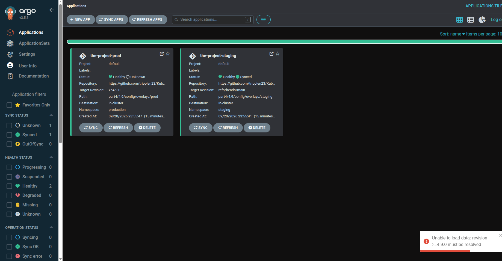
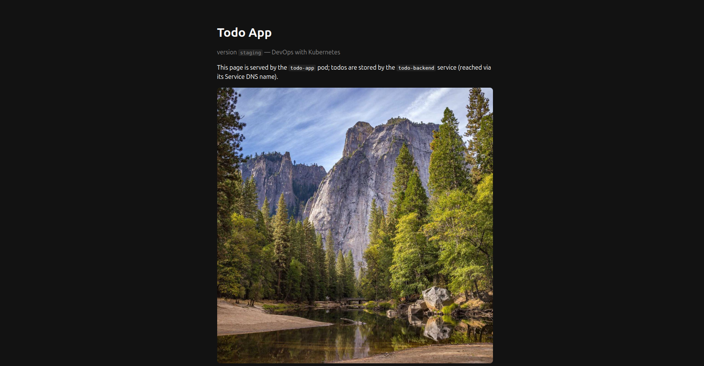
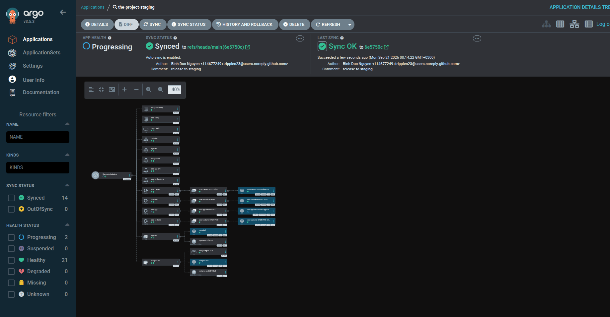
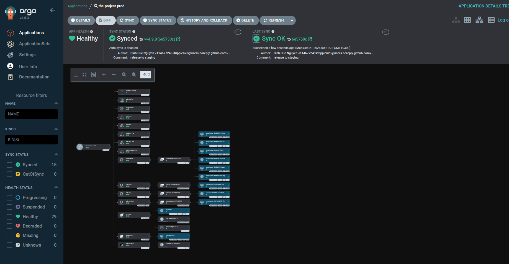

# Exercise 4.9 — The project, step 25: two environments

> Course text (chapter 5, *GitOps*):
> *"Enhance the Project setup as follows: Create two separate environments,
> production and staging that are in their own namespaces. Each commit to the main
> branch should result in deployment to the staging environment. Each tagged commit
> results in deployment to the production environment. In staging the broadcaster
> just logs all the messages, it does not forward those to any external service. In
> staging database is not backed up. You may assume that secrets are readily applied
> outside of the ArgoCD."*

---

## Step 0 — what you need in front of you

- the GKE cluster and `kubectl` pointing at it;
- `docker` — the four images are yours, so you build and push them to Artifact Registry; everything else the cluster pulls itself;
- `git`;
- **the `kustomize` CLI** — `kubectl kustomize` renders, but `kustomize edit` is what a release needs:

```bash
curl -s "https://raw.githubusercontent.com/kubernetes-sigs/kustomize/master/hack/install_kustomize.sh" | bash
sudo mv kustomize /usr/local/bin/
kustomize version
```

- **egress.** ArgoCD clones over the network, and these nodes are private:

```bash
gcloud compute routers describe dwk-router --region=europe-north1 --project=dwk-gke-506208
gcloud compute routers nats describe dwk-nat --router=dwk-router --region=europe-north1 --project=dwk-gke-506208
```

  Only if those say *was not found*:

```bash
gcloud compute routers create dwk-router \
  --network=default --region=europe-north1 --project=dwk-gke-506208
gcloud compute routers nats create dwk-nat \
  --router=dwk-router --region=europe-north1 --project=dwk-gke-506208 \
  --auto-allocate-nat-external-ips --nat-all-subnet-ip-ranges
```

- Now prove the route from **inside** the cluster, which is where ArgoCD stands. Any
  commit hash is a pass; a timeout is the only failure:

```bash
kubectl -n default run gitcheck --rm -i --restart=Never --image=alpine/git:latest \
  --command -- git ls-remote https://github.com/tripplen23/KubernetesSubmissions.git HEAD
```

```text
5cbc4cebf8e7bdb76f8434961cda9dfce9d0a656	HEAD
```

**Room in the cluster.** Two namespaces, two Postgres instances, two NATS servers,
eight Deployments, four StatefulSets and seven ArgoCD pods on a handful of `e2-small`
nodes is tight.
Look before you install, and free any leftover namespaces if Step 0 of the
course has not already done it:

```bash
kubectl get nodes
kubectl describe node | grep -A6 "Allocated resources" | head -30

# what earlier work left behind — delete the ones you do not need any more
kubectl get ns
kubectl delete ns project          # 4.8's namespace, if it is still there
```

---

## Step 1 — two environments, and what a tag means to ArgoCD

```text
commit to main      ─► refs/heads/main ─┐
                                        ├─► the-project-staging ─► namespace staging
tag 4.9.0           ─► >=4.9.0         ─┴─► the-project-prod    ─► namespace production
```

ArgoCD reads `targetRevision` as a **git revision**, and it resolves anything that
looks like a version constraint against **tags only**. Its own documentation is
blunt about it: *"Semver constraints (those containing `*`, `>`, `<`, `>=`, `<=`,
`~`, `^`, or range expressions like `>=1.0.0 <2.0.0`) are only matched against tags, never branches."* That single sentence is this exercise:

- point staging at `refs/heads/main` and **every commit** is a new revision — a branch moves, so a branch tracks;
- point production at `>=4.9.0` and **only a tag** is a new revision — no commit can satisfy a semver constraint, so no commit can deploy production.

**The tag is what deploys production.** Not the commit the tag sits on, not CI's
push to `main`, not a human running `kubectl`: a commit to `main` changes staging's revision and nothing else, and `git push origin 4.9.0` changes production's.

Three consequences before the files:

- **the environments are namespaces, not clusters.** Both `Application`s point at the same `https://kubernetes.default.svc`; only `destination.namespace` separates them. The overlay's `namespace:` transformer rewrites every object it renders, so the base can hold one project and the overlays hold two scopes of it;
- **promotion is a tag, so it is reviewable.** Nothing is deployed to production that does not also exist on `main`, since the tag points at a commit on it;
- **staging is where the untested thing lives.** Same repository, same manifests, earlier revision — which is the only kind of staging that stays honest.

> This is the same pull model 4.8 built: CI builds an image and writes a line of
> YAML, ArgoCD inside the cluster reads the repository. What 4.9 adds is *which
> revision of the repository each environment is allowed to follow*, and it turns out
> that revision is the entire mechanism.

---

## Step 2 — the four apps, the images, and the Dockerfiles

Point Docker at the registry once. The images go to Artifact Registry, not Docker Hub, and without this the first `docker push` asks for Docker Hub credentials:

```bash
gcloud auth configure-docker europe-north1-docker.pkg.dev -q
```

Build and push all Dockerfile:

```bash
R=europe-north1-docker.pkg.dev/dwk-gke-506208/my-repository
for app in todo-app todo-backend broadcaster chat-sink; do
  docker build -t $R/$app:4.9 part4/4.9/$app
  docker push $R/$app:4.9
done
```

---

## Step 3 — the repository: your own GitHub repository

The repository ArgoCD reads is the one this folder is committed to. There is no second repository to keep in step: this lab's configuration is simply a directory, `part4/4.9/config/`, and every push to `main` is what ArgoCD will see. The two release-relevant files (`application-staging.yaml`, `application-prod.yaml`) sit beside it in `part4/4.9/` — they are objects for the cluster, not configuration the ArgoCD path renders.

Two properties matter, and both are about ArgoCD rather than about you.

**It has to be readable anonymously.** ArgoCD clones with no credentials unless you give it a repository Secret, so the repository must be public. A 404 below means it is private, and that is the whole fix:

```bash
# the same request ArgoCD makes: no token, no login
curl -s -o /dev/null -w "%{http_code}\n" \
  https://api.github.com/repos/tripplen23/KubernetesSubmissions
```

```text
200
```

**The cluster has to reach it** — from inside the cluster, not from your laptop:

```bash
kubectl -n default run gitcheck --rm -i --restart=Never --image=alpine/git:latest \
  --command -- git ls-remote https://github.com/tripplen23/KubernetesSubmissions.git HEAD
```

```text
5cbc4cebf8e7bdb76f8434961cda9dfce9d0a656	HEAD
```

**What you commit, and where.** From the repository root, the configuration lives
under `part4/4.9/config/`. There is no nested `.git` and no second remote — doing
`git init` inside the config directory is the one mistake that makes ArgoCD clone an
empty repository.

```bash
git status                 # the four Dockerfiles you just typed, before the config exists
```

Nothing to create yet. The files you type in Step 5 are committed with the rest of the submission, and *that* commit is what moves staging. One property to be aware of  while sharing the repository with your homework: ArgoCD watches `refs/heads/main`, so every commit re-syncs staging, not only the ones that touch `part4/4.9/config/`. It is harmless — the path it reads does not change — and it is exactly what the exercise asks for.

---

## Step 4 — ArgoCD, and the UI on localhost

The install manifest comes from GitHub and is applied straight into `argocd`:

```bash
curl -sL https://raw.githubusercontent.com/argoproj/argo-cd/stable/manifests/install.yaml \
  -o /tmp/argocd-install.yaml

kubectl create namespace argocd
kubectl apply --server-side -n argocd -f /tmp/argocd-install.yaml
```

Download it into `/tmp`, never the repository: it is tens of thousands of lines of CRDs, and the next `git add -A` would sweep it in.

**Three traps in those two commands, in order of how often they bite.**

- **`-n argocd` is not optional on the apply.** The manifest's objects carry no `namespace:` field, so whatever namespace the command line names is where ArgoCD lands. Omit it and the whole control plane installs into `default`, where nothing you type later will look for it — and the failure is silent, because the pods do run;
- **`--server-side` matters.** A plain client-side `apply` of a manifest this size trips over the size of the CRD annotations;
- **`kubectl create namespace argocd` before the apply.** Without it the apply fails with *namespaces "argocd" not found* on the first namespaced object and partially succeeds, which is worse than failing.

Give it a couple of minutes. The pods pull straight from upstream — `quay.io`,
`ghcr.io`, `public.ecr.aws` — which works because of Step 0's NAT. An `ImagePullBackOff` here is slowness, not a wrong registry.

```bash
kubectl -n argocd get pods
```

```text
argocd-application-controller-0                      1/1 Running
argocd-applicationset-controller-84549767db-44n8h    1/1 Running
argocd-dex-server-6cc5dd7c9d-5wxhk                   1/1 Running
argocd-notifications-controller-57d4c66f69-hk47p     1/1 Running
argocd-redis-c55679569-jx88c                         1/1 Running
argocd-repo-server-7f9fdfbb74-sxs7r                  1/1 Running
argocd-server-5f785dd555-vjj6k                       1/1 Running
```

The chapter reaches the UI through a `LoadBalancer`. These nodes have no external
addresses, so port-forward and leave the Service as it is:

```bash
kubectl -n argocd port-forward svc/argocd-server 8080:443

# the initial admin password, as the chapter says: base64 in a Secret
kubectl -n argocd get secret argocd-initial-admin-secret \
  -o jsonpath='{.data.password}' | base64 -d; echo
```

Leave the port-forward running in its own terminal for the rest of the lab: every UI
step below depends on it, and 8080 is now the UI's port — the project's frontend
takes 3001 later precisely because of that.

Open <https://localhost:8080>, accept the self-signed certificate, log in as `admin`
with the password above. The first screen is empty — there is nothing to sync yet.


---

## Step 5 — the state: one base, two overlays

- **there are two overlays.** `overlays/staging` and `overlays/prod`, identical except for what the exercise asks to differ;
- **the base carries no `namespace:` field anywhere, and there is no Secret in it.** The overlay's `namespace:` transformer owns the namespace — which is also why the strategic-merge patches in the overlays need no `namespace:` either — and the Secret (requirement 6) is applied by hand, outside ArgoCD.

Type these inside `part4/4.9/config/`.

### The base

`part4/4.9/config/base/kustomization.yaml`

```yaml
apiVersion: kustomize.config.k8s.io/v1beta1
kind: Kustomization
resources:
  - configmap.yaml
  - configmap-todo.yaml
  - persistentvolumeclaim.yaml
  - postgres.yaml
  - nats.yaml
  - service.yaml
  - service-chat-sink.yaml
  - deployment-todo-app.yaml
  - deployment-todo-backend.yaml
  - deployment-broadcaster.yaml
  - deployment-chat-sink.yaml
```

`part4/4.9/config/base/configmap.yaml`

```yaml
apiVersion: v1
kind: ConfigMap
metadata:
  name: postgres-config
data:
  POSTGRES_HOST: postgres-svc
  POSTGRES_PORT: "5432"
```

The frontend's own configuration:

`part4/4.9/config/base/configmap-todo.yaml`

```yaml
apiVersion: v1
kind: ConfigMap
metadata:
  name: todo-config
data:
  TODO_BACKEND_URL: http://todo-backend-svc:2345
  IMAGE_URL: https://picsum.photos/1200
  IMAGE_PATH: /usr/src/app/files/image.jpg
  MAX_AGE_SECS: "600"
```

Postgres — a StatefulSet behind a headless Service, with the data on a volume claim template and `PGDATA` mounted at the *parent* directory, so `initdb` never sees the filesystem's `lost+found`. All three of the database's identifying values come from `postgres-secret`:

`part4/4.9/config/base/postgres.yaml`

```yaml
apiVersion: v1
kind: Service
metadata:
  name: postgres-svc
  labels:
    app: postgres
spec:
  ports:
    - port: 5432
      name: web
  clusterIP: None
  selector:
    app: postgres
---
apiVersion: apps/v1
kind: StatefulSet
metadata:
  name: postgres-ss
spec:
  serviceName: postgres-svc
  replicas: 1
  selector:
    matchLabels:
      app: postgres
  template:
    metadata:
      labels:
        app: postgres
    spec:
      containers:
        - name: postgres
          image: postgres:16
          ports:
            - name: web
              containerPort: 5432
          env:
            - name: POSTGRES_USER
              valueFrom:
                secretKeyRef:
                  name: postgres-secret
                  key: POSTGRES_USER
            - name: POSTGRES_PASSWORD
              valueFrom:
                secretKeyRef:
                  name: postgres-secret
                  key: POSTGRES_PASSWORD
            - name: POSTGRES_DB
              valueFrom:
                secretKeyRef:
                  name: postgres-secret
                  key: POSTGRES_DB
            # mount at the PARENT dir; data lives in a subdir so initdb
            # never sees the filesystem's lost+found
            - name: PGDATA
              value: /var/lib/postgresql/data
          volumeMounts:
            - name: data
              mountPath: /var/lib/postgresql
  volumeClaimTemplates:
    - metadata:
        name: data
      spec:
        accessModes: ["ReadWriteOnce"]
        storageClassName: standard
        resources:
          requests:
            storage: 100Mi
```

`postgres-secret` does not exist yet, and until it does the Postgres pod does not start. That is deliberate — see the end of this step.

The image cache the frontend writes hourly photos into — **ReadWriteOnce**, which decides the frontend's update strategy further down:

`part4/4.9/config/base/persistentvolumeclaim.yaml`

```yaml
apiVersion: v1
kind: PersistentVolumeClaim
metadata:
  name: image-claim
spec:
  storageClassName: standard
  accessModes:
    - ReadWriteOnce
  resources:
    requests:
      storage: 1Gi
```

`part4/4.9/config/base/nats.yaml`

```yaml
apiVersion: v1
kind: Service
metadata:
  name: my-nats
  labels:
    app: my-nats
spec:
  clusterIP: None
  selector:
    app: my-nats
  ports:
    - name: client
      port: 4222
      targetPort: 4222
---
apiVersion: apps/v1
kind: StatefulSet
metadata:
  name: my-nats
  labels:
    app: my-nats
spec:
  serviceName: my-nats
  replicas: 1
  selector:
    matchLabels:
      app: my-nats
  template:
    metadata:
      labels:
        app: my-nats
    spec:
      containers:
        - name: nats
          image: nats:2.14.6-alpine
          imagePullPolicy: IfNotPresent
          ports:
            - name: client
              containerPort: 4222
          resources:
            requests:
              cpu: 20m
              memory: 32Mi
            limits:
              cpu: 100m
              memory: 128Mi
```

The Services the applications talk to — and the reason neither overlay may carry a `namePrefix`, in both environments:

`part4/4.9/config/base/service.yaml`

```yaml
apiVersion: v1
kind: Service
metadata:
  name: todo-app-svc
  labels:
    app: todo-app
spec:
  type: ClusterIP
  selector:
    app: todo-app
  ports:
    - name: http
      port: 3000
      targetPort: 3000
      protocol: TCP
---
apiVersion: v1
kind: Service
metadata:
  name: todo-backend-svc
  labels:
    app: todo-backend
spec:
  type: ClusterIP
  selector:
    app: todo-backend
  ports:
    - name: http
      port: 2345
      targetPort: 3000
      protocol: TCP
```

`part4/4.9/config/base/service-chat-sink.yaml`

```yaml
apiVersion: v1
kind: Service
metadata:
  name: chat-sink
spec:
  selector:
    app: chat-sink
  ports:
    - name: http
      port: 8080
      targetPort: 8080
```

### The four Deployments

Every project image is a **placeholder**, `PROJECT/<NAME>`: the base describes the
shape, the overlays own the tag. Read the table once, because the whole overlay
mechanism hangs on it:

```text
base names        PROJECT/TODO-APP  PROJECT/TODO-BACKEND  PROJECT/BROADCASTER  PROJECT/CHAT-SINK
overlay rewrites  .../todo-app:4.9  .../todo-backend:4.9  .../broadcaster:4.9  .../chat-sink:4.9
```

`part4/4.9/config/base/deployment-todo-app.yaml`

```yaml
apiVersion: apps/v1
kind: Deployment
metadata:
  name: todo-app
  labels:
    app: todo-app
spec:
  strategy:
    type: Recreate
  replicas: 1
  selector:
    matchLabels:
      app: todo-app
  template:
    metadata:
      labels:
        app: todo-app
    spec:
      volumes:
        - name: image-storage
          persistentVolumeClaim:
            claimName: image-claim
      containers:
        - name: todo-app
          image: PROJECT/TODO-APP
          imagePullPolicy: Always
          ports:
            - containerPort: 3000
          readinessProbe:
            initialDelaySeconds: 5
            periodSeconds: 5
            timeoutSeconds: 3
            failureThreshold: 3
            httpGet:
              path: /healthz
              port: 3000
          livenessProbe:
            initialDelaySeconds: 15
            periodSeconds: 5
            timeoutSeconds: 3
            failureThreshold: 3
            httpGet:
              path: /livez
              port: 3000
          envFrom:
            - configMapRef:
                name: todo-config
          env:
            - name: PORT
              value: "3000"
          resources:
            requests:
              cpu: 50m
              memory: 64Mi
            limits:
              cpu: 200m
              memory: 256Mi
          volumeMounts:
            - name: image-storage
              mountPath: /usr/src/app/files
```

The API — Postgres credentials from the Secret, the address from the ConfigMap, and
NATS, which it degrades without gracefully:

`part4/4.9/config/base/deployment-todo-backend.yaml`

```yaml
apiVersion: apps/v1
kind: Deployment
metadata:
  name: todo-backend
  labels:
    app: todo-backend
spec:
  replicas: 1
  selector:
    matchLabels:
      app: todo-backend
  template:
    metadata:
      labels:
        app: todo-backend
    spec:
      containers:
        - name: todo-backend
          image: PROJECT/TODO-BACKEND
          imagePullPolicy: Always
          ports:
            - containerPort: 3000
          readinessProbe:
            initialDelaySeconds: 5
            periodSeconds: 5
            timeoutSeconds: 3
            failureThreshold: 3
            httpGet:
              path: /healthz
              port: 3000
          # no livenessProbe: /healthz needs Postgres, and a database that is
          # restarting must not restart the backend
          env:
            - name: PORT
              value: "3000"
            - name: NATS_URL
              value: "nats://my-nats:4222"
            - name: NATS_SUBJECT
              value: "todo_events"
            - name: POSTGRES_HOST
              valueFrom:
                configMapKeyRef:
                  name: postgres-config
                  key: POSTGRES_HOST
            - name: POSTGRES_PORT
              valueFrom:
                configMapKeyRef:
                  name: postgres-config
                  key: POSTGRES_PORT
            - name: POSTGRES_USER
              valueFrom:
                secretKeyRef:
                  name: postgres-secret
                  key: POSTGRES_USER
            - name: POSTGRES_PASSWORD
              valueFrom:
                secretKeyRef:
                  name: postgres-secret
                  key: POSTGRES_PASSWORD
            - name: POSTGRES_DB
              valueFrom:
                secretKeyRef:
                  name: postgres-secret
                  key: POSTGRES_DB
          resources:
            requests:
              cpu: 50m
              memory: 64Mi
            limits:
              cpu: 200m
              memory: 256Mi
```

Six broadcasters sharing the queue group — one event, one delivery, however many replicas the environment asks for. **The base carries the six and no `BROADCASTER_LOG_ONLY`**, because forwarding is the program's default and the base is the thing that does not know what kind of environment it is in:

`part4/4.9/config/base/deployment-broadcaster.yaml`

```yaml
apiVersion: apps/v1
kind: Deployment
metadata:
  name: broadcaster
  labels:
    app: broadcaster
spec:
  replicas: 6
  selector:
    matchLabels:
      app: broadcaster
  template:
    metadata:
      labels:
        app: broadcaster
    spec:
      containers:
        - name: broadcaster
          image: PROJECT/BROADCASTER
          imagePullPolicy: Always
          env:
            - name: NATS_URL
              value: "nats://my-nats:4222"
            - name: NATS_SUBJECT
              value: "todo_events"
            - name: NATS_QUEUE_GROUP
              value: "broadcasters"
            - name: CHAT_URL
              value: "http://chat-sink:8080"
            - name: CHAT_FORMAT
              value: "generic"   # or "discord" ({"content"}) / "slack" ({"text"})
            - name: BOT_NAME
              value: "bot"
          resources:
            requests:
              cpu: 20m
              memory: 32Mi
            limits:
              cpu: 100m
              memory: 128Mi
```

and the sink that receives what the broadcaster forwards — the cluster's stand-in for Discord, Telegram or Slack, which it cannot reach:

`part4/4.9/config/base/deployment-chat-sink.yaml`

```yaml
apiVersion: apps/v1
kind: Deployment
metadata:
  name: chat-sink
  labels:
    app: chat-sink
spec:
  replicas: 1
  selector:
    matchLabels:
      app: chat-sink
  template:
    metadata:
      labels:
        app: chat-sink
    spec:
      containers:
        - name: chat-sink
          image: PROJECT/CHAT-SINK
          imagePullPolicy: Always
          ports:
            - containerPort: 8080
          env:
            - name: PORT
              value: "8080"
          resources:
            requests:
              cpu: 20m
              memory: 32Mi
            limits:
              cpu: 100m
              memory: 128Mi
```

### The staging overlay

Two files plus the kustomization. Staging differs from production in exactly three
ways, and all three are visible here.

`part4/4.9/config/overlays/staging/kustomization.yaml`

```yaml
apiVersion: kustomize.config.k8s.io/v1beta1
kind: Kustomization
namespace: staging
resources:
  - ../../base
patches:
  - path: broadcaster.yaml
  - path: deployment.yaml
images:
  - name: PROJECT/TODO-APP
    newName: europe-north1-docker.pkg.dev/dwk-gke-506208/my-repository/todo-app
    newTag: "4.9"
  - name: PROJECT/TODO-BACKEND
    newName: europe-north1-docker.pkg.dev/dwk-gke-506208/my-repository/todo-backend
    newTag: "4.9"
  - name: PROJECT/BROADCASTER
    newName: europe-north1-docker.pkg.dev/dwk-gke-506208/my-repository/broadcaster
    newTag: "4.9"
  - name: PROJECT/CHAT-SINK
    newName: europe-north1-docker.pkg.dev/dwk-gke-506208/my-repository/chat-sink
    newTag: "4.9"
```

The status-quo half of requirement 1, first line: `namespace: staging`. Every object the base holds is rewritten into it, and there is no namespace to keep in step by hand.

**Requirement 4 — met here.** The broadcaster patch is the whole of it: one replica instead of six, and the flag the program reads:

`part4/4.9/config/overlays/staging/broadcaster.yaml`

```yaml
apiVersion: apps/v1
kind: Deployment
metadata:
  name: broadcaster
spec:
  replicas: 1
  template:
    spec:
      containers:
        - name: broadcaster
          env:
            - name: BROADCASTER_LOG_ONLY
              value: "true"
```

`part4/4.9/config/overlays/staging/deployment.yaml`

```yaml
apiVersion: apps/v1
kind: Deployment
metadata:
  name: todo-app
spec:
  template:
    spec:
      containers:
        - name: todo-app
          env:
            - name: VERSION
              value: "staging"
```

The app defaults to `v1` when `VERSION` is absent, so the base stays runnable on its
own.

### The production overlay

`part4/4.9/config/overlays/prod/kustomization.yaml`

```yaml
apiVersion: kustomize.config.k8s.io/v1beta1
kind: Kustomization
namespace: production
resources:
  - ../../base
  - cronjob-backup.yaml
patches:
  - path: deployment.yaml
images:
  - name: PROJECT/TODO-APP
    newName: europe-north1-docker.pkg.dev/dwk-gke-506208/my-repository/todo-app
    newTag: "4.9"
  - name: PROJECT/TODO-BACKEND
    newName: europe-north1-docker.pkg.dev/dwk-gke-506208/my-repository/todo-backend
    newTag: "4.9"
  - name: PROJECT/BROADCASTER
    newName: europe-north1-docker.pkg.dev/dwk-gke-506208/my-repository/broadcaster
    newTag: "4.9"
  - name: PROJECT/CHAT-SINK
    newName: europe-north1-docker.pkg.dev/dwk-gke-506208/my-repository/chat-sink
    newTag: "4.9"
```

Read the two overlays side by side and the entire exercise is visible: the same `resources: [../../base]`, a different `namespace:`, the same four `images:`, and a different list of patches — `cronjob-backup.yaml` is in one `resources:` list and not in the other, which is requirement 5 in a single line.

`part4/4.9/config/overlays/prod/deployment.yaml`

```yaml
apiVersion: apps/v1
kind: Deployment
metadata:
  name: todo-app
spec:
  template:
    spec:
      containers:
        - name: todo-app
          env:
            - name: VERSION
              value: "v1"
```

Production's broadcaster is the base's: six replicas, forwarding. **Requirement 4's other half is the absence of a patch** — nothing in this overlay mentions `BROADCASTER_LOG_ONLY`, so the program's `false` default stands.

**Requirement 5 — met here.** Production's database is backed up nightly; staging has no such object to render:

`part4/4.9/config/overlays/prod/cronjob-backup.yaml`

```yaml
apiVersion: batch/v1
kind: CronJob
metadata:
  name: todo-backup
spec:
  schedule: "15 3 * * *"
  concurrencyPolicy: Forbid
  startingDeadlineSeconds: 300
  jobTemplate:
    spec:
      template:
        spec:
          serviceAccountName: backup-sa
          restartPolicy: OnFailure
          volumes:
            - name: dump
              emptyDir: {}
          containers:
            - name: dump
              image: postgres:16
              command: ["/bin/sh", "-c"]
              args:
                - |
                  pg_dump -h postgres-svc -U "$POSTGRES_USER" -d "$POSTGRES_DB" -f /dump/todo.sql
                  echo "dump written: $(wc -c < /dump/todo.sql) bytes"
              env:
                - name: PGPASSWORD
                  valueFrom:
                    secretKeyRef:
                      name: postgres-secret
                      key: POSTGRES_PASSWORD
                - name: POSTGRES_USER
                  valueFrom:
                    secretKeyRef:
                      name: postgres-secret
                      key: POSTGRES_USER
                - name: POSTGRES_DB
                  valueFrom:
                    secretKeyRef:
                      name: postgres-secret
                      key: POSTGRES_DB
              volumeMounts:
                - name: dump
                  mountPath: /dump
            - name: upload
              image: google/cloud-sdk:slim
              command: ["/bin/sh", "-c"]
              args:
                - |
                  until [ -s /dump/todo.sql ]; do sleep 2; done
                  gcloud storage cp /dump/todo.sql \
                    gs://dwk-todo-backups-tripplen23/todo-$(date +%Y-%m-%d-%H%M).sql
              volumeMounts:
                - name: dump
                  mountPath: /dump
```

Four things to notice, because each one is a design decision rather than a syntax detail:

- **two containers, one `emptyDir`.** `dump` writes the SQL file, `upload` waits for it and ships it. An `emptyDir` lives as long as the pod, which is exactly the lifetime this needs — no PVC, no cleanup;
- **`postgres:16`, the same version as the StatefulSet.** `pg_dump` refuses to read a server newer than itself, so the version is not free;
- **`concurrencyPolicy: Forbid`.** A dump that is still running when the next one starts would read a database mid-backup; skipping the run is the cheaper mistake;
- **`serviceAccountName: backup-sa`.** This is a Kubernetes ServiceAccount, and it is **not in the repository** — same reason as the Secret, and the same paragraph below.

### Secrets, applied outside ArgoCD

**Requirement 6 — met here.** `postgres-secret` and `backup-sa` are prerequisites of the deployed project, not parts of it, and the exercise's *"you may assume that secrets are readily applied outside of the ArgoCD"* is permission to keep them out of the repository. Apply them by hand, into both namespaces:

```bash
for ns in staging production; do
  kubectl create namespace "$ns" --dry-run=client -o yaml | kubectl apply -f -

  kubectl -n "$ns" create secret generic postgres-secret \
    --from-literal=POSTGRES_USER=postgres \
    --from-literal=POSTGRES_PASSWORD=example \
    --from-literal=POSTGRES_DB=postgres
done
```

For the backup's identity — the ServiceAccount in `production`, and the one IAM binding that lets exactly it write the bucket — also by hand, also outside the repository:

```bash
kubectl -n production create serviceaccount backup-sa

gcloud projects add-iam-policy-binding dwk-gke-506208 \
  --role=roles/storage.objectAdmin \
  --member="principal://iam.googleapis.com/projects/323959491379/locations/global/workloadIdentityPools/dwk-gke-506208.svc.id.goog/subject/ns/production/sa/backup-sa" \
  --condition=None
```

Three things about those two commands.

- **The identity comes from the cluster, not from a file.** The node pool serves the GKE metadata server, so `backup-sa` picks up Google credentials at run time. Nothing to create, mount or store.
- **`--member` is scoped to one namespace.** It names `ns/production/sa/backup-sa` and nothing else. Skip the binding and the upload container dies with `403 ... does not have storage.objects.create access` while the dump beside it succeeds.
- **`objectAdmin`, not `objectCreator`.** `gcloud storage cp` reads the object back as it transfers, so it needs `storage.objects.get` as well as `create`; with `create` alone the upload fails `403` even though the dump worked — a confusing pair of logs to be staring at.

A failed CronJob marks its whole Application **Degraded**, which is why that binding is worth getting right the first time: the red badge would point at a fault that is not in the repository at all.

**Why ArgoCD never deletes them.** Two independent reasons, and either one is enough:

- they are not in the repository, so nothing in the Kustomization renders them — and `prune: true` deletes *removed repository objects*, not object types ArgoCD has never seen;
- even if an `Application` rendered an object in a namespace it manages, `prune` only removes what that same `Application` previously created and tracked.

The consequence is the useful one: a Secret that must not live in a public repository is still available to the pods, and the environment stays reproducible because the repository records the *references* to it — `secretKeyRef: postgres-secret` — even though it does not record the value.

```bash
kubectl -n staging get secret postgres-secret
kubectl -n production get serviceaccount backup-sa
kubectl -n argocd get application the-project-staging \
  -o jsonpath='{range .status.resources[*]}{.kind}{"\n"}{end}' | grep -ciE 'secret|serviceaccount'
```

```text
postgres-secret   Opaque   3     138m
backup-sa   101m
0
```

Three objects applied by hand, present in the cluster, and in neither Application's inventory — which is requirement 6, measured rather than asserted.

Without it, the failure is direct: Postgres cannot start without `POSTGRES_PASSWORD`, and the backend cannot start without the credentials it references. `CreateContainerConfigError` and `statefulset.apps/postgres-ss 0/1` are this missing Secret, and nothing else.

### Render both overlays before pushing

Kustomize is what decides what ArgoCD will see, so read it here where the error messages are cheap:

```bash
cd part4/4.9/config
kustomize build overlays/staging | grep -E "^\s+(image|namespace):" | sort -u
kustomize build overlays/prod    | grep -E "^\s+(image|namespace):" | sort -u
```

```text
        image: europe-north1-docker.pkg.dev/dwk-gke-506208/my-repository/broadcaster:4.9
        image: europe-north1-docker.pkg.dev/dwk-gke-506208/my-repository/chat-sink:4.9
        image: europe-north1-docker.pkg.dev/dwk-gke-506208/my-repository/todo-app:4.9
        image: europe-north1-docker.pkg.dev/dwk-gke-506208/my-repository/todo-backend:4.9
        image: postgres:16
  namespace: staging

        image: europe-north1-docker.pkg.dev/dwk-gke-506208/my-repository/broadcaster:4.9
        image: europe-north1-docker.pkg.dev/dwk-gke-506208/my-repository/chat-sink:4.9
        image: europe-north1-docker.pkg.dev/dwk-gke-506208/my-repository/todo-app:4.9
        image: europe-north1-docker.pkg.dev/dwk-gke-506208/my-repository/todo-backend:4.9
            image: google/cloud-sdk:slim
            image: postgres:16
        image: postgres:16
  namespace: production
```

The two outputs differ by exactly one line, and it is requirement 5 in one picture: production lists `google/cloud-sdk:slim`, because the CronJob's `upload` container rides along inside that overlay. `postgres:16` shows up twice there and once in staging — the StatefulSet runs it in both environments, and the CronJob's `dump` container runs it too, one nesting level deeper. The indentation is the whole story: the deeper lines belong to the CronJob, the shallower ones to the workloads every namespace shares.

**If `kustomize build` fails, read the file it names.** In a lab typed by hand the usual cause is a filename that does not match a `resources:` entry — *`accumulating resources from 'persistentvolumeclaim.yaml' … no such file or directory`* is a typo in the file's name (`persistentvolumnclaim.yaml`), not a Kustomize problem. Compare the name in the error with the list in the kustomization before touching anything else. The overlay kustomizations are the ones most likely to name a file that does not exist yet, because you type their `patches:` list last.

The other one worth knowing: a patch whose `metadata.name` does not match any object fails with *no matches for Id …* and names the patch file. A strategic-merge patch selects its target by `apiVersion` + `kind` + `metadata.name` — nothing else.

### The first push

From the repository root — the config is a directory in the submission, not a
repository of its own, so there is no second remote and no nested `.git`:

```bash
git add part4/4.9/config part4/4.9/*/Dockerfile
git commit -m "4.9: two environments, staging and production"
git push origin main
```

That push is a release, and it is worth knowing which one: staging's `targetRevision` is `refs/heads/main`, so **this commit already satisfies requirement 2**, before either `Application` exists. Production's constraint is not satisfied by it, which is requirement 3.

Check the URL where ArgoCD stands, with the `repo-server` that will do the cloning —
including a list of tags, because this lab depends on them:

```bash
kubectl -n argocd exec deploy/argocd-repo-server -- \
  git ls-remote https://github.com/tripplen23/KubernetesSubmissions.git
```

```text
5cbc4cebf8e7bdb76f8434961cda9dfce9d0a656	HEAD
5cbc4cebf8e7bdb76f8434961cda9dfce9d0a656	refs/heads/main
c894c1b54b9f9c357e5b941c66156c9143daf8a8	refs/tags/4.1
0a97a3d0341221323196f6af05c6b541d0ded71c	refs/tags/4.2
8387640ad1f7be920f37b263b48e25de6c910301	refs/tags/4.3
ea5bea7f56b784c27b78e6facc1399353bfdf99e	refs/tags/4.4
57fc78a9ce45e0cd5eaffcf9d366107f8bda47ee	refs/tags/4.5
343911786178bb29099f61be9ef0951702aae68f	refs/tags/4.6
ca683142b29f2d8e0947ce1e39c093a0f0279c25	refs/tags/4.7
6c578180b53cc73c731b6cfb7d6714056fa276b	refs/tags/4.8
```

A list of refs (`… HEAD`, `… refs/heads/main`) is the pass. It is literally what ArgoCD does before it syncs anything, so it is the right place to prove the URL, and it fails the same way ArgoCD would if the repository were private or unreachable.

---

## Step 6 — two Applications: one built in the UI, both kept as files

ArgoCD does nothing by itself. An `Application` says *which repository, which path, which revision, which namespace* — and in this lab the revision is the difference between the two environments. Build staging in the UI first, because that is the fastest way to meet the object and the only way to see what the fields do.

### Creating the staging Application by hand

With the UI open from Step 4, press **+ NEW APP** and fill the panel in:

- **General** — Application Name `the-project-staging`, Project `default`, **Sync Policy** → **Automatic**: tick **ENABLE AUTO-SYNC**, then **PRUNE RESOURCES** and **SELF HEAL**. Those three ticks are the `automated:` block of the YAML below;
- **Source** — Repository URL `https://github.com/tripplen23/KubernetesSubmissions.git`, Revision `refs/heads/main`, Path `part4/4.9/config/overlays/staging`;
- **Destination** — Cluster URL `https://kubernetes.default.svc` (in-cluster), Namespace `staging`. Under **SYNC OPTIONS** also tick **AUTO-CREATE NAMESPACE**: the namespace does not exist until ArgoCD makes it, and the YAML says the same thing as `CreateNamespace=true`.

Press **CREATE**. The card appears as `OutOfSync`, turns `Synced`, and `Progressing` becomes `Healthy`. Everything in `overlays/staging` is now running, and you never touched `kubectl` — Postgres, NATS, four apps and a broadcaster in log-only mode.


### Creating the production Application — and why the UI refuses it until a tag exists

Press **+ NEW APP** again, with the same panel and two deliberate differences: name
`the-project-prod`, revision `>=4.9.0`, path `part4/4.9/config/overlays/prod`,
namespace `production`.


Press **CREATE**, and it refuses:

```text
Unable to create application
application spec for the-project-prod is invalid: InvalidSpecError: Unable to generate
manifests in part4/4.9/config/overlays/prod: rpc error: code = Unknown desc = unable to
resolve '>=4.9.0' to a commit SHA
```




**That is the exercise working, not a failure.** The UI generates the manifests before it creates anything, and no commit satisfies a semver constraint — with no `4.9.x` tag pushed yet, there is nothing for this Application to point at.

The way around it is the file, which the API accepts as it stands. That file is written
out in full under *Both Applications, as files* below — write it there, then apply it.

Leave the card alone. It sits at **Unknown** until Step 7 pushes a tag the constraint
accepts, and then it resolves on its own: the badge turns `Synced` and production rolls
out the commit that tag names. Proof 2 is where you watch that happen.

### Both Applications, as files

The UI wrote the staging Application; in a submission you write both of them yourself. Delete what is in the cluster so the two do not collide, then apply the files:

```bash
kubectl -n argocd delete application the-project-staging the-project-prod
```

`part4/4.9/application-staging.yaml`

```yaml
apiVersion: argoproj.io/v1alpha1
kind: Application
metadata:
  name: the-project-staging
  namespace: argocd
spec:
  project: default
  source:
    repoURL: https://github.com/tripplen23/KubernetesSubmissions.git
    targetRevision: refs/heads/main
    path: part4/4.9/config/overlays/staging
  destination:
    server: https://kubernetes.default.svc
    namespace: staging
  syncPolicy:
    automated:
      prune: true
      selfHeal: true
    syncOptions:
      - CreateNamespace=true
```

`part4/4.9/application-prod.yaml`

```yaml
apiVersion: argoproj.io/v1alpha1
kind: Application
metadata:
  name: the-project-prod
  namespace: argocd
spec:
  project: default
  source:
    repoURL: https://github.com/tripplen23/KubernetesSubmissions.git
    targetRevision: ">=4.9.0"
    path: part4/4.9/config/overlays/prod
  destination:
    server: https://kubernetes.default.svc
    namespace: production
  syncPolicy:
    automated:
      prune: true
      selfHeal: true
    syncOptions:
      - CreateNamespace=true
```

```bash
kubectl apply -n argocd -f part4/4.9/application-staging.yaml
kubectl apply -n argocd -f part4/4.9/application-prod.yaml

# OutOfSync → Synced, Progressing → Healthy (staging once its commit is on main)
kubectl -n argocd get applications -w
```

```text
the-project-staging   Synced   Healthy   refs/heads/main
the-project-prod      Synced   Healthy   >=4.9.0

kubectl -n argocd get application the-project-staging -o jsonpath='{.status.sync.revision}{"\n"}'
d073968aac32a57c1262ebdc291a1bbc194f0b23
kubectl -n argocd get application the-project-prod -o jsonpath='{.status.sync.revision}{"\n"}'
d073968aac32a57c1262ebdc291a1bbc194f0b23
```

**Requirements 1, 2 and 3 are met in these two files**, and only the `\w` of the two differ:

- `destination.namespace` is `staging` and `production` → the two environments live in their own namespaces;
- `targetRevision: refs/heads/main` → any commit to `main` deploys staging;
- `targetRevision: ">=4.9.0"` → only a tag deploys production.

Two fields are the whole GitOps contract, and both environments get them:

- `automated.prune` — an object deleted from the repository is deleted from the cluster;
- `automated.selfHeal` — a change made *by hand* in a namespace is reverted to what the repository says.

**Use the fully qualified `refs/heads/main`, not `main`.** A tag and a branch can share a name, and then `targetRevision: main` is ambiguous: `git ls-remote` order decides. `refs/heads/main` is the branch, `refs/tags/main` the tag. One careless tag stops that branch from moving.

### The UI, once both are running: where to click, and what you are looking at

The card list is the first stop. Each card carries **two badges**, and they answer two different questions:

- **Sync Status** — `Synced` means the cluster matches the repository revision ArgoCD resolved; `OutOfSync` means it does not yet.
- **Health Status** — `Healthy` means the workloads are actually up; `Progressing` means they are on their way; `Degraded` means something is failing and you should look at the resource tree.

The same two fields from the terminal, per environment:

```bash
kubectl -n argocd get application the-project-staging -o jsonpath='{.spec.source.targetRevision}{" -> "}{.status.sync.revision}{"\n"}'
kubectl -n argocd get application the-project-prod    -o jsonpath='{.spec.source.targetRevision}{" -> "}{.status.sync.revision}{"\n"}'
```

```text
refs/heads/main -> 6e5750cbcc0eb7af518d7513f8354757714ff7ed
>=4.9.0 -> >=4.9.0
```

Production's side stays the literal constraint until a tag exists — nothing is broken by
that, and Proof 2 is what changes it. Staging's side is a commit, because a branch is
always resolvable.

If both badges are **blank**, nothing is reconciling: `argocd-application-controller` is what fills them in, so `kubectl -n argocd get pods` comes before any doubt about the Application.

Click a card and you get the **resource tree**: everything the Kustomization rendered. `StatefulSet → Pod` for Postgres and NATS, `Deployment → ReplicaSet → Pod` for the four apps, `CronJob → Job → Pod` in production only, Services beside them. Click a node for its live manifest and events.

**Where the replica count is.** On the **Deployment node**: the `6/6` or `1/1` beside an app's name is `readyReplicas`/`desired` — the number of healthy pods. The broadcaster node reads `1/1` in staging, `6/6` in production once a tag has put it there. Two commands read the same numbers:

```bash
kubectl -n staging get deploy                    # READY is readyReplicas/desired
kubectl -n production get deploy
```

```text
staging
  deployment.apps/broadcaster            READY 1/1
  deployment.apps/chat-sink              READY 1/1
  deployment.apps/todo-app               READY 1/1
  deployment.apps/todo-backend           READY 1/1
  statefulset.apps/my-nats               READY 1/1
  statefulset.apps/postgres-ss           READY 1/1

production
  No resources found in production namespace.
```

**Empty is the right answer there, not a missing step.** No tag has been pushed yet, so production has nothing to run. The `6/6` appears in Proof 2, after the tag.

**SYNC, REFRESH and HARD REFRESH**: *Refresh* re-reads the repository without waiting for the next poll (180 s); *Sync* reconciles immediately; *Hard Refresh* also drops cached manifests: press it after editing a file the UI still shows old. **None changes the repository**; they only make ArgoCD notice it sooner.

**HISTORY AND ROLLBACK**: one entry per revision ArgoCD has deployed.

**DEPLOY** beside an older entry is a rollback, and with `selfHeal` on it lasts only until the next sync restores the repository's version — the durable rollback is a revert commit. The **Details** panel names the initiator (**automated sync policy**, or a user when started by hand) and the elapsed time.

```text
Succeeded at 2026-09-19T21:06:41Z   initiator=[]   revision=d073968aac32a57c1262ebdc291a1bbc194f0b23

(an empty initiator is what the UI prints as "Initiated by: automated sync policy";
a sync started by a person carries that person's username instead)
```

**The app itself.** The frontend is a ClusterIP service in each namespace, so a port-forward is how you reach it — 3001, because 8080 is the UI:

```bash
kubectl -n staging port-forward svc/todo-app-svc 3001:3000
# Ctrl-C when done
```



The page is the project's todo list, rendered by the frontend from the API in Postgres over the Service name — because files in a repository say so. The version string under the title is the overlay's: `staging` in staging, `v1` in production.

---

## Step 7 — the four proofs

Each proof measures one of the exercise's requirements, and each has a receipt.

### Proof 1 — a commit to `main` deploys staging and leaves production untouched

**Requirement 2**, and the negative half of requirement 3. Change one line in the staging overlay — this is the difference the overlay exists for:

`part4/4.9/config/overlays/staging/deployment.yaml`

```yaml
apiVersion: apps/v1
kind: Deployment
metadata:
  name: todo-app
spec:
  template:
    spec:
      containers:
        - name: todo-app
          env:
            - name: VERSION
              value: "staging-2"
```

```bash
git add part4/4.9/config
git commit -m "release to staging"
git push origin main
```



ArgoCD polls the repository — its default interval is 180 seconds, so this takes a couple of minutes unless you press **Refresh** in the UI. Watch it: the `the-project-staging` card turns `OutOfSync`, the todo-app node spins a new ReplicaSet and pod, and it settles back to `Synced` / `Healthy` — while `the-project-prod` never changes a character.

```bash
# both revisions, after the sync
kubectl -n argocd get application the-project-staging -o jsonpath='{.status.sync.revision}{"\n"}'
kubectl -n argocd get application the-project-prod    -o jsonpath='{.status.sync.revision}{"\n"}'

# the staging rollout specifically
kubectl -n staging rollout status deploy/todo-app
kubectl -n staging get pods -l app=todo-app
```

```text
6e5750cbcc0eb7af518d7513f8354757714ff7ed
>=4.9.0

deployment "todo-app" successfully rolled out

NAME                       READY   STATUS    RESTARTS   AGE
todo-app-fdb684cfd-x6sdm   1/1     Running   0          80s
```

**What the receipts show.** Staging's `.status.sync.revision` is the commit you just pushed; production's line is still the constraint itself, because a tag and only a tag resolves it. Nothing was done to either Application between the two commands, which is the entire mechanism — and it is requirement 2 with no arguing left in it.

The page proves it from the browser too: the version line under the title reads `staging-2`, and nobody touched the cluster.

### Proof 2 — a tag deploys production

**Requirement 3**, from the other side. The tag goes on the commit that is already on `main`; ArgoCD's constraint `>=4.9.0` is then satisfied, and production syncs.

```bash
git tag 4.9.0
git push origin 4.9.0
```



The `the-project-prod` card resolves its revision to the tag, turns `OutOfSync`, and
deploys. Refresh the UI so you are not waiting for a poll; from the terminal:

```bash
git ls-remote --tags origin | grep 4.9.0
kubectl -n argocd get application the-project-prod -o jsonpath='{.status.sync.status}{" "}{.status.health.status}{"\n"}'
kubectl -n argocd get application the-project-prod -o jsonpath='{.status.sync.revision}{"\n"}'
kubectl -n production rollout status deploy/broadcaster
kubectl -n production get pods
```

```text
d073968aac32a57c1262ebdc291a1bbc194f0b23	refs/tags/4.9.0
Synced Healthy
d073968aac32a57c1262ebdc291a1bbc194f0b23
deployment "broadcaster" successfully rolled out

broadcaster-dc68c9b5f-6fslp                    1/1
broadcaster-dc68c9b5f-gbx6g                    1/1
broadcaster-dc68c9b5f-gg8tv                    1/1
broadcaster-dc68c9b5f-hd45f                    1/1
broadcaster-dc68c9b5f-hx5t9                    1/1
broadcaster-dc68c9b5f-j5q8r                    1/1
chat-sink-5f9894b584-9f4vg                     1/1
my-nats-0                                      1/1
postgres-ss-0                                  1/1
todo-app-77764d4649-xwx4t                      1/1
todo-backend-6f4bfb9985-qtsb8                  1/1

(the tag is what production resolved to, and the `ComparisonError` from Step 6 is gone
with it — the same commit is also what main points at here, which is why staging and
production show the same revision in this shot)
```

Two more tags make the rule unmissable, and neither needs a new commit:

```bash
git tag 4.9.1 && git push origin 4.9.1        # production follows the newest match
git tag 5.0.0 && git push origin 5.0.0        # also a match: >=4.9.0 has no ceiling
```

`5.0.0` matching is not a bug in your constraint, it is what `>=` means — and it is why a promotion pipeline's tag is a decision and not a formality. Pin it if you want the other behaviour (`~4.9` stays inside 4.9.x).

**A tag and a branch with the same name.** If you ever tag something `main`, `targetRevision: main` becomes ambiguous — see Step 6 for why `refs/heads/main` is the branch's unambiguous spelling.

### Proof 3 — staging's broadcaster logs instead of forwarding

**Requirement 4**, and the proof that needs two log streams and one counter. In staging the broadcaster's startup line says so outright:

```bash
kubectl -n staging logs deploy/broadcaster --tail=20
```

```text
connected to NATS at nats://my-nats:4222
listening on todo_events (queue group broadcasters), logging only, not forwarding to http://chat-sink:8080
```

Now create a todo in the staging frontend — the port-forward from Step 6, and the
form on the page. The event travels frontend → backend → NATS → broadcaster; what the broadcaster does with it is the difference.

```bash
# the staging broadcaster prints, and prints nothing else
kubectl -n staging logs deploy/broadcaster --tail=20 -f
```

```text
[log] #1 {"message":"A todo was created: #1 verify-staging-1789854602","user":"bot"}

(the same log has zero "[forward]" lines — the counter below is the second half of this proof)
```

**The counter is the receipt that forwarding did not happen.** The chat sink's `/count` endpoint says how many messages it has accepted. Run it **after** creating the todo above — with no todo yet, both counters read `0`.

The project images are `debian-slim` with `ca-certificates` and nothing else — no `curl`, no `wget` — so the request comes from a throwaway pod in each namespace:

```bash
kubectl -n staging run curlcheck --rm -i --restart=Never --image=curlimages/curl \
  --command -- curl -s http://chat-sink:8080/count

kubectl -n production run curlcheck --rm -i --restart=Never --image=curlimages/curl \
  --command -- curl -s http://chat-sink:8080/count
```

```text
staging /count     = 0
production /count  = 1
```

(`kubectl run` prints a `warning: couldn't attach to pod/curlcheck, falling back to
streaming logs` before that number. It is the container exiting before the attach lands —
the number is still the real one.)

`0` in staging, and it stays `0` however many todos you create. Production's counter moves, because production's broadcaster is the base's: forwarding, six replicas, no flag. **Same image, same source, one environment variable.**

That difference is worth one line in your own notes, because it is the exercise's quiet lesson: a feature flag in configuration is cheaper than a second program, and `BROADCASTER_LOG_ONLY` is why staging can be a *staging* — the notification path is exercised end to end, without telling a real chat service about test todos.

### Proof 4 — production backs its database up, and staging does not

**Requirement 5.** Two commands, two different answers:

```bash
kubectl -n production get cronjob
kubectl -n staging get cronjob
```

```text
NAME          SCHEDULE     TIMEZONE   SUSPEND   ACTIVE   LAST SCHEDULE   AGE
todo-backup   15 3 * * *   <none>     False     0        <none>          10m

kubectl -n staging get cronjob
No resources found in staging namespace.
```

The CronJob only fires at 03:15, so the honest way to see it work now is to run one
by hand from it — same Job template, same containers, same ServiceAccount:

```bash
kubectl -n production create job todo-backup-manual \
  --from=cronjob/todo-backup
kubectl -n production get jobs,pods -l job-name=todo-backup-manual
kubectl -n production logs job/todo-backup-manual -c upload
```

```text
job.batch/todo-backup-manual created
job completed after 30 s

container dump:
  dump written: 2079 bytes

container upload:
  Copying file:///dump/todo.sql to gs://dwk-todo-backups-tripplen23/todo-2026-09-19-2215.sql

bucket:
        2079  2026-09-19T22:15:32Z  gs://dwk-todo-backups-tripplen23/todo-2026-09-19-2215.sql
```

**When a backup fails, the whole Application turns `Degraded`.** A CronJob with a failed Job in its history is unhealthy, and production's `Application` owns the CronJob, so its badge turns red.

The resource tree holds the Job and its pod; `kubectl -n production describe job/todo-backup-manual` gives the reason — the correct signal, not a false alarm, and the same mechanism flags a broken Deployment.

Then delete the manual Job, so the environment matches the repository again and the badge is honest:

```bash
kubectl -n production delete job todo-backup-manual
```

---

## Step 8 — the pipeline that promotes

Everything so far was done by hand, twice: build, push, edit the overlays, commit, tag. The chapter's workflow does the same thing to the same files. It is **optional** for this exercise — the tag is what deploys production, and a tag you push by hand is a tag — and it is here as the submission's record of the flow.

Two events, two jobs' worth of intent, in one file: a push to `main` releases to **staging**, and a tag releases to **production**.

`.github/workflows/release-4.9.yaml`

```yaml
name: Release 4.9

on:
  push:
    # a branch push is filtered by path; a tag push is NOT — GitHub does not
    # evaluate `paths:` for tag events, which is exactly what this lab wants:
    # part4/4.9/** decides branch pushes, and every 4.9.* tag gets through
    branches: [main]
    tags: ['4.9.*']
    paths:
      - 'part4/4.9/**'

permissions:
  contents: write          # the workflow commits kustomization.yaml back to the repo,
                           # and pushes the tag that deploys production
  id-token: write          # Workload Identity Federation needs an OIDC token to mint
                           # the access token — without it the auth step fails with
                           # "did not inject $ACTIONS_ID_TOKEN_REQUEST_TOKEN"

jobs:
  build-publish-release:
    name: Build, Push, Release
    runs-on: ubuntu-latest

    steps:
      - name: Checkout
        uses: actions/checkout@v6

      - name: Authenticate to Google Cloud
        uses: google-github-actions/auth@v3
        with:
          workload_identity_provider: ${{ secrets.WORKLOAD_IDENTITY_PROVIDER }}
          service_account: ${{ secrets.SERVICE_ACCOUNT }}

      - name: Decide which environment this run releases to
        id: target
        run: |
          if [ "$GITHUB_REF_TYPE" = "tag" ]; then
            echo "overlay=prod" >> "$GITHUB_OUTPUT"
            echo "version=$GITHUB_REF_NAME" >> "$GITHUB_OUTPUT"
          else
            echo "overlay=staging" >> "$GITHUB_OUTPUT"
            echo "version=$GITHUB_SHA" >> "$GITHUB_OUTPUT"
          fi

      - name: Build and publish the four images
        run: |
          gcloud auth configure-docker europe-north1-docker.pkg.dev -q
          R=europe-north1-docker.pkg.dev/${{ secrets.GKE_PROJECT }}/my-repository
          for app in todo-app todo-backend broadcaster chat-sink; do
            docker build -t "$R/$app:${{ steps.target.outputs.version }}" "part4/4.9/$app"
            docker push "$R/$app:${{ steps.target.outputs.version }}"
          done

      - name: Set up Kustomize
        uses: imranismail/setup-kustomize@v3

      - name: Point the overlay at the new images
        run: |
          cd "part4/4.9/config/overlays/${{ steps.target.outputs.overlay }}"
          R=europe-north1-docker.pkg.dev/${{ secrets.GKE_PROJECT }}/my-repository
          for app in todo-app todo-backend broadcaster chat-sink; do
            kustomize edit set image \
              "PROJECT/$(echo $app | tr 'a-z' 'A-Z')=$R/$app:${{ steps.target.outputs.version }}"
          done

      - name: Commit the release
        uses: EndBug/add-and-commit@v10
        with:
          add: 'part4/4.9/config'
          message: "Release ${{ steps.target.outputs.version }} [skip ci]"
          # A run takes minutes and this job commits back to the branch it read: a
          # push that arrives while it builds leaves the checkout behind the remote
          # tip and the push is rejected (non-fast-forward), after everything else
          # already succeeded. Rebase onto the current main, stashing the overlay
          # edits made above.
          pull: '--rebase --autostash'

      - name: Tag the release commit
        if: github.ref_type == 'branch'
        run: |
          # a promotion to production is a tag, and the tag has to point at the
          # commit that already names those images
          git tag "4.9.${{ github.run_number }}" || true
          git push origin "4.9.${{ github.run_number }}"
```

Four details, each one a trap that has already bitten in this course:

- **the tag is what deploys production**, exactly as in Step 7. The first run of this workflow tags its own release commit, and *that* tag is what satisfies `>=4.9.0` — the commit alone never will;
- **`[skip ci]` is not politeness, it is load-bearing.** The commit CI makes touches `part4/4.9/**`, which is what triggers the workflow; without the marker the release re-triggers itself. It also stops the tag push below from re-running the job, since the tagged commit carries the same message;
- **`contents: write` and `id-token: write` are both required.** The first lets the workflow push; the second is what Workload Identity Federation mints its token from, and without it the auth step fails with *did not inject `$ACTIONS_ID_TOKEN_REQUEST_TOKEN`*;
- **the workflow must live at the repository root.** GitHub runs workflows only from `.github/workflows` at the repository root: *"You must store workflow files in the `.github/workflows` directory of your repository"*. A copy inside `part4/4.9/.github/workflows/` never runs — the failure mode is silence.

The shape to notice: **CI never talks to the cluster.** It publishes an image, writes a line of YAML, and pushes a tag. What happens next is ArgoCD's business, in both environments, without a single `kubectl`.

---

## Step 9 — cleanup

The order matters. With `CreateNamespace` and auto-sync on, deleting a destination
namespace alone just makes the controller build it again — the `Application`s go
first, and both of them.

```bash
kubectl -n argocd delete application the-project-staging the-project-prod

kubectl delete namespace staging
kubectl delete namespace production

kubectl delete -n argocd -f /tmp/argocd-install.yaml   # the CRDs uninstall with it
kubectl delete namespace argocd

rm -f /tmp/argocd-install.yaml
```

Four notes on that list:

- **the config stays.** `part4/4.9/config/` and the two `application-*.yaml` files are the submission — that is the deliverable, and there is no repository to remove because the repository is your own;
- **the hand-made objects go with the namespaces.** `postgres-secret` in both, and `backup-sa` in production, are deleted with `kubectl delete namespace`; there is nothing extra to hunt for *because* they were never ArgoCD's;
- **the CRDs go with the manifest** (`kubectl delete -f`). The Argo **Rollouts** CRDs from 4.4/4.5 are a different project and are not touched;
- **the port-forward dies with the UI** — Ctrl-C the terminal from Step 4.

And the NAT from Step 0, only if the course is finished with it:

```bash
gcloud compute routers nats delete dwk-nat --router=dwk-router \
  --region=europe-north1 --project=dwk-gke-506208
gcloud compute routers delete dwk-router --region=europe-north1 --project=dwk-gke-506208
```

**The one cleanup that is not a command.** `git tag 4.9.1` and `git tag 5.0.0` from Step 7 stay in the repository, and production's `>=4.9.0` will follow whichever is newest the next time you point an `Application` at it. If you want production pinned back to the release you meant, delete the stray tags *and* pin the constraint:

```bash
git push --delete origin 5.0.0
git tag -d 5.0.0
```

---

## P.S. — what this exercise leaves you with

- **A revision is a policy, not a pointer.** `refs/heads/main` for staging and `>=4.9.0` for production is the difference that matters: a branch moves with every commit, a semver constraint matches only a tag. That asymmetry enforces "commit to staging, tag to production" in the tool, not in discipline.
- **One base, two overlays, and the differences are countable.** Read `overlays/staging` beside `overlays/prod`: *what is different in production?* A namespace, a replica count, one environment variable, the presence of a CronJob — countable lines of YAML, reviewable in a diff, impossible to forget.
- **The same mechanism scales down to a flag.** Staging's broadcaster is production's broadcaster with `BROADCASTER_LOG_ONLY: "true"`: same image, same events, same queue group, no external service told about test todos. A second program would have been a second thing to keep in step.
- **Not every prerequisite belongs in the repository.** The Secret and the ServiceAccount are applied by hand, and ArgoCD never prunes them: it only deletes what it created. Reproducibility lives in recording the *references* to them — the part that is reviewable.
- **A tag is a decision with a duration.** `>=4.9.0` will happily deploy `5.0.0` the day someone pushes it; `~4.9` will not. Naming the constraint is naming how much of your release process you are willing to automate.
- **And the tag is the only thing production listens to.** A hundred commits to `main` change staging a hundred times and production not once; one `git push origin 4.9.0` changes production, and that is the whole contract this lab hands you.
