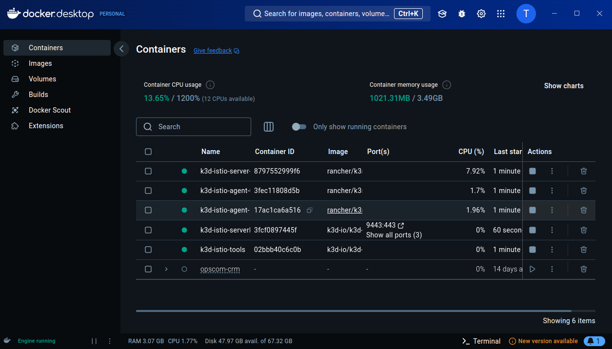
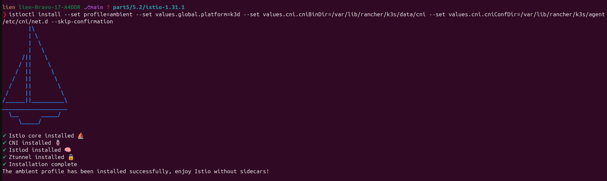
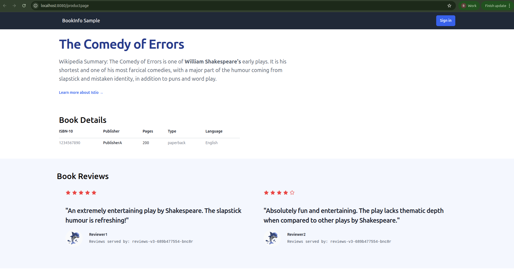
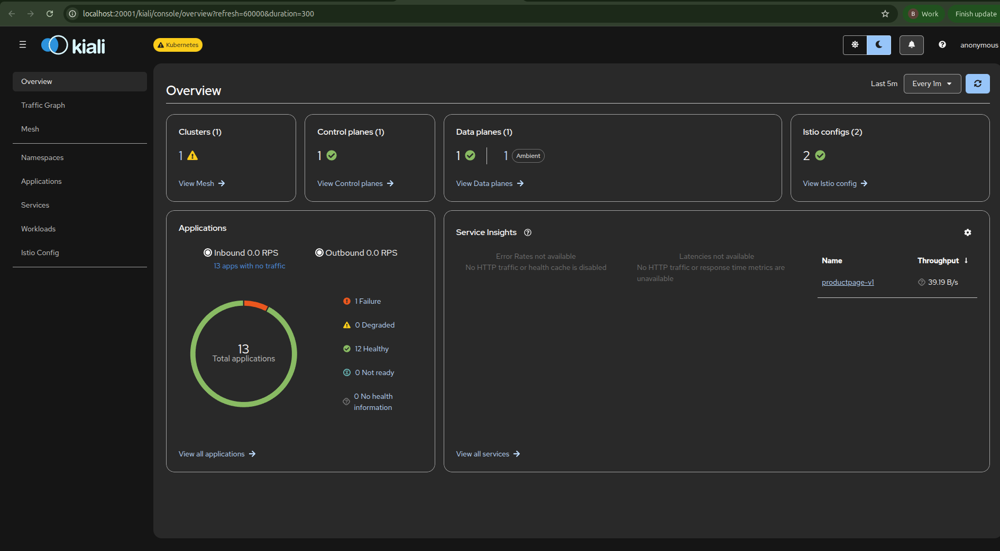
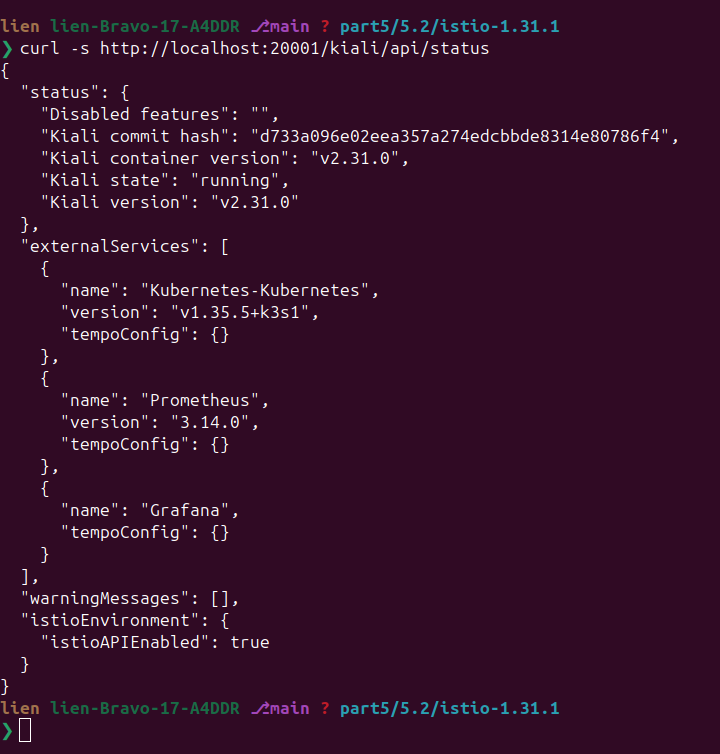

# 5.2 — Getting started with Istio service mesh

This lab is the walkthrough of the exercise. There is no application code of our own this time: the sample app, the mesh and the UI are all YAML that ships inside the Istio release we download. The one edit the exercise asks for is a single line in the Kiali addon, shown in Step 6.

## Step 0 — the cluster

This exercise runs on its own cluster, `istio`, created exactly as the ambient prerequisites ask — with Traefik disabled so it cannot fight Istio's ingress gateway:

```bash
k3d cluster create istio --api-port 6550 -p '9080:80@loadbalancer' -p '9443:443@loadbalancer' --agents 2 --k3s-arg '--disable=traefik@server:*'
kubectl config use-context k3d-istio
kubectl get nodes
```




## Step 1 — the Istio CLI

```bash
curl -L https://istio.io/downloadIstio | sh -
cd istio-1.31.1
export PATH=$PWD/bin:$PATH
istioctl version
```

```console
Istio is not present in the cluster: no running Istio pods in namespace "istio-system"
client version: 1.31.1
```

## Step 2 — install Istio (ambient profile) on k3d

The prerequisites page gives the k3d command as a **Helm** invocation with `global.platform=k3d`, and says the value tells Istio about k3d's nonstandard CNI paths. Two measured surprises follow from translating it to `istioctl`.

First, the literal key is rejected, because `istioctl --set` takes IstioOperator paths rather than Helm's short names:

```console
$ istioctl install --set profile=ambient --set global.platform=k3d --skip-confirmation
Error: generate config: could not unmarshal: json: unknown field "global"
```


The value belongs under `values.`: `--set values.global.platform=k3d`.

Second — and this is the trap the whole step is about — on a current k3s, `platform=k3d` alone still left the cluster with a mesh that could not start. `istioctl install` reported `✔ Istio core`, `✔ CNI`, `✔ Istiod`, then sat on `Waiting for DaemonSet/istio-system/ztunnel` for five minutes and failed:

```console
✘ Ztunnel encountered an error: failed to wait for resource: resources not ready after 5m0s: context deadline exceeded
```

`kubectl get pods -n istio-system` explained nothing — ztunnel pods sit in `ContainerCreating` — but the node did:

```console
$ kubectl describe pod -n istio-system ztunnel-...   # Events:
plugin type="istio-cni" name="istio-cni" failed (add): failed to find plugin "istio-cni" in path [/var/lib/rancher/k3s/data/cni]
```

The CNI plugin had been installed at `/bin/istio-cni`, while k3s looks for plugins in `/var/lib/rancher/k3s/data/cni` (that directory exists and holds symlinks into `/bin/cni` for flannel, portmap and friends — but no `istio-cni`). The `global.platform=k3d` override covers the config directory but not this binary path on this k3s version, so the two paths are set explicitly:

```bash
istioctl install --set profile=ambient --set values.global.platform=k3d \
  --set values.cni.cniBinDir=/var/lib/rancher/k3s/data/cni \
  --set values.cni.cniConfDir=/var/lib/rancher/k3s/agent/etc/cni/net.d \
  --skip-confirmation
```



If the failing install was already run, re-running `istioctl install` is not enough by itself: the CNI DaemonSet keeps its old hostPath until its pods are replaced, so the plugin is still not where k3s looks. Replacing them is what makes the new bin directory take effect (`kubectl -n istio-system rollout restart ds/istio-cni-node`, or deleting the daemonset's pods), after which `ztunnel` comes up on its own. Both were needed here, and the second failure of the day was waiting behind the first:

```console
plugin type="flannel" failed (add): failed to allocate for range 0: no IP addresses available in range set: 10.42.0.1-10.42.0.254
```

Every sandbox that failed had already been handed an IP by flannel before the istio-cni plugin in the chain failed, so 20 minutes of retries leaked the node's entire `/24`. The plugin being fixed did not clear that: the stale allocations have to go, keeping the ones belonging to pods that are actually running.

The final state of the install:

```console
$ kubectl get pods -n istio-system
istio-cni-node-hqxl8     1/1     Running   0          60s
istio-cni-node-nmxpn     1/1     Running   0          15m
istio-cni-node-rn7h7     1/1     Running   0          15m
istiod-d68b4877b-hb7bp   1/1     Running   0          42m
ztunnel-7vg2l            1/1     Running   0          24m
ztunnel-bnxbt            1/1     Running   0          24m
ztunnel-jld4p            1/1     Running   0          3m26s
```

One control-plane pod and, on each node, one CNI pod and one ztunnel — that is the whole ambient data plane, and no pod anywhere has a sidecar.

The sample app's Gateway is a Gateway API resource, so the CRDs come next (the docs check for them first, which is why re-running this line prints `already present`):

```bash
kubectl get crd gateways.gateway.networking.k8s.io > /dev/null 2>&1 || \
  kubectl apply --server-side -f https://github.com/kubernetes-sigs/gateway-api/releases/download/v1.6.0/experimental-install.yaml
```

## Step 3 — Prometheus, so Kiali has something to read

The exercise asks for Prometheus in `monitoring` and Kiali pointed at `http://prom-prometheus-server.monitoring:80`,
which is the Service name the `prometheus-community/prometheus` chart produces for a release called `prom`:

```bash
helm repo add prometheus-community https://prometheus-community.github.io/helm-charts
helm install prom prometheus-community/prometheus -n monitoring --create-namespace
kubectl get svc -n monitoring
```

```console
NAME                            TYPE        CLUSTER-IP      EXTERNAL-IP   PORT(S)    AGE
prom-kube-state-metrics         ClusterIP   10.43.41.74     <none>        8080/TCP   38s
prom-prometheus-node-exporter   ClusterIP   10.43.150.49    <none>        9100/TCP   38s
prom-prometheus-pushgateway     ClusterIP   10.43.126.180   <none>        9091/TCP   38s
prom-prometheus-server          ClusterIP   10.43.138.209   <none>        80/TCP     38s
```

Same shape as the receipt on the exercise page, including the `10.43.x` addresses, which are k3d's Service CIDR — they
exist inside the cluster, not on the host. This chart version keeps its state in PersistentVolumeClaims; k3d does ship a
default StorageClass (`local-path`, `WaitForFirstConsumer`), so they do bind, but only once a consuming pod is
scheduled, and `helm install --wait` can time out on the first attempt before that happens. Installing it again, or
installing without `--wait` and watching the pods, both get there.

## Step 4 — the sample app, and getting to it

From inside `istio-1.31.1`, the four commands of the deploy-sample-app page:

```bash
kubectl apply -f samples/bookinfo/platform/kube/bookinfo.yaml
kubectl apply -f samples/bookinfo/platform/kube/bookinfo-versions.yaml
kubectl apply -f samples/bookinfo/gateway-api/bookinfo-gateway.yaml
kubectl annotate gateway bookinfo-gateway networking.istio.io/service-type=ClusterIP --overwrite
```

Bookinfo is four services — `productpage`, `details`, `reviews` (in three versions), `ratings` — each of them one
container, `1/1` from the start, because in ambient mode there is nothing to inject:

```console
$ kubectl get pods
details-v1-764c46cfdb-pnb9r       1/1     Running   0          46s
productpage-v1-85664dccbc-9s82n   1/1     Running   0          46s
ratings-v1-779fdc7f86-mp5m7       1/1     Running   0          46s
reviews-v1-85964f9f98-48gf8       1/1     Running   0          46s
reviews-v2-6f7fbdc6fd-vn98x       1/1     Running   0          46s
reviews-v3-689b477554-w6hgk       1/1     Running   0          46s
```

The `annotate` is the docs' own step for a cluster whose ingress gateway cannot get a real LoadBalancer address; on k3d
the gateway Service would otherwise never leave `<pending>`. With it, the gateway is a ClusterIP and is reached the way
every other local Service in this project is:

```bash
kubectl port-forward svc/bookinfo-gateway-istio 8080:80
```



```console
$ curl -s -o /tmp/page.html -w "http=%{http_code}\n" http://localhost:8080/productpage
http=200
$ grep -o "<title>[^<]*</title>" /tmp/page.html
<title>Simple Bookstore App</title>
```

`kubectl get gateway` reports `PROGRAMMED False` for a few seconds after the Gateway is created; it turns `True` once
the istio gateway pod it spawns is ready, and only then is the port-forward worth starting:

```console
$ kubectl get gateway
NAME               CLASS   ADDRESS                                            PROGRAMMED   AGE
bookinfo-gateway   istio   bookinfo-gateway-istio.default.svc.cluster.local   True         29m
```

## Step 5 — put the namespace in the mesh

This is the whole of the ambient switch — a label on the namespace, no restarts, no injected containers:

```bash
kubectl label namespace default istio.io/dataplane-mode=ambient
```

```console
$ export PATH=$PWD/bin:$PATH
$ istioctl ztunnel-config workloads
NAMESPACE    POD NAME                                  ADDRESS     NODE               WAYPOINT PROTOCOL
default      bookinfo-gateway-istio-bc9f9cd89-pw5c6   10.42.0.16  k3d-istio-agent-0  None     TCP
default      details-v1-764c46cfdb-pnb9r               10.42.0.11  k3d-istio-agent-0  None     HBONE
default      productpage-v1-85664dccbc-9s82n           10.42.0.13  k3d-istio-agent-0  None     HBONE
default      reviews-v1-85964f9f98-48gf8               10.42.0.12  k3d-istio-agent-0  None     HBONE
istio-system istio-cni-node-nmxpn                     10.42.2.153 k3d-istio-server-0 None     TCP
istio-system istiod-d68b4877b-hb7bp                   10.42.1.5   k3d-istio-agent-1  None     TCP
```


The `PROTOCOL` column is the receipt that the label did what it says: the bookinfo pods are on HBONE — the mesh's tunnelled transport — while the pods in `istio-system` are plain TCP, i.e. not in the mesh. Removing the label takes the namespace back out just as quietly. That is also why this mode is worth comparing with the older one: nothing is injected into the application pods at all, so what changes is the node agent's behaviour, not the pod spec.

## Step 6 — Kiali, pointed at the right Prometheus

The exercise's note is about one line in the Kiali addon manifest. The file has four `enabled: true` lines, so an unanchored edit can easily hit the wrong one; anchoring it to the `prometheus:` block does the job:

```bash
cp samples/addons/kiali.yaml /tmp/kiali.yaml
sed -i '/^      prometheus:$/,+1 s/^        enabled: true$/        enabled: true\n        url: http:\/\/prom-prometheus-server.monitoring:80/' /tmp/kiali.yaml
grep -A 3 "^      prometheus:$" /tmp/kiali.yaml
kubectl apply -f /tmp/kiali.yaml
```

```console
      prometheus:
        enabled: true
        url: http://prom-prometheus-server.monitoring:80
      tracing:
```

```console
clusterrolebinding.rbac.authorization.k8s.io/kiali created
service/kiali created
deployment.apps/kiali created
```

With the addon applied, the UI is behind a Service like everything else:

```bash
istioctl dashboard kiali                                  # opens the browser for you
# or, without the CLI doing it:
kubectl port-forward svc/kiali 20001:20001 -n istio-system
```



The URL is <http://localhost:20001>. Kiali is quiet until Prometheus has scraped something and some traffic has gone through the mesh — an empty graph on a fresh install is normal for a minute or two, and a Kiali that reports `prometheus` as unreachable means the URL line above points at the wrong Service. Its own health endpoint is the quickest way to tell the UI apart from the data behind it:

```console
$ curl -s http://localhost:20001/kiali/api/status
{
  "status": {
    "Disabled features": "",
    "Kiali commit hash": "d733a096e02eea357a274edcbbde8314e80786f4",
    "Kiali container version": "v2.31.0",
    "Kiali state": "running",
    "Kiali version": "v2.31.0"
  },
  "externalServices": [ { "name": "Kubernetes-Kubernetes", ... } ]
}
```



## Step 7 — traffic, and what the UI then shows

The docs generate load with a loop against the product page; it is the step that fills Kiali's graph:

```bash
for i in $(seq 1 100); do curl -s -o /dev/null http://localhost:8080/productpage; done
```

Whether those requests succeeded is not something to judge from the terminal's scrollback — it is in the mesh's own numbers, which is the point of having Prometheus behind the UI. The queries below were run against the monitoring
Prometheus that Kiali reads — from inside the cluster in this run, which is the same endpoint a `kubectl port-forward svc/prom-prometheus-server 9090:80 -n monitoring` exposes to the host. PromQL is full of spaces and **`curl` rejects an unencoded space in a URL** (`curl: (3) URL rejected: Malformed input to a URL function`), so the queries below hand the expression to `--data-urlencode` and let curl do the escaping:

```console
$ curl -s -G http://localhost:9090/api/v1/query --data-urlencode 'query=count(istio_requests_total)'
{"status":"success","data":{"resultType":"vector","result":[{"metric":{},"value":[1790117986.377,"2"]}]}}

$ curl -s -G http://localhost:9090/api/v1/query --data-urlencode 'query=count by (destination_service_name) (istio_requests_total)'
{"status":"success","data":{"resultType":"vector","result":[
  {"metric":{"destination_service_name":"productpage"},"value":[1790117986.918,"2"]}]}}

$ curl -s -G http://localhost:9090/api/v1/query --data-urlencode 'query=sum by (response_code) (istio_requests_total)'
{"status":"success","data":{"resultType":"vector","result":[
  {"metric":{"response_code":"200"},"value":[1790117987.421,"7"]},
  {"metric":{"response_code":"503"},"value":[1790117987.421,"25"]}]}}
```

The third query is the honest version of this step's receipt on this machine: the loop did produce traffic, and the
mesh recorded both its successes and its failures. The `503`s are showing up in the data — the box was under
load average 15 while the requests were flowing, product page requests were taking ~10 seconds each, and the gateway
ran out of patience for some of them. On a quiet machine the same query shows `200` and nothing else, and the traffic
graph in Kiali draws all four bookinfo services with the versions behind them.

The metrics are Istio's, not the app's: `istio_requests_total` exists because ztunnel and the gateways are reporting
on the connections they carry, which is the observability half of what the page says a service mesh gives you for free.
In the UI, the useful pages are **Traffic Graph** (the four bookinfo services and their versions, with the response
codes and latency of the requests just generated), **Workloads** and **Services** (per-workload L7 metrics, and whether
traffic is arriving over mTLS — ambient gives mutual TLS between meshed pods without configuring anything).

## Step 8 — Clean up

```bash
istioctl uninstall --purge -y
kubectl delete namespace istio-system
kubectl delete -f samples/bookinfo/platform/kube/bookinfo.yaml
kubectl delete -f samples/bookinfo/gateway-api/bookinfo-gateway.yaml
helm uninstall prom -n monitoring
k3d cluster delete istio        # this lab's cluster is disposable
```

`istioctl uninstall --purge` also removes the cluster-scoped RBAC of the mesh, which a namespace delete on its own would leave behind.