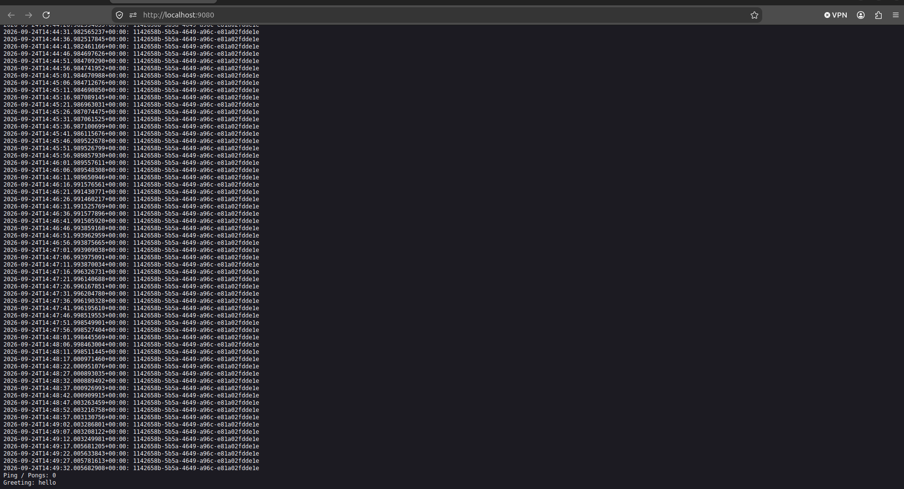
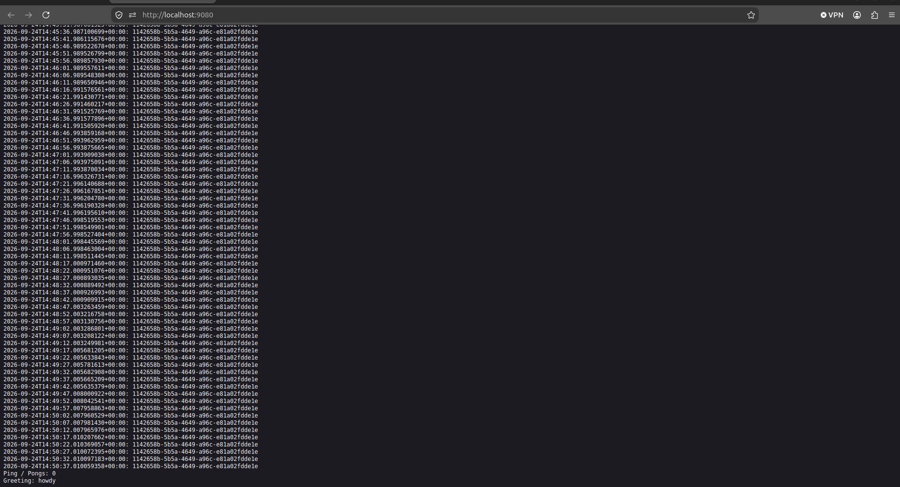
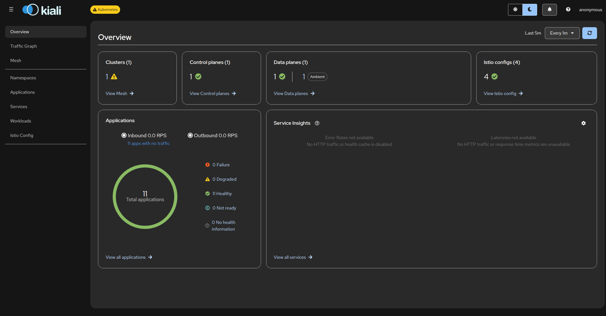
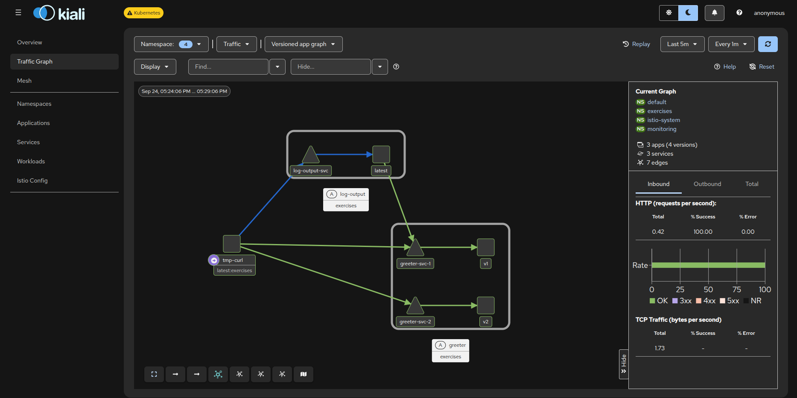

# 5.3 — Log app, the Service Mesh Edition

The lab carries the three apps (the log app and ping-pong from part 2, plus the new greeter), the manifests, and this run's receipts.

## Step 0 — the cluster and the mesh

What this run needs: `docker`, `k3d`, `kubectl`, `helm` (Step 6) and `python3` (the one `-o json |
python3` receipt in Step 4).

```bash
k3d cluster create istio --api-port 6550 -p '9080:80@loadbalancer' -p '9443:443@loadbalancer' --agents 2 --k3s-arg '--disable=traefik@server:*'

kubectl config use-context k3d-istio
kubectl get nodes

cd ~
curl -L https://istio.io/downloadIstio | sh -
export PATH="$HOME/istio-1.31.1/bin:$PATH"
istioctl version

istioctl install --set profile=ambient --set values.global.platform=k3d \
  --set values.cni.cniBinDir=/var/lib/rancher/k3s/data/cni \
  --set values.cni.cniConfDir=/var/lib/rancher/k3s/agent/etc/cni/net.d \
  --skip-confirmation
```

Standing in this lab folder, `export PATH=$PWD/istio-1.31.1/bin:$PATH` cannot work: there is no
release directory here, and the next command fails with `istioctl: command not found`. Any release outside `$HOME`
misses it the same way. Use the real path, or link the binary once (most distros keep `~/.local/bin` on
`PATH`):

```bash
ln -sf "$HOME/istio-1.31.1/bin/istioctl" ~/.local/bin/istioctl
```

```console
✔ Istio core installed ⛵️
✔ CNI installed 🪢
✔ Istiod installed 🧠
✔ Ztunnel installed 🔒
✔ Installation completeThe ambient profile has been installed successfully, enjoy Istio without sidecars!

$ kubectl get pods -n istio-system
NAME                     READY   STATUS    RESTARTS   AGE
istio-cni-node-59wz8     1/1     Running   0          55s
istio-cni-node-99zz5     1/1     Running   0          55s
istio-cni-node-ndkmb     1/1     Running   0          55s
istiod-d68b4877b-w6nh2   1/1     Running   0          55s
ztunnel-5x6f8            1/1     Running   0          13s
ztunnel-h7nxr            1/1     Running   0          13s
ztunnel-r9wg4            1/1     Running   0          13s
```

The apps live in their own namespace, and one label puts them in the mesh. Nothing is added to the pods: they keep
their container count and the node agent picks them up.

`manifests/namespace.yaml`

```yaml
apiVersion: v1
kind: Namespace
metadata:
  name: exercises
  labels:
    # The whole namespace joins the mesh. Nothing is added to the pods: the
    # node agent (ztunnel) picks them up, which is what makes this possible
    # on a namespace that is already running.
    istio.io/dataplane-mode: ambient
```

The Gateway API is still not part of Kubernetes, so the CRDs come first:

```bash
kubectl apply --server-side -f https://github.com/kubernetes-sigs/gateway-api/releases/download/v1.6.0/experimental-install.yaml
kubectl apply -f manifests/namespace.yaml
```

Before anything else: the Gateway and HTTPRoute manifests in Steps 3–4 are Gateway API objects, so they need those CRDs first, and every object that follows lands in `exercises`. Skip the second command and the next namespaced apply fails once per object, five times for `greeter.yaml`:

```console
$ kubectl apply -f manifests/greeter.yaml
Error from server (NotFound): error when creating "manifests/greeter.yaml": namespaces "exercises" not found
Error from server (NotFound): error when creating "manifests/greeter.yaml": namespaces "exercises" not found
...
```

## Step 1 — the apps, and the one new service

Build and hand the images to the cluster:

```bash
docker build -t log-output:5.3 log-output
docker build -t greeter:5.3 greeter
docker build -t ping-pong:5.3 ping-pong

k3d image import log-output:5.3 greeter:5.3 ping-pong:5.3 -c istio
```

```console
INFO[0009] Successfully imported 3 image(s) into 1 cluster(s)
```

The two apps from part 2 go up first — their YAML is below:

```bash
kubectl apply -f manifests/configmap.yaml -f manifests/ping-pong.yaml -f manifests/log-output.yaml
```

`manifests/log-output.yaml` is the writer/reader pair with the new `GREETER_URL` in the reader; `ping-pong.yaml` and `configmap.yaml` are unchanged from part 2:

```yaml
            # The greeter is reached by one Service name; which version answers
            # is the mesh's decision, not the app's.
            - name: GREETER_URL
              value: "http://greeter-svc:3000/"
```

<details>
<summary><code>manifests/configmap.yaml</code> and <code>manifests/ping-pong.yaml</code> — carried over from part 2 unchanged</summary>

```yaml
apiVersion: v1
kind: ConfigMap
metadata:
  name: log-output-config
  namespace: exercises
data:
  information.txt: |
    this text is from file
  MESSAGE: hello world
---
apiVersion: apps/v1
kind: Deployment
metadata:
  name: ping-pong
  namespace: exercises
  labels:
    app: ping-pong
spec:
  replicas: 1
  selector:
    matchLabels:
      app: ping-pong
  template:
    metadata:
      labels:
        app: ping-pong
    spec:
      containers:
        - name: ping-pong
          image: ping-pong:5.3
          ports:
            - containerPort: 3000
          env:
            - name: PORT
              value: "3000"
---
apiVersion: v1
kind: Service
metadata:
  name: ping-pong-svc
  namespace: exercises
  labels:
    app: ping-pong
spec:
  type: ClusterIP
  selector:
    app: ping-pong
  ports:
    - name: http
      port: 3000
      targetPort: 3000
      protocol: TCP
```

</details>

## Step 2 — three Services for one name

The exercise's hint is easy to misread: the greeter needs **three** Services. One carries the name the app calls and the HTTPRoute hangs off; the other two are the backends the route weighs against each other. A Service can back a route only if it exists, so `greeter-svc-1` and `greeter-svc-2` are real objects, each selecting one version's pods.

`manifests/greeter.yaml`

```yaml
# Version 1 — the one that should answer most of the time.
apiVersion: apps/v1
kind: Deployment
metadata:
  name: greeter-v1
  namespace: exercises
  labels:
    app: greeter
    version: v1
spec:
  replicas: 1
  selector:
    matchLabels:
      app: greeter
      version: v1
  template:
    metadata:
      labels:
        app: greeter
        version: v1
    spec:
      containers:
        - name: greeter
          image: greeter:5.3
          ports:
            - containerPort: 3000
          env:
            - name: PORT
              value: "3000"
            - name: GREETING
              value: "hello"
---
# Version 2 — same image, different greeting.
apiVersion: apps/v1
kind: Deployment
metadata:
  name: greeter-v2
  namespace: exercises
  labels:
    app: greeter
    version: v2
spec:
  replicas: 1
  selector:
    matchLabels:
      app: greeter
      version: v2
  template:
    metadata:
      labels:
        app: greeter
        version: v2
    spec:
      containers:
        - name: greeter
          image: greeter:5.3
          ports:
            - containerPort: 3000
          env:
            - name: PORT
              value: "3000"
            - name: GREETING
              value: "howdy"
---
# The name the log app calls, and the Service the HTTPRoute is attached to.
# Its label is what sends this traffic through the waypoint — without a Layer 7
# proxy in the path there is nothing that could weigh two backends against each
# other, and the route below is simply ignored.
apiVersion: v1
kind: Service
metadata:
  name: greeter-svc
  namespace: exercises
  labels:
    app: greeter
    istio.io/use-waypoint: greeter-waypoint
spec:
  type: ClusterIP
  selector:
    app: greeter
  ports:
    - name: http
      port: 3000
      targetPort: 3000
      protocol: TCP
---
# Backend Service for v1 — the HTTPRoute points here, not at the pods.
apiVersion: v1
kind: Service
metadata:
  name: greeter-svc-1
  namespace: exercises
  labels:
    app: greeter
    version: v1
spec:
  type: ClusterIP
  selector:
    app: greeter
    version: v1
  ports:
    - name: http
      port: 3000
      targetPort: 3000
      protocol: TCP
---
# Backend Service for v2.
apiVersion: v1
kind: Service
metadata:
  name: greeter-svc-2
  namespace: exercises
  labels:
    app: greeter
    version: v2
spec:
  type: ClusterIP
  selector:
    app: greeter
    version: v2
  ports:
    - name: http
      port: 3000
      targetPort: 3000
      protocol: TCP
```

Applying it:

```bash
kubectl apply -f manifests/greeter.yaml
```

The `istio.io/use-waypoint` label on `greeter-svc` names a waypoint that does not exist yet; Step 3 creates it. Until
then there is no proxy in front of this Service, so a failure here is not a broken app.

Note what `greeter-svc` selects: `app: greeter`, i.e. **both** versions. Its endpoints are the two pods, which is what makes the Step 5 experiment work: with the waypoint in the path the route decides between the backend Services, and without it nothing does:

```console
$ kubectl get endpoints -n exercises greeter-svc greeter-svc-1 greeter-svc-2
NAME            ENDPOINTS                       AGE
greeter-svc     10.42.0.7:3000,10.42.1.5:3000   66s
greeter-svc-1   10.42.1.5:3000                  66s
greeter-svc-2   10.42.0.7:3000                  66s
```

## Step 3 — the waypoint

This part is easy to skip and impossible to fake. `istioctl ztunnel-config workloads` prints a
`PROTOCOL` column, honest about what ambient gives you by default:

```console
NAMESPACE    POD NAME                                ADDRESS    NODE               WAYPOINT PROTOCOL
exercises    greeter-v1-68cc4fb644-qd9ww             10.42.1.5  k3d-istio-agent-1  None     HBONE
exercises    greeter-v2-8b6c795bb-4qdlv              10.42.0.7  k3d-istio-agent-0  None     HBONE
exercises    log-output-56f955bdf5-t9hk2             10.42.1.6  k3d-istio-agent-1  None     HBONE
exercises    ping-pong-7d849644b-6998s               10.42.0.6  k3d-istio-agent-0  None     HBONE
exercises    greeter-waypoint-d876cb959-75tcf        10.42.0.5  k3d-istio-agent-0  None     TCP
```

The pods are in the mesh (`HBONE`), but that is a TCP tunnel between node agents. Nothing in that path reads an HTTP
request, so nothing could choose between `greeter-svc-1` and `greeter-svc-2`; the waypoint turns the
L4 tunnel into an L7 hop.

```bash
istioctl waypoint apply -n exercises --name greeter-waypoint
```

```console
✅ waypoint exercises/greeter-waypoint applied
```

The command writes a Gateway object; this is it as the cluster stores it, `allowedRoutes` included, worth diffing
against anything written by hand:

`manifests/greeter-waypoint.yaml`

```yaml
# The Layer 7 proxy for greeter-svc. Ambient's ztunnel works on TCP and knows
# nothing about HTTP, so a weighted split between two versions needs this extra
# hop. This is the manifest `istioctl waypoint apply -n exercises --name
# greeter-waypoint` writes — including the allowedRoutes block that the command
# adds for you.
apiVersion: gateway.networking.k8s.io/v1
kind: Gateway
metadata:
  name: greeter-waypoint
  namespace: exercises
spec:
  gatewayClassName: istio-waypoint
  listeners:
    - allowedRoutes:
        namespaces:
          from: Same
      name: mesh
      port: 15008
      protocol: HBONE
```

```bash
kubectl apply -f manifests/greeter-waypoint.yaml
```

Applying that file after the command reports `configured` rather than `created`, and kubectl warns: the object was born from `istioctl`, so `apply` has no `last-applied-configuration` annotation to diff
against. It patches the annotation in and carries on.

The waypoint is up when its Gateway says so:

```console
$ kubectl get gateway -n exercises greeter-waypoint -o jsonpath='{range .status.conditions[*]}{.type}={.status} {.reason}{"\n"}{end}'
Accepted=True Accepted
Programmed=True Programmed
ResolvedRefs=True ResolvedRefs
```

## Step 4 — the route, and where the weights actually live

The HTTPRoute is attached to a **Service**, not a Gateway: this route is for calls inside the mesh, and the waypoint enforces it. `group: ""` and `kind: Service` say so.

`manifests/greeter-route.yaml`

```yaml
# Traffic for greeter-svc, weighed 75/25 between the two backend Services.
# The parentRef is a Service, not a Gateway: this route is for calls inside the
# mesh, and it is the waypoint that enforces it.
apiVersion: gateway.networking.k8s.io/v1
kind: HTTPRoute
metadata:
  name: greeter-route
  namespace: exercises
spec:
  parentRefs:
    - group: ""
      kind: Service
      name: greeter-svc
      port: 3000
  rules:
    - backendRefs:
        - name: greeter-svc-1
          port: 3000
          weight: 75
        - name: greeter-svc-2
          port: 3000
          weight: 25
```

```bash
kubectl apply -f manifests/greeter-route.yaml
```

The route reports that it found the waypoint, and the weights are then visible in the waypoint's own Envoy config: the receipt that the split is configured, not just requested:

```console
$ kubectl get httproute -n exercises greeter-route -o jsonpath='{range .status.parents[*]}{.parentRef.name}: {range .conditions[*]}{.type}={.status} {.reason}{"\n"}{end}{end}'
greeter-svc: Accepted=True Accepted
ResolvedRefs=True ResolvedRefs
ResolvedWaypoints=True ResolvedWaypoints
```

```console
$ istioctl proxy-config route deploy/greeter-waypoint -n exercises -o json | python3 -c '
import json, sys
d = json.load(sys.stdin)
for rc in d:
    for vh in rc.get("virtualHosts", []):
        for r in vh.get("routes", []):
            wc = r.get("route", {}).get("weightedClusters")
            if wc:
                for c in wc["clusters"]:
                    print(c["name"], "weight", c["weight"])'
outbound|3000||greeter-svc-1.exercises.svc.cluster.local weight 75
outbound|3000||greeter-svc-2.exercises.svc.cluster.local weight 25
```

`manifests/gateway.yaml`: a Gateway for the log app, and an HTTPRoute sending it to `log-output-svc`.

```yaml
# The way in from outside: a Gateway for the log app, so the page is reachable
# from the host — the lab reads it at http://localhost:9080.
apiVersion: gateway.networking.k8s.io/v1
kind: Gateway
metadata:
  name: log-gateway
  namespace: exercises
spec:
  gatewayClassName: istio
  listeners:
    - name: http
      port: 80
      protocol: HTTP
      allowedRoutes:
        namespaces:
          from: Same
---
apiVersion: gateway.networking.k8s.io/v1
kind: HTTPRoute
metadata:
  name: log-route
  namespace: exercises
spec:
  parentRefs:
    - name: log-gateway
  rules:
    - backendRefs:
        - name: log-output-svc
          port: 3000
```

```bash
kubectl apply -f manifests/gateway.yaml
```

All eight files at once, valid only because Steps 0–3 created the namespace, the CRDs and the rest; kubectl applies a directory in filename order, so this is no bootstrap:

```bash
kubectl apply -f manifests/
```

```console
$ kubectl get pods -n exercises
NAME                                 READY   STATUS    RESTARTS   AGE
greeter-v1-68cc4fb644-qd9ww          1/1     Running   0          26s
greeter-v2-8b6c795bb-4qdlv           1/1     Running   0          26s
greeter-waypoint-d876cb959-75tcf     1/1     Running   0          2m49s
log-gateway-istio-6cf95bcfc9-xkk8q   1/1     Running   0          24s
log-output-56f955bdf5-t9hk2          2/2     Running   0          25s
ping-pong-7d849644b-6998s            1/1     Running   0          26s
```

## Step 5 — the measurement

To keep this free of port-forwards, the requests came from a throwaway pod in the same namespace, itself in the mesh, so the path is real:

```bash
kubectl -n exercises delete pod tmp-curl --ignore-not-found
kubectl -n exercises run tmp-curl --image=curlimages/curl:8.10.0 --restart=Never --command -- sleep 7200
kubectl -n exercises wait --for=condition=Ready pod/tmp-curl --timeout=120s
kubectl -n exercises exec tmp-curl -- sh -c 'for i in $(seq 1 100); do curl -s http://greeter-svc:3000/; echo; done' | sort | uniq -c
```

The `sleep` is the pod's expiry date: once it ends the pod is `Completed`, and everything asked afterwards fails differently: `run` answers `AlreadyExists`, the `wait` times out (a completed pod never becomes Ready), and `exec` says `cannot exec into a container in a completed pod`. One cause, three messages, and `delete --ignore-not-found` before `run` answers all of them, keeping the block re-runnable even the next day, when yesterday's pod still sits there. `-n exercises` belongs on the deletes too: without it, `kubectl delete pods tmp-curl` targets `default` and answers `NotFound`, leaving the intended pod untouched.

```console
     76 hello
     24 howdy
```

That is 76/24 for a 75/25 split — one hundred samples of a weighted coin, and the coin is in the waypoint.

The log app shows the same thing from the inside: every page load makes one call to `greeter-svc`, the greeting returning in the output.

```console
$ kubectl -n exercises exec tmp-curl -- curl -s http://log-output-svc:3000/
file content: this text is from file
env variable: MESSAGE=hello world
2026-09-23T17:29:24.818510681+00:00: 7d19e60f-b48e-4b27-94da-b014fd84162b
2026-09-23T17:29:29.818727565+00:00: 7d19e60f-b48e-4b27-94da-b014fd84162b
2026-09-23T17:29:34.818628400+00:00: 7d19e60f-b48e-4b27-94da-b014fd84162b
...
Ping / Pongs: 0
Greeting: hello
```

And through the gateway, which is what the browser would use:

```console
$ kubectl -n exercises get svc | grep gateway
log-gateway-istio   LoadBalancer   10.43.81.218   172.18.0.3,...   15021:31045/TCP,80:32610/TCP   32s

$ kubectl -n exercises exec tmp-curl -- curl -s -o /dev/null -w "gateway http=%{http_code}\n" http://log-gateway-istio.exercises.svc.cluster.local/
gateway http=200
```

The same page from the host, where the screenshots come from: the cluster is created with `-p
'9080:80@loadbalancer'`, so port 80 is at <http://localhost:9080/>. Two loads, two answers:




### The same 100 requests without the waypoint

Take the label off `greeter-svc` and requests still arrive: it still has two endpoints, and TCP load balancing spreads over both. The 75/25 disappears:

```bash
kubectl -n exercises label svc greeter-svc istio.io/use-waypoint-
kubectl -n exercises exec tmp-curl -- sh -c 'for i in $(seq 1 100); do curl -s http://greeter-svc:3000/; echo; done' | sort | uniq -c
```

```console
service/greeter-svc unlabeled
     51 hello
     49 howdy
```

51/49 is what "the weights are not being applied" looks like. The route is still there, still `Accepted`; it simply has no Layer 7 proxy to enforce it in. Put the label back and it returns:

```bash
kubectl -n exercises label svc greeter-svc istio.io/use-waypoint=greeter-waypoint
kubectl -n exercises exec tmp-curl -- sh -c 'for i in $(seq 1 100); do curl -s http://greeter-svc:3000/; echo; done' | sort | uniq -c
```

```console
service/greeter-svc labeled
     84 hello
     16 howdy
```

Worth knowing: `istioctl ztunnel-config workloads` wants the namespace the ztunnel daemonset lives in, not yours:

```console
$ istioctl ztunnel-config workloads -n exercises
Error: failed retrieving: daemonsets.apps "ztunnel" not found in the "exercises" namespace
```

## Step 6 — Kiali

Kiali is the exercise's own verification tool, installed as in 5.2: Prometheus into `monitoring`, then the
Kiali addon pointed at it. If both already run, skip to the `port-forward`.

```bash
helm repo add prometheus-community https://prometheus-community.github.io/helm-charts
helm install prom prometheus-community/prometheus -n monitoring --create-namespace \
  --set alertmanager.enabled=false --set server.persistentVolume.enabled=false

cd ~/istio-1.31.1
sed -i '/^      prometheus:$/,+1 s/^        enabled: true$/        enabled: true\n        url: http:\/\/prom-prometheus-server.monitoring:80/' samples/addons/kiali.yaml
kubectl apply -f samples/addons/kiali.yaml

kubectl -n istio-system wait --for=condition=Ready pod -l app.kubernetes.io/name=kiali --timeout=180s
kubectl port-forward svc/kiali 20001:20001 -n istio-system
```

The `wait` is not decoration. `port-forward svc/kiali` picks one of the Service's pods when you run it, and right after `apply` that pod is still being created, so the forward dies with

```console
error: unable to forward port because pod is not running. Current status=Pending
```

which reads like a broken install and is only a race. Wait for the pod, then forward.



The URL is <http://localhost:20001>. In the graph, `exercises` should show the log app calling `greeter-svc`, which fans out to `greeter-v1` and `greeter-v2`: the edges are the split, their thickness the ratio. Kiali stays quiet until Prometheus has scraped and traffic has gone through **while it was watching**. The graph is a rate over a window (five minutes by default), so requests made before the Prometheus install do not count; an empty graph is the expected first sight, not a broken one. Generate a few dozen requests, or widen the window, and it draws.



Both halves of that are checkable without the browser. From inside the cluster:

```console
$ kubectl -n exercises exec tmp-curl -- curl -s http://kiali.istio-system:20001/kiali/api/status
      "Kiali state": "running",
      "Kiali version": "v2.31.0",
      "name": "Prometheus", "version": "3.14.0"
      "name": "Kubernetes-Kubernetes", "version": "v1.35.5+k3s1"

$ kubectl -n exercises exec tmp-curl -- curl -s http://kiali.istio-system:20001/kiali/api/namespaces
[{"name":"default",...,"isAmbient":false}, {"name":"exercises",...,"isAmbient":true,...
```

`isAmbient: true` is Kiali saying it knows that namespace is in the mesh, and the ratio it draws lives in Prometheus. The Prometheus image has no `curl` but does have `wget`, so query it from its own pod, not a port-forward:

```bash
POD=$(kubectl -n monitoring get pod -l app.kubernetes.io/name=prometheus -o jsonpath='{.items[0].metadata.name}')
kubectl -n monitoring exec "$POD" -c prometheus-server -- \
    wget -qO- 'http://localhost:9090/api/v1/query?query=sum%20by%20(destination_service_name)%20(istio_requests_total)'
```

```console
greeter-svc-1 = 161
greeter-svc-2 = 41
```

Those are totals, and totals are what an empty graph is *not* about. Kiali draws **rates** over its window, while a
counter answers differently a minute and an hour in; the same query, twice:

```bash
kubectl -n monitoring exec "$POD" -c prometheus-server -- \
    wget -qO- 'http://localhost:9090/api/v1/query?query=sum(increase(istio_requests_total%5B1h%5D))'
```

```console
# right after the install: every request is older than Prometheus
{} = 0

# the same query, once the session's traffic sits inside the window
{} = 1160
```

A Prometheus counts from its own first scrape: the 161/41 totals arrived as a starting value, so the graph drew an empty page: no *growth* in the window, not no data. Send requests while it watches, then give the receipt time: it scrapes every **1m**, and the function behind the graph answers only after a few intervals.

```bash
kubectl -n monitoring exec "$POD" -c prometheus-server -- \
    wget -qO- 'http://localhost:9090/api/v1/query?query=sum%20by%20(destination_service_name)%20(rate(istio_requests_total%5B5m%5D))'
```

```console
greeter-svc-1 = 0.1833/s
greeter-svc-2 = 0.0708/s
```

72/28 of the traffic, the two edges the exercise asks to see. A window spanning several scrape intervals belongs in a receipt like this; a narrower one reads 0 while the counters move.

## P.S.
- The route's weights are chosen per request, so a `curl` loop is a fair sample of a coin: a hundred samples carry a standard deviation of √(100·0.75·0.25) ≈ 4.3, which is why counts land near 75 rather than on it. One long-lived connection is decided once, and is no sample.
- `greeter-svc-1` and `greeter-svc-2` exist only to be route backends. Nothing calls them by name; if something does, the split is bypassed and that caller gets one version for as long as it keeps calling that name.
