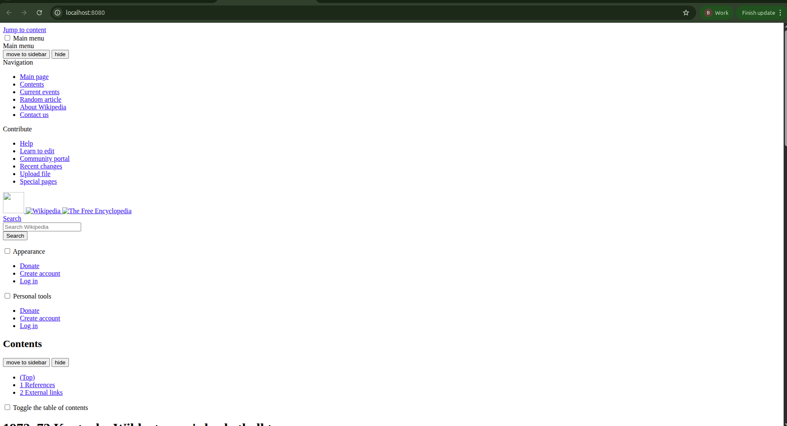

# 5.4 — Wikipedia with init and sidecar

The exercise asks for one app made of three containers: nginx serving whatever is in its public www directory,
an init container that curls `https://en.wikipedia.org/wiki/Kubernetes` into that directory before nginx
starts, and a sidecar that keeps replacing it with a random article. The lab carries the sidecar's script and
Dockerfile, the manifests, and the receipts from these runs.

## Step 0 — the cluster and the sidecar image

What this run needs on the machine: `docker`, `k3d` and `kubectl`. `istioctl` is needed for the last step
only, and nothing in 5.4 requires a mesh at all.

```bash
kubectl config use-context k3d-istio     # or: k3d cluster create istio
```

The sidecar is a script, and the image only exists to carry it:

```bash
docker build -t wikipedia-sidecar:5.4 sidecar
k3d image import wikipedia-sidecar:5.4 -c istio
```

```console
INFO[0005] Successfully imported 1 image(s) into 1 cluster(s)
```

## Step 1 — one directory, three containers

All three containers share a single `emptyDir` at `/www`, and nginx serves it by mounting the same volume over
its own `/usr/share/nginx/html`. That mount is also why nginx's "Welcome to nginx" page never appears: the
volume starts empty and hides whatever the image had at that path.

`manifests/namespace.yaml`

```yaml
apiVersion: v1
kind: Namespace
metadata:
  name: wikipedia
  labels:
    # Not needed by 5.4 itself: this is just the chapter's mode, so the pod can
    # be read next to the mesh work of the previous exercises. Ambient adds no
    # container to the pod — which is the thing the next exercise's sidecar
    # discussion is about.
    istio.io/dataplane-mode: ambient
```

`manifests/wikipedia.yaml`

```yaml
# The whole exercise in one object: one nginx container serving a shared
# directory, one init container that fills it before nginx starts, one sidecar
# that keeps replacing what is in it.
apiVersion: apps/v1
kind: Deployment
metadata:
  name: wikipedia
  namespace: wikipedia
  labels:
    app: wikipedia
spec:
  replicas: 1
  selector:
    matchLabels:
      app: wikipedia
  template:
    metadata:
      labels:
        app: wikipedia
    spec:
      volumes:
        - name: www
          emptyDir: {}
      initContainers:
        # Runs to completion before the nginx container starts, so the first
        # page anyone sees is already the Kubernetes article.
        - name: fetch-kubernetes
          image: curlimages/curl:8.10.0
          command:
            - sh
            - -c
            - curl -sSL -A "dwk-5.4-lab/1.0" -o /www/index.html https://en.wikipedia.org/wiki/Kubernetes
          volumeMounts:
            - name: www
              mountPath: /www
      containers:
        - name: nginx
          image: nginx:1.27-alpine
          ports:
            - name: http
              containerPort: 80
          volumeMounts:
            # nginx serves whatever is here; the image's own index.html is
            # replaced by the volume, which starts empty.
            - name: www
              mountPath: /usr/share/nginx/html
        - name: random-page
          image: wikipedia-sidecar:5.4
          env:
            # The exercise's range. Lower both to watch the loop in seconds.
            - name: MIN_WAIT_SECONDS
              value: "300"
            - name: MAX_WAIT_SECONDS
              value: "900"
          volumeMounts:
            - name: www
              mountPath: /www
---
apiVersion: v1
kind: Service
metadata:
  name: wikipedia-svc
  namespace: wikipedia
  labels:
    app: wikipedia
spec:
  type: ClusterIP
  selector:
    app: wikipedia
  ports:
    - name: http
      port: 80
      targetPort: 80
      protocol: TCP
```

```bash
kubectl apply -f manifests/
```

The namespace sorts before the Deployment, so the folder applies in one pass:

```console
$ kubectl apply -f manifests/
namespace/wikipedia created
deployment.apps/wikipedia created
service/wikipedia-svc created
```

The pod lists what the exercise asks for, in the order Kubernetes runs it:

```console
$ kubectl -n wikipedia get pods -o custom-columns='NAME:.metadata.name,INIT:.spec.initContainers[*].name,CONTAINERS:.spec.containers[*].name,STATUS:.status.phase'
NAME                         INIT               CONTAINERS          STATUS
wikipedia-58f57ff6b9-jczgh   fetch-kubernetes   nginx,random-page   Running
```

`initContainers` is not a second list of containers: those run to completion, in order, before any `containers` entry
starts. Here that took two seconds — nginx cannot have served an empty directory, because it was not running yet:

```console
$ kubectl -n wikipedia get pod -l app=wikipedia -o jsonpath='{.items[0].status.initContainerStatuses[0].state.terminated.startedAt} started, {.items[0].status.initContainerStatuses[0].state.terminated.finishedAt} finished, exit {.items[0].status.initContainerStatuses[0].state.terminated.exitCode}'
2026-09-24T15:09:39Z started, 2026-09-24T15:09:41Z finished, exit 0
```

What the init container fetched is what nginx serves, and the shared volume is the only reason nginx can see it:

```console
$ kubectl -n wikipedia exec deploy/wikipedia -c nginx -- ls -l /usr/share/nginx/html
total 584
-rw-r--r--    1 100      nginx       597595 Sep 24 15:09 index.html

$ kubectl -n wikipedia exec deploy/wikipedia -c nginx -- grep -o "<title>[^<]*</title>" /usr/share/nginx/html/index.html
<title>Kubernetes - Wikipedia</title>
```

The file is owned by uid 100 (`curl_user` in the curl image) and nginx reads it as the `nginx` group, which is
why no `fsGroup` or `runAsUser` is needed here: `emptyDir` volumes are created world-writable, and a container
that writes into one only needs the volume, not permissions.

## Step 2 — the sidecar

`sidecar/random-page.sh`

```sh
#!/bin/sh
# The sidecar: wait a random while, then replace the served page with a random
# Wikipedia article, forever.
#
# The exercise's wait is 5 to 15 minutes. MIN_WAIT_SECONDS/MAX_WAIT_SECONDS are
# here so the same loop can be watched in seconds instead of waiting a quarter
# of an hour for the first fetch.
set -eu

MIN="${MIN_WAIT_SECONDS:-300}"
MAX="${MAX_WAIT_SECONDS:-900}"
TARGET="${WWW_DIR:-/www}/index.html"
URL="${TARGET_URL:-https://en.wikipedia.org/wiki/Special:Random}"
UA="${USER_AGENT:-dwk-5.4-lab/1.0}"

if [ "$MAX" -lt "$MIN" ]; then
  echo "MAX_WAIT_SECONDS ($MAX) is below MIN_WAIT_SECONDS ($MIN)" >&2
  exit 1
fi

while true; do
  wait=$(( MIN + RANDOM % (MAX - MIN + 1) ))
  echo "waiting ${wait}s before the next fetch"
  sleep "$wait"

  # Write beside the target and move it into place, so nginx never serves a
  # half-written article. Special:Random redirects, hence -L.
  tmp="${TARGET}.tmp"
  if curl -sSL -A "$UA" -o "$tmp" "$URL" \
      -w "fetched %{url_effective} (http %{http_code}, %{size_download} bytes)\n"; then
    mv "$tmp" "$TARGET"
    echo "now serving it as $TARGET"
  else
    echo "fetch failed, the previous page stays" >&2
    rm -f "$tmp"
  fi
done
```

`sidecar/Dockerfile`

```dockerfile
# curlimages/curl already carries curl and a shell; this adds the loop and
# nothing else. Both the init container and the sidecar speak to Wikipedia, so
# the image is the same family.
FROM curlimages/curl:8.10.0

USER root
COPY random-page.sh /usr/local/bin/random-page.sh
RUN chmod 0755 /usr/local/bin/random-page.sh
USER curl_user

# The image's own entrypoint is curl, which is not what this container runs.
ENTRYPOINT ["/usr/local/bin/random-page.sh"]
```

The first wait of every pod is inside the exercise's range, and the wait is the part that looks like nothing
happening. Right after the apply the sidecar has fetched nothing: its log holds a single countdown, and the
page is still the init container's article.

```console
$ kubectl -n wikipedia logs deploy/wikipedia -c random-page
waiting 614s before the next fetch

$ kubectl -n wikipedia exec deploy/wikipedia -c nginx -- grep -o "<title>[^<]*</title>" /usr/share/nginx/html/index.html
<title>Kubernetes - Wikipedia</title>
```

That is the state to expect for the first five to fifteen minutes, and nothing about it is broken. When the
countdown ends, the same two commands answer differently, and the article the pod had been serving is gone:

```console
$ kubectl -n wikipedia logs deploy/wikipedia -c random-page
waiting 614s before the next fetch
fetched https://en.wikipedia.org/wiki/Carex_capilliculmis (http 200, 85180 bytes)
now serving it as /www/index.html
waiting 509s before the next fetch

$ kubectl -n wikipedia exec deploy/wikipedia -c nginx -- grep -o "<title>[^<]*</title>" /usr/share/nginx/html/index.html
<title>Carex capilliculmis - Wikipedia</title>

$ kubectl -n wikipedia exec deploy/wikipedia -c nginx -- ls -l /usr/share/nginx/html
total 84
-rw-r--r--    1 100      nginx        85180 Sep 24 16:51 index.html
```

### Watching it without waiting a quarter of an hour

The same script with the range lowered is the same behaviour, fast enough to see. This is a separate pod, so the spec-timed one above keeps its countdown:

```bash
kubectl -n wikipedia run sidecar-demo --image=wikipedia-sidecar:5.4 --restart=Never \
  --env=MIN_WAIT_SECONDS=5 --env=MAX_WAIT_SECONDS=10 --env=WWW_DIR=/tmp/www \
  --command -- sh -c 'mkdir -p /tmp/www && exec /usr/local/bin/random-page.sh'
```

```console
$ kubectl -n wikipedia logs sidecar-demo --tail=10
waiting 5s before the next fetch
fetched https://en.wikipedia.org/wiki/Highlands_Preserve (http 200, 78331 bytes)
now serving it as /tmp/www/index.html
waiting 10s before the next fetch
fetched https://en.wikipedia.org/wiki/Malaysia_Federal_Route_191 (http 200, 223163 bytes)
now serving it as /tmp/www/index.html
waiting 8s before the next fetch
fetched https://en.wikipedia.org/wiki/Hula_painted_frog (http 200, 283624 bytes)
now serving it as /tmp/www/index.html
waiting 7s before the next fetch
```

`%{url_effective}` is in the log because `Special:Random` answers with a redirect: the line names the article that was actually fetched, so the receipt proves the randomness rather than claiming it. Remember to delete the demo pod (`kubectl -n wikipedia delete pod sidecar-demo`); it is a measurement artifact, not part of the exercise.

### The 403 that looks like a broken cluster

Wikimedia refuses requests that carry no `User-Agent` header, and an empty shell variable is an easy way to send one:

```console
$ kubectl -n wikipedia exec deploy/wikipedia -c random-page -- sh -c \
    'curl -s -o /dev/null -A "" -w "empty UA → %{http_code}\n" -L https://en.wikipedia.org/wiki/Kubernetes; \
     curl -s -o /dev/null -A "dwk-5.4-lab/1.0" -w "lab UA   → %{http_code}\n" -L https://en.wikipedia.org/wiki/Kubernetes'
empty UA → 403
lab UA   → 200
```

Both the init container and the sidecar therefore pass `-A`, which also means the requests are attributable. A 403 with `curl`'s own default user agent does not happen — it is specifically the missing header that is rejected.

## Step 3 — seeing the page in a browser

nginx is not exposed outside the cluster here, so a port-forward is the way in, and it serves the same file the init container wrote:

```bash
kubectl -n wikipedia port-forward svc/wikipedia-svc 8080:80
```

Leave that running in its own terminal and type these in a second one. `HTTP 000` is not a broken app — it is `curl` failing to connect because no forward is up:

```console
$ curl -s -o /dev/null -w "HTTP %{http_code}\n" http://localhost:8080/
HTTP 000

$ curl -s -o /dev/null -w "HTTP %{http_code}\n" http://localhost:8080/
HTTP 200

$ curl -s http://localhost:8080/ | grep -o "<title>[^<]*</title>"
<title>1972–73 Kentucky Wildcats men's basketball team - Wikipedia</title>
```




The article arrives without its styling, and the reason is in the file: the stylesheets are absolute paths that only exist on `en.wikipedia.org`, so nothing served from `localhost:8080` can fetch them. That is what an app that serves Wikipedia pages looks like, not a broken download:

```console
$ kubectl -n wikipedia exec deploy/wikipedia -c nginx -- sh -c 'grep -o "rel=\"stylesheet\" href=\"/[^?]*" /usr/share/nginx/html/index.html | sort -u'
rel="stylesheet" href="/w/load.php
```

Unstyled also means the article body sits below the skin's own navigation. In the HTML saved here the table of contents starts on line 2 and the article's `firstHeading` only on line 348 of 969, so the first screen is menus and white space — scroll down until the article text is in view before taking the screenshot:

```console
$ kubectl -n wikipedia exec deploy/wikipedia -c nginx -- sh -c 'grep -n -m1 -F "vector-toc" /usr/share/nginx/html/index.html | cut -d: -f1; grep -n -m1 -F "firstHeading" /usr/share/nginx/html/index.html | cut -d: -f1'
2
348
```

Leave the sidecar running and reload the page after the next fetch: the article in the browser is a different one, which is the whole point of the exercise.

## Step 4 — what the mesh would have added (and did not)

```console
$ istioctl ztunnel-config workloads -n istio-system | head -1
NAMESPACE    POD NAME                                     ADDRESS    NODE               WAYPOINT PROTOCOL

$ istioctl ztunnel-config workloads -n istio-system | grep wikipedia
wikipedia    sidecar-demo                                 10.42.1.21 k3d-istio-server-0 None     HBONE
wikipedia    wikipedia-58f57ff6b9-rzbpz                   10.42.0.28 k3d-istio-agent-1  None     HBONE
```

`HBONE` and no extra container: that is ambient mode, and it is why 5.2 and 5.3 had pods of `1/1` containers. Sidecar mode, the architecture this exercise's reading describes, is the same pod plus machinery — which can be printed without applying anything:

```bash
istioctl kube-inject -f manifests/wikipedia.yaml > /tmp/injected.yaml
wc -l manifests/wikipedia.yaml /tmp/injected.yaml
```

```console
$ istioctl kube-inject -f manifests/wikipedia.yaml > /tmp/injected.yaml
$ wc -l manifests/wikipedia.yaml /tmp/injected.yaml
   74 manifests/wikipedia.yaml
  300 /tmp/injected.yaml
  374 total
```

The 226 added lines are an `istio-validation` init container, an `istio-proxy` container, and the sockets, certificates and config volumes the proxy needs:

```console
$ istioctl kube-inject -f manifests/wikipedia.yaml | grep -nE 'name: (istio-init|istio-validation|istio-proxy|nginx|random-page|fetch-kubernetes)'
37:        name: nginx
51:        name: random-page
82:        name: istio-validation
182:        name: istio-proxy
243:        name: fetch-kubernetes
```

One check worth keeping from this lab: the script inside the running container is byte-identical to the file in this folder, which is what proves the pod is running this build rather than an older image with the same tag:

```console
$ md5sum sidecar/random-page.sh
  978cba44e8cc3f20f398481756e3a8c9  sidecar/random-page.sh
$ kubectl -n wikipedia exec deploy/wikipedia -c random-page -- md5sum /usr/local/bin/random-page.sh
  978cba44e8cc3f20f398481756e3a8c9  /usr/local/bin/random-page.sh
```

(`docker image inspect wikipedia-sidecar:5.4` and the pod's own `imageID` do **not** match after `k3d image import` — the import re-stores the image in containerd, so the node reports `5995d7da7690f` for an image docker calls `8717cab42f34`. The node's view is the one that matches the running pod, and the file hash above is the simpler proof.)

## P.S.

- An init container that fails leaves the pod in `Init:Error` or `Init:CrashLoopBackOff` and the main containers never start — the ordering is a dependency, not a preference. `kubectl logs -c <init name>` works once it has run.
- A sidecar shares the pod's lifecycle and network namespace but not its filesystem. Everything the two containers share has to be a volume, and `emptyDir` dies with the pod, so the page is re-fetched on every new pod.
- Serving a file another container is writing means the write has to be atomic: writing straight to `index.html` lets nginx serve a truncated article for as long as the download takes, which is why the script writes `index.html.tmp` and renames it into place.
- Mounting a volume over a directory hides the image's own content there. nginx's `Welcome to nginx!` index is gone the moment the volume is mounted, which is what makes the init container's fetch visible at all.
- A receipt that contains a timer needs both sides of it. Before the first wait is over, the log holds one countdown line and the page is still the init container's article; the fetch line does not exist yet, and reading that as a failure is the easy mistake to make.
- A `-w` format string that repeats the URL invites copying the line only up to the closing quote, and `curl` answers `curl: (2) no URL specified` — the operand at the end is the part it cannot do without. Keep the URL in one place, and if a copied line ends in an unmatched quote or a shortened tail, the shell either waits for more input or answers with `grep: Usage:` — re-copy the whole line rather than editing it.
- Screenshots of the page in the browser — its top, and the fetched article scrolled into view — are in `assets/`.
